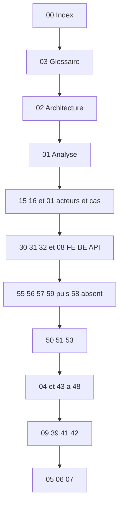

# 00 — Index

## Objectif

Présenter le dossier `docs/uml/`, fixer le périmètre (canon, doublon PreSeed, produit Review), donner l’ordre de lecture, cataloguer les 60 diagrammes, et porter le rapport d’écarts entre le README et le code.

## Statut

Synthèse documentaire. Les faits viennent du canon au commit `0690e34` (« Try to be here », 2026-09-24) et des fichiers lus pour les notes 01 à 07. Confiance « élevé » = confirmé par le code. Confiance « moyen » = partiellement confirmé ou déduit. L’échelle prévoit aussi « faible » ; aucune des 60 vues n’est classée faible. La colonne « Validation humaine » vaut « oui » quand une relecture humaine est nécessaire (confiance moyenne), et « non » quand la vue est confirmée par le code ou constate une absence vérifiée. Pour la vue 58, la confiance « élevé » porte sur l’absence de contrat, pas sur un modèle dessiné.

## Sources analysées

- `/home/azertyuiop/dev/dartchain` — HEAD `0690e34`, working tree inclus
- `/home/azertyuiop/dev/dartchain/README.md`
- `/home/azertyuiop/dev/dartchainPreSeed/dartchain` — même commit, écart de tri d’audit
- `/home/azertyuiop/dev/dartchainReview` — site compagnon, hors des 60 vues
- Notes de ce dossier : [01-analyse-projet.md](01-analyse-projet.md) à [07-elements-non-identifies.md](07-elements-non-identifies.md)

Recensement canon hors caches et dépendances : 1542 fichiers (697 `.ts`, 517 `.java` dont environ 423 main et 94 test, 87 `.html`, 14 `.sql`, 29 `.md`).

## Éléments représentés

Trois arbres, huit notes de socle, soixante vues. Les vues 01 à 14 sont les diagrammes UML 2.5 officiels. Les vues 15 à 60 sont des vues complémentaires, dont la 58 est non applicable.

### Périmètre

Le canon est `/home/azertyuiop/dev/dartchain`. C’est la source unique des 60 diagrammes. Le working tree ajoute des modifications non commitées (showcase, audit `snapshot()`, composant `depth-rail`).

`/home/azertyuiop/dev/dartchainPreSeed/dartchain` est le même dépôt et le même commit. Ce n’est pas un produit « preseed ». Il ne reçoit pas un second jeu de diagrammes. L’écart local vérifié est le tri `createdAt` dans `JpaAuthAuditStore.snapshot()`, présent dans PreSeed et absent du canon.

`/home/azertyuiop/dev/dartchainReview` est un autre produit : Angular 21 port 4201, Spring `io.dartchain.review` port 8081, H2, tables `review_users` et `faq_questions`, JWT toujours `ROLE_USER`. Aucun wallet, aucun bloc, aucun `.sol`. Il est décrit dans l’analyse et dans les risques, pas dans les 60 vues de la chaîne.

### Ordre de lecture

Pour comprendre DartChain vite :

1. Ce fichier, pour le périmètre et le rapport d’écarts.
2. [03-glossaire.md](03-glossaire.md), pour R4V3, M4T3R, les rôles et MetaVerseBB.
3. [02-architecture-globale.md](02-architecture-globale.md), pour la SPA, `memory` / `postgres`, Compose, Pages et Render.
4. [01-analyse-projet.md](01-analyse-projet.md), pour les onze axes.
5. [uml-15-contexte.md](uml-15-contexte.md), [uml-16-acteurs.md](uml-16-acteurs.md), [uml-01-cas-utilisation.md](uml-01-cas-utilisation.md).
6. [uml-30-composants-frontend.md](uml-30-composants-frontend.md), [uml-31-composants-backend.md](uml-31-composants-backend.md), [uml-32-endpoints.md](uml-32-endpoints.md), [uml-08-composants.md](uml-08-composants.md).
7. [uml-55-blockchain.md](uml-55-blockchain.md), [uml-56-wallets-comptes.md](uml-56-wallets-comptes.md), [uml-57-transactions.md](uml-57-transactions.md), [uml-59-evenements-blockchain.md](uml-59-evenements-blockchain.md), puis [uml-58-smart-contracts.md](uml-58-smart-contracts.md) qui constate l’absence de contrat.
8. [uml-50-authentification.md](uml-50-authentification.md), [uml-51-securite.md](uml-51-securite.md), [uml-53-rbac.md](uml-53-rbac.md).
9. [04-dictionnaire-de-donnees.md](04-dictionnaire-de-donnees.md) et les vues [uml-43-base-de-donnees.md](uml-43-base-de-donnees.md) à [uml-48-relations-tables.md](uml-48-relations-tables.md).
10. [uml-09-deploiement.md](uml-09-deploiement.md), [uml-39-docker.md](uml-39-docker.md), [uml-41-cicd.md](uml-41-cicd.md), [uml-42-environnements.md](uml-42-environnements.md).
11. [05-risques-et-incoherences.md](05-risques-et-incoherences.md), [06-hypotheses.md](06-hypotheses.md), [07-elements-non-identifies.md](07-elements-non-identifies.md).

### Catalogue des 60 diagrammes

Légende du statut. « Confirmé par le code » reprend le lot à confiance élevée du mémo. « Partiellement confirmé » reprend le lot « Partiellement confirmé ou Déduit ». La vue 28 confirme les routes Angular vides et déduit le parcours d’écran. La vue 17 sépare la seed admin du JWT. La vue 54 ne contient que des noms de propriétés. La vue 58 est « Non applicable ».

Phrase obligatoire dans le corps de [uml-58-smart-contracts.md](uml-58-smart-contracts.md) : « Ce diagramme n’est pas générable à partir du contenu actuel du projet. Aucun élément blockchain correspondant n’a été identifié. »

| N° | Fichier | Nom | Statut | Confiance | Validation humaine |
|----|---------|-----|--------|-----------|-------------------|
| 01 | [uml-01-cas-utilisation.md](uml-01-cas-utilisation.md) | Diagramme de cas d'utilisation | Confirmé par le code | élevé | non |
| 02 | [uml-02-classes.md](uml-02-classes.md) | Diagramme de classes | Confirmé par le code | élevé | non |
| 03 | [uml-03-objets.md](uml-03-objets.md) | Diagramme d'objets | Partiellement confirmé | moyen | oui |
| 04 | [uml-04-sequence.md](uml-04-sequence.md) | Diagramme de séquence | Confirmé par le code | élevé | non |
| 05 | [uml-05-communication.md](uml-05-communication.md) | Diagramme de communication | Partiellement confirmé | moyen | oui |
| 06 | [uml-06-activites.md](uml-06-activites.md) | Diagramme d'activités | Partiellement confirmé | moyen | oui |
| 07 | [uml-07-etats-transitions.md](uml-07-etats-transitions.md) | Diagramme d'états-transitions | Partiellement confirmé | moyen | oui |
| 08 | [uml-08-composants.md](uml-08-composants.md) | Diagramme de composants | Confirmé par le code | élevé | non |
| 09 | [uml-09-deploiement.md](uml-09-deploiement.md) | Diagramme de déploiement | Confirmé par le code | élevé | non |
| 10 | [uml-10-paquets.md](uml-10-paquets.md) | Diagramme de paquets | Confirmé par le code | élevé | non |
| 11 | [uml-11-structure-composite.md](uml-11-structure-composite.md) | Diagramme de structure composite | Partiellement confirmé | moyen | oui |
| 12 | [uml-12-profils.md](uml-12-profils.md) | Diagramme de profils | Partiellement confirmé | moyen | oui |
| 13 | [uml-13-interactions.md](uml-13-interactions.md) | Vue d'ensemble des interactions | Partiellement confirmé | moyen | oui |
| 14 | [uml-14-temps.md](uml-14-temps.md) | Diagramme de temps | Partiellement confirmé | moyen | oui |
| 15 | [uml-15-contexte.md](uml-15-contexte.md) | Contexte système | Confirmé par le code | élevé | non |
| 16 | [uml-16-acteurs.md](uml-16-acteurs.md) | Acteurs | Confirmé par le code | élevé | non |
| 17 | [uml-17-roles-permissions.md](uml-17-roles-permissions.md) | Rôles et permissions | Partiellement confirmé | moyen | oui |
| 18 | [uml-18-parcours-utilisateurs.md](uml-18-parcours-utilisateurs.md) | Parcours utilisateurs | Partiellement confirmé | moyen | oui |
| 19 | [uml-19-user-stories.md](uml-19-user-stories.md) | User stories | Partiellement confirmé | moyen | oui |
| 20 | [uml-20-exigences-fonctionnelles.md](uml-20-exigences-fonctionnelles.md) | Exigences fonctionnelles | Partiellement confirmé | moyen | oui |
| 21 | [uml-21-exigences-non-fonctionnelles.md](uml-21-exigences-non-fonctionnelles.md) | Exigences non fonctionnelles | Partiellement confirmé | moyen | oui |
| 22 | [uml-22-regles-metier.md](uml-22-regles-metier.md) | Règles métier | Partiellement confirmé | moyen | oui |
| 23 | [uml-23-processus-metier.md](uml-23-processus-metier.md) | Processus métier | Partiellement confirmé | moyen | oui |
| 24 | [uml-24-bpmn.md](uml-24-bpmn.md) | BPMN | Partiellement confirmé | moyen | oui |
| 25 | [uml-25-flux-donnees.md](uml-25-flux-donnees.md) | Flux de données | Partiellement confirmé | moyen | oui |
| 26 | [uml-26-flux-evenements.md](uml-26-flux-evenements.md) | Flux d'événements | Partiellement confirmé | moyen | oui |
| 27 | [uml-27-flux-utilisateur.md](uml-27-flux-utilisateur.md) | Flux utilisateur | Partiellement confirmé | moyen | oui |
| 28 | [uml-28-navigation-frontend.md](uml-28-navigation-frontend.md) | Navigation frontend | Partiellement confirmé | moyen | oui |
| 29 | [uml-29-ecrans.md](uml-29-ecrans.md) | Écrans | Partiellement confirmé | moyen | oui |
| 30 | [uml-30-composants-frontend.md](uml-30-composants-frontend.md) | Composants frontend | Confirmé par le code | élevé | non |
| 31 | [uml-31-composants-backend.md](uml-31-composants-backend.md) | Composants backend | Confirmé par le code | élevé | non |
| 32 | [uml-32-endpoints.md](uml-32-endpoints.md) | Endpoints | Confirmé par le code | élevé | non |
| 33 | [uml-33-appels-api.md](uml-33-appels-api.md) | Appels API | Confirmé par le code | élevé | non |
| 34 | [uml-34-dependances-modules.md](uml-34-dependances-modules.md) | Dépendances modules | Confirmé par le code | élevé | non |
| 35 | [uml-35-architecture-logique.md](uml-35-architecture-logique.md) | Architecture logique | Confirmé par le code | élevé | non |
| 36 | [uml-36-architecture-physique.md](uml-36-architecture-physique.md) | Architecture physique | Confirmé par le code | élevé | non |
| 37 | [uml-37-architecture-applicative.md](uml-37-architecture-applicative.md) | Architecture applicative | Confirmé par le code | élevé | non |
| 38 | [uml-38-architecture-technique.md](uml-38-architecture-technique.md) | Architecture technique | Confirmé par le code | élevé | non |
| 39 | [uml-39-docker.md](uml-39-docker.md) | Docker | Confirmé par le code | élevé | non |
| 40 | [uml-40-infrastructure.md](uml-40-infrastructure.md) | Infrastructure | Confirmé par le code | élevé | non |
| 41 | [uml-41-cicd.md](uml-41-cicd.md) | Intégration et livraison continues | Confirmé par le code | élevé | non |
| 42 | [uml-42-environnements.md](uml-42-environnements.md) | Environnements | Confirmé par le code | élevé | non |
| 43 | [uml-43-base-de-donnees.md](uml-43-base-de-donnees.md) | Base de données | Confirmé par le code | élevé | non |
| 44 | [uml-44-erd.md](uml-44-erd.md) | Diagramme entité-relation | Confirmé par le code | élevé | non |
| 45 | [uml-45-mcd.md](uml-45-mcd.md) | Modèle conceptuel de données | Confirmé par le code | élevé | non |
| 46 | [uml-46-mld.md](uml-46-mld.md) | Modèle logique de données | Confirmé par le code | élevé | non |
| 47 | [uml-47-dictionnaire-donnees.md](uml-47-dictionnaire-donnees.md) | Dictionnaire de données | Confirmé par le code | élevé | non |
| 48 | [uml-48-relations-tables.md](uml-48-relations-tables.md) | Relations entre tables | Confirmé par le code | élevé | non |
| 49 | [uml-49-cycle-vie-donnees.md](uml-49-cycle-vie-donnees.md) | Cycle de vie des données | Partiellement confirmé | moyen | oui |
| 50 | [uml-50-authentification.md](uml-50-authentification.md) | Authentification | Confirmé par le code | élevé | non |
| 51 | [uml-51-securite.md](uml-51-securite.md) | Sécurité applicative | Confirmé par le code | élevé | non |
| 52 | [uml-52-menaces.md](uml-52-menaces.md) | Menaces | Partiellement confirmé | moyen | oui |
| 53 | [uml-53-rbac.md](uml-53-rbac.md) | Contrôle d’accès par rôles | Confirmé par le code | élevé | non |
| 54 | [uml-54-secrets-certificats.md](uml-54-secrets-certificats.md) | Secrets et certificats | Partiellement confirmé | moyen | oui |
| 55 | [uml-55-blockchain.md](uml-55-blockchain.md) | Blockchain | Confirmé par le code | élevé | non |
| 56 | [uml-56-wallets-comptes.md](uml-56-wallets-comptes.md) | Portefeuilles et comptes | Confirmé par le code | élevé | non |
| 57 | [uml-57-transactions.md](uml-57-transactions.md) | Transactions | Confirmé par le code | élevé | non |
| 58 | [uml-58-smart-contracts.md](uml-58-smart-contracts.md) | Contrats intelligents | Non applicable | élevé | non |
| 59 | [uml-59-evenements-blockchain.md](uml-59-evenements-blockchain.md) | Événements | Confirmé par le code | élevé | non |
| 60 | [uml-60-observabilite.md](uml-60-observabilite.md) | Observabilité | Partiellement confirmé | moyen | oui |

### Liens relatifs

Notes de socle :

- [01-analyse-projet.md](01-analyse-projet.md)
- [02-architecture-globale.md](02-architecture-globale.md)
- [03-glossaire.md](03-glossaire.md)
- [04-dictionnaire-de-donnees.md](04-dictionnaire-de-donnees.md)
- [05-risques-et-incoherences.md](05-risques-et-incoherences.md)
- [06-hypotheses.md](06-hypotheses.md)
- [07-elements-non-identifies.md](07-elements-non-identifies.md)

Les soixante fichiers `uml-*.md` sont liés dans le tableau ci-dessus.

## Diagramme

Légende : parcours court. Les quatorze diagrammes UML officiels (01 à 14) se lisent après les acteurs, quand le vocabulaire est en place.

## Explication

### Rapport final

#### Incohérences les plus importantes

- `POST /api/wallets/create` est permitAll dans `SecurityConfig` et n’a pas de mapping sur `WalletController` (`/create-client`, `/verify`) ni sur `WalletV1Controller` (`/generate-evm`). `allow-server-wallet-create` est false. `allow-server-evm-wallet-create` est true.
- Le nom de réseau YAML et la graine SQL valent « DartChain Native ». Le défaut Java `ChainProperties.networkName` vaut « R4V3 Testnet » si le YAML ne charge pas.
- En mode `postgres`, la FAQ est `InMemoryFaqQuestionStore` (RAM). Il n’y a pas de table `faq_questions` dans le canon.
- `GET /**` est permitAll. Les lectures Spring sont publiques. L’authentification porte sur le reste des requêtes.
- L’unlock admin (`POST /api/v1/admin/unlock`, propriété `dartchain.admin.seed-sha256`, valeur `[SECRET MASQUÉ]`) est distinct de `ROLE_ADMIN`.
- L’API est double (`/api` et `/api/v1`), avec `LegacyApiDeprecationFilter`. Aucun fichier `.sol`.
- Star Conquest est sous « Fonctionnalités (live) » dans le README et `starConquestEnabled` vaut false.
- `V12__ad_persistence.sql` est la phase AD : index, `chain_config`, `chain_accounts`. Ce n’est pas une table publicitaire. `addressSchemeDefault` vaut `evm-compatible` et le défaut `chain_accounts.address_scheme` vaut `evm`.
- Le working tree canon modifie le showcase et l’audit, et ajoute `depth-rail` non suivi. PreSeed, même commit, trie `snapshot()` par `createdAt`. Review contredit son README « scaffold » : des pages et une FAQ existent, le forum annoncé n’a pas de route, le README backend parle de JPA/Flyway désactivés alors que H2 est en `ddl-auto=update` et que `db/migration` ne contient qu’un `.gitkeep`.

Le détail est dans [05-risques-et-incoherences.md](05-risques-et-incoherences.md).

#### Fonctionnalités dans le code absentes de la doc README

- WebSockets `/ws/peers` (`PeerSocketHandler`) et `/ws/metaverse-arena` (`ArenaSocketHandler`). L’aperçu README cite `/ws/live` et `/ws/chat`.
- Dossier frontend `admin/` absent du tableau des domaines. Le dock mentionne seulement un onglet Admin si `isAdmin()`, sans le flux `POST /api/v1/admin/unlock`.
- `infra/` (`infra/nginx/nginx.prod.conf`, upstreams `backend-a` et `backend-b`), `Makefile` et `wrangler.toml` absents de l’arbre monorepo du README.
- Composant local `depth-rail` (`app-depth-rail`), branché sur le showcase modifié, absent du README.
- Défaut Java « R4V3 Testnet » absent du README, qui publie « DartChain Native ».
- FAQ tenue en RAM quand `dartchain.persistence.mode` vaut `postgres`.

#### Fonctionnalités README absentes ou désactivées dans le code

- Star Conquest, section live (35 quêtes, 5 galaxies, univers Ruche, `localStorage`) : le flag `starConquestEnabled` est false dans `environment.ts` et `environment.factory.ts`. `app.html` ne l’affiche que si le flag est vrai.
- La feuille de route marque déjà comme non branchés : autres univers Star Conquest, overlay nuit, scène ladder-climb non montée, OAuth provisionné, administration des FAQ par API, jumeau plus dense. Ces lignes du README décrivent des absences. Les fournisseurs OAuth du YAML ont `enabled` false par défaut, ce qui rejoint le README (« souvent non configurés »).
- Le tableau d’environnement local du README annonce `DARTCHAIN_PERSISTENCE_MODE=postgres`. C’est le choix de `bin/dev-env.sh`. Le défaut de `application.yaml`, si la variable est absente, reste `memory`.

#### Priorités de correction documentaire

1. Aligner la section live du README sur `starConquestEnabled`.
2. Compléter l’aperçu API avec `/ws/peers` et `/ws/metaverse-arena`.
3. Citer `infra/`, `Makefile`, `wrangler.toml` et le module `admin/`.
4. Expliquer les deux noms de réseau et les deux défauts de persistance (`memory` dans le YAML, `postgres` dans le script local).
5. Documenter `POST /api/wallets/create` comme permitAll sans contrôleur, et séparer la seed admin de `ROLE_ADMIN`.
6. Expliquer la FAQ du mode postgres et le sens réel de `V12__ad_persistence.sql`.
7. Laisser la vue 58 sur la phrase d’absence, sans contrat inventé.
8. Isoler Review et l’écart PreSeed du canon dans l’analyse, pas dans les diagrammes de la chaîne.
9. Masquer toute valeur de secret par `[SECRET MASQUÉ]`.
10. Faire valider humainement les vues dont la colonne « Validation humaine » vaut « oui » (confiance moyenne).

## Correspondance avec le code

Le canon utile est `apps/dartchain-backend` (package `io.dartchain.backend`, entrée `DartchainBackendApplication`) et `apps/dartchain-frontend/Dart`. La SPA est `app.routes.ts` (`routes` vide). La persistance est `dartchain.persistence.mode`. Les tables sont les migrations `V1` à `V14`. Le déploiement cité est `wrangler.toml`, `.github/workflows/ci.yml`, `.github/workflows/cloudflare-deploy.yml`, `deploy/render.yaml`, `docker-compose.yml`.

## Hypothèses

Les libellés du tableau reprennent le titre H1 des fichiers présents. Si un auteur renomme un H1 sans renommer le fichier, le lien reste valide et le libellé peut diverger d’une ligne. Les causes des écarts (flag Star Conquest, route wallet, FAQ RAM) sont des hypothèses : [06-hypotheses.md](06-hypotheses.md).

## Anomalies détectées

Elles sont résumées dans le rapport ci-dessus et détaillées dans [05-risques-et-incoherences.md](05-risques-et-incoherences.md). Les informations absentes sont dans [07-elements-non-identifies.md](07-elements-non-identifies.md).

## Recommandations

Ne pas modifier le Java, le TypeScript ni le YAML pour « faire coller » ces notes. Mettre à jour le README en priorité sur Star Conquest, les WebSockets et les fichiers d’infra. Relire les vues à confiance moyenne avant de les citer comme spécification. Après relecture humaine, passer leur colonne « Validation humaine » à « non ».
