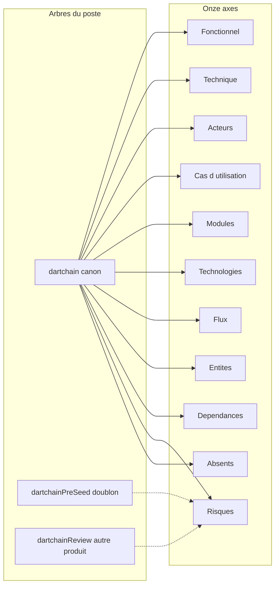

# 01 — Analyse du projet

## Objectif

Décrire DartChain selon les onze axes du cahier : fonctionnel, technique, acteurs, cas d’utilisation, modules, technologies, flux, entités, dépendances, risques, éléments absents. Cette note fixe le périmètre des diagrammes. Elle ne remplace pas les vues détaillées `uml-01` à `uml-60`.

## Statut

Confirmé par le code et par les fichiers lus pour cette note. Les points marqués hypothèse sont renvoyés vers [06-hypotheses.md](06-hypotheses.md). Les absences sont renvoyées vers [07-elements-non-identifies.md](07-elements-non-identifies.md).

## Sources analysées

- `/home/azertyuiop/dev/dartchain` — HEAD `0690e34`, message « Try to be here », date 2026-09-24
- `/home/azertyuiop/dev/dartchain/README.md`
- `/home/azertyuiop/dev/dartchain/apps/dartchain-backend/src/main/resources/application.yaml` (noms de propriétés ; valeurs de secrets masquées)
- `/home/azertyuiop/dev/dartchain/apps/dartchain-backend/src/main/resources/db/migration/V1__auth.sql` à `V14__oauth_identities.sql`, y compris `V12__ad_persistence.sql`
- `/home/azertyuiop/dev/dartchain/apps/dartchain-backend/bin/dev-env.sh` (export `DARTCHAIN_PERSISTENCE_MODE=postgres`)
- Working tree canon : `git status` au moment de la rédaction
- `/home/azertyuiop/dev/dartchainPreSeed/dartchain` — même commit `0690e34`
- `/home/azertyuiop/dev/dartchainReview/README.md`, `apps/frontend/README.md`, `apps/backend/README.md`, `apps/frontend/src/app/app.routes.ts`, `apps/backend/src/main/resources/application.properties`, `docs/ARCHITECTURE.md`

Recensement canon hors `node_modules`, `target`, `dist`, `.git`, `.angular`, `coverage` : 1542 fichiers (697 `.ts`, 517 `.java` dont environ 423 main et 94 test, 87 `.html`, 14 `.sql`, 29 `.md`).

## Éléments représentés

Les onze axes, les trois arbres du poste, et le renvoi vers le dossier `docs/uml/`.

Acteurs stables utilisés plus loin : A1 Visiteur, A2 `USER`, A3 `ADMIN`, A4 Pair P2P, A5 Jobs locaux, A6 Externes.

## Diagramme

Légende : flèche pleine = source des 60 vues. Flèche pointillée = écart signalé, sans second jeu de diagrammes.

## Explication

### Fonctionnel

DartChain est une démo full-stack d’une chaîne native. Le README indique que ce n’est pas une crypto réelle, qu’il n’y a pas de mainnet, pas de custodian et pas d’achat. Le token est R4V3, la micro-unité est M4T3R, le chain-id est 3377, le nom de réseau YAML est « DartChain Native ». Le défaut Java `ChainProperties.networkName` vaut « R4V3 Testnet » si le YAML ne charge pas.

Le shell décrit par le README regroupe navbar, swap, showcase, dock, chart, overlay Star Conquest et le sol 3D de Marseille (floor peek, MetaVerseBB). Le backend couvre blocs, mempool, mine, wallet, faucet, swap, pairs P2P, quêtes, showcase, WebSockets, placements et rewards M4T3R.

Drapeaux produit lus dans `application.yaml` : `dartchain.product.commercial` false, `faucet-enabled` true, `showcase-enabled` true, `legacy-api-aliases-enabled` false, `allow-legacy-private-key` false, `allow-server-wallet-create` false, `dartchain.chain.allow-server-evm-wallet-create` true. L’arène est activée (`dartchain.metaverse.arena.enabled` true).

Star Conquest est décrit sous « Fonctionnalités (live) » dans le README. Le frontend a `starConquestEnabled: false` dans `environment.ts` et `environment.factory.ts`. `app.html` n’affiche Star Conquest que si le flag est vrai.

Le site live cité par le README est https://dartchain.pages.dev. L’API Render citée est https://dartchain-backend-1-0-0.onrender.com.

### Technique

Backend Spring Boot 3.5.14, Java 21, package `io.dartchain.backend`, entrée `DartchainBackendApplication`. JPA, Flyway, driver PostgreSQL, BouncyCastle 1.84, nimbus-jose-jwt 9.47, Testcontainers 1.20.6, JaCoCo 0.8.13 avec seuil 0.65. `info.app.version` vaut `0.17.0-SNAPSHOT`, `info.app.phase` vaut `AF`.

Frontend `apps/dartchain-frontend/Dart` : Angular ^21.2.7, TypeScript ~5.9.2, three ^0.183.2, RxJS ~7.8.0, Vitest ^4.1.10, Node 22 (`.node-version`), npm 9.2.0. `app.routes.ts` exporte `routes` vide : SPA d’une page, ce que le README confirme.

Persistance : `dartchain.persistence.mode` vaut `${DARTCHAIN_PERSISTENCE_MODE:memory}`. Le script `bin/dev-env.sh` exporte `DARTCHAIN_PERSISTENCE_MODE=postgres`. Le mode `postgres` passe par un profil. `info.dartchain.postgres-only-profiles` cite `prod,staging`.

Sécurité Spring : CSRF désactivé, sessions `STATELESS`, CORS, filtres `BearerTokenAuthenticationFilter` et `RateLimitFilter` avant `UsernamePasswordAuthenticationFilter`. Autres filtres nommés : `ActuatorAccessFilter`, `RequestCorrelationFilter`, `RequestTimingFilter`, `SecurityHeadersFilter`, `LegacyApiDeprecationFilter`. JWT : `NativeJwtService`. TTL access 3600 s, refresh 604800 s. `dartchain.auth.legacy-session-enabled` false. Rate limit 60 requêtes / 60000 ms, table `rate_limit_buckets`.

`GET /**` est `permitAll`. Le reste des requêtes non listées en `permitAll` est `authenticated`. Le détail des chemins publics est dans [05-risques-et-incoherences.md](05-risques-et-incoherences.md) et dans la vue `uml-51-securite.md`.

### Acteurs

- A1 Visiteur : `GET /**` permitAll dans `SecurityConfig`. Chat anonyme via `ChatService.ANONYMOUS_AUTHOR` et la chaîne « Anonymous ».
- A2 USER : enum `UserRole.USER`, autorité `ROLE_USER`.
- A3 ADMIN : `UserRole.ADMIN`, autorité `ROLE_ADMIN`. Déverrouillage du panneau distinct : `POST /api/v1/admin/unlock` permitAll, seed SHA-256 (`AdminUnlockService`, propriété `dartchain.admin.seed-sha256`). La valeur est `[SECRET MASQUÉ]`.
- A4 Pair P2P : WebSocket `/ws/peers`, `PeerSocketHandler`, `PeerController` `/api/peers`.
- A5 Jobs locaux : profil `seed` (`application-seed.yaml`), `application-data-import.yaml`, `TestnetSettlementService` (M4T3R).
- A6 Externes : Overpass (`OverpassProxyService`, `OverpassProxyController` `/api/metaverse/overpass`), CoinGecko et GeckoTerminal (`CryptoRatesProxyService`), WiGLE (`WiglePointsService`, `dartchain.wigle.mock-enabled` true par défaut), OAuth google, meta, apple, microsoft, github, x, discord (`enabled` false par défaut).

`GUEST` est un commentaire de `UserRole` : non authentifié, pas persisté. Ce n’est pas une valeur de l’enum.

### Cas d’utilisation

Issus des contrôleurs et du README, sans inventer de parcours : inscription, connexion, refresh, échange OAuth ; création et vérification de wallet ; génération EVM ; consultation de la chaîne, des blocs, du mempool et de l’explorateur ; envoi de transaction ; faucet ; swap et taux ; quêtes ; peers ; showcase (news, launch, FAQ, chat, chart) ; métavers (Overpass, placements, arène, trail et rewards M4T3R) ; personnages `/api/v1/characters` ; admin status, unlock, lock, export ; health et ops.

Quarante-deux contrôleurs sont recensés. Préfixes : `AdminV1Controller` `/api/v1/admin`, `ApiContractV1Controller` `/api/v1`, `AuthController` `/api/auth`, `AuthV1Controller` `/api/v1/auth`, `OAuthV1Controller` `/api/v1/auth/oauth`, `BlockchainController` `/api/blockchain`, `BlockchainV1Controller` `/api/v1/blockchain`, `BlockController` `/api/blocks`, `PendingTransactionController` `/api`, `TransactionController` `/api`, `ChainV1Controller` `/api/v1/chain`, `WalletController` `/api/wallets`, `WalletV1Controller` `/api/v1/wallets`, `ExplorerController` `/api/explorer`, `ExplorerV1Controller` `/api/v1/explorer`, `SwapController` `/api/swap`, `ExchangeController` `/api/exchange-panel`, `CryptoRatesController` `/api/crypto-rates`, `FaucetController` `/api/faucet`, `QuestController` `/api/quests`, `PeerController` `/api/peers`, `OpsController` `/api/ops`, `OpsV1Controller` `/api/v1/ops`, `HealthController` `/api/health`, `HealthV1Controller` `/api/v1`, `M4t3rTrailController` `/api/m4t3r`, `M4t3rRewardController` `/api/m4t3r/rewards`, `OverpassProxyController` `/api/metaverse/overpass`, `PlacementController` `/api/metaverse/placements`, `WigleVisualizationController` `/api/metaverse/wigle`, `ArenaController` `/api/metaverse/arena`, `CharacterNftController` `/api/v1/characters`, plus les contrôleurs showcase `ShowcaseR4v3Controller`, `ShowcaseNewsController`, `ShowcaseLaunchController`, `ShowcaseCommunityFaqController`, `ShowcaseChatController`, `ShowcaseChartController`, `GraphController`, `BannerController`, `HelloController` `/api`, `RootController` `/`.

WebSockets (`WebSocketConfig`) : `/ws/peers` → `PeerSocketHandler`, `/ws/live` → `LiveSocketHandler`, `/ws/chat` → `ChatSocketHandler`, `/ws/metaverse-arena` → `ArenaSocketHandler`.

### Modules

Packages backend : admin, api, auth, blockchain, chain, character, config, exchange, explorer, faucet, live, m4t3r, metaverse, ops, p2p, peer, peers, persistence, product, quests, shared, showcase, tools, utils, wallet, web.

Dossiers `src/app` : admin, auth, blockchain, components, core, dock, exchange, explorer, faucet, metaverse, navbar, peers, quests, r4v3-scene, showcase, star-conquest, wallet, world-map. Composant local non suivi : `components/depth-rail/` (`depth-rail.ts`, `depth-rail.html`, `depth-rail.css`, `depth-rail.math.ts`, `depth-rail.math.spec.ts`). Il est importé par les fichiers showcase modifiés `showcase-window.ts` et `showcase-tabs.ts`.

Services HTTP frontend nommés : `auth.service.ts`, `blockchain-api.service.ts`, `chain-config.service.ts`, `crypto-rate.service.ts`, `faucet.service.ts`, `quests-api.service.ts`, `showcase-api.service.ts`, `character-nft-api.service.ts`, `arena-session.service.ts`, `admin-export-client.service.ts`, `admin-seed-session.service.ts`, `ops-snapshot.service.ts`, `m4t3r-trail-api.service.ts`, `m4t3r-reward-api.service.ts`, `placement-api.repository.ts`, `wigle-api.service.ts`, `auth-token-refresh.ts`.

### Technologies

Images : `postgres:16-alpine`, backend `eclipse-temurin:21`, frontend `node:22-alpine` puis `nginx:1.27-alpine`. Nginx du frontend proxifie `/api/`, `/ws/` et actuator vers `backend:8080`. `infra/nginx/nginx.prod.conf` déclare les upstreams `backend-a` et `backend-b`.

Compose : services `postgres`, `backend`, `frontend` (profil default) ; `postgres-dev`, `backend-dev` (dev) ; `postgres-local` (db-local) ; `postgres-staging`, `backend-staging`, `frontend-staging` (staging) ; `postgres-prod`, `backend-a`, `backend-b`, `frontend-prod` (prod) ; `postgres-a`, `postgres-b`, `backend-p2p-a`, `backend-p2p-b` (p2p). Volume nommé au moins `dartchain_pg_data` sur le profil default. Le frontend default publie `${APP_PORT:-8080}:80`. Health backend : `/actuator/health` ou `/api/health`.

CI : `.github/workflows/ci.yml` (push `main`, `pull_request`) avec jobs backend `./mvnw -q verify` (Java 21 Temurin), frontend (`npm ci`, `npm test`, `verify:a11y`, build, `build:cloudflare` avec `BACKEND_URL` Render) et docker (images `dartchain-backend:ci` et `dartchain-frontend:ci`). `.github/workflows/cloudflare-deploy.yml` : `workflow_dispatch`, wrangler Pages. `wrangler.toml` : name `dartchain`, assets vers `dist/browser`. `deploy/render.yaml` est le blueprint Render. Doc SOC : `deploy/soc-readme.md`.

Tests : 94 fichiers Java sous `src/test` (environ 40 `*IntegrationTest`), environ 201 specs Vitest. Playwright et Cypress ne sont pas identifiés.

### Flux

Le navigateur parle à l’API et aux WebSockets. En local, le proxy nginx ou le proxy de dev Angular porte `/api` et `/ws`. En production citée, Pages sert le frontend et Render sert l’API. Le backend écrit soit des fichiers JSON (mode `memory`), soit PostgreSQL (mode `postgres`). Les appels sortants vont vers Overpass, CoinGecko, GeckoTerminal, WiGLE (mock par défaut) et les fournisseurs OAuth (désactivés par défaut).

Chemins JSON, noms de propriétés : `BLOCKCHAIN_STATE_PATH`, `EXCHANGE_LEDGER_PATH`, `LAUNCH_PROJECTS_PATH`, `CHAT_MESSAGES_PATH`, `NEWS_ITEMS_PATH`, `FAQ_QUESTIONS_PATH`, `QUESTS_PROGRESS_PATH`, `FAUCET_CLAIMS_PATH`, `AUTH_USERS_PATH`, `M4T3R_REWARDS_PATH`. Les défauts YAML pointent vers `data/*.json`. Le contenu de ces fichiers n’est pas recopié ici.

Rewards M4T3R : `m4t3r.reward.settlement-mode` défaut `OFFCHAIN`, `testnet-enabled` false, `mainnet-enabled` false, `world-id` `marseille`. La clé de signature est la propriété `m4t3r.reward.signing-key` : `[SECRET MASQUÉ]`.

### Entités

Dix-sept tables Flyway, détaillées dans [04-dictionnaire-de-donnees.md](04-dictionnaire-de-donnees.md) : `users`, `auth_sessions`, `auth_refresh_tokens`, `auth_audit_log`, `oauth_identities`, `rate_limit_buckets`, `quest_progress`, `faucet_claims`, `blocks`, `pending_transactions`, `chain_config`, `chain_accounts`, `exchange_ledger_adjustments`, `exchange_seeded_wallets`, `launch_projects`, `chat_messages`, `news_items`.

Domaine blockchain hors JPA : `Block`, `Transaction`, `PendingTransaction`. Services : `BlockchainService`, `BlockchainValidationService`, `TransactionPoolService`, `TransactionValidationService`, `PendingTransactionService` / `Impl`, `PendingTransactionMapper`. Stores : `BlockchainStateStore`, `JsonBlockchainStateStore`, `JpaBlockchainStateStore`, snapshot `BlockchainSnapshot`. `dartchain.security.strict-pending-signatures` true. Aucun fichier `.sol`.

FAQ canon : modèle `FaqQuestion`, enum `FaqQuestionStatus`, store `FaqQuestionStore`. `JsonFaqQuestionStore` si mode `memory`. `InMemoryFaqQuestionStore` si mode `postgres` (RAM, pas de table Flyway `faq_questions`). Statuts utilisés dans `CommunityFaqService` : `ACTIVE`, `PINNED`, `ARCHIVED`.

### Dépendances

Dépendances de build citées plus haut (Spring, Angular, Three.js, Postgres, Flyway, JWT, BouncyCastle, Testcontainers, JaCoCo, Vitest). Dépendances d’exécution externes : Overpass / OSM, CoinGecko, GeckoTerminal, WiGLE, fournisseurs OAuth, Cloudflare Pages, Render, Docker Hub (image `docker.io/rutkarf/dartchain-backend:1.0.0` citée par le README). Le README attribue les bâtiments et la voirie aux contributeurs OpenStreetMap, licence ODbL.

### Risques

Le détail est dans [05-risques-et-incoherences.md](05-risques-et-incoherences.md). Les écarts déjà établis : `POST /api/wallets/create` permitAll sans mapping de contrôleur ; README incomplet sur `/ws/peers`, `/ws/metaverse-arena`, le module frontend `admin/`, `infra/`, `Makefile`, `wrangler.toml` ; noms de réseau Java et YAML ; FAQ postgres en RAM ; lectures publiques au niveau Spring ; unlock admin distinct de `ROLE_ADMIN` ; double API `/api` et `/api/v1` ; aucun smart contract ; Star Conquest documenté live avec flag false ; working tree canon (showcase, `depth-rail`, audit) et écart de tri PreSeed.

### Absents

Licence ouverte, Prometheus ou Grafana productisés, E2E Playwright ou Cypress, synchronisation serveur des quêtes Star Conquest, géodonnées IGN, provisionnement OAuth réel hors dépôt, valeurs des secrets, table publicitaire, association JPA `@ManyToOne` entre `users` et les sessions. Review est un autre produit. PreSeed n’est pas un produit « preseed ».

## Correspondance avec le code

| Axe | Ancrage |
|-----|---------|
| SPA | `apps/dartchain-frontend/Dart/src/app/app.routes.ts` |
| Entrée backend | `DartchainBackendApplication`, package `io.dartchain.backend` |
| Sécurité | `SecurityConfig` |
| WebSocket | `WebSocketConfig` |
| Schéma | `apps/dartchain-backend/src/main/resources/db/migration/` |
| Config | `application.yaml`, profils Spring, `bin/dev-env.sh` |
| Déploiement | `docker-compose.yml`, `wrangler.toml`, `.github/workflows/`, `deploy/render.yaml` |
| Flag Star Conquest | `src/environments/environment.ts` |

## Hypothèses

Aucune règle métier supplémentaire n’est déduite dans cette note. Le rapport R4V3 / M4T3R, l’intention du flag Star Conquest et le rôle du motif CORS `https://dartzvz01-tagname.onrender.com` sont des hypothèses ou des absences : voir les fichiers 06 et 07.

## Anomalies détectées

Les anomalies ne sont pas corrigées ici. Elles sont listées dans [05-risques-et-incoherences.md](05-risques-et-incoherences.md). Le working tree canon, au moment de la rédaction, modifie le showcase, `AdminExportService`, `AuthAuditStore`, `InMemoryAuthAuditStore`, `JpaAuthAuditStore`, et ajoute `components/depth-rail/` non suivi. Le commit `0690e34` ne contient pas `snapshot()` sur `JpaAuthAuditStore`.

## Recommandations

Lire ensuite [03-glossaire.md](03-glossaire.md), [02-architecture-globale.md](02-architecture-globale.md) et [00-index.md](00-index.md). Tenir Review et PreSeed hors des diagrammes de la chaîne. Masquer toute valeur de `dartchain.auth.jwt-secret`, `dartchain.admin.seed-sha256`, `dartchain.auth.bootstrap-admin-password`, `dartchain.ops.actuator-token`, `m4t3r.reward.signing-key` et des secrets OAuth par `[SECRET MASQUÉ]`.
