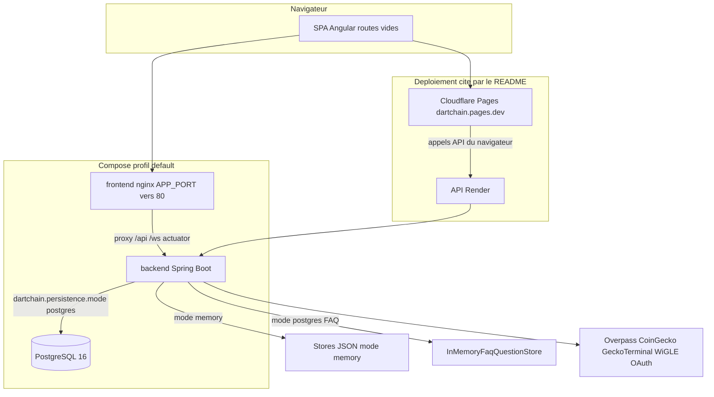

# 02 — Architecture globale

## Objectif

Montrer comment le navigateur, l’API Spring, la persistance et les déploiements Pages / Render se relient. Distinguer le mode `memory` du mode `postgres`, la SPA sans routes Angular, et les profils Docker Compose.

## Statut

Confirmé par le code pour les composants, les modes de persistance, les profils Compose et les cibles citées par le README. Le schéma ci-dessous est une vue de synthèse, pas un relevé de chaque classe.

## Sources analysées

- `/home/azertyuiop/dev/dartchain/README.md` (sections Architecture, Docker Compose, Déploiement)
- `/home/azertyuiop/dev/dartchain/apps/dartchain-backend/src/main/resources/application.yaml`
- `/home/azertyuiop/dev/dartchain/apps/dartchain-backend/bin/dev-env.sh`
- `/home/azertyuiop/dev/dartchain/apps/dartchain-frontend/Dart/src/app/app.routes.ts`
- `/home/azertyuiop/dev/dartchain/apps/dartchain-frontend/Dart/src/environments/environment.ts`
- Migrations Flyway `V1` à `V14` sous `apps/dartchain-backend/src/main/resources/db/migration/`

## Éléments représentés

- SPA Angular, `export const routes: Routes = []`
- Backend `io.dartchain.backend`, entrée `DartchainBackendApplication`
- Mode `memory` (JSON) et mode `postgres` (PostgreSQL 16, Flyway)
- FAQ : store JSON ou store RAM selon le mode
- Nginx local et `infra/nginx/nginx.prod.conf` (`backend-a`, `backend-b`)
- Cloudflare Pages (`wrangler.toml`, name `dartchain`) et API Render
- Profils Compose default, dev, db-local, staging, prod, p2p
- Sorties Overpass, taux crypto, WiGLE, OAuth

## Diagramme

Légende : Pages sert les assets statiques. Le proxy nginx du Compose est le chemin local et les profils qui embarquent le frontend. Le health backend est `/actuator/health` ou `/api/health`.

## Explication

### SPA sans routes

`apps/dartchain-frontend/Dart/src/app/app.routes.ts` contient `export const routes: Routes = []`. Le README le confirme : une seule page, sans routes Angular. La navigation du shell (navbar, showcase, dock, floor peek) est un état de composants, pas un routeur. Le dossier `star-conquest/` existe. `environment.ts` fixe `starConquestEnabled` à false, et `app.html` ne montre l’overlay que si ce flag est vrai.

Les dossiers de `src/app` sont admin, auth, blockchain, components, core, dock, exchange, explorer, faucet, metaverse, navbar, peers, quests, r4v3-scene, showcase, star-conquest, wallet, world-map, plus `components/depth-rail/` non suivi par Git et branché sur le showcase local.

### Mode memory

`application.yaml` fixe `dartchain.persistence.mode` à `${DARTCHAIN_PERSISTENCE_MODE:memory}`. Sans variable d’environnement, le défaut est `memory`. Les états vivent dans des fichiers JSON dont les propriétés sont `BLOCKCHAIN_STATE_PATH`, `EXCHANGE_LEDGER_PATH`, `LAUNCH_PROJECTS_PATH`, `CHAT_MESSAGES_PATH`, `NEWS_ITEMS_PATH`, `FAQ_QUESTIONS_PATH`, `QUESTS_PROGRESS_PATH`, `FAUCET_CLAIMS_PATH`, `AUTH_USERS_PATH`, `M4T3R_REWARDS_PATH`. Les défauts pointent vers `data/*.json`. En mode `memory`, les questions FAQ passent par `JsonFaqQuestionStore`.

Les stores de chaîne nommés sont `BlockchainStateStore`, `JsonBlockchainStateStore` et `JpaBlockchainStateStore`, avec `BlockchainSnapshot`.

### Mode postgres

Le profil postgres et la variable `DARTCHAIN_PERSISTENCE_MODE` basculent vers PostgreSQL. `bin/dev-env.sh` exporte `DARTCHAIN_PERSISTENCE_MODE=postgres`, ce qui explique le défaut « postgres » du tableau d’environnement du README pour un lancement local par les scripts. `info.dartchain.postgres-only-profiles` vaut `prod,staging`.

Flyway applique `V1__auth.sql` à `V14__oauth_identities.sql`. Les dix-sept tables sont décrites dans [04-dictionnaire-de-donnees.md](04-dictionnaire-de-donnees.md). En mode `postgres`, `InMemoryFaqQuestionStore` garde la FAQ en RAM. Il n’existe pas de table Flyway `faq_questions` dans le canon. `JpaAuthAuditStore` est conditionné par `dartchain.persistence.mode=postgres`.

Image Postgres du Compose : `postgres:16-alpine`. Volume nommé au moins `dartchain_pg_data` sur le profil default.

### Compose

Fichier unique cité par le README : `docker-compose.yml`.

| Profil | Services |
|--------|----------|
| default | `postgres`, `backend`, `frontend` |
| dev | `postgres-dev`, `backend-dev` |
| db-local | `postgres-local` |
| staging | `postgres-staging`, `backend-staging`, `frontend-staging` |
| prod | `postgres-prod`, `backend-a`, `backend-b`, `frontend-prod` |
| p2p | `postgres-a`, `postgres-b`, `backend-p2p-a`, `backend-p2p-b` |

Le frontend du profil default publie `${APP_PORT:-8080}:80`. Son nginx proxifie `/api/`, `/ws/` et actuator vers `backend:8080`. En prod, `infra/nginx/nginx.prod.conf` place les upstreams `backend-a` et `backend-b`. Images : backend `eclipse-temurin:21`, frontend `node:22-alpine` puis `nginx:1.27-alpine`.

Le README décrit les mêmes profils : default (nginx :8080), dev (Postgres et backend, UI en `ng serve`), db-local, staging (frontend :9080), prod (deux backends), p2p (ports 8081 et 8082).

### Déploiement Pages et Render

`wrangler.toml` nomme le projet `dartchain` et pointe les assets vers `dist/browser`. Le workflow `.github/workflows/cloudflare-deploy.yml` est manuel (`workflow_dispatch`) et utilise wrangler Pages. Le README indique la cible https://dartchain.pages.dev, branche `main`, Node 22, script `scripts/cloudflare-build.sh`. Le build CI frontend appelle `build:cloudflare` avec `BACKEND_URL` Render.

`deploy/render.yaml` est le blueprint Render. L’URL d’API citée par le README est https://dartchain-backend-1-0-0.onrender.com, health `/api/health`. L’image Docker Hub citée est `docker.io/rutkarf/dartchain-backend:1.0.0`. La CI construit aussi `dartchain-backend:ci` et `dartchain-frontend:ci`.

CORS dans `application.yaml` : motifs `localhost`, `127.0.0.1`, `https://dartchain.pages.dev`, `https://*.dartchain.pages.dev`, `https://*.pages.dev`, `https://dartzvz01-tagname.onrender.com`, `https://*.onrender.com`. Le README indique qu’une origine supplémentaire passe par `DARTCHAIN_CORS_EXTRA`.

### WebSockets et API

Quatre canaux : `/ws/peers`, `/ws/live`, `/ws/chat`, `/ws/metaverse-arena`. L’API est double : préfixes `/api` et `/api/v1`, avec `LegacyApiDeprecationFilter` et `ApiRoutes.LEGACY_STATS` sur `/api/stats`. `legacy-api-aliases-enabled` est false.

## Correspondance avec le code

| Sujet | Fichier ou symbole |
|-------|--------------------|
| Routes vides | `app.routes.ts` |
| Mode de persistance | `dartchain.persistence.mode`, `DARTCHAIN_PERSISTENCE_MODE` |
| Défaut local script | `apps/dartchain-backend/bin/dev-env.sh` |
| FAQ memory | `JsonFaqQuestionStore` |
| FAQ postgres | `InMemoryFaqQuestionStore` |
| Chaîne JPA | `JpaBlockchainStateStore` |
| Audit JPA | `JpaAuthAuditStore` |
| Pages | `wrangler.toml`, `.github/workflows/cloudflare-deploy.yml` |
| Render | `deploy/render.yaml`, URL du README |
| Prod nginx | `infra/nginx/nginx.prod.conf` |

Les vues `uml-08-composants.md`, `uml-09-deploiement.md`, `uml-35-architecture-logique.md` à `uml-42-environnements.md` détaillent cette coupe.

## Hypothèses

Le motif d’origine `https://dartzvz01-tagname.onrender.com` est présent dans le YAML. Son rôle opérationnel n’est pas décrit dans le README. Aucune topologie interne Render au-delà du blueprint et de l’URL publique n’est affirmée.

## Anomalies détectées

Le README (aperçu API) cite `/ws/live` et `/ws/chat`. Le code enregistre aussi `/ws/peers` et `/ws/metaverse-arena`. Le défaut YAML de persistance est `memory`. Le défaut du script local et le tableau README sont `postgres`. Le nom de réseau YAML est « DartChain Native ». Le défaut Java si le YAML ne charge pas est « R4V3 Testnet ». La FAQ du mode postgres n’a pas de table. Star Conquest est dans la section live du README alors que le flag frontend est false.

## Recommandations

Documenter les deux chemins de déploiement côte à côte : Pages vers Render, et Compose avec proxy nginx. Écrire le mode de persistance effectif à côté de chaque profil. Renvoyer le dictionnaire des tables vers [04-dictionnaire-de-donnees.md](04-dictionnaire-de-donnees.md) et les écarts vers [05-risques-et-incoherences.md](05-risques-et-incoherences.md).
