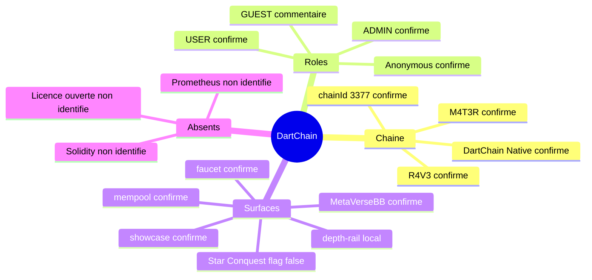

# 03 — Glossaire

## Objectif

Fixer le sens des termes réellement présents dans DartChain, avec le statut « confirmé » ou « non identifié ». Un terme confirmé est un nom lu dans le code, le SQL, la configuration ou le README du canon. Un terme non identifié n’a pas d’objet correspondant dans le périmètre décrit par le mémo et les fichiers ouverts.

## Statut

Les entrées ci-dessous sont des faits de nommage. Les définitions qui dépasseraient le code sont exclues. Review n’alimente pas ce glossaire, sauf mention explicite.

## Sources analysées

- `/home/azertyuiop/dev/dartchain/README.md`
- `/home/azertyuiop/dev/dartchain/apps/dartchain-backend/src/main/resources/application.yaml`
- `V12__ad_persistence.sql` (graine `chain_config`)
- `apps/dartchain-frontend/Dart/src/environments/environment.ts`
- `apps/dartchain-frontend/Dart/src/app/world-map/map-configuration.ts` (`canopyTitleLegacy`)
- `apps/dartchain-frontend/Dart/src/app/core/config/product-config.service.ts`
- `apps/dartchain-frontend/Dart/src/app/components/depth-rail/`
- `apps/dartchain-frontend/Dart/src/app/showcase/components/showcase-window/showcase-window.ts`
- `apps/dartchain-frontend/Dart/src/app/showcase/components/showcase-tabs/showcase-tabs.ts`

## Éléments représentés

Termes produit, rôles, chaîne, persistance, interfaces et absences. Le mindmap ne reprend qu’une partie des entrées, pour rester lisible.

## Diagramme

## Explication

### Produit et chaîne

| Terme | Statut | Sens attesté |
|-------|--------|----------------|
| DartChain | confirmé | Nom du produit et du dépôt. `spring.application.name` vaut `dartchain-backend`. `wrangler.toml` name `dartchain`. |
| R4V3 | confirmé | Token natif. YAML `dartchain.chain.native-token`. Graine SQL `chain_config.nativeToken`. |
| M4T3R | confirmé | Micro-unité citée par le README. Rewards, trail, faucet et `TestnetSettlementService`. L’échelle numérique exacte entre R4V3 et M4T3R n’est pas dans le mémo : voir le fichier 07. |
| chain-id 3377 | confirmé | `dartchain.chain.chain-id` et graine SQL `chainId`. |
| DartChain Native | confirmé | `dartchain.chain.network-name` et graine SQL `networkName`. |
| R4V3 Testnet | confirmé | Défaut Java `ChainProperties.networkName` si le YAML ne charge pas. |
| DCv1 | confirmé | Graine SQL `signingPayloadVersion`. |
| evm-compatible | confirmé | Graine SQL `addressSchemeDefault`. |
| evm | confirmé | Défaut SQL de `chain_accounts.address_scheme`. |
| mempool | confirmé | Terme du README et seuil `dartchain.ops.mempool-alert-threshold` (défaut 50). Le code du pool s’appelle `TransactionPoolService`, `PendingTransaction`, table `pending_transactions`. |
| Bloc | confirmé | Modèle `Block` : index, timestamp, data, transactions, previousHash, hash, nonce, difficulty. Table `blocks`. |
| Transaction | confirmé | Modèle `Transaction` : id, hash, sender, recipient, amount, timestamp, signature, systemReward, payload, status. |
| Wallet | confirmé | `WalletController`, `WalletV1Controller`, champs `walletAddress` / `walletPublicKey` sur `users`, table `chain_accounts`. |
| Faucet | confirmé | `FaucetController` `/api/faucet`, table `faucet_claims`, `dartchain.product.faucet-enabled` true. |
| Showcase | confirmé | Dossier frontend et contrôleurs `Showcase*`. `dartchain.product.showcase-enabled` true. Onglets README : TOUS, R4V3, CHAT, LABZ, D.A.O, MARCHÉ. |
| MetaVerseBB | confirmé | README, section ville 3D Marseille. `canopyTitleLegacy` vaut `MetaVerseBB` dans `map-configuration.ts`. |
| Arène BB | confirmé | Commentaire de `product-config.service.ts` : Arène BB, ex-MetaVerseBB. WebSocket `/ws/metaverse-arena`, `ArenaController` `/api/metaverse/arena`. |
| Star Conquest | confirmé | Dossier `star-conquest/`. README : 35 quêtes, 5 galaxies, univers live Ruche, persistance `localStorage`. Flag `starConquestEnabled` false. |
| depth-rail | confirmé | Composant local non commité `app-depth-rail`, presets `compact`, `band`, `shell`, modes `navigate` et `browse`. Référencé par le showcase modifié. |
| floor peek | confirmé | Terme du README pour le sol 3D en bas de page. |
| CharacterAnon | confirmé | Avatar cité par le README (mesh FBX/STL, stub NFT). |
| marseille-local-v1 | confirmé | Projection locale citée par le README. |
| Launchpad / LABZ | confirmé | README et `ShowcaseLaunchController`, table `launch_projects`. |
| Quête | confirmé | `QuestController` `/api/quests`, table `quest_progress`. |
| Peer | confirmé | `PeerController` `/api/peers`, WebSocket `/ws/peers`. |
| Swap | confirmé | `SwapController` `/api/swap`, `ExchangeController` `/api/exchange-panel`. |
| Explorer | confirmé | `ExplorerController`, `ExplorerV1Controller`. |
| Ops | confirmé | `OpsController`, `OpsV1Controller`. Seuils : mempool 50, erreurs HTTP 10, requête lente 2000 ms, RBAC refusé 20. |
| Hello | confirmé | `HelloController` `/api` `/hello`. |
| Phase AF | confirmé | `info.app.phase` dans `application.yaml`. Version `0.17.0-SNAPSHOT`. |
| Phase AD | confirmé | Commentaire de `V12__ad_persistence.sql`. Ce fichier crée des index, `chain_config` et `chain_accounts`. |
| OFFCHAIN | confirmé | Défaut `m4t3r.reward.settlement-mode`. `testnet-enabled` et `mainnet-enabled` sont false. |

### Rôles et sécurité

| Terme | Statut | Sens attesté |
|-------|--------|----------------|
| USER | confirmé | `UserRole.USER`. Défaut SQL `users.role` = `USER`. |
| ROLE_USER | confirmé | Autorité Spring associée à USER. |
| ADMIN | confirmé | `UserRole.ADMIN`. |
| ROLE_ADMIN | confirmé | Autorité Spring associée à ADMIN. |
| GUEST | confirmé | Commentaire dans `UserRole` : non authentifié, pas persisté. Pas une valeur de l’enum. |
| Anonymous | confirmé | `ChatService.ANONYMOUS_AUTHOR`, libellé « Anonymous ». |
| A1 à A6 | confirmé | Identifiants d’acteurs du mémo : visiteur, USER, ADMIN, pair P2P, jobs locaux, externes. |
| permitAll | confirmé | Règles de `SecurityConfig`, dont `GET /**`. |
| NativeJwtService | confirmé | Émission JWT. Access 3600 s, refresh 604800 s. |
| legacy-session | confirmé | `dartchain.auth.legacy-session-enabled` false. |
| seed admin | confirmé | Propriété `dartchain.admin.seed-sha256`, variable `DARTCHAIN_ADMIN_SEED_SHA256`. Valeur `[SECRET MASQUÉ]`. Unlock `POST /api/v1/admin/unlock`. |
| jwt-secret | confirmé | Propriété `dartchain.auth.jwt-secret`, variable `DARTCHAIN_JWT_SECRET`. Valeur `[SECRET MASQUÉ]`. |
| RateLimitFilter | confirmé | 60 requêtes par fenêtre de 60000 ms. Table `rate_limit_buckets`. |
| LegacyApiDeprecationFilter | confirmé | Filtre de l’API historique. `ApiRoutes.LEGACY_STATS` = `/api/stats`. `legacy-api-aliases-enabled` false. |

### Persistance

| Terme | Statut | Sens attesté |
|-------|--------|----------------|
| memory | confirmé | Défaut `dartchain.persistence.mode` si `DARTCHAIN_PERSISTENCE_MODE` est absent. |
| postgres | confirmé | Mode Flyway / JPA. Exporté par `dev-env.sh`. Profils. |
| Flyway V1–V14 | confirmé | Migrations sous `db/migration/`. |
| FaqQuestionStatus | confirmé | `ACTIVE`, `PINNED`, `ARCHIVED` dans `CommunityFaqService`. |
| JsonFaqQuestionStore | confirmé | FAQ du mode memory. |
| InMemoryFaqQuestionStore | confirmé | FAQ du mode postgres, en RAM. |
| ExchangeLedgerAdjustmentId | confirmé | Id-class de `exchange_ledger_adjustments`. |

### Externes

| Terme | Statut | Sens attesté |
|-------|--------|----------------|
| Overpass | confirmé | `OverpassProxyService`, `POST /api/metaverse/overpass`. |
| CoinGecko | confirmé | `CryptoRatesProxyService`. |
| GeckoTerminal | confirmé | `CryptoRatesProxyService`. |
| WiGLE | confirmé | `WiglePointsService`, `WigleVisualizationController`. Mock `dartchain.wigle.mock-enabled` true. |
| OAuth | confirmé | Fournisseurs google, meta, apple, microsoft, github, x, discord. `enabled` false par défaut. |
| Cloudflare Pages | confirmé | `dartchain.pages.dev`, `wrangler.toml`. |
| Render | confirmé | URL d’API du README, `deploy/render.yaml`. |
| OpenStreetMap / ODbL | confirmé | Attribution du README. |

### Termes non identifiés

| Terme | Statut | Constat |
|-------|--------|---------|
| Licence ouverte | non identifié | Le README demande de traiter le dépôt comme propriétaire tant qu’aucun fichier `LICENSE` n’est publié. Ceci cite le README. Ce n’est pas une analyse juridique. |
| Prometheus | non identifié | Pas de produit d’observabilité Prometheus relevé. |
| Grafana | non identifié | Pas de produit Grafana relevé. |
| Playwright | non identifié | Pas de suite E2E de ce nom. |
| Cypress | non identifié | Pas de suite E2E de ce nom. |
| Sync serveur Star Conquest | non identifié | Le README place cette synchro en feuille de route bloquée. Persistance citée : `localStorage`. |
| Géodonnées IGN / BD TOPO | non identifié | Le README les place hors données livrées (licence) et dit que Marseille est un footprint OSM, pas un levé IGN. |
| Provisionnement OAuth réel | non identifié | Hors dépôt. Les fournisseurs sont désactivés par défaut dans le YAML. |
| Valeur d’un secret | non identifié | Masquée par `[SECRET MASQUÉ]`. |
| Table `ads` ou colonnes publicitaires | non identifié | `V12__ad_persistence.sql` a été lu. Il ne crée pas de table publicitaire. |
| Association JPA `users` ↔ sessions | non identifié | Pas de `@ManyToOne` relevé. La clé étrangère SQL, elle, existe. |
| Smart contract / Solidity | non identifié | Aucun fichier `.sol`. |
| Produit preseed | non identifié | L’arbre PreSeed est le même dépôt, pas un second produit. |
| Mainnet opérationnel | non identifié | README : aucun mainnet. `m4t3r.reward.mainnet-enabled` false. |
| Forum canon | non identifié | Pas de module forum dans le canon. Le mot apparaît dans Review, sans route `forum` dans `app.routes.ts`. |

## Correspondance avec le code

Les enums et propriétés cités portent les noms exacts du dépôt : `UserRole`, `NativeJwtService`, `ChatService.ANONYMOUS_AUTHOR`, `dartchain.persistence.mode`, `dartchain.chain.chain-id`, `starConquestEnabled`, `app-depth-rail`. Les graines `chain_config` sont dans `V12__ad_persistence.sql`.

## Hypothèses

Le mot « micro-unité » pour M4T3R vient du README. Il ne fixe pas un nombre de décimales. GUEST n’est pas interprété comme un rôle stocké. « Phase AD » est le commentaire SQL, pas une régie publicitaire.

## Anomalies détectées

`addressSchemeDefault` dans `chain_config` vaut `evm-compatible`. Le défaut de colonne `chain_accounts.address_scheme` vaut `evm`. `R4V3 Testnet` et `DartChain Native` coexistent selon que le YAML est chargé. `GUEST` peut être lu à tort comme une troisième valeur d’enum. Le nom de fichier `V12__ad_persistence.sql` peut être lu à tort comme de la publicité.

## Recommandations

Reprendre ce glossaire dans les diagrammes plutôt que d’introduire un synonyme. Quand un terme est « non identifié », la vue correspondante doit le dire, en particulier `uml-58-smart-contracts.md`. Index : [00-index.md](00-index.md).
