# 04 — Dictionnaire de données

## Objectif

Décrire les 17 tables du canon DartChain : champ Java, colonne SQL, type SQL lu dans Flyway, contraintes lues. Le type Java n’est indiqué que lorsque le mémo le donne (`UUID`). Sinon la colonne « Type Java » porte « non précisé ».

## Statut

Confirmé par lecture des migrations `V1__auth.sql` à `V14__oauth_identities.sql`, y compris `V12__ad_persistence.sql`. Les noms de champs Java viennent du mémo d’entités. Aucune table supplémentaire n’est ajoutée.

## Sources analysées

- `/home/azertyuiop/dev/dartchain/apps/dartchain-backend/src/main/resources/db/migration/V1__auth.sql`
- `V2__quests.sql`, `V3__quest_week_key.sql`, `V4__faucet_claims.sql`, `V5__quest_explored_blocks.sql`
- `V6__blockchain.sql`, `V7__exchange_ledger.sql`, `V8__launch_projects.sql`, `V9__chat_messages.sql`
- `V10__news_items.sql`, `V11__auth_ab.sql`, `V12__ad_persistence.sql`, `V13__launch_project_metadata.sql`
- `V14__oauth_identities.sql`

`V12__ad_persistence.sql` a été ouvert. Son commentaire dit « Phase AD — indexes persistance + métadonnées chaîne EVM-compatible native ». Il crée des index, la table `chain_config` et la table `chain_accounts`. Il ne crée pas de table publicitaire. Le détail colonnes de ce fichier est donc repris ici, pour `chain_config` et `chain_accounts`.

## Éléments représentés

Dix-sept tables. Les liens `user_id` des entités JPA sont des UUID scalaires : aucun `@ManyToOne` ni `@OneToMany` n’a été relevé. Quatre clés étrangères SQL, elles, sont écrites dans les migrations.

Graine `chain_config` lue dans V12, qui n’est pas un secret : `chainId` = `3377`, `networkName` = `DartChain Native`, `nativeToken` = `R4V3`, `addressSchemeDefault` = `evm-compatible`, `signingPayloadVersion` = `DCv1`.

## Diagramme

```mermaid
erDiagram
  users ||--o{ auth_sessions : "user_id FK"
  users ||--o{ auth_refresh_tokens : "user_id FK"
  users ||--o{ oauth_identities : "user_id FK"
  users ||--|| quest_progress : "user_id PK FK"
  users {
    uuid id PK
    varchar username
    varchar role
  }
  auth_sessions {
    uuid token PK
    uuid user_id FK
  }
  auth_refresh_tokens {
    uuid token PK
    uuid user_id FK
  }
  oauth_identities {
    uuid id PK
    uuid user_id FK
  }
  quest_progress {
    uuid user_id PK
  }
  auth_audit_log {
    uuid id PK
    uuid user_id
  }
  rate_limit_buckets {
    varchar bucket_key PK
  }
  faucet_claims {
    varchar id PK
  }
  blocks {
    int block_index PK
  }
  pending_transactions {
    varchar id PK
  }
  chain_config {
    varchar config_key PK
  }
  chain_accounts {
    varchar address PK
  }
  exchange_ledger_adjustments {
    varchar wallet_address PK
    varchar token PK
  }
  exchange_seeded_wallets {
    varchar wallet_address PK
  }
  launch_projects {
    varchar id PK
  }
  chat_messages {
    varchar id PK
  }
  news_items {
    varchar id PK
  }
```

Légende : seules les relations avec `REFERENCES` dans le SQL sont dessinées. `auth_audit_log.user_id` n’a pas de clé étrangère. Les autres tables n’ont pas de lien SQL vers `users`.

## Explication

Lecture des colonnes : « Champ Java » = nom du mémo. « Type Java » = `UUID` seulement si le mémo l’écrit, sinon « non précisé ». « Type SQL » = type lu dans la migration. Les index secondaires sont cités sous chaque table, pas dans le diagramme.

### users / UserEntity

Création `V1__auth.sql`. Colonne `role` ajoutée par `V11__auth_ab.sql`. Index `idx_users_wallet_address`.

| Champ Java | Colonne SQL | Type Java | Type SQL | Contraintes lues |
|------------|-------------|-----------|----------|------------------|
| id | id | UUID | UUID | PK |
| username | username | non précisé | VARCHAR(64) | NOT NULL, UNIQUE |
| email | email | non précisé | VARCHAR(255) | NOT NULL, UNIQUE |
| passwordHash | password_hash | non précisé | VARCHAR(128) | NOT NULL |
| passwordSalt | password_salt | non précisé | VARCHAR(64) | NOT NULL |
| walletAddress | wallet_address | non précisé | VARCHAR(128) | nullable |
| walletPublicKey | wallet_public_key | non précisé | TEXT | nullable |
| createdAt | created_at | non précisé | TIMESTAMPTZ | NOT NULL, défaut `NOW()` |
| role | role | non précisé | VARCHAR(16) | NOT NULL, défaut `USER` |

### auth_sessions / AuthSessionEntity

`V1__auth.sql`. Index `idx_auth_sessions_user_id`, `idx_auth_sessions_expires_at`.

| Champ Java | Colonne SQL | Type Java | Type SQL | Contraintes lues |
|------------|-------------|-----------|----------|------------------|
| token | token | UUID | UUID | PK |
| userId | user_id | UUID | UUID | NOT NULL, FK `users(id)` ON DELETE CASCADE |
| expiresAt | expires_at | non précisé | TIMESTAMPTZ | NOT NULL |
| createdAt | created_at | non précisé | TIMESTAMPTZ | NOT NULL, défaut `NOW()` |

### auth_refresh_tokens / AuthRefreshTokenEntity

`V11__auth_ab.sql`. Index `idx_auth_refresh_tokens_user_id`, `idx_auth_refresh_tokens_expires_at`.

| Champ Java | Colonne SQL | Type Java | Type SQL | Contraintes lues |
|------------|-------------|-----------|----------|------------------|
| token | token | UUID | UUID | PK |
| userId | user_id | UUID | UUID | NOT NULL, FK `users(id)` ON DELETE CASCADE |
| expiresAt | expires_at | non précisé | TIMESTAMPTZ | NOT NULL |
| createdAt | created_at | non précisé | TIMESTAMPTZ | NOT NULL, défaut `NOW()` |

### auth_audit_log / AuthAuditLogEntity

`V11__auth_ab.sql`. Index `idx_auth_audit_log_user_id`, `idx_auth_audit_log_created_at`. Pas de `REFERENCES` sur `user_id`.

| Champ Java | Colonne SQL | Type Java | Type SQL | Contraintes lues |
|------------|-------------|-----------|----------|------------------|
| id | id | non précisé | UUID | PK |
| userId | user_id | UUID | UUID | nullable, sans FK |
| action | action | non précisé | VARCHAR(64) | NOT NULL |
| detail | detail | non précisé | TEXT | nullable |
| ipAddress | ip_address | non précisé | VARCHAR(64) | nullable |
| createdAt | created_at | non précisé | TIMESTAMPTZ | NOT NULL, défaut `NOW()` |

### oauth_identities / OAuthIdentityEntity

`V14__oauth_identities.sql`. Contrainte `uq_oauth_provider_subject` sur `(provider, provider_subject)`. Index `idx_oauth_identities_user_id`.

| Champ Java | Colonne SQL | Type Java | Type SQL | Contraintes lues |
|------------|-------------|-----------|----------|------------------|
| id | id | non précisé | UUID | PK |
| userId | user_id | UUID | UUID | NOT NULL, FK `users(id)` ON DELETE CASCADE |
| provider | provider | non précisé | VARCHAR(32) | NOT NULL |
| providerSubject | provider_subject | non précisé | VARCHAR(255) | NOT NULL |
| createdAt | created_at | non précisé | TIMESTAMPTZ | NOT NULL, défaut `NOW()` |

### rate_limit_buckets / RateLimitBucketEntity

`V11__auth_ab.sql`.

| Champ Java | Colonne SQL | Type Java | Type SQL | Contraintes lues |
|------------|-------------|-----------|----------|------------------|
| bucketKey | bucket_key | non précisé | VARCHAR(256) | PK |
| windowStartMs | window_start_ms | non précisé | BIGINT | NOT NULL |
| requestCount | request_count | non précisé | INT | NOT NULL |
| updatedAt | updated_at | non précisé | TIMESTAMPTZ | NOT NULL, défaut `NOW()` |

### quest_progress / QuestProgressEntity

`V2__quests.sql`, colonne `week_key` dans `V3__quest_week_key.sql`, colonne `explored_blocks_json` dans `V5__quest_explored_blocks.sql`. Index `idx_quest_progress_day_key`.

| Champ Java | Colonne SQL | Type Java | Type SQL | Contraintes lues |
|------------|-------------|-----------|----------|------------------|
| userId | user_id | UUID | UUID | PK, FK `users(id)` ON DELETE CASCADE |
| dayKey | day_key | non précisé | VARCHAR(10) | NOT NULL |
| weekKey | week_key | non précisé | VARCHAR(8) | NOT NULL |
| tasksJson | tasks_json | non précisé | JSONB | NOT NULL |
| exploredBlocksJson | explored_blocks_json | non précisé | JSONB | NOT NULL, défaut `[]` |
| missionClaimed | mission_claimed | non précisé | BOOLEAN | NOT NULL, défaut false |
| weeklyClaimed | weekly_claimed | non précisé | BOOLEAN | NOT NULL, défaut false |
| totalXp | total_xp | non précisé | INT | NOT NULL, défaut 0 |
| pendingMts | pending_mts | non précisé | NUMERIC(18,2) | NOT NULL, défaut 0 |
| updatedAt | updated_at | non précisé | TIMESTAMPTZ | NOT NULL, défaut `NOW()` |

### faucet_claims / FaucetClaimEntity

`V4__faucet_claims.sql`. Index `idx_faucet_claims_wallet_claimed_at` sur `(wallet_address, claimed_at DESC)`.

| Champ Java | Colonne SQL | Type Java | Type SQL | Contraintes lues |
|------------|-------------|-----------|----------|------------------|
| id | id | non précisé | VARCHAR(36) | PK |
| walletAddress | wallet_address | non précisé | VARCHAR(128) | NOT NULL |
| amount | amount | non précisé | NUMERIC(38,26) | NOT NULL |
| claimedAt | claimed_at | non précisé | BIGINT | NOT NULL |
| nextEligibleAt | next_eligible_at | non précisé | BIGINT | NOT NULL |
| txHash | tx_hash | non précisé | VARCHAR(128) | nullable |
| clientId | client_id | non précisé | VARCHAR(128) | nullable |
| createdAt | created_at | non précisé | TIMESTAMPTZ | NOT NULL, défaut `NOW()` |

### blocks / BlockEntity

`V6__blockchain.sql`. Index `idx_blocks_hash`.

| Champ Java | Colonne SQL | Type Java | Type SQL | Contraintes lues |
|------------|-------------|-----------|----------|------------------|
| blockIndex | block_index | non précisé | INT | PK |
| blockTimestamp | block_timestamp | non précisé | BIGINT | NOT NULL |
| blockData | block_data | non précisé | TEXT | nullable |
| previousHash | previous_hash | non précisé | VARCHAR(128) | NOT NULL |
| blockHash | block_hash | non précisé | VARCHAR(128) | NOT NULL |
| nonce | nonce | non précisé | INT | NOT NULL |
| difficulty | difficulty | non précisé | INT | NOT NULL |
| transactionsJson | transactions_json | non précisé | JSONB | NOT NULL, défaut `[]` |

### pending_transactions / PendingTransactionEntity

`V6__blockchain.sql`. Index `idx_pending_created`. `V12__ad_persistence.sql` ajoute `idx_pending_from` et `idx_pending_to`.

| Champ Java | Colonne SQL | Type Java | Type SQL | Contraintes lues |
|------------|-------------|-----------|----------|------------------|
| id | id | non précisé | VARCHAR(36) | PK |
| txHash | tx_hash | non précisé | VARCHAR(128) | nullable |
| fromAddress | from_address | non précisé | VARCHAR(128) | NOT NULL |
| toAddress | to_address | non précisé | VARCHAR(128) | NOT NULL |
| amount | amount | non précisé | NUMERIC(38,26) | NOT NULL |
| txData | tx_data | non précisé | TEXT | nullable |
| signature | signature | non précisé | TEXT | nullable |
| status | status | non précisé | VARCHAR(32) | nullable |
| systemReward | system_reward | non précisé | BOOLEAN | NOT NULL, défaut false |
| createdAt | created_at | non précisé | BIGINT | NOT NULL |

### chain_config / ChainConfigEntity

`V12__ad_persistence.sql`.

| Champ Java | Colonne SQL | Type Java | Type SQL | Contraintes lues |
|------------|-------------|-----------|----------|------------------|
| configKey | config_key | non précisé | VARCHAR(64) | PK |
| configValue | config_value | non précisé | TEXT | NOT NULL |

### chain_accounts / ChainAccountEntity

`V12__ad_persistence.sql`. Index `idx_chain_accounts_scheme`.

| Champ Java | Colonne SQL | Type Java | Type SQL | Contraintes lues |
|------------|-------------|-----------|----------|------------------|
| address | address | non précisé | VARCHAR(42) | PK |
| addressScheme | address_scheme | non précisé | VARCHAR(16) | NOT NULL, défaut `evm` |
| publicKey | public_key | non précisé | TEXT | nullable |
| nonce | nonce | non précisé | BIGINT | NOT NULL, défaut 0 |
| createdAt | created_at | non précisé | BIGINT | NOT NULL |

### exchange_ledger_adjustments / ExchangeLedgerAdjustmentEntity

`V7__exchange_ledger.sql`. Clé primaire composée. Id-class Java `ExchangeLedgerAdjustmentId`. Index `idx_exchange_wallet` ajouté par V12.

| Champ Java | Colonne SQL | Type Java | Type SQL | Contraintes lues |
|------------|-------------|-----------|----------|------------------|
| walletAddress | wallet_address | non précisé | VARCHAR(128) | PK (avec token), NOT NULL |
| token | token | non précisé | VARCHAR(16) | PK (avec wallet_address), NOT NULL |
| adjustment | adjustment | non précisé | NUMERIC(38,8) | NOT NULL |

### exchange_seeded_wallets / ExchangeSeededWalletEntity

`V7__exchange_ledger.sql`.

| Champ Java | Colonne SQL | Type Java | Type SQL | Contraintes lues |
|------------|-------------|-----------|----------|------------------|
| walletAddress | wallet_address | non précisé | VARCHAR(128) | PK |

### launch_projects / LaunchProjectEntity

`V8__launch_projects.sql`. Colonnes `whitepaper_url`, `website`, `launch_date` ajoutées par `V13__launch_project_metadata.sql`.

| Champ Java | Colonne SQL | Type Java | Type SQL | Contraintes lues |
|------------|-------------|-----------|----------|------------------|
| id | id | non précisé | VARCHAR(64) | PK |
| name | name | non précisé | VARCHAR(128) | NOT NULL |
| symbol | symbol | non précisé | VARCHAR(16) | NOT NULL, UNIQUE |
| status | status | non précisé | VARCHAR(16) | NOT NULL |
| raisedAmount | raised_amount | non précisé | NUMERIC(18,2) | NOT NULL, défaut 0 |
| targetAmount | target_amount | non précisé | NUMERIC(18,2) | NOT NULL, défaut 0 |
| createdAt | created_at | non précisé | TIMESTAMPTZ | NOT NULL |
| logoUrl | logo_url | non précisé | TEXT | nullable |
| description | description | non précisé | TEXT | nullable |
| chain | chain | non précisé | VARCHAR(64) | nullable |
| whitepaperUrl | whitepaper_url | non précisé | TEXT | nullable |
| website | website | non précisé | TEXT | nullable |
| launchDate | launch_date | non précisé | VARCHAR(40) | nullable |

### chat_messages / ChatMessageEntity

`V9__chat_messages.sql`. Index `idx_chat_room_sent` sur `(room_id, sent_at DESC)`.

| Champ Java | Colonne SQL | Type Java | Type SQL | Contraintes lues |
|------------|-------------|-----------|----------|------------------|
| id | id | non précisé | VARCHAR(36) | PK |
| roomId | room_id | non précisé | VARCHAR(64) | NOT NULL |
| author | author | non précisé | VARCHAR(128) | NOT NULL |
| messageText | message_text | non précisé | TEXT | NOT NULL |
| sentAt | sent_at | non précisé | TIMESTAMPTZ | NOT NULL |
| clientId | client_id | non précisé | VARCHAR(64) | nullable |
| fontKey | font_key | non précisé | VARCHAR(32) | nullable |
| fontSize | font_size | non précisé | VARCHAR(8) | nullable |
| bold | bold | non précisé | BOOLEAN | NOT NULL, défaut false |
| italic | italic | non précisé | BOOLEAN | NOT NULL, défaut false |
| underline | underline | non précisé | BOOLEAN | NOT NULL, défaut false |
| strikethrough | strikethrough | non précisé | BOOLEAN | NOT NULL, défaut false |
| fontColor | font_color | non précisé | VARCHAR(16) | nullable |
| highlightColor | highlight_color | non précisé | VARCHAR(16) | nullable |
| textAlign | text_align | non précisé | VARCHAR(16) | nullable |
| styleKey | style_key | non précisé | VARCHAR(32) | nullable |

### news_items / NewsItemEntity

`V10__news_items.sql`. Index `idx_news_published`.

| Champ Java | Colonne SQL | Type Java | Type SQL | Contraintes lues |
|------------|-------------|-----------|----------|------------------|
| id | id | non précisé | VARCHAR(64) | PK |
| category | category | non précisé | VARCHAR(64) | NOT NULL |
| title | title | non précisé | TEXT | NOT NULL |
| summary | summary | non précisé | TEXT | nullable |
| body | body | non précisé | TEXT | nullable |
| publishedAt | published_at | non précisé | TIMESTAMPTZ | NOT NULL |
| source | source | non précisé | VARCHAR(16) | NOT NULL |
| actionType | action_type | non précisé | VARCHAR(32) | nullable |
| actionTarget | action_target | non précisé | TEXT | nullable |

### Hors de ces 17 tables

La FAQ canon (`FaqQuestion`, `FaqQuestionStore`) n’a pas de table Flyway. Le mode `memory` utilise `JsonFaqQuestionStore`. Le mode `postgres` utilise `InMemoryFaqQuestionStore`. Review, produit séparé, a une table `faq_questions` qui n’appartient pas à ce dictionnaire.

Les modèles `Block`, `Transaction` et `PendingTransaction` existent aussi hors JPA. Leurs champs de domaine sont dans le mémo. Les colonnes ci-dessus sont celles des tables.

## Correspondance avec le code

Les entités nommées par le mémo portent le suffixe `Entity` : `UserEntity`, `AuthSessionEntity`, `AuthRefreshTokenEntity`, `AuthAuditLogEntity`, `OAuthIdentityEntity`, `RateLimitBucketEntity`, `QuestProgressEntity`, `FaucetClaimEntity`, `BlockEntity`, `PendingTransactionEntity`, `ChainConfigEntity`, `ChainAccountEntity`, `ExchangeLedgerAdjustmentEntity`, `ExchangeSeededWalletEntity`, `LaunchProjectEntity`, `ChatMessageEntity`, `NewsItemEntity`.

La vue `uml-47-dictionnaire-donnees.md` reprend ce dictionnaire côté diagrammes. Les vues `uml-43` à `uml-48` couvrent base, ERD, MCD, MLD, dictionnaire et relations.

## Hypothèses

Le passage camelCase Java vers snake_case SQL suit les colonnes lues, pas une convention supposée. Aucun type Java `String`, `Instant` ou `BigDecimal` n’est inventé quand le mémo ne le donne pas. Aucune colonne publicitaire n’est imaginée à partir du nom de fichier V12.

## Anomalies détectées

`auth_audit_log.user_id` est un UUID nullable sans clé étrangère, alors que les sessions, les refresh tokens, les identités OAuth et `quest_progress` référencent `users`. Le JPA ne mappe pas ces liens en associations. `chain_config.addressSchemeDefault` vaut `evm-compatible` et le défaut `chain_accounts.address_scheme` vaut `evm`. `launch_projects.launch_date` est un `VARCHAR(40)`, pas un type date SQL. `faucet_claims.claimed_at` et `pending_transactions.created_at` sont des `BIGINT`, alors que d’autres `created_at` sont des `TIMESTAMPTZ`.

## Recommandations

Garder ce fichier comme source des colonnes pour les diagrammes de données. Si une entité JPA diverge un jour du SQL, le signaler dans [05-risques-et-incoherences.md](05-risques-et-incoherences.md) au lieu d’aligner les deux par hypothèse. Ne pas recopier `password_hash` ni `password_salt` d’un environnement réel.
