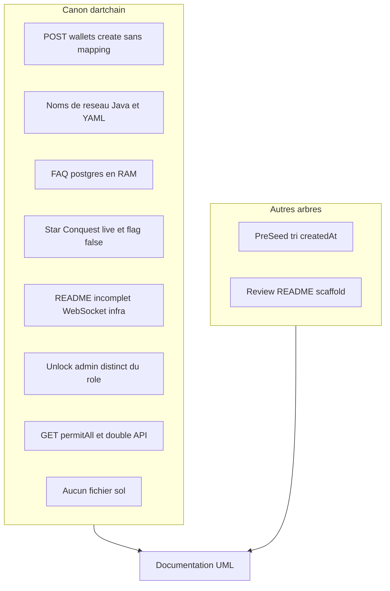

# 05 — Risques et incohérences

## Objectif

Recenser les incohérences confirmées du canon, l’écart du working tree PreSeed, et les écarts du produit Review. Ces constats sont documentés. Ils ne sont pas corrigés dans le code.

## Statut

Confirmé pour chaque écart dont la source est citée. Les causes historiques restent dans [06-hypotheses.md](06-hypotheses.md).

## Sources analysées

- `/home/azertyuiop/dev/dartchain/README.md`
- `/home/azertyuiop/dev/dartchain/apps/dartchain-backend/src/main/resources/application.yaml`
- `SecurityConfig`, `WalletController`, `WalletV1Controller` (tels que décrits par le mémo et les écarts déjà vus)
- Migrations `V12__ad_persistence.sql` et `V11__auth_ab.sql`
- `apps/dartchain-frontend/Dart/src/environments/environment.ts`
- `git status` et `git diff` du canon au commit `0690e34`
- `/home/azertyuiop/dev/dartchainPreSeed/dartchain` — même commit, diff de `JpaAuthAuditStore.java`
- `/home/azertyuiop/dev/dartchainReview/README.md`
- `dartchainReview/apps/frontend/README.md`, `apps/frontend/src/app/app.routes.ts`
- `dartchainReview/apps/backend/README.md`, `apps/backend/src/main/resources/application.properties`
- `dartchainReview/docs/ARCHITECTURE.md`
- `dartchainReview/apps/backend/src/main/resources/db/migration/.gitkeep`
- `JwtAuthFilter.java` de Review (`ROLE_USER`)
- Entités Review `review_users` et `faq_questions`

## Éléments représentés

Dix écarts imposés par le mémo, les risques de configuration lus sans recopier de secret, l’écart PreSeed, les écarts Review.

## Diagramme

## Explication

### Écarts du canon

1. `SecurityConfig` autorise `POST /api/wallets/create` en permitAll. `WalletController` ne mappe que `POST /create-client` et `POST /verify`. `WalletV1Controller` mappe `POST /generate-evm`. `dartchain.product.allow-server-wallet-create` est false. `dartchain.chain.allow-server-evm-wallet-create` est true. Le chemin `/api/wallets/create` est donc autorisé au niveau Spring et sans mapping de contrôleur relevé.

2. Le README, section « API backend (aperçu) », cite les WebSockets `/ws/live` et `/ws/chat`. `WebSocketConfig` enregistre aussi `/ws/peers` et `/ws/metaverse-arena`. Le tableau des domaines frontend du README ne liste pas le dossier `admin/`, alors que le dock décrit un onglet Admin visible si `isAdmin()`. L’arbre « Structure du monorepo » ne cite ni `infra/`, ni `Makefile`, ni `wrangler.toml`. `infra/nginx/nginx.prod.conf` et `wrangler.toml` (name `dartchain`, assets `dist/browser`) sont présents.

3. `dartchain.chain.network-name` et la graine SQL `networkName` valent « DartChain Native ». Le défaut Java `ChainProperties.networkName` vaut « R4V3 Testnet » si le YAML ne charge pas. Le README publie « DartChain Native ».

4. En mode `postgres`, la FAQ passe par `InMemoryFaqQuestionStore` (liste en RAM). Il n’y a pas de table Flyway `faq_questions` dans le canon. En mode `memory`, le store est `JsonFaqQuestionStore`. Les statuts utilisés par `CommunityFaqService` sont `ACTIVE`, `PINNED`, `ARCHIVED`.

5. `GET /**` est permitAll. Les mutations hors liste publique exigent une authentification. Au niveau Spring, les lectures HTTP GET sont publiques. L’autorisation fine des écritures porte sur le reste des routes.

6. `ROLE_ADMIN` (`UserRole.ADMIN`) et le déverrouillage du panneau sont deux mécanismes. `POST /api/v1/admin/unlock` est permitAll. `AdminUnlockService` compare une empreinte SHA-256, propriété `dartchain.admin.seed-sha256`. La valeur est `[SECRET MASQUÉ]`.

7. Deux familles d’URL coexistent : `/api` et `/api/v1`. `LegacyApiDeprecationFilter` existe. `ApiRoutes.LEGACY_STATS` vaut `/api/stats`. `dartchain.product.legacy-api-aliases-enabled` est false. `dartchain.auth.legacy-session-enabled` est false. `allow-legacy-private-key` est false.

8. Aucun smart contract. Aucun fichier `.sol`. La vue 58 doit porter la phrase : « Ce diagramme n’est pas générable à partir du contenu actuel du projet. Aucun élément blockchain correspondant n’a été identifié. »

9. Le README classe Star Conquest dans « Fonctionnalités (live) » : 35 quêtes, 5 galaxies, univers Ruche, persistance `localStorage`. `environment.ts` et `environment.factory.ts` ont `starConquestEnabled: false`. `app.html` n’affiche Star Conquest que si le flag est vrai. La feuille de route dit déjà que la synchro Spring des quêtes est bloquée et que les autres univers ne sont pas branchés.

10. Working tree du canon, commit de tête `0690e34` « Try to be here » (2026-09-24), fichiers modifiés non commités : showcase (`showcase-panel`, `showcase-tab-showcase`, `showcase-tabs`, `showcase-window`, `app.css`), `AdminExportService`, `AuthAuditStore`, `InMemoryAuthAuditStore`, `JpaAuthAuditStore`. Non suivi : `apps/dartchain-frontend/Dart/src/app/components/depth-rail/` (cinq fichiers). Le showcase modifié importe `DepthRailComponent`. Le commit, lui, n’a pas `snapshot()` sur `JpaAuthAuditStore` : cette méthode est dans le working tree.

Autres constats de configuration, sans valeur de secret :

- CSRF désactivé, sessions `STATELESS`. Cohérent avec un JWT, à connaître pour la vue menaces.
- `dartchain.auth.password-min-length` vaut 6.
- `dartchain.ops.restrict-actuator` vaut false. Le jeton est la propriété `dartchain.ops.actuator-token` : `[SECRET MASQUÉ]`.
- Rate limit : `dartchain.rate-limit.max-requests` 60, `window-ms` 60000.
- `dartchain.security.strict-pending-signatures` true.
- Arène activée. Paramètres lus : loot-rate 0.10, loot-cap-per-elimination 25, minimum-faucet-balance-to-loot 1, spawn-shield 8 s, respawn 8 s, kill-cooldown 5 s, daily-loot-cap 200, daily-loss-cap 200, protection nouveau joueur 60 s, anti-farming-threshold 8.
- WiGLE : `dartchain.wigle.mock-enabled` true. `api-name` et `api-token` : `[SECRET MASQUÉ]`.
- OAuth : les sept fournisseurs ont `enabled` false par défaut. Secrets clients : `[SECRET MASQUÉ]`.
- `m4t3r.reward.signing-key` : `[SECRET MASQUÉ]`. `mainnet-enabled` false. `testnet-enabled` false. `settlement-mode` défaut `OFFCHAIN`.
- `chain_config` stocke `addressSchemeDefault` = `evm-compatible`. La colonne `chain_accounts.address_scheme` a le défaut `evm`.
- Défaut de persistance YAML : `memory`. `dev-env.sh` et le tableau README local : `postgres`.
- `GET` et `POST`/`DELETE` publics du showcase chat, trail pickup, overpass et inquiries de placements sont dans la liste permitAll du mémo. Ils élargissent la surface anonyme au-delà des lectures.

### Écart PreSeed

`/home/azertyuiop/dev/dartchainPreSeed/dartchain` est le même commit `0690e34`. Il n’y a pas de produit nommé preseed dans le code.

Les deux working trees modifient les mêmes quatre fichiers d’audit : `AdminExportService` (dépendance `AuthAuditStore` à la place de `InMemoryAuthAuditStore`), `AuthAuditStore` (méthode `snapshot()`), `InMemoryAuthAuditStore`, `JpaAuthAuditStore`. Ces quatre fichiers sont identiques entre les deux arbres, sauf `JpaAuthAuditStore.snapshot()` : PreSeed trie par `AuthAuditLogEntity.getCreatedAt` avec `Comparator.nullsLast`. Le canon ne trie pas.

Le working tree PreSeed vu par `git status` ne contient pas les modifications showcase ni `depth-rail`.

### Review

`/home/azertyuiop/dev/dartchainReview` est un site compagnon, pas la chaîne. Angular 21, port 4201. Spring `io.dartchain.review`, port 8081. Base H2 (`jdbc:h2:file`, `spring.jpa.hibernate.ddl-auto=update`). Tables `review_users` et `faq_questions`. `JwtAuthFilter` pose toujours l’autorité `ROLE_USER`. Aucun wallet, aucun bloc, aucun `.sol`. Le mémo compte 134 fichiers hors caches. Le dossier de migration ne contient qu’un `.gitkeep`.

Le README racine se dit « scaffold initial » et indique qu’il n’y a pas encore de landing, de forum ni de contenu métier. `app.routes.ts` charge pourtant des pages : accueil, `comprendre`, `r4v3`, `faq`, `inscription`, `connexion`, `ressources`, `legal/risques`, `legal/mentions`, `legal/confidentialite`. Il n’y a pas de route `forum`. Le README frontend annonce une page `forum` parmi les pages prévues. `docs/ARCHITECTURE.md` place `forum/` et le package `community/` en phase 2. `package-info.java` du package `community` dit « Community / forum domain — Phase 2 ».

Le README backend dit que JPA et Flyway sont désactivés jusqu’au provisionnement Postgres. `application.properties` active JPA avec `ddl-auto=update` sur H2. Les identifiants de cette datasource et `dartchain.review.jwt.secret` (variable `REVIEW_JWT_SECRET`) sont `[SECRET MASQUÉ]`.

## Correspondance avec le code

| Écart | Ancrage |
|-------|---------|
| Wallet create | `SecurityConfig`, `WalletController`, `WalletV1Controller` |
| Réseau | `application.yaml` `dartchain.chain.network-name`, `ChainProperties.networkName`, `chain_config` |
| FAQ | `JsonFaqQuestionStore`, `InMemoryFaqQuestionStore` |
| Star Conquest | `environment.ts`, `app.html`, README |
| Audit | `JpaAuthAuditStore.snapshot()` |
| Review | `app.routes.ts`, `application.properties`, `JwtAuthFilter` |
| Contrats | absence de `.sol`, vue `uml-58-smart-contracts.md` |

## Hypothèses

La raison historique de la route wallet, du flag Star Conquest et du store FAQ n’est pas établie. Voir [06-hypotheses.md](06-hypotheses.md). L’impact visuel du tri PreSeed n’a pas été rejoué dans l’interface.

## Anomalies détectées

Ce fichier est la liste des anomalies. Les plus structurantes pour un lecteur du README sont : Star Conquest affiché comme live, WebSockets peers et arène absents de l’aperçu, nom de réseau double, route wallet sans contrôleur, FAQ non durable en postgres, admin seed distinct de `ROLE_ADMIN`, Review décrit comme scaffold alors que des pages existent, et l’écart de tri d’audit entre les deux working trees.

## Recommandations

Priorités documentaires, dans l’ordre : aligner la section live du README sur `starConquestEnabled` ; compléter l’aperçu WebSocket et citer `infra/`, `Makefile`, `wrangler.toml` ; expliquer les deux noms de réseau ; documenter `POST /api/wallets/create` comme permitAll sans mapping ; expliquer la FAQ RAM ; séparer unlock seed et `ROLE_ADMIN` ; garder la phrase exacte de la vue 58 ; décrire V12 comme phase AD ; isoler Review et PreSeed du canon. Ne pas « corriger » ces points dans le Java, le TypeScript ou le YAML depuis cette documentation. Index : [00-index.md](00-index.md).
