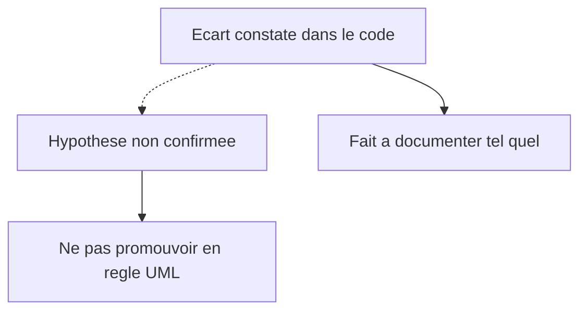

# 06 — Hypothèses

## Objectif

Isoler ce qui n’est pas confirmé. Une hypothèse de ce fichier n’est pas un fait du code. Elle ne doit pas être dessinée comme une règle métier dans les 60 vues.

## Statut

Hypothèses explicitement non confirmées. Si une entrée est vérifiée plus tard, elle sort de ce fichier et entre dans l’analyse ou le glossaire avec sa source.

## Sources analysées

- Constats de lecture décrits dans [01-analyse-projet.md](01-analyse-projet.md), [02-architecture-globale.md](02-architecture-globale.md) et [05-risques-et-incoherences.md](05-risques-et-incoherences.md)
- Absence de preuve dans les fichiers ouverts, pas une preuve d’absence universelle du dépôt

## Éléments représentés

Intentions produit, effets non relus, et causes historiques possibles des écarts déjà constatés.

## Diagramme

Légende : le trait plein est le fait. Le trait pointillé est l’interprétation qui reste dans ce fichier.

## Explication

### H1 — Intention du flag Star Conquest

Fait : le README place Star Conquest sous « Fonctionnalités (live) ». `starConquestEnabled` vaut false. `app.html` conditionne l’affichage à ce flag.

Hypothèse non confirmée : le flag false serait un oubli de build, ou au contraire une coupure voulue après la rédaction du README. Les deux lectures sont possibles. Aucune des deux n’est écrite dans le code.

### H2 — Effet visible du tri `createdAt`

Fait : le working tree PreSeed trie `JpaAuthAuditStore.snapshot()` par `createdAt` (`Comparator.nullsLast`). Le working tree canon a `snapshot()` sans ce tri. Le commit `0690e34` n’a pas encore `snapshot()` sur cette classe.

Hypothèse non confirmée : l’écran ou l’export qui consomme cette liste change d’ordre pour un lecteur humain. `AdminExportService` dépend de `AuthAuditStore` dans les deux working trees. Le rendu exact de l’export n’a pas été rejoué.

### H3 — Cause de `POST /api/wallets/create`

Fait : `SecurityConfig` autorise `POST /api/wallets/create`. `allow-server-wallet-create` est false. `WalletController` mappe `POST /create-client` et `POST /verify`. `WalletV1Controller` mappe `POST /generate-evm`. `allow-server-evm-wallet-create` est true.

Hypothèse non confirmée : le `permitAll` sur `/api/wallets/create` serait le reste d’un endpoint retiré. L’historique Git de cette ligne n’a pas été relu.

### H4 — Cause du store FAQ en RAM

Fait : mode `postgres` → `InMemoryFaqQuestionStore`, sans table `faq_questions` dans le canon.

Hypothèse non confirmée : ce store serait une étape temporaire avant une migration. Aucun commentaire de feuille de route backend canon n’a été ouvert pour le confirmer. Le README dit seulement, dans les éléments préparés et non branchés : « Administration des FAQ via API ».

### H5 — Échelle R4V3 / M4T3R

Fait : le README appelle M4T3R la micro-unité de R4V3. `quest_progress.pending_mts` est un `NUMERIC(18,2)`. `faucet_claims.amount` est un `NUMERIC(38,26)`.

Hypothèse non confirmée : un facteur unique du type 10 exposant n convertirait les deux symboles partout. Ce facteur n’est pas nommé dans le mémo. Il n’est pas déduit des précisions SQL, qui peuvent servir des usages différents.

### H6 — Hôte CORS `dartzvz01-tagname.onrender.com`

Fait : le motif est dans `dartchain.cors.allowed-origin-patterns`.

Hypothèse non confirmée : cet hôte serait un environnement personnel, un ancien service Render, ou un alias encore utilisé. Le README ne le nomme pas.

### H7 — Showcase et depth-rail locaux

Fait : des fichiers showcase sont modifiés et non commités. `app-depth-rail` est non suivi et déjà importé par `showcase-window` et `showcase-tabs`.

Hypothèse non confirmée : cet ensemble serait prêt à être commité, ou serait un essai local. Le dépôt ne le dit pas.

### H8 — Autres écarts de working tree

Fait : le seul écart de contenu vérifié entre les quatre fichiers d’audit partagés par les deux working trees est le tri `createdAt`. Le canon a en plus le showcase, `depth-rail` et `docs/`.

Hypothèse non confirmée : il n’existerait aucun autre fichier différent entre les deux arbres. Un diff récursif complet des working trees n’a pas été relancé au-delà de `git status` et de ces fichiers Java.

### H9 — Identifiants d’onglets showcase

Fait : le README nomme les onglets TOUS, R4V3, CHAT, LABZ, D.A.O et MARCHÉ.

Hypothèse non confirmée : chaque libellé correspond à un identifiant de composant du même nom. Les classes `ShowcaseR4v3Controller`, `ShowcaseNewsController`, `ShowcaseLaunchController`, `ShowcaseCommunityFaqController`, `ShowcaseChatController` et `ShowcaseChartController` existent. La table visuelle du README n’a pas été recollée ligne à ligne sur le template.

### H10 — « random » des bootstrap admin

Fait : les propriétés `dartchain.auth.bootstrap-admin-username` et `dartchain.auth.bootstrap-admin-password` existent, branchées sur `DARTCHAIN_BOOTSTRAP_ADMIN` et `DARTCHAIN_BOOTSTRAP_ADMIN_PASSWORD`.

Hypothèse non confirmée : le comportement runtime quand la valeur par défaut reste celle du YAML. Cette valeur n’est pas recopiée. Elle est `[SECRET MASQUÉ]`. Le code qui consomme ces propriétés n’a pas été ouvert pour cette note.

## Correspondance avec le code

Chaque hypothèse s’appuie sur un fait voisin déjà nommé : `environment.ts`, `JpaAuthAuditStore`, `SecurityConfig`, `WalletController`, `InMemoryFaqQuestionStore`, `application.yaml`, `README.md`. La correspondance s’arrête au fait. Elle ne couvre pas la cause.

## Hypothèses

La liste H1 à H10 est le contenu de cette section. Aucune n’est promue au rang de fait dans [01-analyse-projet.md](01-analyse-projet.md).

## Anomalies détectées

Le risque documentaire est de transformer H1, H3 ou H4 en « bug confirmé » avec une cause. Les écarts de comportement, eux, sont confirmés et vivent dans le fichier 05. Confondre les deux produit de fausses user stories.

## Recommandations

Dans les diagrammes `uml-19-user-stories.md`, `uml-20-exigences-fonctionnelles.md`, `uml-22-regles-metier.md` et `uml-28-navigation-frontend.md`, marquer ces points comme non confirmés ou les omettre. Une revue humaine peut invalider une hypothèse sans modifier le code. Index : [00-index.md](00-index.md).
