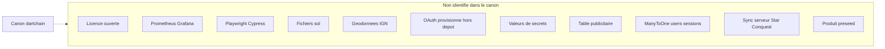

# 07 — Éléments non identifiés

## Objectif

Lister les informations absentes du projet canon, ou présentes seulement comme intention écrite, afin qu’aucune vue UML ne les dessine comme des composants réels.

## Statut

Non identifié dans le périmètre lu. Une absence dans le mémo et dans les fichiers ouverts pour cette note n’est pas une preuve qu’un symbole inexistant se cache sous un autre nom. Quand le recensement dit « aucun fichier », l’absence est tenue pour confirmée.

## Sources analysées

- `/home/azertyuiop/dev/dartchain/README.md` (licence, feuille de route, attribution)
- Recherche de fichiers `.sol` : aucun, d’après le mémo
- `V12__ad_persistence.sql` ouvert : pas de table publicitaire
- `/home/azertyuiop/dev/dartchainReview` pour ne pas mélanger ses tables avec le canon
- `environment.ts` : pas de synchro serveur Star Conquest identifiée

## Éléments représentés

Licence, observabilité productisée, tests E2E, chaîne externe, données géographiques, OAuth hors dépôt, secrets, schéma publicitaire, associations JPA, contrats, produit preseed, forum canon.

## Diagramme

Légende : le pointillé signifie « pas d’objet à modéliser ». La vue 58 reprend le cas des contrats.

## Explication

### Licence

Aucun fichier `LICENSE` n’est publié, d’après le README. Le README demande de traiter le code comme propriétaire jusqu’à mention contraire. Une licence ouverte n’est pas identifiée. Cette phrase cite le README. Elle ne constitue pas une analyse juridique.

### Observabilité productisée

Les seuils ops du backend existent (`OpsController`, `OpsV1Controller`, health Actuator, jauges citées par l’onglet Admin du README). Prometheus et Grafana productisés ne sont pas identifiés. La vue `uml-60-observabilite.md` reste au périmètre réellement présent. Sa confiance imposée est moyenne.

### Tests de bout en bout

94 fichiers de test Java et environ 201 specs Vitest sont recensés. Playwright et Cypress ne sont pas identifiés.

### Star Conquest côté serveur

Le README indique une persistance `localStorage` et place la synchronisation Spring des quêtes en feuille de route bloquée. Cette synchro n’est pas identifiée comme fonction livrée. Le flag frontend est false. Le module `star-conquest/` existe : le code UI n’est pas « absent », le branchement live et la synchro serveur le sont.

### Géodonnées

Le README attribue les empreintes à OpenStreetMap (ODbL) et dit que ce n’est pas un levé IGN. La feuille de route bloque les géodonnées IGN / BD TOPO pour contrainte de licence. Ces jeux ne sont pas identifiés dans le dépôt comme données livrées.

### OAuth hors dépôt

Les fournisseurs google, meta, apple, microsoft, github, x et discord sont dans `application.yaml` avec `enabled` false par défaut. Le provisionnement réel des comptes fournisseurs, hors dépôt, n’est pas identifié. Le README le classe parmi les éléments préparés et non branchés en live.

### Secrets

Les noms de propriétés sont connus. Les valeurs ne sont pas recopiées : `dartchain.auth.jwt-secret`, `dartchain.admin.seed-sha256`, `dartchain.auth.bootstrap-admin-password`, `dartchain.ops.actuator-token`, `m4t3r.reward.signing-key`, secrets OAuth, jetons WiGLE, secret Review `dartchain.review.jwt.secret`. Écriture imposée : `[SECRET MASQUÉ]`. Le fichier local cité en commentaire YAML, `deploy/admin-seed.local.txt`, n’a pas été ouvert.

### Publicité et V12

Le nom `V12__ad_persistence.sql` ne correspond pas à une régie publicitaire dans le fichier lu. Colonnes réelles : voir [04-dictionnaire-de-donnees.md](04-dictionnaire-de-donnees.md). Une table `ads` n’est pas identifiée.

### Relation JPA users et sessions

`auth_sessions.user_id` possède une clé étrangère SQL. L’association JPA `@ManyToOne` ou `@OneToMany` n’a pas été relevée. La relation objet formelle est non identifiée. La contrainte SQL, elle, est identifiée.

### Contrats

Aucun élément de smart contract n’est identifié. Phrase imposée pour le corps de `uml-58-smart-contracts.md` : « Ce diagramme n’est pas générable à partir du contenu actuel du projet. Aucun élément blockchain correspondant n’a été identifié. »

La chaîne démo, elle, est identifiée (vues 55, 56, 57 et 59). L’absence concerne le contrat, pas les blocs.

### Autres produits et échelles

Le mot « preseed » ne désigne pas un produit dans l’arbre `/home/azertyuiop/dev/dartchainPreSeed/dartchain`. Review a ses propres tables. Elles sont hors dictionnaire canon. Le facteur numérique unique entre R4V3 et M4T3R n’est pas identifié. Le rôle opérationnel de l’origine CORS `https://dartzvz01-tagname.onrender.com` n’est pas identifié dans le README. Un forum canon n’est pas identifié. La page forum de Review n’est pas dans `app.routes.ts`.

## Correspondance avec le code

Chaque ligne « non identifié » se traduit par l’absence d’un fichier, d’une table, d’une dépendance ou d’une valeur publiable. Les symboles positifs voisins restent documentés : `OpsController` sans Prometheus, `star-conquest/` sans flag true, Flyway V12 sans table `ads`, `UserRole` sans valeur `GUEST`.

## Hypothèses

Ce fichier ne convertit pas une absence en projet futur, sauf lorsque le README le dit déjà (synchro Star Conquest, IGN, OAuth, FAQ admin). Ces mentions de feuille de route sont des textes du README, pas des composants livrés. Les causes supposées sont dans [06-hypotheses.md](06-hypotheses.md).

## Anomalies détectées

Le risque est d’inventer un diagramme de contrats, une table `faq_questions` canon, une licence SPDX, ou un dashboard Grafana pour remplir une case. Review possède `faq_questions` : la copier dans le canon serait une erreur de périmètre. Le README canon parle de Star Conquest au présent de la section live : le flag false montre que la doc et le code ne décrivent pas le même état. Ce décalage est une incohérence, traitée dans le fichier 05, pas une fonctionnalité cachée identifiée.

## Recommandations

Dans chaque vue, préférer « non identifié » à un symbole gris inventé. Laisser `uml-58-smart-contracts.md` sur la phrase imposée, sans classe Solidity. Masquer les secrets dans `uml-54-secrets-certificats.md`. Index : [00-index.md](00-index.md).
