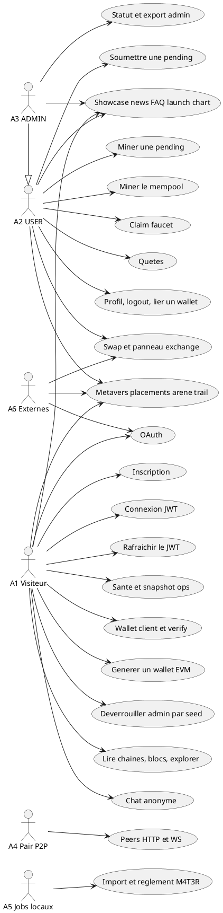

# 01 — Diagramme de cas d'utilisation

## Objectif

Ce fichier décrit le diagramme de cas d'utilisation, type officiel UML 2.5. Il relie les acteurs stables A1 à A6 aux capacités réellement exposées par l'API Spring et par la SPA Angular : authentification, wallet, minage, faucet, swap, quêtes, pairs, showcase, métavers, administration et exploitation. Le produit est une démo de chaîne native (token R4V3, micro-unité M4T3R, chain-id 3377). Aucun cas de paiement carte, de mainnet ou de smart contract n'est représenté.

## Statut

Confirmé par le code.

## Sources analysées

- `SecurityConfig` : `permitAll` et `anyRequest().authenticated()`.
- Contrôleurs sous `io.dartchain.backend` (42 classes `*Controller`).
- `UserRole`, `ChatService.ANONYMOUS_AUTHOR`, `WebSocketConfig`, `AdminUnlockService`, `ProductFeatureService`.
- Les arbres `dartchainPreSeed` et `dartchainReview` ne sont pas la source de ce diagramme.

## Éléments représentés

- A1 Visiteur : lectures `GET /**` en `permitAll`, chat anonyme (`Anonymous`), quelques POST publics (Overpass, ramassage de piste M4T3R, messages showcase, inquiries de placement).
- A2 USER : `UserRole.USER`, autorité `ROLE_USER`. Mutations authentifiées (pending, mine, faucet, quêtes, swap, wallet lié).
- A3 ADMIN : `UserRole.ADMIN`, autorité `ROLE_ADMIN`. `UserRole.isAtLeast(USER)` est vrai pour ADMIN, d'où la généralisation vers A2. Le déverrouillage seed est un cas distinct du rôle JWT.
- A4 Pair P2P : `GET/POST /api/peers` et WebSocket `/ws/peers` (`PeerSocketHandler`).
- A5 Jobs locaux : profil Spring `seed` (`application-seed.yaml`), `application-data-import.yaml`, `TestnetSettlementService` (M4T3R).
- A6 Externes : Overpass, CoinGecko et GeckoTerminal, WiGLE (mock par défaut), fournisseurs OAuth google, meta, apple, microsoft, github, x, discord (`enabled` faux par défaut).

Cas regroupés : auth (`AuthController` `/api/auth`, `AuthV1Controller` `/api/v1/auth`, `OAuthV1Controller`), wallet (`WalletController`, `WalletV1Controller`), chaîne et mine (`PendingTransactionController`, `BlockchainController`, `BlockController`, `TransactionController`), faucet, swap (`SwapController`, `ExchangeController`), quêtes, pairs, showcase (news, FAQ, chat, launch, chart, bannière, graphe), métavers (Overpass, placements, WiGLE, arène, trail et rewards M4T3R, personnages), admin (`AdminV1Controller`), ops et santé.

## Diagramme

Légende : un acteur lié à un cas signifie qu'un chemin de code ou une règle `SecurityConfig` lui ouvre ce cas. La flèche de généralisation A3 vers A2 reprend `UserRole.isAtLeast` : un compte ADMIN passe les contrôles prévus pour USER. Elle ne fusionne pas le jeton d'unlock seed avec `ROLE_ADMIN`.

## Explication

Le visiteur n'est pas une valeur de `UserRole`. Le commentaire de l'enum parle d'un GUEST non authentifié et non persisté. Au niveau HTTP, ce visiteur correspond surtout à `GET /**` en `permitAll`, plus une liste courte de POST et DELETE publics. Il peut donc lire la chaîne, l'explorer, la config faucet, le showcase et une partie du métavers sans JWT. Le chat showcase accepte l'auteur `ChatService.ANONYMOUS_AUTHOR` (`Anonymous`) sur `POST` et `DELETE /api/showcase/chat/messages`.

L'inscription et la connexion existent en double préfixe : `POST /api/auth/register|login` et `POST /api/v1/auth/register|login`. Seule la variante v1 expose `POST /api/v1/auth/refresh`. Les deux contrôleurs délèguent à `AuthService`. Le jeton d'accès est produit par `NativeJwtService.createAccessToken`. Le refresh est un UUID stocké à part (`RefreshTokenStore`), pas un second JWT.

Les mutations de mempool passent par `PendingTransactionController` : `POST /api/pending-transactions` puis `POST /api/pending-transactions/{id}/mine`. `RoleAuthorizationService.authorizeMutation` exige un compte dont le rôle est au moins USER. Un second minage, plus large, est `POST /api/blockchain/mine` et `POST /api/blockchain/mine/{minerAddress}` sur `BlockchainController`. Ce sont deux cas, parce que les méthodes ne sont pas les mêmes : `minePendingTransaction` appelle `BlockchainService.addBlock`, alors que le mine du contrôleur blockchain appelle `minePendingTransactions`.

Le faucet est un cas authentifié. `FaucetController.claim` appelle `productFeatures.requireFaucet()` puis `FaucetService.claim`, qui exige un compte et la possession du wallet. Le swap est `GET/POST /api/swap` et `POST /api/exchange-panel/swap`. Les cours viennent du proxy `CryptoRatesController` vers CoinGecko et GeckoTerminal. Les quêtes sont sous `/api/quests` (catalogue, état, progression, exploration de bloc, claims de tâche, de mission et hebdomadaire).

Le showcase regroupe news, FAQ communautaire, chat, launch projects, chart, bannière et graphe. Le changement de statut FAQ (`PATCH /api/showcase/faq/questions/{id}/status`) est réservé à `UserRole.ADMIN` dans `CommunityFaqService.updateStatus`. Le métavers couvre Overpass (`POST /api/metaverse/overpass`, public), les placements et leurs inquiries, WiGLE, l'arène (`/api/metaverse/arena` et `/ws/metaverse-arena`), le trail M4T3R et les rewards. Les personnages sont `GET /api/v1/characters/me` et `GET /api/v1/characters/{userId}`.

L'admin applicatif est `AdminV1Controller` : `GET /status`, `POST /unlock`, `POST /lock`, `GET /export`. `POST /unlock` est `permitAll` et compare un SHA-256 de seed à la propriété `dartchain.admin.seed-sha256`. La valeur n'est pas recopiée ici : [SECRET MASQUÉ]. Le jeton rendu voyage dans l'en-tête `X-Admin-Unlock-Token`. Ce n'est pas une autorité Spring.

Les jobs A5 ne sont pas des utilisateurs de la SPA. Le profil `seed`, l'import de données et `TestnetSettlementService` tournent dans le processus backend. Les pairs A4 sont des nœuds : HTTP `/api/peers` et socket `/ws/peers`.

## Correspondance avec le code

| Cas | Point d'entrée confirmé |
| --- | --- |
| Inscription, connexion | `AuthController`, `AuthV1Controller` |
| Refresh | `AuthV1Controller.refresh` uniquement |
| OAuth | `OAuthV1Controller` sous `/api/v1/auth/oauth` |
| Wallet | `WalletController` `POST /create-client`, `POST /verify` ; `WalletV1Controller` `POST /generate-evm` |
| Pending et mine unitaire | `PendingTransactionController` |
| Mine mempool | `BlockchainController` `POST /mine` |
| Faucet | `FaucetController` |
| Swap | `SwapController`, `ExchangeController` |
| Quêtes | `QuestController` |
| Peers | `PeerController`, `PeerSocketHandler` |
| Showcase | contrôleurs `Showcase*` , `GraphController`, `BannerController` |
| Métavers | `OverpassProxyController`, `PlacementController`, `WigleVisualizationController`, `ArenaController`, `M4t3rTrailController`, `M4t3rRewardController` |
| Admin | `AdminV1Controller`, `AdminUnlockService` |
| Ops | `OpsController`, `OpsV1Controller`, `HealthController`, `HealthV1Controller` |

`app.routes.ts` exporte `routes` vide. Ces cas ne sont pas des routes Angular. Ils sont des zones de la page unique et des endpoints.

## Hypothèses

- Le regroupement « showcase » et « métavers » est un découpage documentaire. Le code a un contrôleur par ressource, pas un cas d'utilisation nommé.
- A1 est dessiné sur les POST `permitAll` (register, login, refresh, wallets, unlock, overpass). Un visiteur déjà connecté peut aussi les appeler.
- La participation d'A6 est celle d'un acteur secondaire : le backend appelle Overpass, les APIs de cours et WiGLE. Le dépôt ne provisionne pas les secrets OAuth.

## Anomalies détectées

- `SecurityConfig` autorise `POST /api/wallets/create`, mais `WalletController` ne mappe que `/create-client` et `/verify`.
- `GET /**` est `permitAll` : la lecture est publique au filtre Spring. L'autorisation fine des mutations est sur le reste (`authenticated`) et, dans les services, sur le wallet.
- Le déverrouillage seed est distinct de `ROLE_ADMIN`.
- L'API est double (`/api` et `/api/v1`), avec `LegacyApiDeprecationFilter` et `ApiRoutes.LEGACY_STATS` (`/api/stats`).
- Aucun fichier `.sol`. Star Conquest est cité live par le README alors que `environment.ts` a `starConquestEnabled: false`.
- `ProductFeatureService.requireFaucet()` a un corps vide. Le garde produit est appelé, sans lire `faucet-enabled`.
- Les fournisseurs OAuth sont désactivés par défaut. Le cas OAuth existe dans le code et reste inactif sans configuration hors dépôt.

## Recommandations

- Garder ce diagramme comme index des contrôleurs, et renvoyer les flux précis vers les fiches 04 (séquence), 17 (rôles) et 20 (exigences).
- Documenter à part le POST `/api/wallets/create` orphelin, pour qu'un client ne le prenne pas pour un cas supporté.
- Si le faucet doit pouvoir s'éteindre, brancher `requireFaucet()` sur `ProductProperties.isFaucetEnabled()`. Aujourd'hui le drapeau YAML ne ferme pas le contrôleur.
