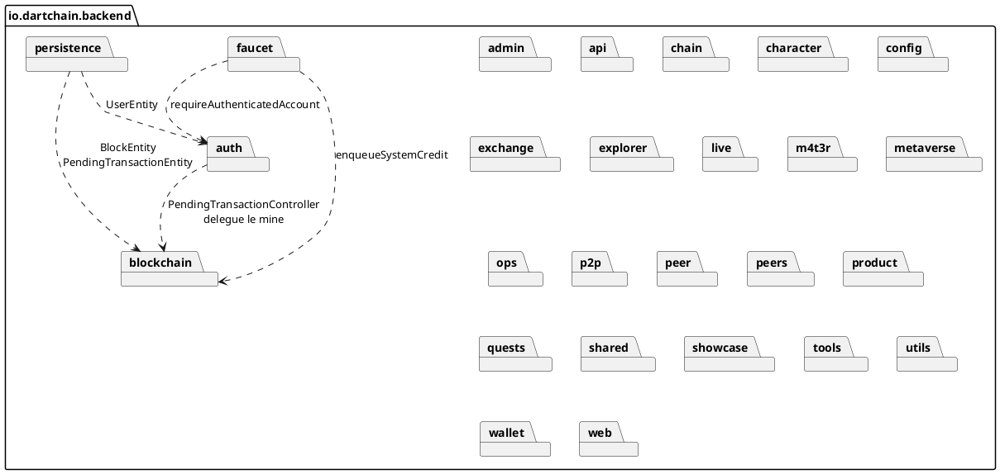
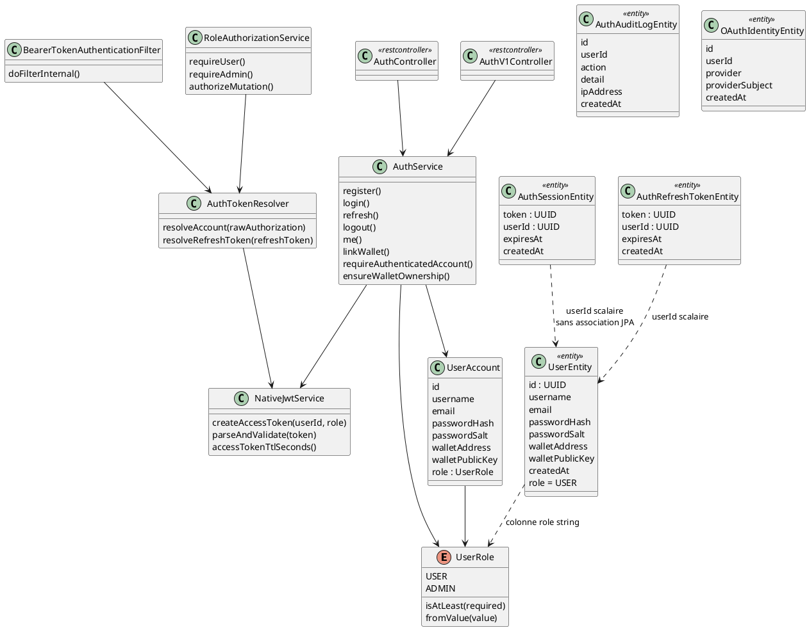
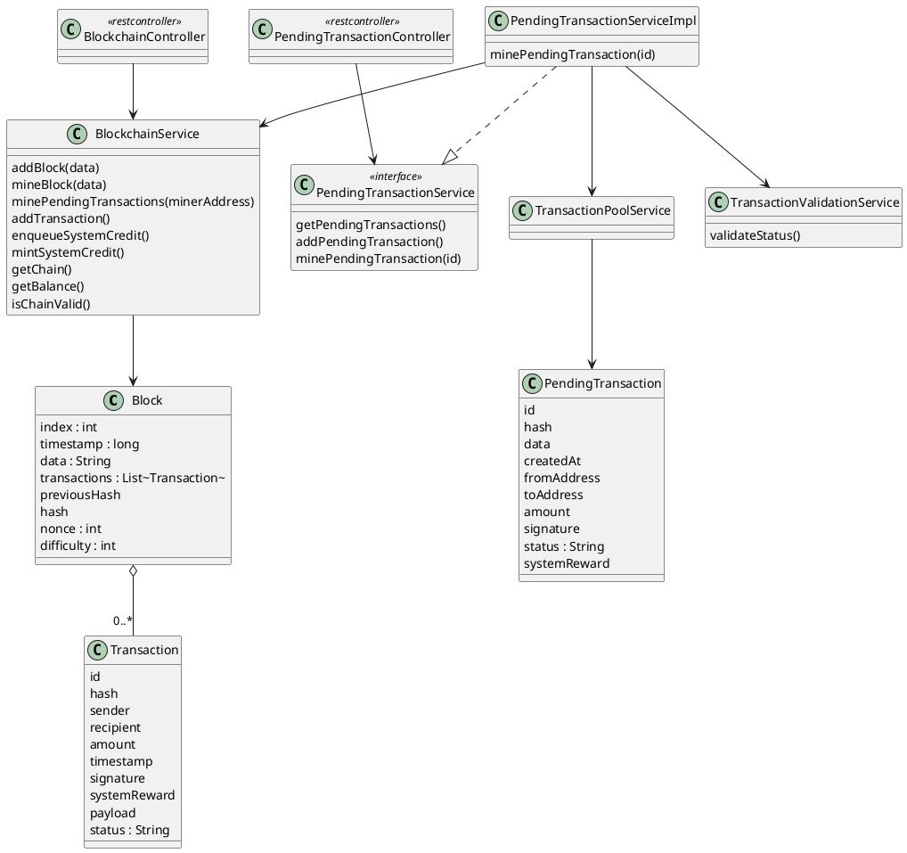
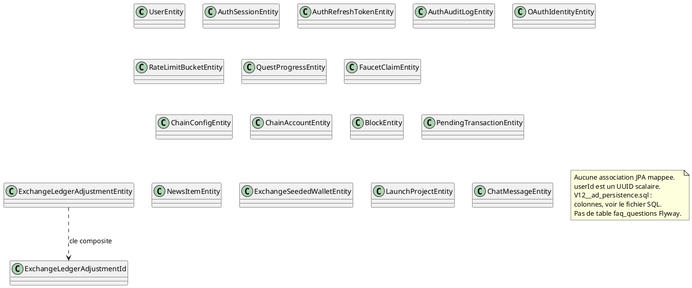

# 02 — Diagramme de classes

## Objectif

Ce fichier décrit le diagramme de classes, type officiel UML 2.5. Le modèle backend est trop large pour un seul graphe. La vue globale situe les packages. Trois sous-vues donnent les noms exacts : authentification (`UserRole`, `UserEntity`, sessions), blockchain (`Block`, `Transaction`, `PendingTransaction`, `BlockchainService`) et persistance JPA. Les liens `userId` sont des UUID scalaires : aucun `@ManyToOne` ni `@OneToMany` n'a été relevé.

## Statut

Confirmé par le code.

## Sources analysées

- `UserRole`, `UserEntity`, `AuthSessionEntity`, `AuthRefreshTokenEntity`, `AuthAuditLogEntity`, `OAuthIdentityEntity`.
- `AuthService`, `AuthController`, `AuthV1Controller`, `NativeJwtService`, `BearerTokenAuthenticationFilter`, `AuthTokenResolver`, `RoleAuthorizationService`.
- `Block`, `Transaction`, `PendingTransaction`, `BlockchainService`, `PendingTransactionService`, `PendingTransactionServiceImpl`.
- Entités de `io.dartchain.backend.persistence.entity` (17 tables, plus la classe d'identité `ExchangeLedgerAdjustmentId`).
- `FaqQuestion` et `FaqQuestionStatus` sont hors de cette vue classes cœur ; ils sont dans la fiche 07.

## Éléments représentés

- Package racine `io.dartchain.backend` et les packages listés dans le dépôt.
- Enum `UserRole` : `USER`, `ADMIN`. GUEST est un commentaire, pas une constante.
- Entités auth et leur double modèle mémoire `UserAccount` (utilisé par `AuthService`, distinct de `UserEntity`).
- Modèle chaîne en mémoire et service `BlockchainService`.
- Entités JPA et le fait qu'elles ne portent pas d'association objet.

## Diagramme

### Vue globale des packages

Les flèches sont les dépendances lues dans les contrôleurs et services cités. Les autres packages existent ; leurs dépendances internes ne sont pas toutes dessinées.

### Sous-vue auth

### Sous-vue blockchain

### Sous-vue persistance

Les champs des entités auth et chaîne sont dans les sous-vues précédentes et dans la fiche de correspondance ci-dessous. Les entités restantes portent les champs Java lus sur les classes : `FaucetClaimEntity` (`walletAddress`, `amount`, `claimedAt`, `nextEligibleAt`, `txHash`, `clientId`, `createdAt`), `QuestProgressEntity` (`userId`, `dayKey`, `weekKey`, `tasksJson`, `exploredBlocksJson`, `missionClaimed`, `weeklyClaimed`, `totalXp`, `pendingMts`, `updatedAt`), `RateLimitBucketEntity` (`bucketKey`, `windowStartMs`, `requestCount`, `updatedAt`), `ChainConfigEntity` (`configKey`, `configValue`), `ChainAccountEntity` (`address`, `addressScheme`, `publicKey`, `nonce`, `createdAt`), `LaunchProjectEntity` (`name`, `symbol`, `status`, `raisedAmount`, `targetAmount`, `logoUrl`, `description`, `chain`, `whitepaperUrl`, `website`, `launchDate`), `NewsItemEntity` (`category`, `title`, `summary`, `body`, `publishedAt`, `source`, `actionType`, `actionTarget`). `ChatMessageEntity` ajoute les colonnes de style `fontKey`, `fontSize`, `bold`, `italic`, `underline`, `strikethrough`, `fontColor`, `highlightColor`, `textAlign`, `styleKey`.

## Explication

Deux modèles d'utilisateur coexistent. `UserAccount` est l'objet métier que `AuthService` et `RoleAuthorizationService` manipulent. `UserEntity` est la ligne JPA de la table `users`, avec `role` stocké en chaîne et défaut `USER`. En mode `dartchain.persistence.mode=memory` (défaut), les comptes peuvent vivre dans un store JSON (`AUTH_USERS_PATH`) plutôt que dans Postgres. Les classes JPA restent le contrat du mode `postgres`.

`AuthSessionEntity` correspond aux sessions legacy. `dartchain.auth.legacy-session-enabled` vaut `false`. `AuthTokenResolver.resolveAccount` n'appelle `SessionStore` que si ce drapeau est vrai et si le jeton ne ressemble pas à un JWT (trois segments séparés par des points). Le chemin nominal est `NativeJwtService.parseAndValidate`, puis `userAccountStore.findById(claims.subject())`. Le refresh token est une ligne `auth_refresh_tokens`, créée par `refreshTokenStore.create` dans `AuthService.buildAuthResponse`.

`Block` possède une liste `transactions`. `PendingTransaction` n'est pas un sous-type de `Transaction` : les champs d'adresse s'appellent `fromAddress` et `toAddress`, alors que `Transaction` utilise `sender` et `recipient`. Le statut est un `String` dans les deux cas. `TransactionValidationService.validateStatus` accepte `PENDING`, `MINED` et `REJECTED`. `PendingTransactionServiceImpl.addPendingTransaction` écrit `PENDING`. `minePendingTransaction` écrit `MINED`, appelle `BlockchainService.addBlock(blockData)`, puis retire la pending du pool. `addBlock` construit un `Block` dont `transactions` est une liste vide et dont le contenu utile est le champ `data`.

`BlockchainService` expose aussi `minePendingTransactions(minerAddress)` et `enqueueSystemCredit`, utilisé par le faucet. Ces méthodes ne sont pas interchangeables avec `addBlock`.

## Correspondance avec le code

| Classe | Fichier |
| --- | --- |
| `UserRole` | `auth/model/UserRole.java` |
| `UserEntity` | `persistence/entity/UserEntity.java`, table `users` |
| `AuthSessionEntity` | table `auth_sessions` |
| `AuthRefreshTokenEntity` | table `auth_refresh_tokens` |
| `AuthAuditLogEntity` | table `auth_audit_log` |
| `OAuthIdentityEntity` | table `oauth_identities` |
| `Block`, `Transaction`, `PendingTransaction` | `blockchain/model` |
| `BlockEntity` | table `blocks`, colonne `transactions_json` |
| `PendingTransactionEntity` | table `pending_transactions`, `status` longueur 32 |
| `BlockchainService` | `blockchain/application/BlockchainService.java` |
| `PendingTransactionServiceImpl` | implémente `PendingTransactionService` |
| Stores | `JsonBlockchainStateStore`, `JpaBlockchainStateStore`, `BlockchainStateStore` |

Flyway : `V1__auth.sql` à `V14__oauth_identities.sql`. `V12__ad_persistence.sql` crée les index de phase AD et les tables `chain_config` et `chain_accounts` (valeur initiale `addressSchemeDefault` = `evm-compatible`). Ce n’est pas une table publicitaire.

## Hypothèses

- `UserAccount` est placé à côté de `UserEntity` parce que les services d'auth le portent. Le mapping exact des champs est assuré par `UserEntityMapper` ; cette fiche ne redessine pas chaque setter.
- Les dépendances de packages non fléchées existent sûrement (par exemple `showcase` vers `auth`). Elles sont omises pour garder la vue globale lisible.
- `ExchangeLedgerAdjustmentId` est une classe d'identité, pas une table.

## Anomalies détectées

- `minePendingTransaction` persiste le transfert dans `Block.data` et laisse `transactions` vide. Le diagramme de composition (fiche 11) doit être lu avec cette réserve.
- `POST /api/wallets/create` n'a pas de classe contrôleur correspondante.
- FAQ en mode postgres : `InMemoryFaqQuestionStore`, pas une entité Flyway `faq_questions`.
- `networkName` Java par défaut dans `ChainProperties` est « R4V3 Testnet » si le YAML ne charge pas. Le YAML canon dit « DartChain Native ».
- Aucune association JPA `users` vers `auth_sessions`, malgré la colonne `user_id`.

## Recommandations

- Traiter `UserAccount` et `UserEntity` comme deux types, et éviter un diagramme unique qui les fusionnerait.
- Si un schéma relationnel est généré plus tard, dessiner les FK en pointillés tant que les annotations `@ManyToOne` sont absentes.
- Aligner le mine unitaire sur `Block.transactions` ou documenter officiellement que `data` est le format de persistance de ce chemin.
