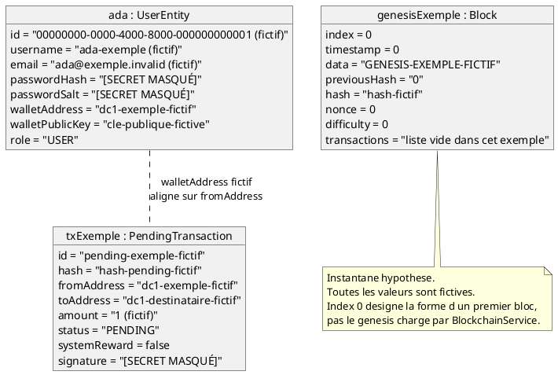

# 03 — Diagramme d'objets

## Objectif

Ce fichier décrit le diagramme d'objets, type officiel UML 2.5. Il fixe un instantané d'exemple : un `UserEntity` de rôle USER, un `Block` d'index 0, une `PendingTransaction`. Les valeurs sont fictives. Elles illustrent la forme des objets, pas un dump de base ni le bloc genesis réel du processus.

## Statut

Partiellement confirmé.

## Sources analysées

- Champs de `UserEntity`, `Block`, `PendingTransaction`, `PendingTransactionEntity`.
- Écritures de statut dans `PendingTransactionServiceImpl` (`PENDING` à la création).
- Aucune lecture du contenu JSON `BLOCKCHAIN_STATE_PATH` ni de la table `users` : les identifiants ci-dessous ne viennent pas d'un jeu de données.

## Éléments représentés

- `ada : UserEntity`, rôle `USER`.
- `genesisExemple : Block`, index `0`.
- `txExemple : PendingTransaction`, statut `PENDING`.
- Lien documentaire : la pending n'est pas encore un élément de `Block.transactions` (liste vide sur le chemin `addBlock`).

## Diagramme

## Explication

Un diagramme d'objets montre des instances, pas des types. Ici les types sont confirmés, les instances ne le sont pas : le dépôt ne fournit pas un snapshot figé à publier, et les secrets (hash de mot de passe, sel, signature, seed admin, secret JWT) doivent rester masqués.

`UserEntity.role` est une chaîne. La valeur `USER` est le défaut du champ Java (`private String role = "USER"`) et la constante `UserRole.USER`. L'exemple choisit ce rôle parce que c'est le cas nominal d'un compte inscrit sans username bootstrap admin.

`Block.index` est un `int`. L'index 0 est le seul choix neutre pour « un premier bloc » sans lire `loadFromStore`. Le constructeur historique accepte `index`, `timestamp`, `data`, `previousHash`, `hash`, `nonce`. Le champ `transactions` existe et, dans `BlockchainService.addBlock`, est remplacé par une `ArrayList` vide. L'objet exemple reprend cette forme : le texte est dans `data`, la liste de transactions est vide.

`PendingTransaction.status` est un `String`, pas un enum. À la création, `PendingTransactionServiceImpl` affecte `"PENDING"`, calcule un hash SHA-256 sur id, adresses, montant, data et `createdAt`, et signe via `PendingTransactionAttestation.sign`. La signature d'exemple est masquée. Le montant `1` n'est pas un paramètre produit lu pour cette fiche.

Le trait entre `ada` et `tx` n'est pas une association JPA. Il rappelle que `ensureWalletOwnership` compare le wallet du compte à `fromAddress` lors d'un `POST /api/pending-transactions`. Dans l'exemple, les deux chaînes coïncident volontairement.

## Correspondance avec le code

- Table `users` / `UserEntity` : `id` UUID, `username`, `email`, `password_hash`, `password_salt`, `wallet_address`, `wallet_public_key`, `created_at`, `role`.
- `Block` : `blockchain/model/Block.java`.
- `PendingTransaction` : `blockchain/model/PendingTransaction.java`. La table miroir est `pending_transactions` / `PendingTransactionEntity` (`tx_hash`, `from_address`, `to_address`, `amount`, `tx_data`, `signature`, `status`, `system_reward`, `created_at`).
- Statut initial : `PendingTransactionServiceImpl.addPendingTransaction`, ligne qui appelle `setStatus("PENDING")`.

## Hypothèses

- L'instantané est une hypothèse pédagogique. Statut de la fiche : partiellement confirmé, parce que la structure est lue dans le code et que les valeurs sont déduites comme exemples.
- `previousHash = "0"` et `timestamp = 0` ne sont pas affirmés comme le genesis du store. Si `BlockchainService` fabrique un genesis autrement, cet objet reste un exemple.
- Aucun solde, aucun nonce de compte (`ChainAccountEntity`) n'est dessiné : ces objets ne font pas partie de l'instantané demandé.

## Anomalies détectées

- Le même transfert peut exister comme `PendingTransaction` (champs `fromAddress` / `toAddress`) et, après mine unitaire, seulement comme texte dans `Block.data`. Un diagramme d'objets pris après `minePendingTransaction` montrerait la pending au statut `MINED` retirée du pool, et un bloc dont `transactions` est vide.
- Les secrets réels des fichiers YAML et des stores JSON ne doivent pas être collés dans un objet d'exemple. Les défauts `dartchain.admin.seed-sha256` et `dartchain.auth.jwt-secret` restent des noms de propriétés.

## Recommandations

- Régénérer cet instantané depuis un test (`PendingTransactionControllerIntegrationTest` ou un test blockchain) le jour où il faudra des valeurs réelles, et continuer à masquer hash, sel et signature.
- Étiqueter tout export d'admin (`GET /api/v1/admin/export`) avant de le recopier dans une fiche : cet export peut contenir des données de démo, pas seulement des types.
