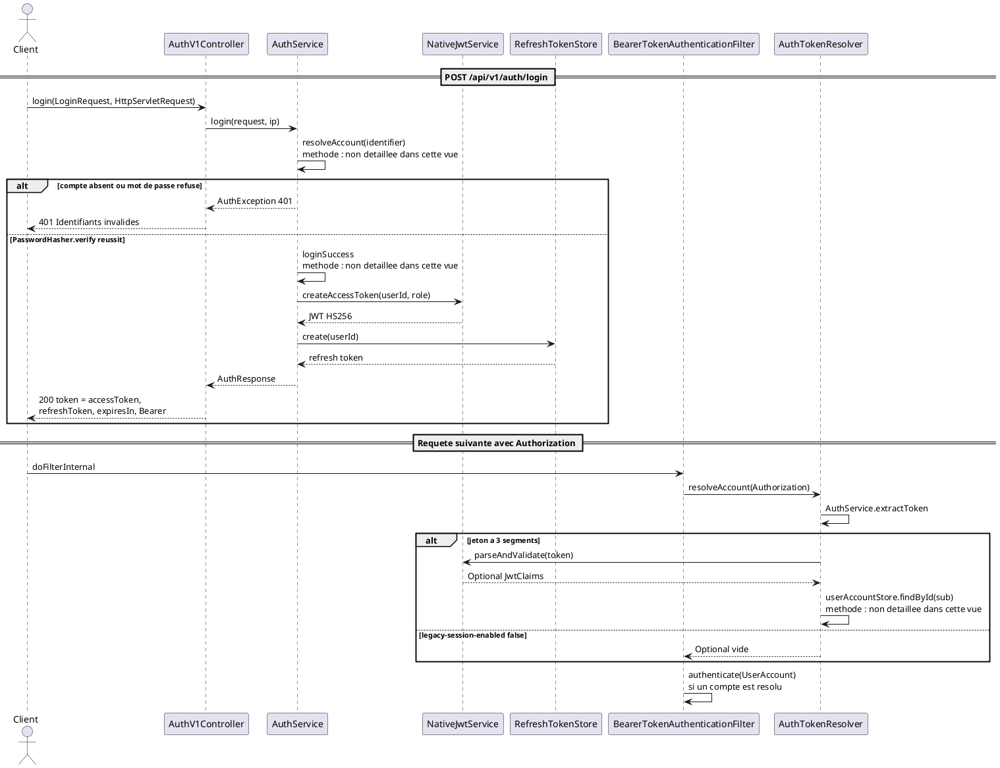
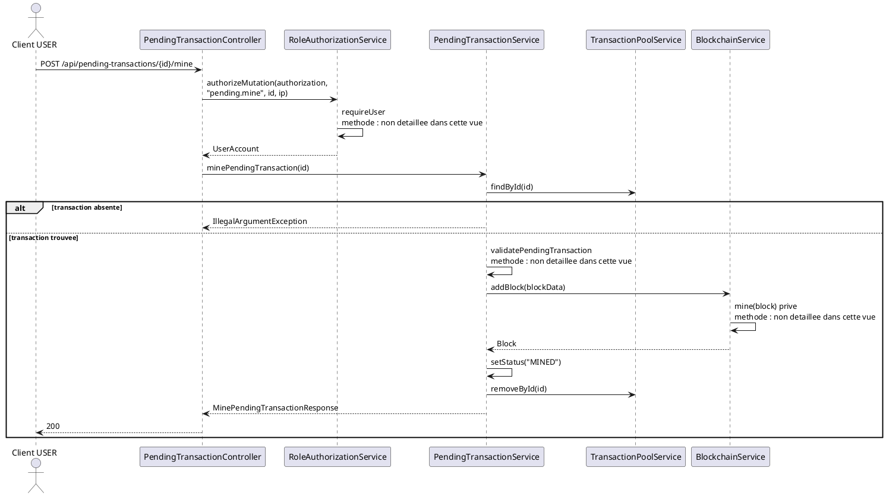

# 04 — Diagramme de séquence

## Objectif

Ce fichier décrit le diagramme de séquence, type officiel UML 2.5. La séquence principale est le login JWT. La sous-séquence est le mine d'une transaction pending. Les méthodes citées ont été lues dans le code. Quand un détail interne n'est pas déroulé, le message porte la mention « méthode : non détaillée dans cette vue ».

## Statut

Confirmé par le code.

## Sources analysées

- `AuthV1Controller.login`, `AuthController.login` (même délégation).
- `AuthService.login` et `AuthService.buildAuthResponse`.
- `NativeJwtService.createAccessToken`, `parseAndValidate`.
- `BearerTokenAuthenticationFilter.doFilterInternal`.
- `AuthTokenResolver.resolveAccount`.
- `PendingTransactionController.minePendingTransaction`.
- `RoleAuthorizationService.authorizeMutation`.
- `PendingTransactionServiceImpl.minePendingTransaction`.
- `BlockchainService.addBlock`.

## Éléments représentés

- `POST /api/v1/auth/login` jusqu'à `AuthResponse` (`token`, `accessToken`, `refreshToken`, `expiresIn`, `tokenType`, `user`).
- Le filtre Bearer sur une requête ultérieure.
- `POST /api/pending-transactions/{id}/mine` jusqu'à `BlockchainService.addBlock`.

Le login legacy `POST /api/auth/login` suit le même `AuthService.login`. Il n'a pas d'endpoint refresh sur `AuthController`.

## Diagramme

### Séquence principale : login JWT

### Sous-séquence : mine d'une pending

## Explication

`AuthV1Controller.login` ne vérifie pas le mot de passe lui-même. Il transmet `LoginRequest` et l'adresse IP (`RequestClientInfo.clientIp`) à `AuthService.login`. Le service résout le compte par e-mail ou par username. Si le hash est un compte OAuth (`PasswordHasher.isOAuthAccount`), la connexion mot de passe est refusée. Sinon `PasswordHasher.verify` compare le mot de passe au couple sel / hash. Un hash non bcrypt est réécrit en bcrypt après succès. L'audit enregistre l'échec ou le succès.

`buildAuthResponse` est privé. Il est cité ici parce qu'il est le seul endroit qui appelle `nativeJwtService.createAccessToken(account.getId(), account.getRole())` puis `refreshTokenStore.create(account.getId())`. Le record `AuthResponse` a deux champs de jeton d'accès, `token` et `accessToken` : l'appel leur passe la même chaîne. `expiresIn` vient de `accessTokenTtlSeconds()` (propriété `dartchain.auth.access-token-ttl-seconds`, 3600). `tokenType` est `"Bearer"`. Le secret de signature n'est pas recopié : [SECRET MASQUÉ]. Propriété : `dartchain.auth.jwt-secret`.

`createAccessToken` pose les claims `sub`, `role`, `iat`, `exp`, `jti` et signe en HS256 avec le JDK (`HmacSHA256`), sans librairie tierce, conformément au commentaire de classe. `parseAndValidate` rejette un jeton mal formé, une signature différente ou un `exp` déjà passé.

`BearerTokenAuthenticationFilter` ne bloque pas la requête si le jeton est absent ou invalide : il n'authentifie que lorsque `resolveAccount` renvoie un compte et que le contexte de sécurité est encore vide. Ensuite `SecurityConfig` décide. `POST /api/v1/auth/login` est `permitAll`. `POST /api/pending-transactions/{id}/mine` tombe dans `anyRequest().authenticated()`.

`authorizeMutation` appelle `requireUser`. `UserRole.ADMIN` satisfait `isAtLeast(USER)`. Le contrôleur mine n'appelle pas `ensureWalletOwnership` : contrairement à `addPendingTransaction`, le mine unitaire ne reçoit pas l'adresse source dans l'URL. Le service charge la pending par id, la revalide, fabrique `blockData` (chaîne `txId=...;from=...;to=...;amount=...`), puis `addBlock`. Le statut passe à `MINED` et l'id quitte le pool. `addBlock` incrémente l'index, mine selon la difficulté interne, valide le bloc contre la chaîne et persiste.

Cette sous-séquence n'est pas `BlockchainService.minePendingTransactions`. Ce nom appartient à l'autre cas, `BlockchainController`.

## Correspondance avec le code

| Message du diagramme | Méthode lue |
| --- | --- |
| `login` | `AuthV1Controller.login` → `AuthService.login` |
| `createAccessToken` | `NativeJwtService.createAccessToken` |
| `create` | `RefreshTokenStore.create` via `buildAuthResponse` |
| `doFilterInternal` | `BearerTokenAuthenticationFilter` |
| `resolveAccount` | `AuthTokenResolver.resolveAccount` |
| `parseAndValidate` | `NativeJwtService.parseAndValidate` |
| `authorizeMutation` | `RoleAuthorizationService.authorizeMutation` |
| `minePendingTransaction` | `PendingTransactionController` puis `PendingTransactionServiceImpl` |
| `findById` / `removeById` | `TransactionPoolService`, appelés par l'impl |
| `addBlock` | `BlockchainService.addBlock(String data)` |

`AuthController` (`/api/auth`) expose le même `login` sans `refresh`. Le filtre et `NativeJwtService` sont communs aux deux préfixes.

## Hypothèses

- Le client dessiné est la SPA ou tout appelant HTTP. Le diagramme ne détaille pas `auth.service.ts`.
- `resolveAccount` et l'audit sont résumés par « méthode : non détaillée dans cette vue » là où le corps n'apporte rien à la chaîne JWT ou mine.
- L'ordre filtre puis contrôleur est celui de Spring Security : `addFilterBefore(..., UsernamePasswordAuthenticationFilter.class)` pour `BearerTokenAuthenticationFilter` et `RateLimitFilter`. Le rate limit n'est pas une ligne de cette séquence (voir fiche 14).

## Anomalies détectées

- `AuthResponse` duplique le même JWT dans `token` et `accessToken`.
- `legacy-session-enabled: false` : un jeton opaque de session ne résout aucun compte.
- Le mine unitaire ne vérifie pas `ensureWalletOwnership` dans le contrôleur, alors que la création de pending le fait.
- `addBlock` ne range pas la transaction dans `Block.transactions`.
- `GET /**` en `permitAll` ne s'applique pas à ce POST de mine, qui reste authentifié. Un oubli de JWT donne 401 au filtre d'autorisation, pas dans `minePendingTransaction`.

## Recommandations

- Pour une revue de sécurité, enchaîner cette fiche avec la fiche 17 : le JWT porte `role`, et l'unlock admin est un autre jeton (`X-Admin-Unlock-Token`).
- Ajouter plus tard une séquence séparée pour `BlockchainController` → `minePendingTransactions`, afin de ne pas mélanger les deux mines dans un seul graphe.
- Conserver la formule « méthode : non détaillée dans cette vue » plutôt que d'inventer les helpers privés (`mine`, `buildBlockData`) comme s'ils étaient l'API publique. `buildBlockData` et `mine` ont été lus ; ils restent internes.
