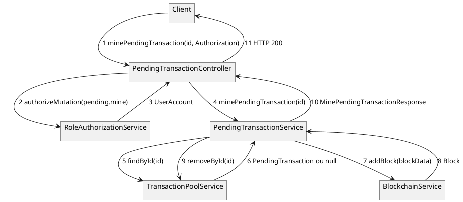

# 05 — Diagramme de communication

## Objectif

Ce fichier décrit le diagramme de communication, type officiel UML 2.5. Il reprend les mêmes objets que la sous-séquence mine de la fiche 04 et numérote les messages sur les liens, au lieu de les dérouler dans le temps. Le login JWT n'est pas redessiné : il reste dans la fiche 04.

## Statut

Partiellement confirmé.

## Sources analysées

- `PendingTransactionController.minePendingTransaction`.
- `RoleAuthorizationService.authorizeMutation`.
- `PendingTransactionServiceImpl.minePendingTransaction`.
- `TransactionPoolService.findById` et `removeById` (appels lus dans l'implémentation).
- `BlockchainService.addBlock`.
- Fiche `uml-04-sequence.md` pour la correspondance des numéros.

## Éléments représentés

Objets de la sous-séquence mine :

- `:PendingTransactionController`
- `:RoleAuthorizationService`
- `:PendingTransactionService` (l'implémentation réelle est `PendingTransactionServiceImpl`)
- `:TransactionPoolService`
- `:BlockchainService`

Le client HTTP porte le message 1. Il est dessiné comme objet `Client` pour rester dans le même diagramme d'objets que les services. Dans la séquence (fiche 04), c'est l'acteur.

## Diagramme

Légende : le numéro est l'ordre d'un scénario où la pending existe et où `authorizeMutation` réussit. Le statut `MINED` est affecté sur l'objet pending entre les messages 8 et 9, dans `PendingTransactionServiceImpl`, avant `removeById`. Ce n'est pas un appel à un autre objet.

## Explication

Un diagramme de communication montre les mêmes interactions qu'une séquence, avec l'ordre écrit sur les liens. Ici le scénario nominal tient en onze messages.

Le client envoie `POST /api/pending-transactions/{id}/mine` avec un en-tête `Authorization`. Le contrôleur calcule l'IP puis appelle `authorizeMutation(authorization, "pending.mine", id, ip)`. Le service de rôle renvoie le `UserAccount`. Le contrôleur ignore ce compte pour la suite : la valeur de retour n'est pas passée à `minePendingTransaction`, qui ne prend que l'id.

`PendingTransactionServiceImpl` demande la pending au pool. Si `findById` rend null, l'implémentation lève `IllegalArgumentException("Pending transaction not found: " + id)`. Ce chemin d'échec n'a pas de numéro propre : il coupe la chaîne après le message 6. Sinon `validatePendingTransaction` s'exécute (collaborateur `TransactionValidationService`, non dessiné pour rester aligné sur les objets de la séquence mine). Le message 7 est l'appel confirmé `blockchainService.addBlock(blockData)`. `blockData` est une concaténation `txId`, `from`, `to`, `amount`, `data`, `signature`, `status`, `createdAt`.

Au retour du bloc, l'implémentation fait `setStatus("MINED")` puis `removeById`. La réponse `MinePendingTransactionResponse` porte le message français « Transaction minée avec succès. » et le `Block`. Le contrôleur le renvoie tel quel, sans code HTTP explicite autre que le 200 de Spring pour un corps non vide.

`BlockchainService.minePendingTransactions` et `PendingTransactionService.addPendingTransaction` sont d'autres collaborations. Les mettre sur ce graphe changerait le scénario.

## Correspondance avec le code

| N° | Appel |
| --- | --- |
| 1 | `PendingTransactionController.minePendingTransaction` |
| 2-3 | `RoleAuthorizationService.authorizeMutation` |
| 4 | `pendingTransactionService.minePendingTransaction(id)` |
| 5-6 | `transactionPoolService.findById(id)` |
| 7-8 | `blockchainService.addBlock(blockData)` |
| 9 | `transactionPoolService.removeById(id)` |
| 10-11 | `new MinePendingTransactionResponse(...)` renvoyé au client |

La classe dessinée `PendingTransactionService` est l'interface injectée dans le contrôleur. L'objet runtime est `PendingTransactionServiceImpl`.

## Hypothèses

- La numérotation 1 à 11 est un choix de lecture du scénario nominal. UML n'impose pas ces numéros dans le code.
- `TransactionValidationService` et `UserAccountStore` participent à `validatePendingTransaction`. Ils sont hors du dessin parce que la fiche 04 les a laissés en « méthode : non détaillée dans cette vue ».
- Le statut de la fiche est partiellement confirmé : les appels le sont, la présentation numérotée est une vue.

## Anomalies détectées

- Le `UserAccount` revenu au message 3 n'est pas relié au bloc miné. Le mineur effectif n'est pas un paramètre de cette route, contrairement à `POST /api/blockchain/mine/{minerAddress}`.
- Après le message 9, la pending n'est plus dans le pool alors que son statut vient d'être mis à `MINED`. Un `GET /api/pending-transactions` ne la montrera plus (`getPendingOnly`).
- `addBlock` ne place pas l'objet `Transaction` dans le bloc. Le lien 7 transporte une `String`, pas une `PendingTransaction`.

## Recommandations

- Lire ce diagramme à côté de la fiche 04 : même scénario, deux notations.
- Si le mine doit refuser le compte qui ne possède pas `fromAddress`, le contrôleur devra passer le `UserAccount` du message 3 au service. Ce n'est pas le comportement actuel.
- Garder `TransactionPoolService` sur le graphe : sans lui, `findById` et `removeById` sembleraient être des méthodes de `BlockchainService`, ce qu'elles ne sont pas.
