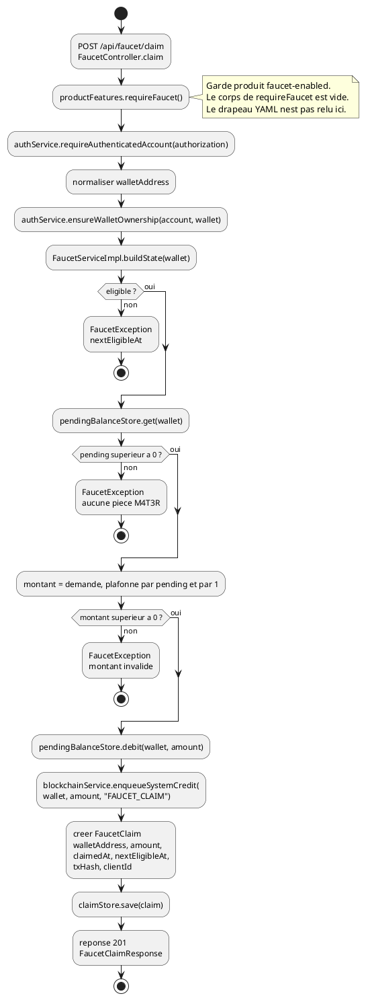
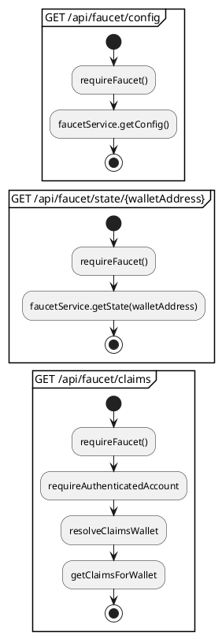

# 06 — Diagramme d'activités

## Objectif

Ce fichier décrit le diagramme d'activités, type officiel UML 2.5. Le flux représenté est le claim faucet, parce que `FaucetController` et `FaucetClaimEntity` donnent un début, une garde et une trace persistée (`walletAddress`, `amount`, `nextEligibleAt`). Le mine pending reste décrit en séquence (fiche 04) : le mélanger ici ajouterait un second flux.

## Statut

Partiellement confirmé.

## Sources analysées

- `FaucetController` : `getConfig`, `getState`, `claim`, `getClaims`.
- `ProductFeatureService.requireFaucet`.
- `FaucetServiceImpl.claim` et `getState`.
- `FaucetClaimEntity` / modèle `FaucetClaim` : `walletAddress`, `amount`, `claimedAt`, `nextEligibleAt`, `txHash`, `clientId`.
- `FaucetConfig` : `@Value("${faucet.cooldown-seconds:10}")`.
- `BlockchainService.enqueueSystemCredit`.
- Propriété produit `dartchain.product.faucet-enabled` (défaut `true` dans `application.yaml`).

## Éléments représentés

- Garde appelée par le contrôleur : `productFeatures.requireFaucet()`.
- Authentification et propriété du wallet.
- Éligibilité via `nextEligibleAt`.
- Solde pending M4T3R, débit, mise en mempool, enregistrement du claim.
- Lecture d'état et historique, en activités voisines courtes.

## Diagramme

Activités de lecture, même garde :

## Explication

Chaque méthode de `FaucetController` commence par `productFeatures.requireFaucet()`. C'est la garde « faucet-enabled » visible dans le contrôleur. `ProductFeatureService.requireFaucet` ne consulte pas `ProductProperties.isFaucetEnabled()` : le commentaire dit que le faucet est toujours actif. Le drapeau `dartchain.product.faucet-enabled: true` existe, et le frontend masque l'onglet si `product.faucetEnabled` est faux, mais le backend ne refuse pas le claim sur ce drapeau. La fiche le marque donc comme partiellement confirmé : l'appel de garde est réel, son effet métier ne l'est pas.

`claim` exige ensuite un compte (`requireAuthenticatedAccount`). `POST /api/faucet/claim` n'est pas dans la liste `permitAll`. Il tombe sous `anyRequest().authenticated()`. Le corps `FaucetClaimRequest` porte `walletAddress`, `amount` et `clientId`. `ensureWalletOwnership` refuse un wallet qui n'est pas celui du compte.

L'éligibilité vient de `buildState`. S'il existe un claim précédent, `FaucetServiceImpl` calcule les secondes restantes entre maintenant et `nextEligibleAt`. `eligible` est vrai quand ce reste vaut 0. Sinon l'exception cite `nextEligibleAt`. Le champ est celui de `FaucetClaim` et de la colonne `faucet_claims.next_eligible_at`.

Le montant réclamé ne sort pas d'une réserve illimitée. Le service lit un solde pending M4T3R. S'il est nul ou négatif, le message est « Aucune pièce M4T3R à claim — ramassez des pièces d'abord ». Le montant effectif est le minimum entre le montant demandé, le pending et `BigDecimal.ONE`. Ce plafond 1 est dans `claim`, pas dans `FaucetClaimEntity`. Après débit, `enqueueSystemCredit(normalizedWallet, debited, "FAUCET_CLAIM")` place un crédit système dans le mempool. Le commentaire du service le dit : le bloc n'est créé qu'au mine. Le claim enregistre `txHash` depuis `pendingTx.getHash()`.

`nextEligibleAt` vaut `now + faucetConfig.getCooldownDuration().toMillis()`. La durée par défaut lue dans `FaucetConfig` est la propriété `faucet.cooldown-seconds` avec défaut `10` secondes. `claimedAt` est `now`. L'entité JPA reprend les mêmes informations, plus `createdAt`. Le store effectif dépend du mode de persistance : JSON (`FAUCET_CLAIMS_PATH`, `JsonFaucetClaimStore`) ou table `faucet_claims`.

La réponse HTTP est 201 (`@ResponseStatus(CREATED)`), avec `success`, le message « Faucet claim placé dans le mempool — miner pour confirmer », le wallet, le montant, les dates ISO, `cooldownSeconds` et `txHash`. Si un `QuestService` est présent, `completeFaucetClaimQuest(account.getId())` est appelé. Ce n'est pas un champ de `FaucetClaimEntity`.

`GET /claims` ne liste pas tous les wallets. Sans `walletAddress` en paramètre, le wallet du compte est utilisé. S'il est vide, la liste renvoyée est vide. Avec un wallet demandé, `ensureWalletOwnership` s'applique.

## Correspondance avec le code

| Étape | Code |
| --- | --- |
| Garde | `FaucetController` appelle `requireFaucet()` sur les quatre routes |
| Auth | `AuthService.requireAuthenticatedAccount` |
| Wallet | `AuthService.ensureWalletOwnership` |
| Éligibilité | `FaucetServiceImpl.buildState` / `nextEligibleAt` |
| Pending M4T3R | `pendingBalanceStore.get` et `debit` |
| Mempool | `BlockchainService.enqueueSystemCredit` |
| Trace | `FaucetClaim` puis `claimStore.save` ; table `FaucetClaimEntity` |
| Config cooldown | `FaucetConfig` propriété `faucet.cooldown-seconds`, défaut 10 |

`GET /api/faucet/config` renvoie `defaultClaimAmount`, `cooldownSeconds`, `walletPrefix`, `nativeToken`, `smallestUnit`, `maxClaimAmount` via `getConfig`. Ces libellés sont des champs de `FaucetConfigResponse`, pas des étapes du claim.

## Hypothèses

- Le diagramme suit `FaucetServiceImpl`, qui est l'implémentation lue de `FaucetService`. Un autre bean remplaçant cette classe n'a pas été identifié.
- « pending supérieur à 0 » résume `compareTo(BigDecimal.ZERO) <= 0`.
- Le ramassage de pièces (`POST /api/m4t3r/trail-pickup`) alimente le solde pending. Il n'est pas une étape de `FaucetController` et n'est pas dessiné dans le flux principal.

## Anomalies détectées

- `requireFaucet()` ne lit pas `faucet-enabled`. Couper le produit dans le YAML ne coupe pas ces routes.
- Le claim crédite le mempool (`enqueueSystemCredit`) et ne mine pas. Le solde chaîne n'est pas final tant qu'un mine n'a pas eu lieu. Le message de réponse le dit.
- Le plafond `BigDecimal.ONE` peut surprendre face à `defaultClaimAmount` de la config : les deux existent dans des méthodes différentes.
- `GET /api/faucet/config` et `GET /api/faucet/state/{walletAddress}` sont des GET, donc `permitAll` à cause de `GET /**`, alors que `POST /claim` et le contrôle métier de `/claims` exigent un compte. `/claims` est aussi un GET : le filtre Spring le laisse passer, puis `requireAuthenticatedAccount` répond 401 si le JWT manque.

## Recommandations

- Faire de `requireFaucet()` un vrai test de `isFaucetEnabled()`, puis renvoyer `FeatureDisabledException`, déjà utilisée pour le wallet serveur.
- Traiter le claim et le mine comme deux activités reliées par `txHash`, pas comme une seule transaction confirmée.
- Documenter le plafond à 1 à côté de `faucet.cooldown-seconds` pour que l'écran faucet n'annonce pas un montant que `claim` réduit ensuite.
