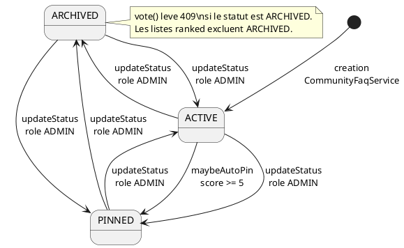
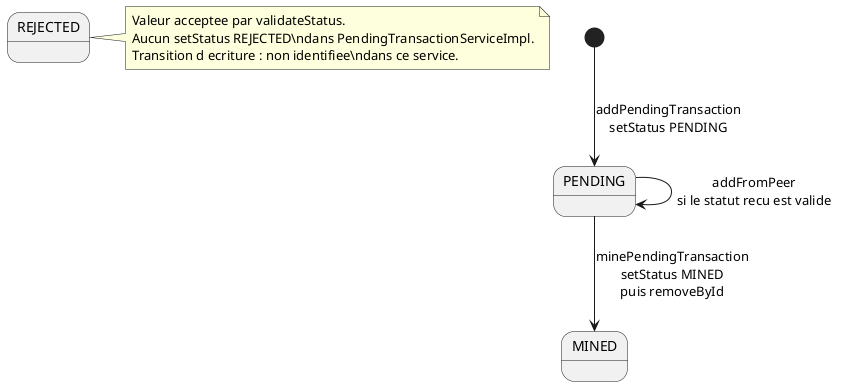

# 07 — Diagramme d'états-transitions

## Objectif

Ce fichier décrit le diagramme d'états-transitions, type officiel UML 2.5. Deux machines sont confirmées à des degrés différents. `FaqQuestionStatus` est un enum Java `ACTIVE`, `PINNED`, `ARCHIVED`, utilisé par `CommunityFaqService`. Le statut d'une `PendingTransaction` est un champ `String`. Les valeurs acceptées par `TransactionValidationService.validateStatus` sont `PENDING`, `MINED` et `REJECTED`. Seules `PENDING` et `MINED` sont écrites par `PendingTransactionServiceImpl`.

## Statut

Partiellement confirmé.

## Sources analysées

- `FaqQuestionStatus.java`.
- `CommunityFaqService` : création, `maybeAutoPin`, `updateStatus`, `vote`.
- Constante `AUTO_PIN_SCORE_THRESHOLD = 5`.
- `UpdateFaqQuestionStatusRequest` : motif `ACTIVE|PINNED|ARCHIVED`.
- `ShowcaseCommunityFaqController` : `PATCH /api/showcase/faq/questions/{id}/status`.
- `PendingTransaction.status` et `PendingTransactionEntity.status`.
- `PendingTransactionServiceImpl.setStatus("PENDING")` et `setStatus("MINED")`.
- `TransactionValidationService.validateStatus`.

## Éléments représentés

- Cycle de vie d'une `FaqQuestion`.
- Cycle de vie d'une pending, avec `REJECTED` accepté à la validation et sans transition d'écriture trouvée dans le service de pending.

Les statuts d'arène (`alive`, `eliminated`, `disconnected` sur `ArenaPlayerState`) sont un autre champ string. Ils ne sont pas cette machine.

## Diagramme

### FaqQuestionStatus

### Statut pending (champ String)

## Explication

`FaqQuestionStatus` a exactement trois constantes. À la création d'une question, `CommunityFaqService` passe `FaqQuestionStatus.ACTIVE` au constructeur puis `faqQuestionStore.save`. Il n'y a pas d'état « brouillon ».

`maybeAutoPin` ne s'applique que si le statut courant est `ACTIVE` et si `score >= AUTO_PIN_SCORE_THRESHOLD` (5). Il est appelé depuis `vote`, après la mise à jour des compteurs. Un vote sur une question `ARCHIVED` lève `ResponseStatusException` 409 « Question archivée » avant toute modification. `PINNED` reste votable. L'auto-pin ne rétrograde pas une question : une question déjà `PINNED` ne repasse pas par cette méthode vers `ACTIVE`.

`updateStatus` est le seul chemin qui écrit un statut arbitraire. Il exige `actor.getRole() == UserRole.ADMIN`, charge la question, fait `FaqQuestionStatus.valueOf` sur le corps (majuscules), puis `setStatus` et `save`. Aucune matrice n'interdit `ARCHIVED` vers `PINNED` ou `PINNED` vers `ACTIVE`. Le diagramme montre donc les six transitions d'administration, pas une politique plus stricte. Le contrôleur est `PATCH /api/showcase/faq/questions/{id}/status`. Le motif Bean Validation reprend les trois noms, insensible à la casse.

Les lectures `rankedList` filtrent `status != ARCHIVED`. `matchesStatusFilter` avec un filtre vide ou `all` fait de même. Un filtre égal à une constante ne renvoie que ce statut, y compris `ARCHIVED` si le client le demande explicitement.

Côté pending, le champ n'est pas un enum. `validateStatus` normalise en majuscules et n'accepte que `PENDING`, `MINED`, `REJECTED`. `addPendingTransaction` force `PENDING` après construction, quelle que soit une éventuelle valeur entrante du DTO (le DTO de création lu ne fixe pas le statut : le service l'écrit). `minePendingTransaction` exige que la pending soit dans le pool, valide, puis appelle `addBlock`, passe le statut à `MINED` et retire l'id. Après retrait, `getPendingOnly` ne la renvoie plus. `addFromPeer` revalide la transaction entrante, donc son statut doit déjà être l'une des trois chaînes, puis `addIfAbsent`. Cette fiche ne transforme pas `REJECTED` en transition observée : aucun `setStatus("REJECTED")` n'existe dans `PendingTransactionServiceImpl`. Le mot `REJECTED` apparaît ailleurs pour les rewards M4T3R (`M4t3rRewardService`), qui est un autre agrégat.

Le store FAQ par défaut en mémoire est `JsonFaqQuestionStore` (`FAQ_QUESTIONS_PATH`). En mode postgres, `@ConditionalOnProperty(..., havingValue = "postgres")` sélectionne `InMemoryFaqQuestionStore` : liste en RAM, sans table Flyway `faq_questions`. Le statut survit alors au process uniquement en mode JSON.

## Correspondance avec le code

| État | Origine |
| --- | --- |
| `ACTIVE`, `PINNED`, `ARCHIVED` | `showcase/model/FaqQuestionStatus.java` |
| Seuil 5 | `CommunityFaqService.AUTO_PIN_SCORE_THRESHOLD` |
| Patch admin | `ShowcaseCommunityFaqController` + `updateStatus` |
| `PENDING` | `PendingTransactionServiceImpl.addPendingTransaction` |
| `MINED` | `PendingTransactionServiceImpl.minePendingTransaction` |
| `REJECTED` | `TransactionValidationService.validateStatus` uniquement, pour cet agrégat |
| Colonne | `PendingTransactionEntity.status`, longueur 32 |

## Hypothèses

- Les six flèches `updateStatus` décrivent l'absence de garde de transition, pas une intention produit de toutes les utiliser.
- `addFromPeer` peut réintroduire une pending déjà `MINED` si la validation l'accepte et si l'id est absent. Le diagramme ne le dessine pas comme un retour depuis `MINED`, parce que l'objet miné local a été retiré du pool : ce serait une nouvelle entrée pair.
- Le statut `Transaction.status` (autre classe) n'est pas cette machine.

## Anomalies détectées

- `REJECTED` est légal et orphelin dans le service pending : un pair pourrait l'envoyer, le chemin local ne l'écrit pas.
- `updateStatus` ne journalise pas l'ancien statut. Une question archivée peut revenir `ACTIVE` sans transition intermédiaire.
- Le mode postgres ne persiste pas la FAQ. Un redémarrage remet la machine à l'état du store mémoire initial.
- `PendingTransactionMapper` contient un commentaire `response.setStatus(tx.getStatus())` désactivé. Le mapping de réponse utilisé par `toResponse` dans l'implémentation, lui, copie le statut.

## Recommandations

- Introduire un enum `PendingTransactionStatus` le jour où `REJECTED` doit être une vraie transition, et refuser les autres chaînes à la compilation.
- Restreindre `updateStatus` à une matrice (par exemple `PINNED` vers `ACTIVE` ou `ARCHIVED` seulement) si l'admin ne doit pas réouvrir sans trace.
- Persister `FaqQuestion` en JPA si le mode postgres est le déploiement Render (`DARTCHAIN_PERSISTENCE_MODE=postgres` dans `deploy/render.yaml`).
