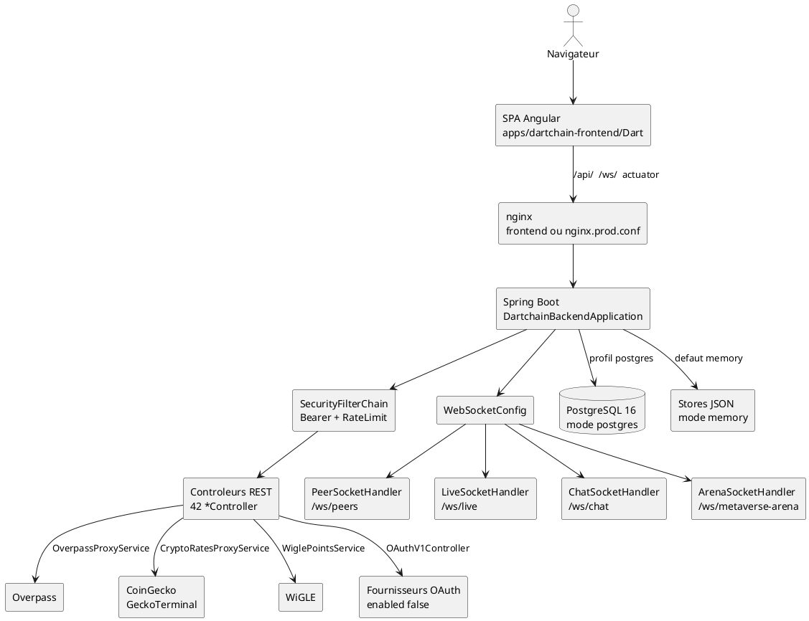

# 08 — Diagramme de composants

## Objectif

Ce fichier décrit le diagramme de composants, type officiel UML 2.5. Il assemble les gros blocs exécutables du canon : la SPA Angular, l'API Spring Boot, les stores Postgres ou JSON, les handlers WebSocket et nginx. Les composants externes (Overpass, cours, WiGLE, OAuth) sont des dépendances, pas des modules du dépôt.

## Statut

Confirmé par le code.

## Sources analysées

- `DartchainBackendApplication`, package `io.dartchain.backend`.
- Frontend `apps/dartchain-frontend/Dart`, `app.routes.ts`, `environment.ts`.
- `WebSocketConfig` : `/ws/peers`, `/ws/live`, `/ws/chat`, `/ws/metaverse-arena`.
- `SecurityConfig`, filtres servlet.
- `docker-compose.yml`, `infra/nginx/nginx.prod.conf`, `wrangler.toml`, `deploy/render.yaml`.
- Propriété `dartchain.persistence.mode`.

## Éléments représentés

- SPA Angular 21 servie en statique.
- Nginx : proxy `/api/`, `/ws/`, actuator.
- Backend Spring Boot 3.5.14, Java 21.
- Persistance interchangeable : PostgreSQL 16 ou fichiers JSON.
- Quatre handlers WebSocket.
- Entrées publiques déjà filtrées par `SecurityConfig`.

## Diagramme

## Explication

Le frontend est une SPA d'une seule page. `export const routes: Routes = [];` dans `app.routes.ts`. Le README le confirme. L'interface est le shell `app.html` : navbar, showcase, dock, graphe, `app-three-floor`. Les services HTTP (`auth.service.ts`, `blockchain-api.service.ts`, `faucet.service.ts`, `quests-api.service.ts`, et les autres services du dossier `src/app`) appellent l'API. En production Pages, `wrangler.toml` publie `dist/browser` sous le nom `dartchain`, avec repli SPA. L'API citée par le README est `https://dartchain-backend-1-0-0.onrender.com`. Le blueprint `deploy/render.yaml` nomme le service web `dartchain-backend` et la base `dartchain-db`.

Nginx est le frontal HTTP du conteneur frontend. `apps/dartchain-frontend/Dart/nginx.conf` proxifie `/api/`, `/ws/` et l'actuator vers `backend:8080`, et répond 403 sur `/actuator/metrics` et `/actuator/prometheus`. `infra/nginx/nginx.prod.conf` est le profil prod compose : l'upstream `dartchain_backend` pointe vers `backend-a:8080` et `backend-b:8080` (`least_conn`), et les locations `/api/`, `/ws/`, `/actuator/` sont proxifiées. La location `/` sert les fichiers statiques (`try_files` vers `index.html`).

Le backend est un seul processus Spring. `SecurityConfig` construit la `SecurityFilterChain` (CSRF désactivé, sessions `STATELESS`, CORS). Deux filtres y sont ajoutés devant `UsernamePasswordAuthenticationFilter` : `BearerTokenAuthenticationFilter` et `RateLimitFilter`. D'autres filtres sont des filtres servlet, pas des `addFilterBefore` de cette chaîne : `SecurityHeadersFilter`, `LegacyApiDeprecationFilter`, `RequestCorrelationFilter`, `RequestTimingFilter`, `ActuatorAccessFilter`. Ils font partie du même processus, pas de la même chaîne Spring Security. La fiche 11 détaille cette coupe.

`WebSocketConfig` enregistre quatre handlers, chacun avec `WebSocketAuthHandshakeInterceptor`. Les chemins `/ws/**` sont `permitAll` au niveau HTTP. L'intercepteur de handshake peut quand même lire un JWT. `LiveSocketHandler.afterConnectionEstablished` demande un snapshot à `LiveUpdateBroadcastService.sendSnapshot`.

La persistance est un choix de profil. Défaut `memory` (`DARTCHAIN_PERSISTENCE_MODE`). Les chemins JSON sont des noms de propriétés : `BLOCKCHAIN_STATE_PATH`, `EXCHANGE_LEDGER_PATH`, `LAUNCH_PROJECTS_PATH`, `CHAT_MESSAGES_PATH`, `NEWS_ITEMS_PATH`, `FAQ_QUESTIONS_PATH`, `QUESTS_PROGRESS_PATH`, `FAUCET_CLAIMS_PATH`, `AUTH_USERS_PATH`, `M4T3R_REWARDS_PATH`. Le mode `postgres` utilise le driver PostgreSQL, Flyway (`V1` à `V14`) et les entités JPA. Render force `postgres,prod` et `DARTCHAIN_PERSISTENCE_MODE=postgres`.

Les composants externes ne sont pas embarqués. `OverpassProxyController` proxifie Overpass. `CryptoRatesProxyService` interroge CoinGecko et GeckoTerminal. WiGLE est mocké par défaut (`dartchain.wigle.mock-enabled: true`). Les fournisseurs OAuth existent dans la config et sont désactivés. Leurs secrets ne sont pas recopiés : [SECRET MASQUÉ].

## Correspondance avec le code

| Composant | Emplacement |
| --- | --- |
| SPA | `apps/dartchain-frontend/Dart` |
| Entrée backend | `DartchainBackendApplication` |
| Sécurité | `shared/config/SecurityConfig.java` |
| WebSocket | `shared/config/WebSocketConfig.java` |
| Handlers | `PeerSocketHandler`, `LiveSocketHandler`, `ChatSocketHandler`, `ArenaSocketHandler` |
| Nginx prod | `infra/nginx/nginx.prod.conf` |
| Compose | `docker-compose.yml` |
| Pages | `wrangler.toml` (`name = "dartchain"`) |
| Render | `deploy/render.yaml` (`dartchain-backend`, `dartchain-db`) |

Images : frontend `node:22-alpine` puis `nginx:1.27-alpine`, backend `eclipse-temurin:21`, Postgres `postgres:16-alpine`.

## Hypothèses

- Le composant « nginx frontend » du profil compose default et le fichier `nginx.prod.conf` sont deux déploiements du même rôle. Leurs upstreams diffèrent (`backend` seul, ou `backend-a` / `backend-b`).
- « 42 contrôleurs » est le nombre de classes `*Controller` sous `src/main/java` (hors `GlobalExceptionHandler`).
- Le navigateur parle à la SPA et au même origine nginx. En Pages + Render, le navigateur parle à Pages et l'API est l'origine Render configurée au build (`BACKEND_URL` dans le job frontend de `.github/workflows/ci.yml`).

## Anomalies détectées

- `GET /**` permitAll rend une grande partie des lectures accessibles sans passer par une autorisation de composant métier.
- FAQ : le composant de store en mode postgres est une liste RAM (`InMemoryFaqQuestionStore`), pas Postgres.
- `allow-server-wallet-create: false` coexiste avec `POST /api/wallets/create` dans `SecurityConfig`, sans mapping.
- Le README omet `/ws/peers`, `/ws/metaverse-arena`, l'admin frontend, `infra`, le Makefile et `wrangler.toml`.
- Star Conquest est un dossier frontend (`star-conquest`) affiché seulement si `starConquestEnabled` est vrai. Le flag d'environnement est faux. Aucun composant serveur de synchronisation Star Conquest n'est identifié.

## Recommandations

- Dessiner le déploiement (fiche 09) dès qu'on parle d'un profil compose : le composant Spring est unique dans le code, mais prod le lance deux fois (`backend-a`, `backend-b`).
- Ne pas traiter les filtres servlet et la `SecurityFilterChain` comme un seul composant interne.
- Prévoir un composant de persistance FAQ explicite avant d'annoncer le mode postgres comme équivalent fonctionnel du mode JSON.
