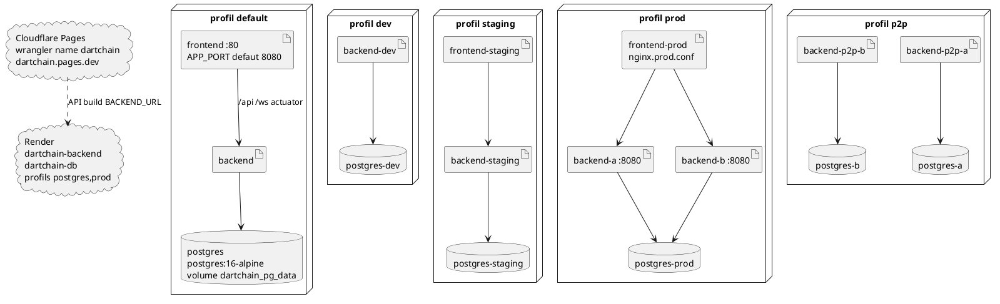

# 09 — Diagramme de déploiement

## Objectif

Ce fichier décrit le diagramme de déploiement, type officiel UML 2.5. Il nomme les services réels de `docker-compose.yml` selon les profils `default`, `dev`, `staging`, `prod` et `p2p`, puis les cibles hors compose : Cloudflare Pages et Render. Les secrets d'environnement ne sont pas recopiés : [SECRET MASQUÉ].

## Statut

Confirmé par le code.

## Sources analysées

- `docker-compose.yml` : blocs `profiles` et images.
- `infra/nginx/nginx.prod.conf` : upstream `backend-a` et `backend-b`.
- `deploy/render.yaml` : base `dartchain-db`, service `dartchain-backend`.
- `wrangler.toml` : `name = "dartchain"`, assets `apps/dartchain-frontend/Dart/dist/browser`.
- `.github/workflows/ci.yml` et `.github/workflows/cloudflare-deploy.yml`.
- `application.yaml`, `application-prod.yaml`, `application-staging.yaml`, `application-postgres.yaml`, `application-seed.yaml`, `application-data-import.yaml` (présence des profils).

## Éléments représentés

- Profil `default` : `postgres`, `backend`, `frontend`.
- Profil `dev` : `postgres-dev`, `backend-dev`.
- Profil `db-local` : `postgres-local` (présent dans le compose, hors des cinq profils demandés, cité pour ne pas le perdre).
- Profil `staging` : `postgres-staging`, `backend-staging`, `frontend-staging`.
- Profil `prod` : `postgres-prod`, `backend-a`, `backend-b`, `frontend-prod`.
- Profil `p2p` : `postgres-a`, `postgres-b`, `backend-p2p-a`, `backend-p2p-b`.
- Pages `dartchain` et Render `dartchain-backend` + `dartchain-db`.
- Volume `dartchain_pg_data` sur le postgres du profil default.
- Santé backend : `/actuator/health` ou `/api/health`.

## Diagramme

## Explication

Le fichier unique `docker-compose.yml` active des services par profil Compose. Le profil `default` construit `backend` depuis `apps/dartchain-backend/Dockerfile` (image de base `eclipse-temurin:21`) et `frontend` depuis `apps/dartchain-frontend/Dart/Dockerfile` (`node:22-alpine` pour le build, `nginx:1.27-alpine` pour le runtime). `frontend` publie `${APP_PORT:-8080}:80`. `postgres` utilise `postgres:16-alpine`, la base et l'utilisateur par défaut `dartchain`, et le volume nommé `dartchain_pg_data`. Le mot de passe n'est pas dans cette fiche : [SECRET MASQUÉ], variable `POSTGRES_PASSWORD`. Le healthcheck backend du compose interroge `http://localhost:8080/actuator/health` puis, en repli, `http://localhost:8080/api/health`.

`dev` ne lance pas de conteneur frontend : `postgres-dev` et `backend-dev` servent un développement hybride, la SPA restant sur la machine hôte (le port 4200 apparaît comme callback OAuth de développement dans `application.yaml`, propriété `dartchain.oauth.frontend-callback-url`). `db-local` ne lance que `postgres-local`.

`staging` reprend le trio `postgres-staging`, `backend-staging`, `frontend-staging`. `prod` sépare deux backends, `backend-a` et `backend-b`, derrière `frontend-prod`. `nginx.prod.conf` les cite par ces noms DNS compose, port 8080, avec `max_fails=2` et `fail_timeout=10s`. Ils partagent `postgres-prod` dans le graphe de services du fichier. `p2p` est le seul profil à deux bases : `postgres-a` avec `backend-p2p-a`, `postgres-b` avec `backend-p2p-b`. C'est le déploiement qui correspond à l'acteur A4 (pairs), pas un deuxième produit.

Hors Docker Compose du dépôt, le README pointe la SPA `https://dartchain.pages.dev` et l'API Render `https://dartchain-backend-1-0-0.onrender.com`. `wrangler.toml` fixe le nom Pages `dartchain` et le répertoire d'assets. Le workflow `cloudflare-deploy.yml` est en `workflow_dispatch` et utilise Wrangler. `deploy/render.yaml` décrit une base gratuite `dartchain-db` (nom logique `dartchain`, utilisateur `dartchain`) et un service web image `dartchain-backend`, healthcheck `/api/health`, région `frankfurt`, profils Spring `postgres,prod`, persistance `postgres`. Le jeton JWT et le jeton actuator y sont générés par Render (`generateValue: true`) : valeurs [SECRET MASQUÉ]. Le CORS d'exemple contient le texte `https://YOUR-PROJECT.pages.dev`, à remplacer au déploiement. Le document `deploy/soc-readme.md` est une note du dossier `deploy` ; il n'ajoute pas un service compose.

La CI (`.github/workflows/ci.yml`, nom CI) construit sur push `main` et sur pull request : job backend `./mvnw -q verify` (Java 21 Temurin), job frontend (`npm ci`, `npm test`, `verify:a11y`, `build`, `build:cloudflare` avec l'URL Render), job docker (images `dartchain-backend:ci` et `dartchain-frontend:ci`). Ce sont des nœuds d'intégration, pas des nœuds d'exécution du produit.

Le profil Spring `seed` (`application-seed.yaml`) et `application-data-import.yaml` sont des modes de processus, pas des services compose nommés `seed`.

## Correspondance avec le code

| Nœud | Source |
| --- | --- |
| `postgres`, `backend`, `frontend` | `docker-compose.yml`, `profiles: [default]` |
| `postgres-dev`, `backend-dev` | `profiles: [dev]` |
| `postgres-local` | `profiles: [db-local]` |
| `postgres-staging`, `backend-staging`, `frontend-staging` | `profiles: [staging]` |
| `postgres-prod`, `backend-a`, `backend-b`, `frontend-prod` | `profiles: [prod]` |
| `postgres-a`, `postgres-b`, `backend-p2p-a`, `backend-p2p-b` | `profiles: [p2p]` |
| Pages | `wrangler.toml`, workflow Cloudflare |
| Render | `deploy/render.yaml` |
| Santé | ancre `backend-healthcheck` du compose ; `HealthController` `/api/health` |

## Hypothèses

- Le lien `backend-a` / `backend-b` vers `postgres-prod` reprend la structure du compose (deux API, une base prod). Les variables d'environnement exactes de chaque service ne sont pas recopiées.
- Pages n'héberge pas Postgres. La flèche en pointillés vers Render est le couplage de build (`BACKEND_URL`), pas un réseau Docker.
- Le profil `db-local` est dessiné seulement dans le texte, pour ne pas surcharger le graphe des cinq profils demandés.

## Anomalies détectées

- Le README ne cite pas l'infra compose, le Makefile ni `wrangler.toml`, alors que ces fichiers portent le déploiement réel.
- Prod compose a deux backends et une base. Le mode FAQ en postgres reste en RAM : les deux nœuds `backend-a` et `backend-b` n'auraient pas la même FAQ.
- p2p a deux Postgres. Ce n'est pas le même partage que prod. Un diagramme qui fusionnerait « la base » serait faux.
- `network-name` YAML « DartChain Native » et défaut Java « R4V3 Testnet » peuvent diverger selon le fichier de config chargé par le nœud.
- Aucun service Prometheus ou Grafana n'est identifié dans le compose.

## Recommandations

- Nommer le profil Compose dans chaque commande d'exploitation (`default`, `dev`, `staging`, `prod`, `p2p`) plutôt que « le docker-compose ».
- Traiter Pages + Render comme le chemin live du README, et le compose `prod` comme un chemin séparé (deux backends, nginx du dépôt).
- Avant un déploiement p2p, vérifier que `/ws/peers` et `PeerSocketHandler` sont le canal prévu entre `backend-p2p-a` et `backend-p2p-b`, et que chaque nœud a sa base.
