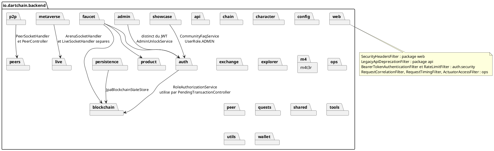
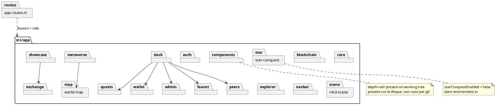

# 10 — Diagramme de paquets

## Objectif

Ce fichier décrit le diagramme de paquets, type officiel UML 2.5. Il recense les packages Java `io.dartchain.backend.*` et les dossiers de `apps/dartchain-frontend/Dart/src/app`. Le diagramme montre la contenance. Il ne prétend pas lister chaque dépendance Maven ou chaque import TypeScript.

## Statut

Confirmé par le code.

## Sources analysées

- Arborescence des contrôleurs (tous sous `io.dartchain.backend.<domaine>.infrastructure.web` ou voisin).
- `app.routes.ts` à la racine de `src/app`.
- Dossier local non commité `apps/dartchain-frontend/Dart/src/app/components/depth-rail/`.

## Éléments représentés

Packages backend : `admin`, `api`, `auth`, `blockchain`, `chain`, `character`, `config`, `exchange`, `explorer`, `faucet`, `live`, `m4t3r`, `metaverse`, `ops`, `p2p`, `peer`, `peers`, `persistence`, `product`, `quests`, `shared`, `showcase`, `tools`, `utils`, `wallet`, `web`.

Dossiers frontend : `admin`, `auth`, `blockchain`, `components`, `core`, `dock`, `exchange`, `explorer`, `faucet`, `metaverse`, `navbar`, `peers`, `quests`, `r4v3-scene`, `showcase`, `star-conquest`, `wallet`, `world-map`.

## Diagramme

### Backend

### Frontend `src/app`

## Explication

Le backend n'est pas un seul package plat. La convention observée place les contrôleurs dans `infrastructure.web` du domaine : `auth.infrastructure.web`, `blockchain.infrastructure.web`, `faucet.infrastructure.web`, `admin.infrastructure.web`, et de même pour l'exchange, l'explorer, les quêtes, les pairs, les ops, le showcase, le wallet, le métavers et M4T3R. `HelloController` et `RootController` sont dans `shared.infrastructure.web`. `ApiContractV1Controller` est dans `api.infrastructure.web`.

Quelques packages se chevauchent par le nom. `peer` et `peers` coexistent : `PeerController` est sous `peers`, `PeerSocketHandler` est sous `p2p`, et `peer` contient `PeerConnection` ainsi que `PeerMetricsRegistry`. `live` porte `LiveSocketHandler` et n'est pas un sous-package de `metaverse`, alors que `ArenaSocketHandler` est sous `metaverse.arena.ws`. `web` et `shared` portent les filtres transverses (`SecurityHeadersFilter` dans `web`, corrélation et timing dans `ops` avec enregistrement dans `config`).

`persistence` contient les `@Entity` et les stores JPA (`JpaBlockchainStateStore`). Il ne remplace pas les modèles `blockchain.model`, qui restent les objets manipulés par `BlockchainService`. `product` porte `ProductFeatureService` et est appelé par le faucet. `config` porte `ApiRoutes`, `AuthProperties`, `ProductProperties`, `SecurityConfig` est dans `shared.config`, `WebSocketConfig` aussi.

Côté Angular, `src/app` n'a pas de routeur fonctionnel : `app.routes.ts` exporte un tableau vide. Les dossiers sont des zones de la page, pas des lazy routes. `dock` héberge les onglets wallet, faucet, transactions, chaîne, quêtes, pairs et admin (`BottomDockTab` dans `dock-navigation.service.ts`). `showcase` porte les onglets `tours`, `r4v3`, `rv23`, `dao`, `daonews`, `market`. `metaverse` contient l'arène et le sol three.js ; `world-map` porte la config de carte (Marseille dans les noms de fichiers lus). `star-conquest` est livré dans l'arbre mais `app.html` ne l'affiche que si `product.starConquestEnabled` est vrai, et `environment.ts` le met à faux.

`components/depth-rail/` (fichiers `depth-rail.ts`, html, css, `depth-rail.math.ts`, spec) est présent dans le working tree et non suivi par git. Il figure en note, pas comme package stable du HEAD.

Les services HTTP du frontend ne forment pas tous un dossier `services` unique. Ils sont répartis : `auth.service.ts`, `blockchain-api.service.ts`, `chain-config.service.ts`, `crypto-rate.service.ts`, `faucet.service.ts`, `quests-api.service.ts`, `showcase-api.service.ts`, `character-nft-api.service.ts`, `arena-session.service.ts`, `admin-export-client.service.ts`, `admin-seed-session.service.ts`, `ops-snapshot.service.ts`, `m4t3r-trail-api.service.ts`, `m4t3r-reward-api.service.ts`, `placement-api.repository.ts`, `wigle-api.service.ts`, `auth-token-refresh.ts`.

## Correspondance avec le code

| Paquet | Rôle confirmé |
| --- | --- |
| `io.dartchain.backend.auth` | JWT, rôles, contrôleurs `/api/auth` et `/api/v1/auth` |
| `io.dartchain.backend.blockchain` | `Block`, pool, mine |
| `io.dartchain.backend.persistence` | 17 tables JPA |
| `io.dartchain.backend.p2p` | `PeerSocketHandler` |
| `io.dartchain.backend.peers` | `PeerController` `/api/peers` |
| `io.dartchain.backend.showcase` | FAQ, news, chat, launch, chart |
| `io.dartchain.backend.metaverse` | Overpass, placements, WiGLE, arène |
| `src/app/dock` | barre basse de la SPA |
| `src/app/showcase` | hub haut |
| `src/app/wallet` | panneau wallet du dock |

Le frontend TypeScript est en `apps/dartchain-frontend/Dart`. Le backend Java est en `apps/dartchain-backend/src/main/java`.

## Hypothèses

- Les flèches du diagramme backend sont un sous-ensemble lu pour les fiches 01 à 07. Un import non cité peut exister.
- `tools` et `utils` sont des packages Java du backend. Leur contenu n'est pas détaillé dans cette vue de paquets.
- Le dossier `components` contient aussi d'autres composants que `depth-rail`. Seul `depth-rail` est appelé en note parce qu'il est hors suivi git.

## Anomalies détectées

- Trois noms proches pour les pairs : `peer`, `peers`, `p2p`.
- `live` et `metaverse.arena.ws` séparent deux sockets que l'interface peut présenter ensemble.
- Double API : les packages ne distinguent pas `/api` et `/api/v1`. Les deux contrôleurs vivent dans le même package `auth` ou `blockchain`.
- `star-conquest` est un paquet source alors que le flag produit est faux. Le README le décrit comme live.
- Working tree : fichiers showcase modifiés et `depth-rail` non suivi par git. Le paquet documenté du HEAD peut donc différer du disque de travail.

## Recommandations

- Utiliser cette fiche comme légende des autres diagrammes : un nom de classe doit être préfixé par son package quand `peer` et `peers` prêtent à confusion.
- Éviter un nouveau package `guest` ou `payment` : ils n'existent pas.
- Décider si `depth-rail` entre dans le paquet `components` versionné avant de le citer dans une revue d'architecture figée sur `0690e34`.
