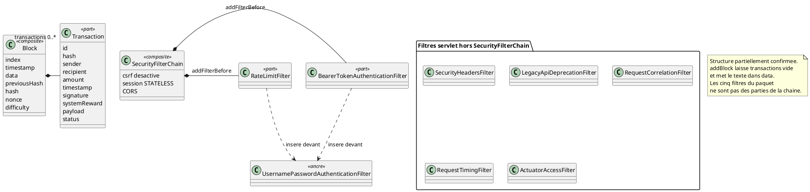

# 11 — Diagramme de structure composite

## Objectif

Ce fichier décrit le diagramme de structure composite, type officiel UML 2.5. Deux compositions sont assez concrètes pour être dessinées : un `Block` possède une liste `transactions` de `Transaction`, et la chaîne de filtres HTTP est un assemblage de filtres nommés. La seconde composition est partielle : seuls deux filtres sont ajoutés à la `SecurityFilterChain` dans `SecurityConfig`. Les autres filtres nommés sont des filtres servlet enregistrés à part.

## Statut

Partiellement confirmé.

## Sources analysées

- `Block.java` : champ `List<Transaction> transactions`.
- `BlockchainService.addBlock` : `setTransactions(new ArrayList<>())`.
- `BlockEntity.transactionsJson`.
- `SecurityConfig.securityFilterChain`.
- Filtres : `BearerTokenAuthenticationFilter`, `RateLimitFilter`, `SecurityHeadersFilter`, `LegacyApiDeprecationFilter`, `RequestCorrelationFilter`, `RequestTimingFilter`, `ActuatorAccessFilter`.
- Configurations `FilterRegistrationBean` : `RequestTimingFilterConfig`, `RequestCorrelationFilterConfig`, `ActuatorAccessFilterConfig`.

## Éléments représentés

- Partie `transactions` dans le composite `Block`.
- Composite documentaire `SecurityFilterChain` et ses deux filtres branchés par `addFilterBefore`.
- Groupe séparé des filtres servlet, pour ne pas les dessiner comme des parties internes de la chaîne Spring Security.

## Diagramme

## Explication

UML composite sert à montrer les parties d'un objet à l'exécution, pas seulement une association de classes. `Block` déclare `private List<Transaction> transactions = new ArrayList<>()`. Les constructeurs qui reçoivent une liste la copient ou la remplacent par une liste vide si l'argument est null. Le constructeur historique (index, timestamp, data, previousHash, hash, nonce) initialise aussi une liste vide et `difficulty` à 0. La composition est donc dans le type.

Le chemin `PendingTransactionServiceImpl.minePendingTransaction` n'ajoute pas une `Transaction` à cette liste. Il appelle `BlockchainService.addBlock(String data)`. Cette méthode crée un bloc, copie le hash du bloc précédent, puis `setTransactions(new ArrayList<>())` et `setData(data)`. La partie `transactions` existe et reste vide. Le contenu de la pending est une chaîne dans `data` (`txId`, `from`, `to`, `amount`, `data`, `signature`, `status`, `createdAt`). `BlockEntity` persiste les deux : `block_data` et `transactions_json`. Un bloc chargé depuis Postgres peut donc avoir un JSON de transactions non vide si un autre chemin les a écrites (`minePendingTransactions`, `addTransaction`). Cette fiche ne fusionne pas ces chemins.

`SecurityConfig.securityFilterChain` est le bean `SecurityFilterChain`. Il désactive le CSRF, active le CORS, fixe `SessionCreationPolicy.STATELESS`, branche `SecurityProblemSupport` en entry point et en access denied handler, puis déclare les `permitAll`. Ensuite :

- `addFilterBefore(bearerTokenAuthenticationFilter, UsernamePasswordAuthenticationFilter.class)`
- `addFilterBefore(rateLimitFilter, UsernamePasswordAuthenticationFilter.class)`

Ces deux filtres sont des parties de la chaîne. L'ordre relatif entre Bearer et RateLimit n'est pas un `addFilterBefore` de l'un vers l'autre : les deux sont placés devant l'ancre `UsernamePasswordAuthenticationFilter`. Le diagramme ne numérote pas un ordre Bearer-puis-RateLimit que le code n'exprime pas ainsi.

`SecurityHeadersFilter` est un `@Component` `@Order(Ordered.HIGHEST_PRECEDENCE + 10)`. `LegacyApiDeprecationFilter` est un `@Component` `@Order(Ordered.HIGHEST_PRECEDENCE + 20)`. `RequestCorrelationFilter`, `RequestTimingFilter` et `ActuatorAccessFilter` sont créés par des `@Bean` dans `config` (`RequestCorrelationFilterConfig`, `RequestTimingFilterConfig`, `ActuatorAccessFilterConfig`) et enregistrés par `FilterRegistrationBean` sur `/*`. L'ordre lu est `HIGHEST_PRECEDENCE + 10` pour la corrélation, et `HIGHEST_PRECEDENCE + 20` pour le timing et l'actuator. Les classes elles-mêmes sont dans le package `ops`, pas dans `shared`. Ils voient la requête, y compris celles qui ne passent pas par une règle `authorizeHttpRequests`. Les dessiner à l'intérieur de `SecurityFilterChain` serait inexact. Le statut de la fiche reste « partiellement confirmé » pour cette raison, et à cause du décalage entre `Block.transactions` et `addBlock`.

## Correspondance avec le code

| Partie | Preuve |
| --- | --- |
| `Block.transactions` | `blockchain/model/Block.java` |
| Liste vidée au mine unitaire | `BlockchainService.addBlock` |
| JSON persistant | `BlockEntity.transactionsJson` |
| Chaîne | `SecurityConfig.securityFilterChain` |
| Parties branchées | `BearerTokenAuthenticationFilter`, `RateLimitFilter` |
| Hors chaîne | `SecurityHeadersFilter`, `LegacyApiDeprecationFilter`, `RequestCorrelationFilter`, `RequestTimingFilter`, `ActuatorAccessFilter` |

`UsernamePasswordAuthenticationFilter` est la classe ancre Spring Security. Le projet ne la sous-classe pas. Le login DartChain ne passe pas par un formulaire username/password de Spring : il passe par `AuthV1Controller`.

## Hypothèses

- La multiplicité `0..*` vient du type `List` et des initialisations vides. Aucun test de cardinalité maximale n'a été lu pour cette fiche.
- L'ancre `UsernamePasswordAuthenticationFilter` est un repère de la chaîne, pas une classe métier du dépôt.
- `WebSocketAuthHandshakeInterceptor` n'est pas une partie de `SecurityFilterChain`. Il est enregistré dans `WebSocketConfig`.

## Anomalies détectées

- Composition déclarée (`transactions`) et composition effective du mine unitaire (`data` seul) divergent.
- Cinq filtres nommés dans l'exploration sécurité ne sont pas des enfants de la `SecurityFilterChain`.
- `RateLimitFilter` et le Bearer sont tous les deux « devant » le filtre username/password, sans ordre mutuel explicite dans `SecurityConfig`.
- `POST /api/wallets/create` est une règle de la chaîne sans contrôleur. La structure de filtres l'autorise, la structure REST ne la sert pas.

## Recommandations

- Dans une revue de code, citer le chemin (`addBlock` ou `minePendingTransactions`) avant d'affirmer qu'un bloc « contient » des transactions.
- Documenter l'ordre servlet (`@Order`, `FilterRegistrationBean`) dans une liste à part de la `SecurityFilterChain`.
- Si l'ordre Bearer / rate limit devient un invariant, l'exprimer avec un seul `addFilterBefore` chaîné, puis mettre à jour ce diagramme.
