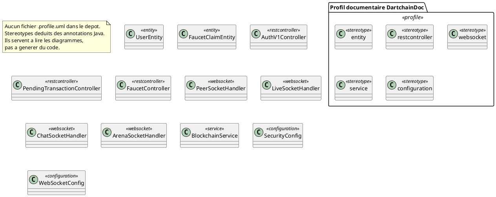

# 12 — Diagramme de profils

## Objectif

Ce fichier décrit le diagramme de profils, type officiel UML 2.5. Il propose un profil documentaire, utile pour lire les autres fiches : stéréotypes `entity`, `restcontroller` et `websocket`, calés sur les annotations réellement présentes dans le code. Le dépôt ne contient pas de fichier `.profile.uml`. Ce profil n'est pas appliqué par un outil de génération.

## Statut

Déduit du projet.

## Sources analysées

- Recherche documentaire : aucun fichier `.profile.uml` dans le canon.
- Annotations lues : `@Entity` sur `UserEntity`, `PendingTransactionEntity`, `BlockEntity`, `AuthSessionEntity`, `FaucetClaimEntity` et les autres entités de `persistence.entity`.
- `@RestController` et `@RequestMapping` sur les 42 contrôleurs.
- `@EnableWebSocket` et handlers : `PeerSocketHandler`, `LiveSocketHandler`, `ChatSocketHandler`, `ArenaSocketHandler` étendent le handler WebSocket Spring (`TextWebSocketHandler` pour ceux dont la déclaration a été lue).
- `@Service` sur `AuthService`, `NativeJwtService`, `BlockchainService`, `ProductFeatureService`, `AdminUnlockService`, `CommunityFaqService`.

## Éléments représentés

- Profil documentaire `DartchainDoc`.
- Stéréotypes `entity`, `restcontroller`, `websocket`, plus `service` et `configuration` parce qu'ils évitent de confondre un bean Spring avec une entité.
- Exemples d'application sur des classes déjà citées dans les fiches 02 et 08.

Le profil ne crée pas de nouvelle métaclasse au-delà de ces stéréotypes. Il ne décrit pas un DSL exécutable.

## Diagramme

Légende : le mot entre guillemets doubles dans les fiches UML (`<<entity>>`, `<<restcontroller>>`, `<<websocket>>`) renvoie à ce profil documentaire. Il ne faut pas le lire comme un profil OMG livré avec DartChain.

## Explication

Un profil UML étend le métamodèle avec des stéréotypes, des tagged values et des contraintes. DartChain n'a pas fait ce travail dans un fichier d'outil. Les annotations Java jouent un rôle voisin, et ce sont elles qui justifient trois stéréotypes utiles.

`entity` correspond à `@Entity` et `@Table`. Exemple : `UserEntity` sur `users`, `FaucetClaimEntity` sur `faucet_claims`, `PendingTransactionEntity` sur `pending_transactions`. Ce stéréotype ne s'applique pas à `Block`, `Transaction` ni `PendingTransaction` dans `blockchain.model` : ces classes n'ont pas `@Entity`. Leur image JPA est `BlockEntity` et `PendingTransactionEntity`. `FaqQuestion` n'a pas non plus `@Entity`. En mode postgres elle est tenue par `InMemoryFaqQuestionStore`.

`restcontroller` correspond à `@RestController`. Chaque classe de ce stéréotype a un `@RequestMapping` de préfixe (`/api/auth`, `/api/v1/auth`, `/api/faucet`, `/api`, `/api/v1/admin`, etc.). Le stéréotype ne dit pas si la route est `permitAll` ou `authenticated`. Cette information reste dans `SecurityConfig` et dans les services (`requireAuthenticatedAccount`, `authorizeMutation`, `requireAdmin`).

`websocket` correspond aux handlers enregistrés par `WebSocketConfig.registerWebSocketHandlers`, pas à n'importe quelle classe du package `live` ou `p2p`. Les quatre chemins sont `/ws/peers`, `/ws/live`, `/ws/chat`, `/ws/metaverse-arena`. `WebSocketAuthHandshakeInterceptor` est un intercepteur, pas un handler : il n'a pas le stéréotype `websocket` dans ce profil.

`service` et `configuration` évitent deux confusions fréquentes dans ce dépôt. `BlockchainService` et `PendingTransactionServiceImpl` ne sont pas des contrôleurs. `SecurityConfig` et `WebSocketConfig` ne sont pas des entités. `NativeJwtService` est un `@Service` même s'il ne touche pas à JPA.

Tagged values documentaires, non présentes dans un fichier de profil, mais stables dans le code :

- `entity.table` : nom `@Table`, par exemple `users`, `faucet_claims`.
- `restcontroller.prefix` : valeur de `@RequestMapping`.
- `websocket.path` : argument de `addHandler`.
- `service.persistence` : `memory` ou `postgres`, propriété `dartchain.persistence.mode`, qui change le store derrière le même service.

Aucune contrainte OCL n'est écrite dans le dépôt. Une contrainte utile à retenir à la lecture : une classe `<<restcontroller>>` ne doit pas être confondue avec le rôle `UserRole`. Le rôle est un enum, pas un stéréotype.

## Correspondance avec le code

| Stéréotype | Annotation ou type Java |
| --- | --- |
| `entity` | `jakarta.persistence.Entity` |
| `restcontroller` | `org.springframework.web.bind.annotation.RestController` |
| `websocket` | handler passé à `WebSocketHandlerRegistry.addHandler` |
| `service` | `org.springframework.stereotype.Service` |
| `configuration` | `org.springframework.context.annotation.Configuration` |

Fichiers d'exemple : `UserEntity.java`, `AuthV1Controller.java`, `WebSocketConfig.java`, `BlockchainService.java`, `SecurityConfig.java`.

## Hypothèses

- Le profil est entièrement déduit. Statut imposé par l'absence de `.profile.uml`.
- Les stéréotypes sont en minuscules dans le dessin pour rester proches des mots demandés (`entity`, `restcontroller`, `websocket`), pas des noms d'annotations (`@Entity`, `@RestController`).
- D'autres annotations (`@Table`, `@GetMapping`, `@Order`) pourraient devenir des tagged values. Elles ne sont pas promues au rang de stéréotype dans cette fiche, pour garder le profil court.

## Anomalies détectées

- Pas de fichier `.profile.uml`. Un outil qui importerait cette fiche ne trouvera pas de profil appliqué dans le build.
- `PendingTransaction` (modèle) et `PendingTransactionEntity` (table) recevraient des stéréotypes différents. Les nommer tous deux « transaction » dans un profil serait une erreur.
- `peer`, `peers` et `p2p` n'ont pas de stéréotype qui les distingue. Le stéréotype `websocket` ne couvre que `PeerSocketHandler`.
- GUEST n'est pas un stéréotype ni une valeur d'enum.

## Recommandations

- Garder ce profil comme légende des fiches 02, 08 et 10. Ne pas le commiter sous forme de `.profile.uml` tant qu'aucun outil du build ne le charge.
- Si un jour un profil est versionné, y mettre seulement les cinq stéréotypes ci-dessus et la contrainte « `blockchain.model` n'est pas `entity` ».
- Ne pas stéréotyper `UserRole.ADMIN` : le rôle et le stéréotype répondent à deux questions différentes (qui appelle, versus quelle sorte de classe).
