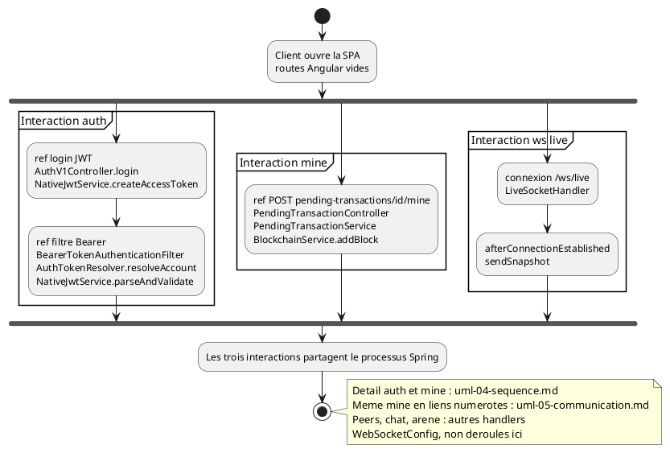

# 13 — Vue d'ensemble des interactions

## Objectif

Ce fichier décrit la vue d'ensemble des interactions (interaction overview), type officiel UML 2.5. Elle enchaîne trois interactions déjà détaillées ailleurs : l'authentification JWT, le mine d'une pending, et le flux WebSocket live. Les séquences message par message restent dans la fiche 04 pour l'auth et le mine. Le socket live est résumé ici parce qu'il n'a pas de fiche de séquence dédiée.

## Statut

Partiellement confirmé.

## Sources analysées

- `AuthV1Controller`, `AuthService`, `NativeJwtService`, `BearerTokenAuthenticationFilter`, `AuthTokenResolver` (fiche 04).
- `PendingTransactionController.minePendingTransaction`, `PendingTransactionServiceImpl`, `BlockchainService.addBlock`.
- `WebSocketConfig` : handler `LiveSocketHandler` sur `/ws/live`.
- `LiveSocketHandler.afterConnectionEstablished` : `broadcastService.sendSnapshot(session)`.
- `SecurityConfig` : `/ws/**` en `permitAll`.

## Éléments représentés

- Interaction `auth` : login puis résolution Bearer.
- Interaction `mine` : pending authentifiée jusqu'à `addBlock`.
- Interaction `ws-live` : connexion `/ws/live` et envoi d'un snapshot.
- Références vers `uml-04-sequence.md` et `uml-05-communication.md`.

Les sockets `/ws/peers`, `/ws/chat` et `/ws/metaverse-arena` sont nommés comme interactions sœurs, sans être déroulés.

## Diagramme

La notation `ref` est textuelle dans les actions : PlantUML ne charge pas les fichiers voisins comme fragments d'interaction UML. Le renvoi est documentaire.

## Explication

La vue d'ensemble sert à voir l'ordre des grands morceaux sans répéter chaque appel. Dans DartChain, ces morceaux ne sont pas un seul workflow obligatoire. Un visiteur peut ouvrir `/ws/live` sans avoir miné, et il peut miner sans garder le socket. Le `fork` du diagramme exprime cette indépendance. Le point commun est le processus `DartchainBackendApplication`.

L'interaction auth commence par `POST /api/v1/auth/login` (`permitAll`). `AuthService.login` vérifie le compte et le mot de passe, puis `buildAuthResponse` appelle `NativeJwtService.createAccessToken` et `RefreshTokenStore.create`. Une requête suivante porte `Authorization: Bearer`. `BearerTokenAuthenticationFilter.doFilterInternal` appelle `AuthTokenResolver.resolveAccount`, qui appelle `parseAndValidate` si le jeton a trois segments. Le détail des alternatives 401 est dans la fiche 04. `POST /api/auth/login` est la même interaction côté `AuthService`, sans route `refresh` sur `AuthController`.

L'interaction mine ne démarre qu'avec un compte accepté par `RoleAuthorizationService.authorizeMutation` (`pending.mine`). `PendingTransactionService.minePendingTransaction` trouve la pending, appelle `BlockchainService.addBlock`, passe le statut à `MINED` et retire l'id du pool. La fiche 05 numérote ces liens. `BlockchainController` et `minePendingTransactions` sont une autre interaction, volontairement hors de ce fork.

L'interaction live est le handler `LiveSocketHandler` enregistré sur `/ws/live`. À l'ouverture, `afterConnectionEstablished` planifie `LiveUpdateBroadcastService.sendSnapshot(session)`. Le corps de `sendSnapshot` n'est pas redessiné : méthode de broadcast, le message interne au-delà de cet appel est non détaillé dans cette vue. `/ws/**` est `permitAll`. L'intercepteur `WebSocketAuthHandshakeInterceptor` est tout de même posé sur les quatre handlers. Cette fiche ne décrit pas le contenu du snapshot (chaîne, mempool ou autre) parce que ce contenu n'a pas été ouvert méthode par méthode.

Les trois autres handlers existent et répondent à d'autres cas : pairs (`PeerSocketHandler`, acteur A4), chat (`ChatSocketHandler`, auteur anonyme possible), arène (`ArenaSocketHandler`). Les citer dans la note évite de croire que `/ws/live` est le seul canal.

## Correspondance avec le code

| Interaction | Ancrage |
| --- | --- |
| auth login | `AuthV1Controller.login`, `NativeJwtService.createAccessToken` |
| auth requêtes suivantes | `BearerTokenAuthenticationFilter`, `AuthTokenResolver.resolveAccount` |
| mine | `PendingTransactionController`, `PendingTransactionServiceImpl.minePendingTransaction`, `BlockchainService.addBlock` |
| ws live | `WebSocketConfig` chemin `/ws/live`, `LiveSocketHandler.afterConnectionEstablished` |
| ws sœurs | `/ws/peers`, `/ws/chat`, `/ws/metaverse-arena` |

## Hypothèses

- Le fork ne signifie pas que le client lance les trois interactions en parallèle à chaque visite. Il signifie qu'aucune des trois n'est une précondition codée des deux autres, sauf le JWT pour le POST de mine.
- « méthode : non détaillée dans cette vue » s'applique à `sendSnapshot` au-delà de son nom, et aux handlers pairs, chat et arène.
- Le statut partiellement confirmé vient du fait que l'overview est une composition documentaire des séquences, pas une classe `Interaction` du code.

## Anomalies détectées

- Deux mines coexistent (`minePendingTransaction` et `minePendingTransactions`). Cette overview n'en retient qu'une, celle demandée pour la séquence.
- Le live est `permitAll` au filtre HTTP. Le handshake a un intercepteur : le diagramme ne doit pas être lu comme « socket anonyme sans aucun code d'auth ».
- Le README omet `/ws/peers` et `/ws/metaverse-arena`. Une overview calée sur le README seul serait incomplète.
- `GET /**` permitAll n'ouvre pas le POST de mine. L'overview qui mettrait « tout est public » serait fausse.

## Recommandations

- Garder la fiche 04 comme référence normative des messages auth et mine. Mettre à jour cette overview seulement si ces méthodes changent de nom.
- Ajouter une interaction `ws-arena` le jour où les timings de l'arène (fiche 14) doivent être reliés à des messages `ArenaSocketHandler`.
- Ne pas transformer le fork en processus métier unique dans la fiche d'activités : le claim faucet et le mine sont deux flux.
