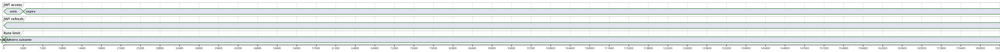
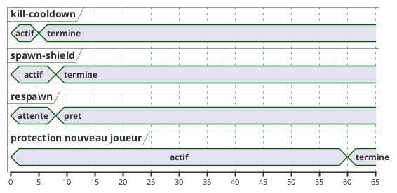

# 14 — Diagramme de temps

## Objectif

Ce fichier décrit le diagramme de temps, type officiel UML 2.5. Il ne trace que des durées lues dans la configuration ou les constantes : TTL JWT (3600 s et 604800 s), rate limit (60 requêtes / 60000 ms), timings d'arène (spawn-shield 8 s, respawn 8 s, kill-cooldown 5 s, protection nouveau joueur 60 s), plus quelques autres durées trouvées au même endroit (unlock admin, cooldown faucet, cache WiGLE, seuil de requête lente, TTL de session legacy). Ce qui n'a pas de durée dans le code n'est pas représenté.

## Statut

Partiellement confirmé.

## Sources analysées

- `application.yaml` : `dartchain.auth.access-token-ttl-seconds` 3600, `refresh-token-ttl-seconds` 604800, `dartchain.rate-limit.max-requests` 60, `window-ms` 60000.
- Arène : `spawn-shield-duration-seconds` 8, `respawn-delay-seconds` 8, `kill-cooldown-seconds` 5, `new-player-protection-duration-seconds` 60.
- `dartchain.admin.unlock-ttl-seconds` via `${DARTCHAIN_ADMIN_UNLOCK_TTL:3600}`.
- `FaucetConfig` : `faucet.cooldown-seconds` défaut 10.
- `dartchain.wigle.cache-ttl-ms` 300000.
- `dartchain.ops.slow-request-threshold-ms` défaut 2000.
- `auth.session.ttl-seconds` défaut 604800, avec `dartchain.auth.legacy-session-enabled: false`.
- `NativeJwtService` : `exp = now + accessTokenTtlSeconds`.
- `RateLimitBucketEntity` : `windowStartMs`, `requestCount`.

Les compteurs sans durée (loot-rate 0.10, loot-cap 25, daily caps 200, anti-farming-threshold 8, mempool 50, http errors 10, rbac denied 20) ne sont pas des timelines.

## Éléments représentés

- Durée de vie du JWT d'accès et du refresh.
- Fenêtre de rate limit.
- Quatre durées d'arène, sur une échelle en secondes.
- Durées annexes confirmées, sur une liste à part pour ne pas écraser l'échelle.

## Diagramme

### Jetons et rate limit

La fenêtre de rate limit dure 60 secondes (60000 ms) et autorise 60 requêtes. Le diagramme ne peut pas dessiner chaque fenêtre jusqu'à 604800 s sans masquer le TTL. Après `@60`, les fenêtres se répètent. Seuls le premier basculement et les deux expirations de jeton sont marqués.

### Arène

### Durées hors de ces deux échelles

| Propriété | Valeur lue | Rôle |
| --- | --- | --- |
| `dartchain.admin.unlock-ttl-seconds` | 3600 s par défaut d'environnement | vie du jeton `X-Admin-Unlock-Token` |
| `faucet.cooldown-seconds` | 10 s si la propriété est absente | `nextEligibleAt = now + cooldown` |
| `dartchain.wigle.cache-ttl-ms` | 300000 ms | cache WiGLE |
| `dartchain.ops.slow-request-threshold-ms` | 2000 ms par défaut | seuil ops, pas un timeout HTTP |
| `auth.session.ttl-seconds` | 604800 s | session legacy, drapeau `legacy-session-enabled` à false |

## Explication

`NativeJwtService.createAccessToken` fixe `exp` à l'instant courant plus `AuthProperties.getAccessTokenTtlSeconds()`. La valeur YAML est 3600 secondes. `parseAndValidate` refuse le jeton quand `exp` est inférieur ou égal à l'epoch courant. Le refresh n'est pas un JWT : `RefreshTokenStore.create` pose une ligne `auth_refresh_tokens` dont l'expiration suit `refresh-token-ttl-seconds` (604800, soit 7 jours). Cette fiche n'a pas rouvert le store pour recopier la formule ; la durée, elle, est dans le YAML chargé par les propriétés d'auth. Le secret de signature reste [SECRET MASQUÉ] (`dartchain.auth.jwt-secret`).

Le rate limit est un quota, pas une pause. `max-requests` 60 et `window-ms` 60000 alimentent `RateLimitFilter` et la table `rate_limit_buckets` (`bucketKey`, `windowStartMs`, `requestCount`, `updatedAt`). À la fin de la fenêtre, le compteur repart. Le diagramme marque 60 secondes comme changement de fenêtre. Il ne dessine pas les 60 requêtes : ce sont des événements discrets sans horodatage imposé.

L'arène a quatre durées distinctes, toutes en secondes dans `dartchain.metaverse.arena` :

- `spawn-shield-duration-seconds` : 8
- `respawn-delay-seconds` : 8
- `kill-cooldown-seconds` : 5
- `new-player-protection-duration-seconds` : 60

`enabled: true` indique que l'arène est allumée. Les daily caps 200, le loot-rate et l'anti-farming sont des seuils de quantité. Les mettre sur une ligne de temps inventerait une horloge. `ArenaSocketHandler` et `ArenaController` portent l'état joueur (`alive`, `eliminated`, `disconnected`) sans que cette fiche leur associe une de ces quatre durées message par message : les propriétés existent, le branchement exact dans chaque méthode de combat n'est pas redessiné.

L'unlock admin dure par défaut 3600 s (`AdminUnlockService` ajoute `unlockTtlSeconds * 1000` à l'horloge). Ce n'est pas le TTL du JWT. Le cooldown faucet de 10 secondes est le défaut de `@Value`, pas la valeur d'un claim déjà enregistré : le claim stocke `nextEligibleAt` en epoch millisecondes. Le cache WiGLE est de 300000 ms, et le mock est actif (`dartchain.wigle.mock-enabled: true`), donc ce TTL ne s'applique au réseau WiGLE que lorsque le mock est coupé. Le seuil 2000 ms classe une requête comme lente pour les ops. Il n'annule pas la requête. La session legacy a le même ordre de grandeur que le refresh (604800 s) mais `legacy-session-enabled` est faux : `AuthTokenResolver` ne consulte pas `SessionStore` dans le chemin nominal.

Non représenté, faute de durée lue : temps de minage (`BlockchainService.mine` boucle sur le nonce sans timeout), tours de quêtes (`dayKey`, `weekKey` sont des clés, pas des `Duration`), intervalle de healthcheck Docker (10 s dans le compose : c'est une sonde d'infra, pas un timing métier ; il est cité seulement ici pour ne pas le mélanger aux TTL), synchronisation Star Conquest (aucune durée serveur identifiée, flag frontend faux).

## Correspondance avec le code

| Durée | Clé |
| --- | --- |
| 3600 s | `dartchain.auth.access-token-ttl-seconds` |
| 604800 s | `dartchain.auth.refresh-token-ttl-seconds` |
| 60 / 60000 ms | `dartchain.rate-limit.max-requests`, `window-ms` |
| 8 s, 8 s, 5 s, 60 s | clés `spawn-shield-duration-seconds`, `respawn-delay-seconds`, `kill-cooldown-seconds`, `new-player-protection-duration-seconds` |
| 3600 s | `dartchain.admin.unlock-ttl-seconds` |
| 10 s | `faucet.cooldown-seconds` dans `FaucetConfig` |
| 300000 ms | `dartchain.wigle.cache-ttl-ms` |
| 2000 ms | `dartchain.ops.slow-request-threshold-ms` |
| 604800 s inactifs | `auth.session.ttl-seconds` et `legacy-session-enabled: false` |

## Hypothèses

- Le diagramme de temps PlantUML utilise des unités cohérentes par graphe (secondes). 60000 ms est converti en 60 s pour l'échelle, la clé reste en millisecondes dans le YAML.
- Le refresh expire bien à 604800 s. La clé YAML est confirmée. Le champ `expiresAt` de `AuthRefreshTokenEntity` est le support de persistance.
- Les lignes d'arène partent toutes de t=0 pour comparer les durées. Dans une partie, le kill-cooldown et le respawn ne démarrent pas au même événement. Le graphe compare des constantes, pas un combat daté.

## Anomalies détectées

- Trois mécanismes d'environ une heure coexistent : JWT access 3600 s, unlock admin 3600 s, et ils ne sont pas le même jeton.
- Session legacy 604800 s alignée sur le refresh, alors que le drapeau legacy est faux. Un lecteur peut croire que les deux jetons sont équivalents.
- Le rate limit est global à la fenêtre du filtre. Cette fiche ne démontre pas une exemption par route `permitAll`.
- Le minage n'a pas de timeout : un diagramme de temps qui montrerait une durée de bloc serait inventé.
- Star Conquest n'a pas de timeline serveur identifiable.

## Recommandations

- Afficher dans l'écran auth `expiresIn` renvoyé par `AuthResponse` (secondes du TTL access) plutôt qu'une constante dupliquée dans le frontend.
- Nommer séparément « JWT », « refresh opaque » et « unlock seed » dans les docs d'exploitation.
- Laisser les caps d'arène dans une fiche de règles, pas dans un diagramme de temps.
