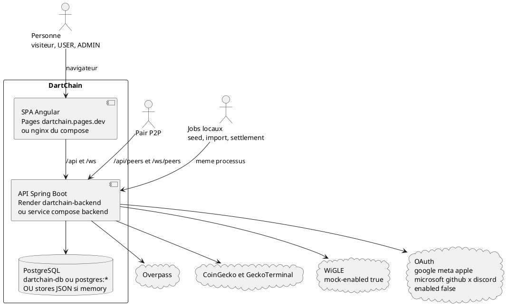

# 15 — Contexte système

## Objectif

Ce fichier est une vue complémentaire, pas un des quatorze diagrammes officiels UML 2.5. Il reprend l'idée d'un diagramme de contexte (style C4 niveau 1) : qui utilise le système, quelle SPA, quelle API, quelle base, quels systèmes externes. Le détail des composants est dans la fiche 08, le déploiement dans la fiche 09.

## Statut

Confirmé par le code.

## Sources analysées

- Mémo produit : démo full-stack, pas une crypto réelle, pas de mainnet. Token R4V3, micro-unité M4T3R, chain-id 3377, network-name YAML « DartChain Native ».
- README live : `https://dartchain.pages.dev`, API `https://dartchain-backend-1-0-0.onrender.com`.
- `deploy/render.yaml`, `wrangler.toml`, `docker-compose.yml`.
- `OverpassProxyService` / `OverpassProxyController`, `CryptoRatesProxyService`, `WiglePointsService`, fournisseurs OAuth.
- `dartchain.persistence.mode` : `memory` par défaut, `postgres` par profil.

## Éléments représentés

- Personnes : visiteur, utilisateur USER, administrateur (rôle JWT et, à part, détenteur de la seed).
- Pair P2P et jobs locaux, en acteurs non humains.
- SPA Angular.
- API Spring.
- PostgreSQL ou fichiers JSON.
- Externes : Overpass, CoinGecko, GeckoTerminal, WiGLE, OAuth.

## Diagramme

## Explication

Le système à la frontière est la démo DartChain : une SPA et une API qui simulent une chaîne native. Le README écarte l'idée d'une crypto réelle et d'un mainnet. Le chain-id YAML est 3377, le token R4V3, la plus petite unité M4T3R. Si le YAML ne charge pas, le défaut Java `ChainProperties.networkName` vaut « R4V3 Testnet », alors que le fichier canon dit « DartChain Native ». Les deux noms sont des libellés de configuration, pas deux produits.

La personne utilise un navigateur. La SPA n'a pas de routes Angular (`routes` vide). En ligne, le static est Cloudflare Pages, nom Wrangler `dartchain`, URL README `https://dartchain.pages.dev`. L'API README est `https://dartchain-backend-1-0-0.onrender.com`. Le blueprint Render nomme le web `dartchain-backend` et la base `dartchain-db`, profils `postgres,prod`. En local ou en compose, nginx publie la SPA et proxifie `/api/`, `/ws/` et l'actuator vers le backend. Ce sont deux contextes de déploiement de la même frontière, pas deux systèmes.

L'API est le seul composant qui parle à Postgres et aux externes. Le mode `memory` remplace Postgres par des fichiers dont les variables sont `BLOCKCHAIN_STATE_PATH`, `AUTH_USERS_PATH`, `FAUCET_CLAIMS_PATH` et les autres propriétés `*_PATH` de `application.yaml`. Le contexte doit donc montrer une base « Postgres ou JSON », sinon le défaut développeur disparaît.

Overpass est appelé pour le métavers (`POST /api/metaverse/overpass`, public). Les cours du panneau swap passent par `CryptoRatesProxyService` (CoinGecko et GeckoTerminal). WiGLE alimente la visualisation (`/api/metaverse/wigle`) et reste mocké tant que `dartchain.wigle.mock-enabled` est vrai. Les sept fournisseurs OAuth sont des boîtes du contexte parce que `OAuthV1Controller` et les clés `dartchain.oauth.*.enabled` existent. Leur défaut est faux, et les secrets ne sont pas dans cette fiche : [SECRET MASQUÉ]. Le dépôt ne provisionne pas un OAuth réel.

Le pair n'est pas un utilisateur de la SPA. Il parle à `/api/peers` et `/ws/peers`. Les jobs seed, import et `TestnetSettlementService` tournent dans le backend. Les dessiner hors de la boîte API serait inventer un scheduler externe. Ils sont sur la frontière comme acteur A5, tout en s’exécutant dans le même processus.

Hors contexte, et absents du dessin : Prometheus, Grafana, Playwright, Cypress, géodonnées IGN, smart contracts Solidity, synchronisation serveur Star Conquest. Ils ne sont pas dans le code du canon. Le site `dartchainReview` (Angular port 4201, Spring `io.dartchain.review`, H2) est un autre arbre, pas ce système.

## Correspondance avec le code

| Élément de contexte | Preuve |
| --- | --- |
| SPA | `apps/dartchain-frontend/Dart`, `wrangler.toml` |
| API | `io.dartchain.backend`, `DartchainBackendApplication` |
| Postgres | `docker-compose.yml`, `deploy/render.yaml` `dartchain-db` |
| JSON | `dartchain.persistence.mode` défaut `memory` |
| Overpass | `OverpassProxyController` `/api/metaverse/overpass` |
| Cours | `CryptoRatesController` `/api/crypto-rates` |
| WiGLE | `WigleVisualizationController`, `dartchain.wigle.mock-enabled` |
| OAuth | `OAuthV1Controller`, fournisseurs listés dans `application.yaml` |
| Pairs | `PeerController`, `PeerSocketHandler` |

## Hypothèses

- « Personne » regroupe A1, A2 et A3 au niveau contexte. La fiche 16 les sépare. Les droits ne sont pas un diagramme de contexte.
- La flèche jobs vers API signifie « dans le processus API », pas un appel réseau.
- L'URL Render du README et le nom `dartchain-backend` du blueprint désignent le même rôle. Le hostname exact `dartchain-backend-1-0-0.onrender.com` est celui du README.

## Anomalies détectées

- Deux noms de réseau : « DartChain Native » et « R4V3 Testnet ».
- WiGLE est dans le contexte alors que le mock est le défaut : la dépendance externe peut être inactive.
- OAuth est dans le contexte avec `enabled: false`.
- FAQ non persistée en postgres : la boîte « PostgreSQL » ne couvre pas toutes les données que la SPA affiche.
- Aucun `.sol` : le contexte ne doit pas montrer une chaîne EVM externe comme dépendance de consensus. `WalletV1Controller` génère un wallet EVM (`allow-server-evm-wallet-create: true`) sans réseau de contrats identifié.

## Recommandations

- Utiliser ce dessin en ouverture, puis la fiche 16 pour les acteurs et la fiche 09 pour choisir Pages, Render ou un profil compose.
- Quand le mock WiGLE ou un fournisseur OAuth change d'état, mettre à jour la flèche plutôt que le nom du système.
- Ne pas ajouter de système « carte bancaire » ou « mainnet » : ils sont hors du code canon.
