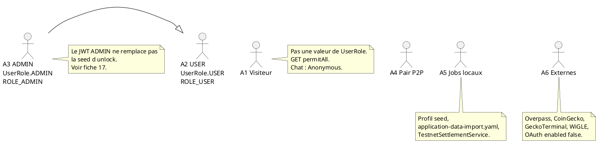

# 16 — Acteurs

## Objectif

Ce fichier est une vue complémentaire, pas un des quatorze diagrammes officiels UML 2.5. Il détaille les acteurs stables A1 à A6 utilisés par le diagramme de cas d'utilisation (fiche 01). Les identifiants ne changent pas d'une fiche à l'autre. GUEST n'est pas un acteur persisté : le commentaire de `UserRole` le décrit comme non authentifié et non enregistré, et l'enum ne contient que `USER` et `ADMIN`.

## Statut

Confirmé par le code.

## Sources analysées

- Mémo, section acteurs.
- `UserRole.java`.
- `AuthenticatedUser` : autorité `ROLE_` + nom du rôle.
- `SecurityConfig` (`permitAll`, `authenticated`).
- `ChatService.ANONYMOUS_AUTHOR`.
- `AdminUnlockService`, propriété `dartchain.admin.seed-sha256`.
- `WebSocketConfig`, `PeerController`.
- `application-seed.yaml`, `application-data-import.yaml`, `m4t3r/settlement/TestnetSettlementService.java`.
- `OverpassProxyController`, `CryptoRatesProxyService`, `WiglePointsService`, clés OAuth de `application.yaml`.

## Éléments représentés

- A1 Visiteur.
- A2 USER.
- A3 ADMIN.
- A4 Pair P2P.
- A5 Jobs locaux.
- A6 Systèmes externes.
- Relation : A3 satisfait les contrôles prévus pour A2 (`isAtLeast(USER)`), sans absorber le déverrouillage seed.

## Diagramme

## Explication

A1 est toute personne ou client HTTP sans compte résolu. `BearerTokenAuthenticationFilter` laisse la requête continuer si `resolveAccount` ne renvoie personne. `SecurityConfig` ouvre alors les GET (`GET /**`), les préflights `OPTIONS /**`, les WebSocket `/ws/**`, les POST d'inscription et de login, le refresh et l'échange OAuth v1, le unlock admin, les POST wallet listés, l'actuator health/info, le chat showcase en POST et DELETE, le trail pickup M4T3R, Overpass, et les inquiries de placement. Le chat anonyme enregistre l'auteur `Anonymous` (`ChatService.ANONYMOUS_AUTHOR`). A1 n'a pas de ligne `users`.

A2 est un compte dont `UserRole` vaut `USER`. À l'inscription, `resolveBootstrapRole` ne renvoie `ADMIN` que si le username égale `AuthProperties.getBootstrapAdminUsername()` (propriété `dartchain.auth.bootstrap-admin-username`). Sinon le rôle est `USER`, qui est aussi le défaut de la colonne `users.role`. L'autorité Spring construite par `AuthenticatedUser` est `ROLE_USER`. Les mutations qui appellent `authorizeMutation` ou `requireAuthenticatedAccount` visent cet acteur : pending, mine, faucet claim, quêtes, swap, liaison de wallet. Le mot de passe a une longueur minimale 6 (`dartchain.auth.password-min-length`). Le hash n'est pas recopié : [SECRET MASQUÉ].

A3 est un compte `UserRole.ADMIN`, autorité `ROLE_ADMIN`. `isAtLeast(USER)` est vrai pour ADMIN, donc les gardes `requireUser` laissent passer A3. `requireAdmin` et `CommunityFaqService.updateStatus` exigent exactement `ADMIN`. A3 n'est pas, à lui seul, le détenteur du panneau admin seed. `POST /api/v1/admin/unlock` est `permitAll` et compare un SHA-256 à `dartchain.admin.seed-sha256` ([SECRET MASQUÉ]). Le jeton `X-Admin-Unlock-Token` peut donc exister sans que le JWT porte `ROLE_ADMIN`, et l'inverse est vrai aussi. La fiche 17 sépare ces deux preuves.

A4 est un autre nœud DartChain. Le contrat HTTP est `PeerController` sous `/api/peers` (liste, stats, ajout, reconnect, disconnect). Le contrat temps réel est `/ws/peers` et `PeerSocketHandler`. Le profil compose `p2p` (`backend-p2p-a`, `backend-p2p-b`, `postgres-a`, `postgres-b`) est le déploiement qui donne un support à cet acteur. Ce n'est pas un utilisateur de la SPA, même si le dock a un onglet peers pour qu'A2 pilote des connexions.

A5 regroupe des traitements dans le processus backend, pas des personnes. Le profil Spring `seed` (`application-seed.yaml`), le fichier `application-data-import.yaml` et `TestnetSettlementService` (règlement M4T3R) sont les trois traitements locaux identifiés dans le backend. Ils ne passent pas par `AuthV1Controller`. Les dessiner comme des cron externes serait faux.

A6 regroupe les systèmes hors dépôt que le backend appelle ou pourrait appeler. Overpass via `OverpassProxyService`. CoinGecko et GeckoTerminal via `CryptoRatesProxyService`. WiGLE via `WiglePointsService`, avec `dartchain.wigle.mock-enabled: true` par défaut. OAuth : google, meta, apple, microsoft, github, x, discord, chacun `enabled` faux par défaut. Le provisionnement réel des clients OAuth n’est pas dans le dépôt : les drapeaux `OAUTH_*_ENABLED` sont faux par défaut. A6 n'inclut pas une banque ni un mainnet.

Le site compagnon `dartchainReview` (`io.dartchain.review`, H2, JWT toujours `ROLE_USER`, sans wallet ni bloc) n'est aucun de ces acteurs. C'est un autre arbre.

## Correspondance avec le code

| Acteur | Ancrage |
| --- | --- |
| A1 | `SecurityConfig` permitAll, `ChatService.ANONYMOUS_AUTHOR` |
| A2 | `UserRole.USER`, `AuthenticatedUser` préfixe `ROLE_` |
| A3 | `UserRole.ADMIN`, `RoleAuthorizationService.requireAdmin` |
| A4 | `PeerController`, `PeerSocketHandler`, `/ws/peers` |
| A5 | `application-seed.yaml`, `application-data-import.yaml`, `TestnetSettlementService` |
| A6 | Overpass, `CryptoRatesProxyService`, `WiglePointsService`, `dartchain.oauth` |

`UserRole.fromValue` renvoie `USER` si la chaîne est vide ou inconnue. Un rôle illisible en base ne devient pas un septième acteur.

## Hypothèses

- A1 peut être un navigateur, un curl ou un pair qui ne s'est pas authentifié. Le diagramme ne crée pas un acteur par user-agent.
- La généralisation A3 vers A2 décrit `isAtLeast`, pas un héritage de comptes en base. Un admin est une ligne `users` avec `role = ADMIN`.
- A5 est confirmé par les noms de profils et de service. Le corps de `TestnetSettlementService` n'est pas redessiné ici.

## Anomalies détectées

- GUEST est documenté en commentaire et absent de l'enum. Un client qui enverrait `role=GUEST` serait relu comme `USER` par `fromValue` (valeur inconnue).
- A3 JWT et le détenteur de seed sont deux acteurs opérationnels souvent confondus. Le modèle n'a qu'un seul A3 pour le rôle, et le seed n'a pas d'id A.
- A6 OAuth est déclaré et désactivé. A6 WiGLE est mocké.
- `GET /**` donne à A1 presque toutes les lectures, y compris des ressources qu'un écran présente comme « le compte ».
- Le README ne présente pas A4 (`/ws/peers` omis) ni le panneau admin frontend.

## Recommandations

- Conserver les ids A1–A6 dans les user stories (fiche 19) et les exigences (fiche 20).
- Nommer explicitement « détenteur de seed » quand le sujet est `AdminUnlockService`, plutôt que de le rabattre sur A3.
- Ne pas ajouter d'acteur « porteur de carte » ou « validateur mainnet ».
