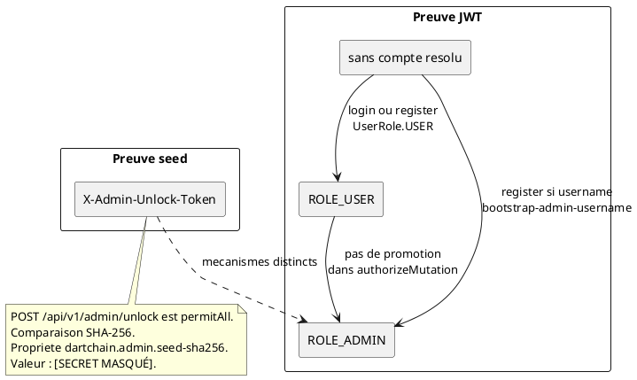
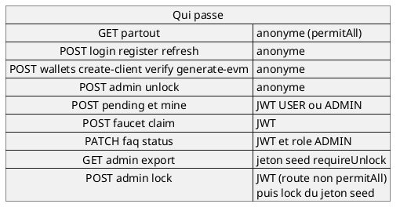

# 17 — Rôles et permissions

## Objectif

Ce fichier est une vue complémentaire, pas un des quatorze diagrammes officiels UML 2.5. Elle sépare trois mécanismes que le code ne mélange pas : l'absence de JWT (lectures `GET /**` en `permitAll`), le rôle porté par le JWT (`USER` ou `ADMIN`, autorités `ROLE_USER` et `ROLE_ADMIN`), et le déverrouillage admin par seed SHA-256 (jeton `X-Admin-Unlock-Token`, propriété `dartchain.admin.seed-sha256`).

## Statut

Partiellement confirmé.

## Sources analysées

- `UserRole`, `AuthenticatedUser.getAuthorities`.
- `SecurityConfig` (liste `permitAll` et `anyRequest().authenticated()`).
- `RoleAuthorizationService` : `requireAuthenticated`, `requireUser`, `requireAdmin`, `authorizeMutation`.
- `AuthService.resolveBootstrapRole`, `ensureWalletOwnership`, `requireAuthenticatedAccount`.
- `AdminV1Controller`, `AdminUnlockService` (`UNLOCK_HEADER`, `unlock`, `requireUnlock`, `lock`).
- `CommunityFaqService.updateStatus`.
- `application.yaml` : `legacy-session-enabled: false`, `password-min-length: 6`, `unlock-ttl-seconds`.

La valeur de seed et le secret JWT ne sont pas recopiés : [SECRET MASQUÉ].

## Éléments représentés

- Enum persisté : `USER`, `ADMIN`.
- Autorités : `ROLE_USER`, `ROLE_ADMIN`.
- Bootstrap : username égal à `dartchain.auth.bootstrap-admin-username` reçoit `ADMIN` à l'inscription.
- Matrice courte : anonyme / USER / ADMIN / jeton seed.
- Routes publiques explicites autres que `GET /**`.

## Diagramme

### Matrice lue dans le code

La syntaxe `map` est un aide-mémoire. La norme de la fiche reste le texte ci-dessous si le rendu `map` n'est pas disponible.

## Explication

Le JWT d'accès est créé par `NativeJwtService.createAccessToken(userId, role)`. Le claim `role` est `USER` ou `ADMIN`. `AuthTokenResolver` recharge le `UserAccount` par `sub`, et `AuthenticatedUser` expose `ROLE_` concaténé au nom de l'enum. Il n'y a pas d'autorité `ROLE_GUEST`. `legacy-session-enabled` est faux : un identifiant de session opaque ne devient pas un rôle.

`GET /**` est `permitAll`. Toute lecture HTTP passe le filtre d'autorisation Spring sans rôle. Cela couvre la chaîne, l'explorer, la config faucet, l'état faucet par wallet, les claims faucet (le contrôleur rappelle ensuite `requireAuthenticatedAccount`), le statut admin, l'export admin (le contrôleur rappelle `requireUnlock`), les news, la FAQ, la santé `/api/health` et `/api/v1/health`, le snapshot ops en GET, et `GET /`. Le rôle ne protège pas ces URL au niveau de la chaîne de filtres. La protection éventuelle est dans la méthode.

Les écritures qui ne sont pas listées en `permitAll` exigent un compte (`anyRequest().authenticated()`). `authorizeMutation` appelle `requireUser`, et `isAtLeast(USER)` accepte ADMIN. Le mine pending et la création de pending sont dans ce cas. La création vérifie en plus `ensureWalletOwnership` sur `fromAddress`. Le mine par id ne le fait pas.

`requireAdmin` compare le rôle à `ADMIN` et journalise un refus RBAC sinon. `CommunityFaqService.updateStatus` fait la même comparaison et lève 403 « Rôle administrateur requis ». C'est le seul usage admin lu pour la FAQ. Le vote FAQ exige un utilisateur authentifié et refuse une question `ARCHIVED`, sans exiger `ADMIN`.

Le seed est un second facteur de panneau, pas un rôle. `POST /api/v1/admin/unlock` est `permitAll`. `AdminUnlockService.unlock` normalise la phrase, calcule un SHA-256 et le compare à `properties.getSeedSha256()` (propriété `dartchain.admin.seed-sha256`). En cas de succès, un UUID est mis en mémoire avec une échéance `unlock-ttl-seconds` (défaut 3600). L'en-tête s'appelle `X-Admin-Unlock-Token`. `GET /api/v1/admin/export` appelle `requireUnlock` sur cet en-tête. Il ne lit pas `UserRole`. `GET /api/v1/admin/status` ne demande ni JWT ni seed : il dit si la seed est configurée (`isConfigured` : présence d'une chaîne de 64 caractères), et liste des domaines et des formats. `POST /api/v1/admin/lock` n'est pas `permitAll`, donc Spring demande un JWT, puis `lock` retire le token seed de la map s'il est fourni. `lock` n'appelle pas `requireAdmin`.

Les POST publics hors GET, confirmés dans `SecurityConfig`, sont : register et login (`/api/auth` et `/api/v1/auth`), refresh, oauth exchange, admin unlock, oauth apple callback, wallets `create`, `verify`, `create-client`, `generate-evm`, chat messages POST et DELETE, trail pickup, overpass, inquiries de placement. `POST /api/wallets/create` n'a pas de méthode de contrôleur. `allow-server-wallet-create` est faux. `allow-server-evm-wallet-create` est vrai, et `POST /api/v1/wallets/generate-evm` existe.

Le rate limit (60 / 60000 ms) s'applique via `RateLimitFilter` sans être un rôle. Les seuils ops (mempool 50, erreurs HTTP 10, requête lente 2000 ms, rbac denied 20) sont des alertes, pas des permissions.

## Correspondance avec le code

| Règle | Code |
| --- | --- |
| Rôles | `UserRole.USER`, `UserRole.ADMIN` |
| Autorité | `AuthenticatedUser`, préfixe `ROLE_` |
| Lectures | `SecurityConfig` `GET /**` permitAll |
| Mutations JWT | `RoleAuthorizationService.authorizeMutation` |
| Admin JWT | `requireAdmin`, `CommunityFaqService.updateStatus` |
| Seed | `AdminUnlockService`, en-tête `X-Admin-Unlock-Token` |
| Export | `AdminV1Controller.export` → `requireUnlock` |
| Bootstrap ADMIN | `AuthService.resolveBootstrapRole` |

## Hypothèses

- Le statut « partiellement confirmé » porte sur la matrice : chaque case citée a été lue, mais toutes les méthodes de tous les contrôleurs n'ont pas été ouvertes pour une revue ligne à ligne des `requireAdmin`.
- Un GET qui rappelle `requireAuthenticatedAccount` (claims faucet) est à la fois permitAll au filtre et authentifié dans la méthode. La matrice le signale pour l'export et les claims ; le même motif peut exister ailleurs.
- Le mot de passe bootstrap (`dartchain.auth.bootstrap-admin-password`) n'est pas une permission. Il n'est pas recopié.

## Anomalies détectées

- Seed et `ROLE_ADMIN` sont deux portes. L'export dépend de la seed. Le statut FAQ dépend du rôle. Le lock dépend d'un JWT quelconque plus d'un header optionnel.
- `GET /**` permitAll rend l'export joignable sans JWT, la seed restant le contrôle applicatif. Le statut admin est joignable sans aucun des deux.
- `POST /api/wallets/create` est autorisé par la chaîne et sans mapping.
- `fromValue` inconnu retombe sur `USER`, donc une valeur de rôle corrompue élargit vers USER plutôt que de refuser.
- GUEST n'est pas un rôle. Le traiter comme une permission dans un client serait inexact.
- `requireFaucet()` ne consulte pas le drapeau produit : la permission faucet n'est pas le drapeau `faucet-enabled`.

## Recommandations

- Dans le frontend, séparer `admin-seed-session.service.ts` (header unlock) et le rôle renvoyé par `/api/v1/auth/me`.
- Ne pas documenter l'export comme « réservé ADMIN » tant que `export` n'appelle pas `requireAdmin`.
- Réduire `GET /**` si des lectures doivent suivre le rôle. Aujourd'hui la fermeture est dans quelques méthodes seulement.
- Masquer seed, JWT et mot de passe bootstrap dans tout export collé à une fiche : [SECRET MASQUÉ].
