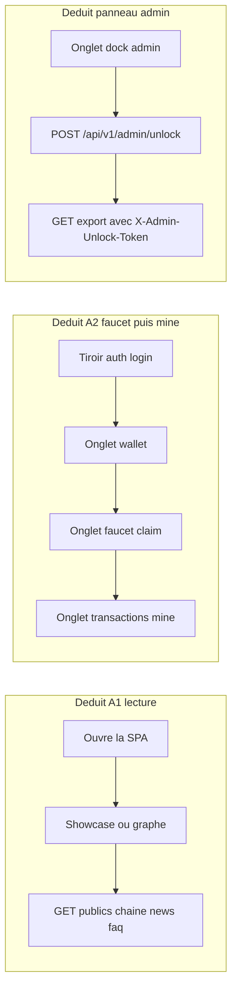

# 18 — Parcours utilisateurs

## Objectif

Ce fichier est une vue complémentaire, pas un des quatorze diagrammes officiels UML 2.5. Le fait de navigation confirmé est étroit : `app.routes.ts` exporte `routes` vide, et `app.html` compose une seule page. Les zones dock, showcase, wallet et métavers sont des composants de ce shell. Les parcours détaillés d'écrans (ordre des clics, succès, erreurs) sont déduits de ces zones et des services HTTP. Ils ne sont pas un journal d'usage ni un fichier de spécification d'écrans du dépôt.

## Statut

Déduit du projet.

## Sources analysées

- `apps/dartchain-frontend/Dart/src/app/app.routes.ts` : `export const routes: Routes = [];`
- `app.html` : shell, navbar, showcase, dock, graphe, `app-three-floor`, scène R4V3 conditionnelle, tiroirs, `app-auth-drawer`.
- `environment.ts` : `starConquestEnabled: false`. `app.html` n’affiche Star Conquest que si le flag est vrai.
- `BottomDockTab` dans `dock-navigation.service.ts` : `wallet`, `faucet`, `transactions`, `chain`, `quests`, `peers`, `admin`.
- `dock-tabs-shell.component.html` : panneaux `app-wallet-panel`, `app-faucet`, `app-quests-panel`, `app-admin-panel`, onglet peers.
- `ShowcaseTab` : `tours`, `r4v3`, `rv23`, `dao`, `daonews`, `market`.
- Services HTTP lus : auth, blockchain, faucet, quêtes, showcase, wallet, admin seed, ops, métavers.

Aucun fichier de parcours ou de cahier d'écrans n'a été utilisé comme source. Le README confirme la SPA une page.

## Éléments représentés

- Un seul shell, sans route Angular.
- Zones toujours montées ou conditionnelles.
- Onglets dont les ids sont dans le code.
- Trois parcours déduits : visiteur qui lit, utilisateur qui claim puis mine, admin seed. Chaque parcours est étiqueté déduit.

## Diagramme

```mermaid
flowchart TD
  subgraph shell [Shell unique app.html]
    routes["app.routes.ts : tableau vide"]
    nav[Navbar et bandeau]
    show[Showcase]
    dock[Dock]
    graph[Graphe]
    floor[app-three-floor metaverse]
    authDrawer[Tiroir auth]
    blockDrawer[Tiroir detail de bloc]
  end
  routes --> shell
  show --> tabsShow["Onglets: tours, r4v3, rv23, dao, daonews, market"]
  dock --> tabsDock["Onglets: wallet, faucet, transactions, chain, quests, peers, admin"]
  tabsDock --> wallet[app-wallet-panel]
  tabsDock --> faucet[app-faucet si faucetEnabled]
  floor --> arena[Arene et carte world-map]
```

Parcours détaillés, déduits des composants et des endpoints, pas observés comme scripts e2e (aucun Playwright ni Cypress identifié) :



## Explication

La navigation confirmée tient en une phrase : il n'y a pas de changement de route. `routes` est un tableau vide. Le lien `wrangler.toml` `not_found_handling = "single-page-application"` sert le `index.html` pour toute URL Pages, mais le routeur Angular ne découpe pas ces URL en pages. Un parcours « écran login puis écran wallet » est donc un changement d'état dans le shell (tiroir, onglet, collapse), pas un `Router.navigate`.

`app.html` monte, dans l'ordre du template : lien d'évitement, fond, éventuellement Star Conquest si `product.starConquestEnabled` (le flag d'environnement est faux, donc cette branche ne s'affiche pas avec le fichier lu), la navbar et son bandeau, le `main` (swap, showcase, dock, graphe), `app-three-floor`, éventuellement `app-r4v3-scene` si `r4v3SceneVisible()`, un bandeau d'erreur, le tiroir de bloc, le tiroir de formulaire launch, un retour de quête, le tiroir d'auth et un HUD de performance. Showcase et dock peuvent être repliés (`showcaseCollapsed`, `dockCollapsed`). Le faucet du dock est entouré de `product.faucetEnabled`.

Les ids d'onglets sont du code, pas une déduction. Le dock : wallet, faucet, transactions, chain, quests, peers, admin. Des alias legacy `pending` et `block` existent sur `LegacyBottomDockTab` et sont redirigés vers transactions ou chain par `dock-navigation.service.ts`. Le showcase : CHAT (`rv23`), D.A.O (`daonews`), LABZ (`dao`), MARCHÉ (`market`), R4V3 (`r4v3`), TOUS (`tours`), d'après `SHOWCASE_TABS`. L'onglet marché du showcase n'est pas le composant `app-swap` du `main` : les deux sont présents dans le template.

Le métavers visible dans le shell est `app-three-floor`, plus les modules `metaverse` et `world-map` (arène, carte). Les appels associés, s'ils partent, visent Overpass, les placements, WiGLE, l'arène et le trail M4T3R. L'ordre dans lequel un joueur ouvre l'arène n'est pas fixé par une route. Le parcours « marcher puis ramasser une pièce puis claim » est déduit du fait que `FaucetServiceImpl` refuse un claim sans solde pending (« ramassez des pièces d'abord ») et que `POST /api/m4t3r/trail-pickup` existe. Ce n'est pas un storyboard validé.

Le parcours auth est déduit du tiroir `app-auth-drawer` et de `auth.service.ts` / `auth-token-refresh.ts` : login `POST /api/v1/auth/login` ou legacy `/api/auth/login`, puis header Bearer. Le parcours admin est déduit de l'onglet dock `admin`, de `admin-panel` et des services `admin-seed-session.service.ts` et `admin-export-client.service.ts`, alignés sur `POST /api/v1/admin/unlock` et `GET /api/v1/admin/export`. Le rôle JWT `ADMIN` et la seed restent deux gestes (fiche 17).

Star Conquest ne fait pas partie du parcours par défaut. Le README le dit live. Le flag est faux. Aucun e2e n'a été trouvé pour trancher un parcours réel.

## Correspondance avec le code

| Zone | Fichier |
| --- | --- |
| Routes vides | `src/app/app.routes.ts` |
| Shell | `src/app/app.html` |
| Onglets dock | `dock-navigation.service.ts`, `dock-tabs-shell.component.html` |
| Onglets showcase | `showcase/models/showcase-tab.model.ts` |
| Wallet | `wallet/wallet-panel/wallet-panel.ts` dans le dock |
| Métavers | `app-three-floor`, dossier `metaverse/` |
| Auth UI | `app-auth-drawer` |
| Admin UI | `admin/admin-panel` |

## Hypothèses

- Tout enchaînement de plus d'un onglet est déduit. Le statut de la fiche est donc « Déduit du projet », même si le shell et les ids d'onglets sont confirmés.
- `app-swap` dans le `main` et l'onglet showcase `market` peuvent afficher des données proches (`/api/swap`, `/api/exchange-panel`, `/api/crypto-rates`). Le template ne dit pas qu'ils sont le même composant.
- Le working tree modifie le showcase et ajoute `depth-rail` non suivi. Un parcours qui citerait `depth-rail` comme étape du HEAD `0690e34` serait en avance sur le commit.

## Anomalies détectées

- Routes vides et repli SPA Pages : une URL profonde ne sélectionne pas un onglet.
- Star Conquest documenté live, flag faux, composant absent du parcours réel.
- Faucet : le backend `requireFaucet()` est vide, le dock masque l'onglet avec `faucetEnabled`. Les deux bords ne racontent pas la même garde.
- Admin UI et README : le README omet l'admin frontend, alors que l'onglet `admin` est dans le dock.
- Aucun parcours e2e versionné. Les parcours détaillés ne sont pas une spec testée.

## Recommandations

- Si des URL doivent ouvrir un onglet, les introduire dans `routes` et mettre à jour cette fiche. Tant que le tableau est vide, décrire des zones, pas des pages.
- Marquer tout schéma de clics futur comme déduit ou comme test, pour ne pas le faire passer pour le routeur.
- Aligner le flag Star Conquest et le README avant d'ajouter un parcours « conquête ».
