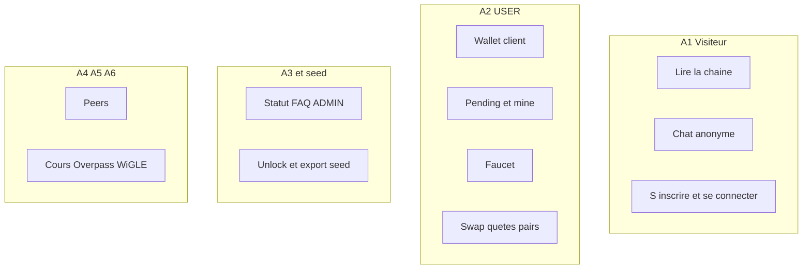

# 19 — User stories

## Objectif

Ce fichier est une vue complémentaire, pas un des quatorze diagrammes officiels UML 2.5. Les stories sont formulées à partir des endpoints et des acteurs A1 à A6. Elles sont déduites : le dépôt ne contient pas de fichier user-stories (recherche `user-stories*` vide). Ce ne sont pas des engagements de produit recopiés d'un backlog.

## Statut

Déduit du projet.

## Sources analysées

- Contrôleurs et mappings listés pour les fiches 01 et 20.
- Acteurs A1–A6, fiche 16.
- Absence de fichier user-stories dans `/home/azertyuiop/dev/dartchain`.
- `app.routes.ts` vide : aucune story ne promet une URL d'écran Angular.

Chaque story cite l'endpoint qui la justifie. Si l'endpoint est un GET public, la story le dit.

## Éléments représentés

Stories déduites, groupées par acteur. Le diagramme mermaid est un index. Le texte est la formulation.

## Diagramme

## Explication

Formulations déduites. Le « je » est l'acteur. La source est l'endpoint, pas un ticket.

**A1 — Visiteur**

- En tant que visiteur, je consulte la chaîne, les blocs, les stats, la validité et le mempool, afin de suivre la démo sans compte. Sources : `GET /api/blockchain/**`, `GET /api/v1/blockchain/**`, `GET /api/blocks`, `GET /api/explorer/search`, `GET /api/explorer/blocks`, et les miroirs v1. Ces GET sont `permitAll`.
- En tant que visiteur, je lis la config de chaîne. Source : `GET /api/v1/chain/config` (`ChainV1Controller`).
- En tant que visiteur, je publie ou supprime un message de chat showcase sous l'auteur `Anonymous`. Sources : `POST` et `DELETE /api/showcase/chat/messages`, `ChatService.ANONYMOUS_AUTHOR`.
- En tant que visiteur, je crée un compte puis j'ouvre une session JWT. Sources : `POST /api/v1/auth/register`, `POST /api/v1/auth/login`, et les alias `POST /api/auth/register`, `POST /api/auth/login`.
- En tant que visiteur, je renouvelle l'accès avec un refresh token. Source : `POST /api/v1/auth/refresh` seulement. `AuthController` n'a pas cette route.
- En tant que visiteur, je vois les fournisseurs OAuth et je peux échanger un code si un fournisseur est activé. Sources : `GET /api/v1/auth/oauth/providers`, `GET /api/v1/auth/oauth/connect/{providerId}`, callback, `POST /api/v1/auth/oauth/exchange`. Défaut : `enabled` faux. La story d'un login social réel n'est pas tenue par le dépôt seul.
- En tant que visiteur, je demande un proxy Overpass et une inquiry de placement. Sources : `POST /api/metaverse/overpass`, `POST /api/metaverse/placements/{id}/inquiries`.
- En tant que visiteur, je signale un ramassage de piste M4T3R. Source : `POST /api/m4t3r/trail-pickup` en `permitAll`.

**A2 — USER**

- En tant qu'utilisateur connecté, je lis mon profil et je me déconnecte. Sources : `GET /api/v1/auth/me`, `POST /api/v1/auth/logout` (et alias `/api/auth`). Logout côté filtre : la route POST n'est pas `permitAll`, donc un JWT est exigé par Spring. Le service révoque le refresh s'il est fourni.
- En tant qu'utilisateur, je lie un wallet à mon compte. Source : `PUT /api/v1/auth/me/wallet` et alias `/api/auth/me/wallet`.
- En tant qu'utilisateur, je fais enregistrer un wallet créé côté client et je le fais vérifier. Sources : `POST /api/wallets/create-client`, `POST /api/wallets/verify`. Ces POST sont `permitAll`. La story « le serveur crée le wallet » n'est pas celle de `WalletController` : `allow-server-wallet-create` est faux et `POST /api/wallets/create` n'a pas de mapping.
- En tant qu'utilisateur, je génère un wallet EVM côté serveur. Source : `POST /api/v1/wallets/generate-evm`. Propriété `allow-server-evm-wallet-create: true`.
- En tant qu'utilisateur, je soumets une transaction pending depuis mon wallet puis je la mine. Sources : `POST /api/pending-transactions` (avec `ensureWalletOwnership`), `POST /api/pending-transactions/{id}/mine`.
- En tant qu'utilisateur, je mine le mempool à une adresse. Sources : `POST /api/blockchain/mine`, `POST /api/blockchain/mine/{minerAddress}`.
- En tant qu'utilisateur, je dépose une transaction sur `POST /api/transactions`. Source : `TransactionController`.
- En tant qu'utilisateur authentifié, je claim le faucet pour mon wallet si `nextEligibleAt` est passé et s'il reste des M4T3R pending. Source : `POST /api/faucet/claim`. Story déduite aussi de `FaucetServiceImpl`, pas seulement du contrôleur.
- En tant qu'utilisateur, je consulte et j'avance les quêtes, y compris le claim de tâche, de mission et de semaine. Sources : `GET /api/quests/catalog`, `GET /api/quests/state`, `POST /api/quests/progress`, `POST /api/quests/explore-block`, `POST /api/quests/tasks/{taskId}/claim`, `POST /api/quests/mission/claim`, `POST /api/quests/weekly/claim`.
- En tant qu'utilisateur, je consulte le panneau de swap et j'envoie un swap. Sources : `GET` et `POST /api/swap`, `GET /api/exchange-panel`, `POST /api/exchange-panel/swap`.
- En tant qu'utilisateur, je lis les cours proxifiés. Sources : `GET /api/crypto-rates/panels`, `/panels/batch`, `/panels/native`, `/search`, `/chart`.
- En tant qu'utilisateur, je gère des pairs depuis le dock. Sources : `GET /api/peers`, `GET /api/peers/stats`, `POST /api/peers`, `POST /api/peers/reconnect`, `POST /api/peers/disconnect`. Le socket `/ws/peers` sert l'acteur A4 ; l'onglet peut être utilisé par A2. La story ne décide pas qui est le pair distant.
- En tant qu'utilisateur, je lis news, FAQ, chart, bannière, graphe, projets launch et fiche R4V3. Sources : contrôleurs `Showcase*`, `GraphController`, `BannerController`.
- En tant qu'utilisateur, je vote sur une FAQ non archivée. Source : `POST /api/showcase/faq/questions/{id}/vote`.
- En tant qu'utilisateur, je rejoins l'arène, je lis l'état et le classement. Sources : `POST /api/metaverse/arena/session/join`, `POST .../leave`, `GET .../state`, `GET .../leaderboard`, `POST .../events/elimination`, socket `/ws/metaverse-arena`.
- En tant qu'utilisateur, je lis mon personnage. Source : `GET /api/v1/characters/me`.

**A3 — ADMIN JWT**

- En tant qu'administrateur JWT, je change le statut d'une question FAQ parmi `ACTIVE`, `PINNED`, `ARCHIVED`. Source : `PATCH /api/showcase/faq/questions/{id}/status` et `CommunityFaqService.updateStatus`.

**Détenteur de seed (pas le rôle JWT)**

- En tant que détenteur de la seed, je déverrouille le panneau, j'exporte un bundle et je verrouille. Sources : `POST /api/v1/admin/unlock`, `GET /api/v1/admin/export` (`requireUnlock`), `POST /api/v1/admin/lock`. `GET /api/v1/admin/status` est lisible sans cette seed. La story ne dit pas que `ROLE_ADMIN` suffit à l'export : le code ne le fait pas.

**A4, A5, A6**

- En tant que pair, j'échange sur `/ws/peers` et les routes `/api/peers`. Source : `PeerSocketHandler`, `PeerController`.
- En tant que job local, le processus applique le profil `seed`, l'import `application-data-import.yaml` ou `TestnetSettlementService`. Pas d'endpoint HTTP unique déduit pour les résumer.
- En tant que système externe, Overpass, CoinGecko, GeckoTerminal et WiGLE répondent aux proxies. WiGLE est mocké par défaut. OAuth est désactivé par défaut.

Stories explicitement non écrites, parce qu'aucun endpoint ne les porte : paiement carte, transfert mainnet, déploiement de contrat Solidity, synchronisation Star Conquest (flag frontend faux), tableau Prometheus.

## Correspondance avec le code

Chaque story ci-dessus nomme son contrôleur ou son chemin. Le regroupement par acteur reprend la fiche 16. Le double préfixe `/api` et `/api/v1` est conservé là où les deux contrôleurs existent (`AuthController` et `AuthV1Controller`, `BlockchainController` et `BlockchainV1Controller`, explorer, ops, health).

## Hypothèses

- Le format « en tant que » est une formulation documentaire. Le code n'a pas de critère d'acceptation.
- « Afin de » est omis quand le but n'est pas écrit dans le dépôt. Le but n'a pas été inventé au-delà du verbe de l'endpoint (consulter, claim, miner, exporter).
- Les stories A2 sur des POST `permitAll` (wallets, overpass, trail) restent classées A1 ou A2 selon que le contrôleur redemande un compte. `create-client` est classé utilisateur parce que le domaine est le wallet, tout en restant callable sans JWT au filtre.

## Anomalies détectées

- Pas de backlog dans le repo. Ces stories ne doivent pas être citées comme des exigences signées. La fiche 20 est la liste traçable.
- Refresh uniquement en v1 : une story écrite seulement sur `/api/auth` serait fausse.
- Export admin classé à tort sous `ROLE_ADMIN` contredirait `requireUnlock`.
- `POST /api/wallets/create` ne donne pas de story : pas de méthode.
- Star Conquest « live » dans le README ne donne pas de story serveur.

## Recommandations

- Si un backlog est ajouté, reprendre ces identifiants implicites (A1 lecture, A2 mine, seed export) et les lier aux EF de la fiche 20.
- Ne pas convertir une story déduite en test e2e sans sélecteur réel : les routes Angular sont vides, les tests UI existants sont des specs Vitest.
- Garder la seed hors des stories « administrateur JWT ».
