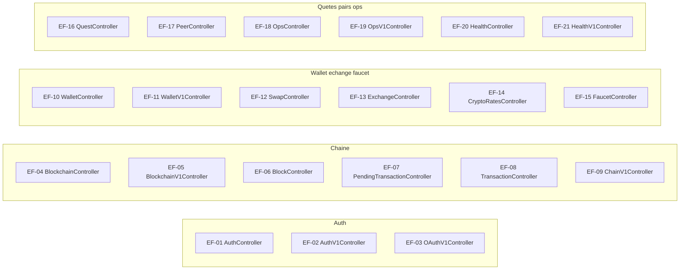

# 20 — Exigences fonctionnelles

## Objectif

Ce fichier est une vue complémentaire, pas un des quatorze diagrammes officiels UML 2.5. Il liste des exigences fonctionnelles EF dont chacune pointe vers un contrôleur et un chemin réels. La formulation est une lecture de l'API, pas un cahier des charges séparé : aucun fichier d'exigences n'a été trouvé comme source. Une capacité absente du code (paiement carte, contrat Solidity, mainnet, Star Conquest serveur) n'a pas d'EF.

## Statut

Partiellement confirmé.

## Sources analysées

- Les 42 contrôleurs et leurs `@RequestMapping` / `@GetMapping` / `@PostMapping` / `@PutMapping` / `@PatchMapping` / `@DeleteMapping`.
- `ApiRoutes` pour les préfixes v1.
- `SecurityConfig` pour le rappel permitAll ou authentifié, sans refaire la matrice de la fiche 17.
- `WebSocketConfig` pour les quatre canaux, qui ne sont pas des contrôleurs REST mais des EF de transport.

Le statut est partiellement confirmé : les chemins le sont, les numéros EF sont un index documentaire.

## Éléments représentés

Index EF-01 à EF-40 pour quarante contrôleurs, EF-04b et EF-05b pour `ExplorerController` et `ExplorerV1Controller` (les 42 contrôleurs), EF-41 pour les quatre WebSocket, EF-42 pour les sondes health. Le détail des verbes est dans l'explication.

## Diagramme

La suite du graphe (showcase, métavers, admin, contrat) est dans la liste : un seul dessin de 43 boîtes serait illisible.

## Explication

Chaque EF est : le système fournit les opérations suivantes. Rien n'est ajouté au-delà des mappings lus.

**Auth**

- EF-01. `AuthController` `/api/auth` : `POST /register` (201), `POST /login`, `POST /logout`, `GET /me`, `PUT /me/wallet`.
- EF-02. `AuthV1Controller` `/api/v1/auth` : les mêmes opérations, plus `POST /refresh`.
- EF-03. `OAuthV1Controller` `/api/v1/auth/oauth` : `GET /providers`, `GET /connect/{providerId}`, `GET /connect/{providerId}/callback`, `POST /connect/apple/callback`, `POST /exchange`.

**Chaîne**

- EF-04. `BlockchainController` `/api/blockchain` : `GET /balance/{address}`, `GET /chain`, `GET /blocks`, `GET /blocks/latest`, `GET /stats`, `GET /valid`, `GET /pending`, `POST /mine`, `POST /mine/{minerAddress}`.
- EF-05. `BlockchainV1Controller` `/api/v1/blockchain` : `GET /chain`, `/stats`, `/valid`, `/blocks`, `/blocks/latest`, `/pending`. Pas de POST mine sur ce contrôleur.
- EF-06. `BlockController` `/api/blocks` : `GET`, `GET /latest`, `POST`, `GET /validate`, `POST /validate`.
- EF-07. `PendingTransactionController` `/api` : `GET /pending-transactions`, `POST /pending-transactions`, `POST /pending-transactions/{id}/mine`.
- EF-08. `TransactionController` `/api` : `POST /transactions`.
- EF-09. `ChainV1Controller` `/api/v1/chain` : `GET /config`.

**Wallet, exchange, faucet**

- EF-10. `WalletController` `/api/wallets` : `POST /create-client`, `POST /verify`. Il n'existe pas d'EF « POST /create » : la route est permitAll et sans méthode.
- EF-11. `WalletV1Controller` `/api/v1/wallets` : `POST /generate-evm`.
- EF-12. `SwapController` `/api/swap` : `GET`, `POST`.
- EF-13. `ExchangeController` `/api/exchange-panel` : `GET`, `POST /swap`.
- EF-14. `CryptoRatesController` `/api/crypto-rates` : `GET /panels`, `/panels/batch`, `/panels/native`, `/search`, `/chart`.
- EF-15. `FaucetController` `/api/faucet` : `GET /config`, `GET /state/{walletAddress}`, `POST /claim` (201), `GET /claims`. Le claim persiste `walletAddress`, `amount`, `nextEligibleAt` (fiche 06).

**Quêtes, pairs, ops**

- EF-16. `QuestController` `/api/quests` : `GET /catalog`, `GET /state`, `POST /progress`, `POST /explore-block`, `POST /tasks/{taskId}/claim`, `POST /mission/claim`, `POST /weekly/claim`.
- EF-17. `PeerController` `/api/peers` : `GET`, `GET /stats`, `POST`, `POST /reconnect`, `POST /disconnect`.
- EF-18. `OpsController` `/api/ops` : `GET /snapshot`.
- EF-19. `OpsV1Controller` `/api/v1/ops` : `GET /snapshot`.
- EF-20. `HealthController` : `GET /api/health`.
- EF-21. `HealthV1Controller` `/api/v1` : `GET /health`.

**M4T3R et métavers**

- EF-22. `M4t3rTrailController` `/api/m4t3r` : `POST /trail-pickup`, `GET /trail-cells`.
- EF-23. `M4t3rRewardController` `/api/m4t3r/rewards` : `GET /history`, `GET /{rewardId}/verify`.
- EF-24. `OverpassProxyController` `/api/metaverse/overpass` : `POST`.
- EF-25. `PlacementController` `/api/metaverse/placements` : `GET`, `GET /{id}`, `POST /{id}/inquiries`.
- EF-26. `WigleVisualizationController` `/api/metaverse/wigle` : `GET /buildings`, `GET /areas`, `GET /points`.
- EF-27. `ArenaController` `/api/metaverse/arena` : `POST /session/join`, `POST /session/leave`, `GET /state`, `POST /events/elimination`, `GET /leaderboard`.
- EF-28. `CharacterNftController` `/api/v1/characters` : `GET /me`, `GET /{userId}`.

**Showcase**

- EF-29. `ShowcaseR4v3Controller` `/api/showcase/r4v3` : `GET`.
- EF-30. `ShowcaseNewsController` `/api/showcase/news` : `GET`, `GET /{id}`.
- EF-31. `ShowcaseLaunchController` `/api/showcase/launch` : `GET /projects`, `POST /projects`.
- EF-32. `ShowcaseCommunityFaqController` `/api/showcase/faq` : `GET /questions`, `/questions/latest`, `/questions/popular`, `/questions/pinned`, `POST /questions`, `POST /questions/{id}/vote`, `PATCH /questions/{id}/status`.
- EF-33. `ShowcaseChatController` `/api/showcase/chat` : `GET /messages`, `POST /messages`, `DELETE /messages`.
- EF-34. `ShowcaseChartController` `/api/showcase/chart` : `GET`.
- EF-35. `GraphController` `/api/graph` : `GET`.
- EF-36. `BannerController` `/api` : `GET /banner`.

**Admin, contrat, racine**

- EF-37. `AdminV1Controller` `/api/v1/admin` : `GET /status`, `POST /unlock`, `POST /lock`, `GET /export`. L'export exige le jeton seed. Le statut ne l'exige pas.
- EF-38. `ApiContractV1Controller` `/api/v1` : `GET /contract`.
- EF-39. `HelloController` `/api` : `GET /hello`.
- EF-40. `RootController` : `GET /`.

**Transports et garde produit déjà codés**

- EF-41. Le système enregistre quatre canaux dans `WebSocketConfig` : `/ws/peers` (`PeerSocketHandler`), `/ws/live` (`LiveSocketHandler`), `/ws/chat` (`ChatSocketHandler`), `/ws/metaverse-arena` (`ArenaSocketHandler`).
- EF-42. Le système expose l'actuator `health` et `info` en permitAll (`SecurityConfig`). Ce n'est pas un contrôleur métier ; c'est une exigence de sonde confirmée par le healthcheck compose et par Render (`healthCheckPath: /api/health` dans le blueprint, et `/actuator/health` dans le compose).

EF-43 n'est pas créée pour `POST /api/wallets/create`. Une exigence ne peut pas pointer vers une méthode absente.

Hors liste, donc sans EF : paiement, custody bancaire, déploiement `.sol`, réseau mainnet, sync Star Conquest, métriques Prometheus/Grafana, E2E Playwright ou Cypress, contenu de colonnes de `V12__ad_persistence.sql` non relu.

## Correspondance avec le code

| EF | Classe |
| --- | --- |
| EF-01 à EF-03 | `auth.infrastructure.web` |
| EF-04 à EF-08 | `blockchain.infrastructure.web` |
| EF-09 | `chain.infrastructure.web.ChainV1Controller` |
| EF-10 EF-11 | `wallet.infrastructure.web` |
| EF-12 à EF-14 | `exchange.infrastructure.web` |
| EF-15 | `faucet.infrastructure.web.FaucetController` |
| EF-16 | `quests.infrastructure.web.QuestController` |
| EF-17 | `peers.infrastructure.web.PeerController` |
| EF-18 à EF-21 | `ops.infrastructure.web` |
| EF-22 EF-23 | `m4t3r.infrastructure.web` |
| EF-24 à EF-27 | `metaverse` et `metaverse.arena` |
| EF-28 | `character.infrastructure.web.CharacterNftController` |
| EF-29 à EF-36 | `showcase.infrastructure.web` et `BannerController` |
| EF-37 | `admin.infrastructure.web.AdminV1Controller` |
| EF-38 | `api.infrastructure.web.ApiContractV1Controller` |
| EF-39 EF-40 | `shared.infrastructure.web` |
| EF-41 | `shared.config.WebSocketConfig` |
| EF-42 | `SecurityConfig` et healthchecks |

Les préfixes v1 viennent de `ApiRoutes` : `/api/v1`, `/api/v1/auth`, `/api/v1/blockchain`, `/api/v1/explorer` (explorer v1 est inclus dans EF-05 seulement pour la chaîne ; l'explorer a ses propres classes).

Précision explorer, pour ne pas la perdre : `ExplorerController` `/api/explorer` et `ExplorerV1Controller` `/api/v1/explorer` exposent `GET /search` et `GET /blocks`. Ils complètent EF-04 et EF-05. On les rattache ainsi :

- EF-04b. `ExplorerController` : `GET /api/explorer/search`, `GET /api/explorer/blocks`.
- EF-05b. `ExplorerV1Controller` : `GET /api/v1/explorer/search`, `GET /api/v1/explorer/blocks`.

Ce sont les mêmes verbes que le recensement des 42 contrôleurs. Aucun quarante-troisième contrôleur n'est ajouté.

## Hypothèses

- Numéroter un contrôleur par EF est un choix d'index. Plusieurs verbes restent une seule exigence « le contrôleur offre ces opérations », afin de ne pas inventer un objectif métier par verbe.
- EF-41 et EF-42 sortent du motif « un contrôleur » parce que les sockets et l'actuator sont des comportements fonctionnels confirmés sans classe `*Controller` dédiée pour chaque canal.
- Le double préfixe est une exigence de compatibilité observée (`LegacyApiDeprecationFilter`, `legacy-api-aliases-enabled: false`), pas une demande de supprimer `/api`.

## Anomalies détectées

- `POST /api/wallets/create` est autorisé et sans EF implémentée.
- EF-05 ne reprend pas le mine de EF-04. Un client v1 ne mine pas via `BlockchainV1Controller`.
- EF-02 a un refresh. EF-01 non.
- EF-37 mélange une lecture publique (`/status`), un unlock public et un export gardé par seed.
- EF-15 appelle `requireFaucet()` dont le corps est vide : l'exigence « faucet désactivable » n'est pas tenue par cette méthode, malgré `faucet-enabled` dans le YAML.
- Aucune EF de smart contract : aucun fichier `.sol` dans le dépôt.
- `ApiRoutes.LEGACY_STATS` (`/api/stats`) est une constante, pas un contrôleur. Aucun `@RequestMapping` ne l’expose. `LegacyApiDeprecationFilter` ajoute des en-têtes seulement si la réponse est déjà 404.

## Recommandations

- Tenir cette liste comme check-list de non-régression des mappings : un contrôleur ajouté ou retiré met à jour une EF, pas un paragraphe du README seulement.
- Traiter `/api` et `/api/v1` comme deux EF quand les verbes diffèrent (auth refresh, blockchain mine, explorer).
- Laisser `POST /api/wallets/create` hors EF jusqu'à une méthode réelle, et le mentionner comme écart de `SecurityConfig`.
- Lier les stories déduites de la fiche 19 à ces EF si un backlog apparaît. D'ici là, les EF restent la trace la plus proche du code.
