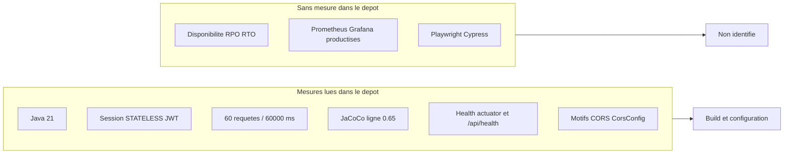

# 21 — Exigences non fonctionnelles

## Objectif

Décrire les qualités mesurables du démonstrateur DartChain (plateforme, sécurité de session, limite de débit, santé, CORS) à partir de la configuration et du code. Les diagrammes 21 à 40 sont des vues complémentaires. Ils ne font pas partie des 14 diagrammes UML officiels.

Aucune promesse de niveau de service (disponibilité, délai de reprise, débit contractuel) n’est ajoutée : le dépôt n’en formule pas.

## Statut

Moyen. Partiellement confirmé par `pom.xml`, `application.yaml`, `SecurityConfig`, `CorsConfig`, `RateLimitFilter` et les healthchecks Docker. Chaque exigence sans chiffre lu dans le dépôt est marquée **déduite** ou **non identifiée**.

## Sources analysées

Arbre canon `/home/azertyuiop/dev/dartchain`, HEAD `0690e34`. Fichiers ouverts pour cette vue :

- `apps/dartchain-backend/pom.xml` (`java.version` 21, JaCoCo `0.8.13`, `jacoco.minimum.line-ratio` `0.65`)
- `apps/dartchain-backend/src/main/resources/application.yaml` (rate limit, TTL JWT, CORS, seuils ops, mode de persistance)
- `apps/dartchain-backend/src/main/java/io/dartchain/backend/shared/config/CorsConfig.java`
- `apps/dartchain-backend/src/main/java/io/dartchain/backend/config/RateLimitProperties.java` et `auth/security/RateLimitFilter.java`
- `apps/dartchain-backend/src/main/java/io/dartchain/backend/auth/security/InMemoryRateLimitCounterStore.java`
- `apps/dartchain-backend/src/main/java/io/dartchain/backend/persistence/JpaRateLimitCounterStore.java`
- `docker-compose.yml` (healthchecks), Dockerfiles backend et frontend
- `infra/nginx/nginx.prod.conf` et `apps/dartchain-frontend/Dart/nginx.conf` (refus `metrics` et `prometheus`)

Arbres voisins cités pour mémoire, non utilisés comme source : `dartchainPreSeed` (même commit, écart local de tri dans `JpaAuthAuditStore.snapshot()`), `dartchainReview` (site compagnon, hors chaîne).

Les valeurs des propriétés `dartchain.auth.jwt-secret` et `dartchain.admin.seed-sha256` ne sont pas recopiées : [SECRET MASQUÉ].

## Éléments représentés

| Id | Exigence | Mesure lue | Qualification |
| --- | --- | --- | --- |
| NF-01 | Runtime Java | 21 (`pom.xml`) | confirmée |
| NF-02 | Sessions HTTP | `STATELESS`, CSRF désactivé (`SecurityConfig`) | confirmée |
| NF-03 | Jetons | access 3600 s, refresh 604800 s, `legacy-session-enabled: false` | confirmée (durée), secret [SECRET MASQUÉ] |
| NF-04 | Limite de débit | 60 requêtes / 60 000 ms sur une liste de chemins | confirmée dans le YAML |
| NF-05 | Couverture de lignes | JaCoCo 0.8.13, seuil 0,65 | confirmée (build, pas runtime) |
| NF-06 | Santé | `/actuator/health`, `/api/health` | confirmée |
| NF-07 | Origines CORS | motifs de `CorsConfig.DEFAULT_ALLOWED_ORIGIN_PATTERNS` | confirmée |
| NF-08 | Seuils d’alerte ops | mempool 50, erreurs HTTP 10, requête lente 2 000 ms, refus RBAC 20 | confirmés comme seuils, sans engagement de traitement |
| NF-09 | Disponibilité / RPO / RTO | aucune | non identifiée |
| NF-10 | Bus de métriques Prometheus / Grafana productisé | aucune stack | non identifiée |
| NF-11 | Tests bout en bout navigateur | aucun Playwright ni Cypress | non identifié |

## Diagramme

Légende : un cadre « mesures » regroupe ce que le dépôt chiffre. Le cadre « sans mesure » n’est pas une exigence du produit ; il marque l’absence de texte.

## Explication

Le backend se compile et s’exécute sur Java 21 (`<java.version>21</java.version>`, image `eclipse-temurin:21`). Spring Boot parent est 3.5.14. Ce chiffre décrit la plateforme, pas un temps de réponse.

`SecurityConfig` désactive CSRF et fixe la politique de session à `STATELESS`. L’authentification porteuse passe par `BearerTokenAuthenticationFilter` et `NativeJwtService`. Le YAML fixe `dartchain.auth.access-token-ttl-seconds` à 3600 et `refresh-token-ttl-seconds` à 604800. `legacy-session-enabled` vaut `false`. Le nom de la propriété secrète est `dartchain.auth.jwt-secret` (variable `DARTCHAIN_JWT_SECRET`) ; la valeur est [SECRET MASQUÉ].

La limite de débit n’est pas globale. `application.yaml` pose `dartchain.rate-limit.max-requests: 60` et `window-ms: 60000`. `RateLimitFilter` n’incrémente le compteur que si `isLimitedPath` reconnaît l’URI : liste `RateLimitProperties` plus le motif `/api/pending-transactions/{id}/mine`. Le compteur est `InMemoryRateLimitCounterStore` quand `dartchain.persistence.mode` vaut `memory` (défaut, `matchIfMissing`), et `JpaRateLimitCounterStore` sur la table `rate_limit_buckets` en mode `postgres`. Le champ Java `RateLimitProperties.maxRequests` vaut 20 si le YAML ne se lie pas ; le fichier chargé par l’application fixe 60.

JaCoCo est un garde-fou de build : plugin `0.8.13`, propriété `jacoco.minimum.line-ratio` à `0.65`. Le commentaire du POM indique une baseline d’environ 65 % avec les entités JPA exclues. Ce n’est pas un objectif de performance en production.

Les healthchecks sont concrets. Le compose appelle `curl` sur `http://localhost:8080/actuator/health` puis, en repli, `/api/health`. Le Dockerfile backend vérifie `/api/health`. Le frontend nginx vérifie `wget` sur `http://127.0.0.1/`. L’actuator expose `health` et `info`. `dartchain.ops.restrict-actuator` vaut `false`. Le nginx de prod et le nginx d’image frontend répondent 403 sur `/actuator/metrics` et `/actuator/prometheus`.

Les motifs CORS effectifs, lus dans `CorsConfig` et recopiés dans le YAML, sont :

- `http://localhost:*`, `http://127.0.0.1:*`, `https://localhost:*`, `https://127.0.0.1:*`
- `https://dartchain.pages.dev`, `https://*.dartchain.pages.dev`, `https://*.pages.dev`
- `https://dartzvz01-tagname.onrender.com`, `https://*.onrender.com`

Méthodes autorisées : GET, POST, PUT, DELETE, OPTIONS, PATCH, HEAD. En-têtes autorisés et exposés : `*`. `maxAge` : 3600 secondes. Le même tableau est passé aux quatre WebSockets.

Les seuils ops (`mempool-alert-threshold` 50, `http-error-alert-threshold` 10, `slow-request-threshold-ms` 2000, `rbac-denied-alert-threshold` 20) sont des déclencheurs internes. Ils ne décrivent pas un contrat client.

## Correspondance avec le code

- Plateforme : `apps/dartchain-backend/pom.xml`, entrée `DartchainBackendApplication`.
- Session et filtres : `SecurityConfig` place `BearerTokenAuthenticationFilter` et `RateLimitFilter` avant `UsernamePasswordAuthenticationFilter`. Autres filtres nommés : `ActuatorAccessFilter`, `RequestCorrelationFilter`, `RequestTimingFilter`, `SecurityHeadersFilter`, `LegacyApiDeprecationFilter`.
- CORS : `CorsConfig.buildCorsConfiguration` lit `CorsProperties`, défaut `DEFAULT_ALLOWED_ORIGIN_PATTERNS`.
- Débit : `RateLimitFilter` + stores mémoire ou `rate_limit_buckets`.
- Santé : `HealthController` `GET /api/health` ; `HealthV1Controller` sous `/api/v1` ; actuator `management.endpoints.web.exposure.include: health,info`.
- Couverture : plugin JaCoCo du POM, seuil `0.65`.

## Hypothèses

- Le YAML du classpath est bien celui qui fixe 60 requêtes. Le défaut Java à 20 ne s’applique que si la liaison de propriétés échoue. Cette distinction est lue dans la classe, le scénario d’échec de liaison n’a pas été exécuté ici.
- L’absence de Playwright et de Cypress dans le recensement vaut « pas de campagne E2E navigateur identifiée », pas une preuve qu’un outil hors dépôt n’existe nulle part.
- Les en-têtes nginx (`X-Content-Type-Options`, `X-Frame-Options`, `Referrer-Policy`) sont traités comme un durcissement de transport observé, pas comme une exigence rédigée par un cahier des charges.

## Anomalies détectées

- `GET /**` est `permitAll` dans `SecurityConfig`. Les lectures sont publiques au niveau Spring ; l’autorisation fine porte sur le reste des mutations. Ce n’est pas un objectif de confidentialité chiffré.
- `restrict-actuator: false` coexiste avec un 403 nginx sur `metrics` et `prometheus`. La protection dépend du proxy, pas du seul Spring.
- Le seuil JaCoCo 0,65 exclut les entités JPA selon le commentaire du POM. Le pourcentage réel du dernier `verify` n’a pas été rejoué dans cette session.
- Aucun objectif de latence p95, de disponibilité ou de reprise n’est écrit. Les inventer serait une promesse SLA absente du dépôt.
- Prometheus et Grafana productisés : non identifiés. Le nginx interdit même l’exposition publique de `prometheus`.

## Recommandations

- Documenter à côté du YAML que 60/60 000 ms ne couvre que `RateLimitProperties.defaultPaths()` et le motif de mine unitaire, et que le défaut Java reste 20.
- Si un objectif de disponibilité est un jour voulu, l’écrire dans un fichier de produit avec une mesure. Tant que ce texte n’existe pas, la fiche doit rester « non identifiée ».
- Aligner le commentaire « baseline 65 % » et la propriété `0.65` dans la doc de build, sans le présenter comme un SLA runtime.
