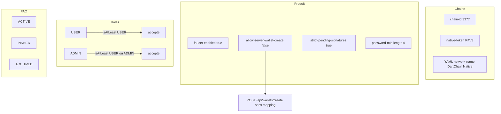

# 22 — Règles métier

## Objectif

Recenser les règles que le code applique vraiment : identité de chaîne, produit, mot de passe, signatures en attente, seuils numériques de l’arène, ordre des rôles, cycle FAQ, et le décalage entre l’interdiction de créer un wallet serveur et la route encore citée par la sécurité. Les diagrammes 21 à 40 sont des vues complémentaires. Ils ne font pas partie des 14 diagrammes UML officiels.

Aucun processus de ressources humaines n’est décrit. Le dépôt n’en contient pas.

## Statut

Moyen. Les valeurs ci-dessous sont lues dans `application.yaml`, `UserRole`, `FaqQuestionStatus` et les contrôleurs wallet. L’application effective de chaque seuil d’arène dans le moteur de jeu n’a pas été retracée méthode par méthode : les chiffres de configuration sont confirmés, leur enforcement complet est partiel.

## Sources analysées

- `apps/dartchain-backend/src/main/resources/application.yaml`
- `config/ChainProperties.java` (défaut `networkName`)
- `config/ProductProperties.java` et `product/ProductFeatureService.java`
- `auth/model/UserRole.java`, `auth/application/AuthService.java` (`validatePassword`)
- `showcase/model/FaqQuestionStatus.java`, usages dans `CommunityFaqService`
- `showcase/faq/JsonFaqQuestionStore.java` et `InMemoryFaqQuestionStore.java`
- `wallet/infrastructure/web/WalletController.java`, `WalletV1Controller.java`
- `SecurityConfig` (permitAll de `POST /api/wallets/create`)
- `config/RateLimitProperties.java` (le chemin `/api/wallets/create` reste dans la liste limitée)

Secrets : noms de propriétés seulement. `dartchain.auth.jwt-secret` et `dartchain.admin.seed-sha256` = [SECRET MASQUÉ].

## Éléments représentés

Règles de chaîne et de produit, règle de mot de passe, signatures pending, règles d’arène chiffrées (seuils numériques), `UserRole.isAtLeast`, statuts FAQ, contradiction wallet serveur.

## Diagramme

Légende : les cadres sont des familles de règles lues dans la configuration ou les enums. La flèche vers « sans mapping » est une incohérence observée, pas une règle voulue.

## Explication

### Chaîne et jeton

`dartchain.chain.chain-id` vaut `3377`. `dartchain.chain.native-token` vaut `R4V3`. Le micro-unité cité par le produit est M4T3R (`FaucetServiceImpl.getConfig` renvoie `smallestUnit` `m4t3r`). Le YAML fixe `network-name` à `DartChain Native`. Si cette propriété ne se charge pas, le défaut Java de `ChainProperties.networkName` est `R4V3 Testnet`.

`dartchain.chain.allow-server-evm-wallet-create` vaut `true`. `WalletV1Controller` expose `POST` sous le préfixe `/api/v1/wallets` (`ApiRoutes.WALLETS_GENERATE_EVM_V1` = `/api/v1/wallets/generate-evm`).

### Produit

`dartchain.product.commercial` est `false`. `allow-legacy-private-key` est `false`. `faucet-enabled` est `true`. `showcase-enabled` est `true`. `legacy-api-aliases-enabled` est `false`.

`ProductFeatureService.requireFaucet()` ne teste pas le drapeau : le corps est vide et le commentaire dit « Faucet toujours actif ». `requireServerWalletCreate()` lève `FeatureDisabledException` quand `allow-server-wallet-create` est faux. `requireLegacyPrivateKey()` refuse `senderPrivateKey` quand le drapeau legacy est faux.

### Mot de passe et signatures

`dartchain.auth.password-min-length` vaut `6`. `AuthService.validatePassword` rejette un mot de passe nul ou plus court que `authProperties.getPasswordMinLength()` avec un HTTP 400.

`dartchain.security.strict-pending-signatures` vaut `true`. La règle est : une transaction pending non système doit porter une signature vérifiable. Le détail d’appel de `TransactionValidationService` n’est pas redessiné ici ; le drapeau de configuration est confirmé.

### Règles d’arène chiffrées

« Chiffrées » désigne ici les seuils numériques de `dartchain.metaverse.arena` dans `application.yaml`. Aucun chiffrement (AES, clé, blob chiffré) de ces règles n’a été trouvé dans le package `metaverse.arena` lors de la vérification de nom.

| Propriété | Valeur |
| --- | --- |
| `enabled` | `true` |
| `loot-rate` | `0.10` |
| `loot-cap-per-elimination` | `25` |
| `minimum-faucet-balance-to-loot` | `1` |
| `spawn-shield-duration-seconds` | `8` |
| `respawn-delay-seconds` | `8` |
| `kill-cooldown-seconds` | `5` |
| `daily-loot-cap` | `200` |
| `daily-loss-cap` | `200` |
| `new-player-protection-duration-seconds` | `60` |
| `anti-farming-threshold` | `8` |

### Rôles

`UserRole` ne contient que `USER` et `ADMIN`. Le commentaire de classe dit que GUEST signifie « non authentifié, pas persisté » : ce n’est pas une valeur de l’enum.

`isAtLeast` :

- si le rôle exigé est `USER`, `USER` et `ADMIN` passent ;
- sinon la méthode exige `this == ADMIN`.

`fromValue` renvoie `USER` si la chaîne est vide ou inconnue.

Le déverrouillage du panneau admin (`POST /api/v1/admin/unlock`, `AdminUnlockService`) compare un SHA-256 de seed à `dartchain.admin.seed-sha256`. Cette session est distincte de l’autorité `ROLE_ADMIN`. La valeur de seed est [SECRET MASQUÉ].

### FAQ

`FaqQuestionStatus` : `ACTIVE`, `PINNED`, `ARCHIVED`. `CommunityFaqService` pose `ACTIVE` à la création, exclut `ARCHIVED` des listes publiques, peut passer une question `ACTIVE` à `PINNED`, et trie les `PINNED` devant.

En mode `memory` (défaut), le store est `JsonFaqQuestionStore`. En mode `postgres`, le store actif est `InMemoryFaqQuestionStore` : liste en RAM. Aucune table Flyway `faq_questions` n’est identifiée dans le canon. Le site compagnon `dartchainReview` a une table `faq_questions` ; il n’est pas la source de ce diagramme.

### Wallet serveur et route morte

`allow-server-wallet-create` est `false`. `WalletController` (`/api/wallets`) ne mappe que `POST /create-client` et `POST /verify`. Il n’existe pas de méthode `POST /create` sur ce contrôleur. `SecurityConfig` laisse pourtant `POST /api/wallets/create` en `permitAll`, et `RateLimitProperties.defaultPaths()` contient encore `/api/wallets/create`.

## Correspondance avec le code

- Chaîne : `application.yaml` clés `dartchain.chain.*`, classe `ChainProperties`.
- Garde-fous produit : `ProductFeatureService.requireServerWalletCreate`, `requireLegacyPrivateKey`, `requireFaucet`.
- Mot de passe : `AuthService.validatePassword`, propriété `dartchain.auth.password-min-length`.
- Rôles : `UserRole.isAtLeast`. Autorités Spring construites par `AuthenticatedUser` : `"ROLE_" + role.name()`, donc `ROLE_USER` et `ROLE_ADMIN`.
- FAQ : enum `FaqQuestionStatus`, service `CommunityFaqService`, stores conditionnés par `dartchain.persistence.mode`.
- Wallet : `WalletController`, `WalletV1Controller`, constante `ApiRoutes.WALLETS_CREATE_CLIENT` et `WALLETS_GENERATE_EVM_V1`.

## Hypothèses

- Les onze nombres d’arène sont appliqués par les services d’arène qui lisent les mêmes propriétés. Seul le YAML a été relu pour les valeurs ; le branchement de chaque seuil dans le combat n’est pas démontré ligne à ligne dans cette fiche.
- `strict-pending-signatures: true` est traité comme la règle active, parce que le YAML de l’application principale le fixe. Les profils `prod` et `staging` relus le confirment aussi pour ce drapeau.
- Le commentaire « Faucet toujours actif » signifie que `faucet-enabled: false` ne couperait pas `requireFaucet()`. Ce comportement est celui du corps de méthode vide, pas un essai d’exécution.

## Anomalies détectées

1. `POST /api/wallets/create` est autorisé par la sécurité et listé au rate limit, sans mapping de contrôleur.
2. `network-name` Java par défaut `R4V3 Testnet` contre YAML `DartChain Native`.
3. FAQ en postgres = RAM (`InMemoryFaqQuestionStore`), pas une table.
4. Unlock admin par seed, distinct de `ROLE_ADMIN`.
5. `requireFaucet()` n’honore pas le booléen `faucet-enabled`.
6. Double surface `/api` et `/api/v1`, avec `legacy-api-aliases-enabled: false` et `ApiRoutes.LEGACY_STATS` = `/api/stats`.

## Recommandations

- Retirer `POST /api/wallets/create` du `permitAll` et de `defaultPaths()`, ou documenter explicitement que l’URL est morte tant que `allow-server-wallet-create` reste faux.
- Faire de `requireFaucet()` un vrai test de `isFaucetEnabled()`, ou retirer la propriété si le produit décide que le faucet ne s’éteint pas.
- Choisir un seul `network-name` entre le défaut Java et le YAML.
- Si la FAQ doit survivre au redémarrage en mode postgres, un store JPA manque ; aujourd’hui il ne faut pas le dessiner.
