# 23 — Processus métier

## Objectif

Décrire quatre processus présents dans le code : miner le mempool, claim faucet, inscription et connexion, déverrouillage admin. Les diagrammes 21 à 40 sont des vues complémentaires. Ils ne font pas partie des 14 diagrammes UML officiels.

Pas de processus RH, paie, recrutement ou validation hiérarchique : aucun de ces flux n’existe dans le dépôt.

## Statut

Moyen. Les enchaînements cités sont lus dans les services nommés. Les branches d’erreur secondaires (validation de bloc, quêtes) sont résumées au point d’appel observé, sans inventer d’étapes.

## Sources analysées

- `blockchain/application/BlockchainService.java` : `minePendingTransactions`, `mine`, `addBlock`, `enqueueSystemCredit`
- `blockchain/application/TransactionPoolService.java` : `drainAll`
- `blockchain/infrastructure/web/BlockchainController.java` et `PendingTransactionController.java`
- `faucet/application/FaucetServiceImpl.java` méthode `claim`
- `auth/application/AuthService.java` : `register`, `login`, `validatePassword`
- `admin/application/AdminUnlockService.java` : `unlock`, `requireUnlock`, `lock`
- Contrôleurs : `AuthController` `/api/auth`, `AuthV1Controller` `/api/v1/auth`, `AdminV1Controller` `/api/v1/admin`

## Éléments représentés

Quatre processus. Acteurs : A2 utilisateur authentifié pour le claim et souvent pour la mine, A1 visiteur pour l’inscription, A3 admin JWT distinct de la seed d’unlock.

## Diagramme

```mermaid
flowchart TB
  subgraph P1 [P1 Miner le mempool]
    M1[Mineur fournit une adresse]
    M2[TransactionPoolService.drainAll]
    M3[Chaque pending passe CONFIRMED]
    M4[Transaction SYSTEM MINING_REWARD]
    M5[mine incremente le nonce]
    M6[validateBlockAgainstChain puis persistBlocks]
    M1 --> M2 --> M3 --> M4 --> M5 --> M6
  end
  subgraph P2 [P2 Claim faucet]
    F1[Compte authentifie et wallet possede]
    F2{Eligible et pending M4T3R}
    F3[Debit pending puis enqueueSystemCredit FAUCET_CLAIM]
    F4[FaucetClaim enregistre cooldown]
    F1 --> F2
    F2 -->|oui| F3 --> F4
    F2 -->|non| F5[FaucetException]
  end
  subgraph P3 [P3 Register et login]
    R1[Register: unicite username et email]
    R2[Hash mot de passe et role]
    L1[Login: identifiant puis verify]
    R1 --> R2
    L1 --> L2[AuthResponse JWT]
    R2 --> L2
  end
  subgraph P4 [P4 Admin unlock]
    A1[POST unlock seed]
    A2[SHA-256 compare a la propriete]
    A3[Jeton memoire X-Admin-Unlock-Token]
    A1 --> A2 --> A3
  end
```

Légende : quatre processus indépendants. Le claim faucet dépose une transaction dans le mempool ; elle ne devient un bloc qu’au processus de mine.

## Explication

### Miner le mempool

`BlockchainService.minePendingTransactions(String minerAddress)` refuse une adresse vide. Il vide le pool partagé via `TransactionPoolService.drainAll()`. Le commentaire de classe du pool indique un mempool mémoire unique pour REST, P2P, WebSocket live et minage.

Chaque `PendingTransaction` est converti en `Transaction` avec le statut `CONFIRMED`. Une transaction de récompense est ajoutée : sender `SYSTEM`, recipient = adresse du mineur, `systemReward` vrai, payload `MINING_REWARD`, signature `SYSTEM`, statut `CONFIRMED`.

Le bloc prend l’index du dernier bloc plus un, `previousHash` du dernier hash, nonce 0, difficulté `DIFFICULTY`, et un `data` du type « Mined block with N transaction(s) ». `mine(Block)` incrémente le nonce tant que `calculateHash` ne commence pas par le préfixe de zéros. Ensuite `BlockchainValidationService.validateBlockAgainstChain` doit réussir, le bloc est ajouté, `persistBlocks()` est appelé.

Deux entrées HTTP existent : le mine groupé côté `BlockchainController` (`minePendingTransactions`) et le mine unitaire `POST /api/pending-transactions/{id}/mine` qui passe par `PendingTransactionService.minePendingTransaction` après `RoleAuthorizationService.authorizeMutation(..., "pending.mine", ...)`.

`mineBlock(String data)` délègue à `addBlock`, qui mine un bloc sans vider le mempool. Ce n’est pas le même processus que `minePendingTransactions`.

### Claim faucet

`FaucetServiceImpl.claim` :

1. `AuthService.requireAuthenticatedAccount` sur l’en-tête Authorization.
2. Normalisation de l’adresse et `ensureWalletOwnership`.
3. Refus si `buildState` dit non éligible (cooldown, `nextEligibleAt`).
4. Refus si le pending M4T3R de l’adresse est nul ou négatif : « Aucune pièce M4T3R à claim — ramassez des pièces d'abord ».
5. Montant = minimum entre la demande, le pending et `BigDecimal.ONE` (plafond aussi exposé par `getConfig` : `maxClaimAmount` `1`, `nativeToken` `R4V3`).
6. Débit du pending, puis `blockchainService.enqueueSystemCredit(..., "FAUCET_CLAIM")`. Le commentaire du service dit que le crédit reste dans le mempool jusqu’au mine.
7. Sauvegarde d’un `FaucetClaim` (id, adresse, montant, `claimedAt`, `nextEligibleAt` = maintenant + cooldown, `clientId`, `txHash`).
8. Métrique `recordFaucetClaim` et `questService.completeFaucetClaimQuest` si le service de quêtes est présent.

Le message de réponse lu dans le code : « Faucet claim placé dans le mempool — miner pour confirmer ».

`ProductFeatureService.requireFaucet()` ne bloque pas ce chemin (corps vide). Le YAML a `faucet-enabled: true`.

### Inscription et connexion

`AuthService.register` trim username et email, appelle `validatePassword` (minimum `password-min-length`, valeur YAML 6), refuse un username ou un email déjà présent (409), crée un `UserAccount` avec `PasswordHasher.hashBcrypt`, rôle via `resolveBootstrapRole(username)`, audit `registerSuccess`, puis `buildAuthResponse`.

`AuthService.login` résout le compte par email si l’identifiant matche `EMAIL_PATTERN`, sinon par username. Un compte OAuth (`PasswordHasher.isOAuthAccount`) est refusé avec le message demandant Google ou Meta. Un mot de passe faux produit un 401 et `loginFailure`. Un hash non bcrypt est réécrit en bcrypt après succès. Audit `loginSuccess`, puis `buildAuthResponse`.

Les contrôleurs exposent les deux générations : `AuthController` sous `/api/auth` et `AuthV1Controller` sous `/api/v1/auth` (register, login, refresh). Le frontend lu appelle la variante v1 (`AuthService.authV1`).

### Déverrouillage admin

`AdminUnlockService.unlock` refuse si la propriété seed n’a pas 64 caractères hex (`503`, message citant `DARTCHAIN_ADMIN_SEED_SHA256`). La phrase est normalisée, son SHA-256 est comparé en temps constant (`MessageDigest.isEqual`) à `dartchain.admin.seed-sha256`. Succès : UUID en mémoire, expiration `unlock-ttl-seconds` (défaut de propriété 3600). L’en-tête attendu ensuite est `X-Admin-Unlock-Token`. `lock` retire le jeton. `requireUnlock` refuse un jeton absent ou expiré.

Ce jeton n’est pas le JWT `ROLE_ADMIN`.

## Correspondance avec le code

| Processus | Service | Entrée HTTP lue |
| --- | --- | --- |
| Mine mempool | `BlockchainService.minePendingTransactions` | `BlockchainController` |
| Mine une pending | `PendingTransactionServiceImpl.minePendingTransaction` | `POST /api/pending-transactions/{id}/mine` |
| Claim | `FaucetServiceImpl.claim` | `FaucetController` `/api/faucet` |
| Register / login | `AuthService` | `/api/auth` et `/api/v1/auth` |
| Unlock | `AdminUnlockService` | `POST /api/v1/admin/unlock` (`ApiRoutes.ADMIN_UNLOCK_V1`) |

Persistance du claim et des blocs : store mémoire JSON ou JPA selon `dartchain.persistence.mode` (voir la vue 25). Le processus métier ne change pas de forme ; seul le store change.

## Hypothèses

- L’adresse mineur est saisie par un utilisateur déjà capable d’appeler la route. Le contrôleur de mine groupé n’a pas été relu au-delà de la délégation à `minePendingTransactions`. Le mine unitaire, lui, appelle `authorizeMutation`.
- `resolveBootstrapRole` peut promouvoir un username de bootstrap. Le mot de passe de bootstrap est une propriété (`dartchain.auth.bootstrap-admin-password`) dont la valeur est [SECRET MASQUÉ]. Le détail de la promotion n’est pas redessiné.
- Le montant de récompense `MINING_REWARD` existe comme constante du service. Sa valeur numérique n’est pas recopiée ici faute de l’avoir relue dans cette session.

## Anomalies détectées

- Deux mines coexistent : vider tout le mempool, ou miner une pending par id. Le frontend appelle les deux familles d’URL (`/blockchain/mine` et `/pending-transactions/{id}/mine` dans `blockchain-api.service.ts`).
- Le claim faucet crédite le mempool, pas un bloc confirmé. Une doc qui dirait « le claim paie immédiatement on-chain » serait fausse au regard du message du service.
- L’unlock admin est un deuxième facteur local en mémoire (`ConcurrentHashMap`), perdu au redémarrage du process. Ce n’est pas une session JWT.
- Aucun workflow RH n’est identifiable. Ne pas en ajouter dans les diagrammes suivants.

## Recommandations

- Nommer dans l’interface le fait que le claim reste `PENDING` jusqu’au mine, comme le fait déjà le message serveur.
- Documenter côte à côte le mine groupé et le mine par id, avec la règle d’autorisation de chacun.
- Persister ou non l’unlock admin : aujourd’hui la map est process-local ; un second nœud (`backend-a` / `backend-b`) ne partage pas ces jetons.
