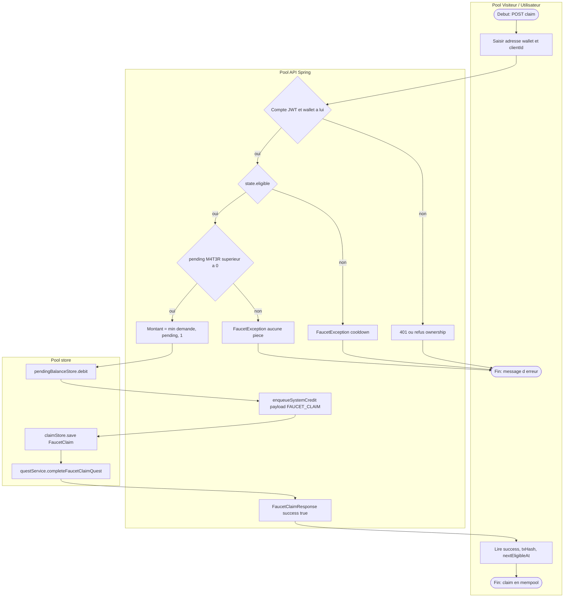

# 24 — BPMN

## Objectif

Donner un BPMN simplifié du claim faucet, le processus dont le code a été relu de bout en bout. Les diagrammes 21 à 40 sont des vues complémentaires. Ils ne font pas partie des 14 diagrammes UML officiels. Ce n’est pas non plus un BPMN 2.0 exporté d’un moteur : c’est une lecture développeur des pools et des passerelles.

Pools : Visiteur / Utilisateur, API Spring, store.

## Statut

Moyen. Le scénario nominal et les refus explicites de `FaucetServiceImpl.claim` sont confirmés. La notation BPMN est adaptée en Mermaid (pas de XML BPMN).

## Sources analysées

- `faucet/application/FaucetServiceImpl.java` (`claim`, `buildState`, `getConfig`)
- `faucet/infrastructure/web/FaucetController.java` (préfixe `/api/faucet`)
- `blockchain/application/BlockchainService.java` (`enqueueSystemCredit`, commentaire mempool)
- `auth/application/AuthService.java` (`requireAuthenticatedAccount`, `ensureWalletOwnership`)
- Frontend : `faucet/services/faucet.service.ts` (`POST ${baseUrl}/claim` avec `baseUrl` = `{apiUrl}/faucet`)

Le mine mempool est le processus suivant (vue 23) ; il n’est pas redessiné ici pour garder un seul flux lisible.

## Éléments représentés

Trois pools. Événement de début : l’utilisateur envoie un claim. Passerelles : authentification, éligibilité cooldown, pending M4T3R, montant. Tâches store : débit pending, insert du claim. Tâche API vers la chaîne : enqueue système dans le mempool. Fin : réponse succès, ou `FaucetException`.

## Diagramme

Légende : les sous-graphes tiennent lieu de pools BPMN. Les losanges sont des passerelles exclusives. Il n’y a pas de timer BPMN dessinable au-delà du cooldown déjà calculé (`nextEligibleAt`).

## Explication

L’utilisateur authentifié appelle `POST /api/faucet/claim`. Le service Angular `FaucetService` poste sur `${apiUrl}/faucet/claim`. `apiUrl` vaut `/api` dans `environment.ts` et `environment.docker.ts`, donc l’URL relative de dev est `/api/faucet/claim`.

Côté API, le claim n’est pas anonyme. `requireAuthenticatedAccount` exige un compte. `ensureWalletOwnership` exige que l’adresse du corps appartienne à ce compte. Un visiteur A1 sans JWT s’arrête à cette passerelle.

L’éligibilité vient du dernier `FaucetClaim` : s’il n’y en a pas, `buildState` met `eligible` à vrai. Sinon le cooldown configuré (`faucetConfig.getCooldownDuration`) bloque jusqu’à `nextEligibleAt`.

Le pending M4T3R n’est pas le solde R4V3 confirmé. Le service refuse un pending à zéro. Le plafond lu est 1 unité (`min` avec `BigDecimal.ONE`, et `maxClaimAmount` `"1"` dans la config). Le jeton natif annoncé par `getConfig` est `R4V3`, la plus petite unité `m4t3r`, le préfixe de wallet vient de `faucetConfig.getWalletPrefix` (les tests d’intégration attendent `R4V3`).

Le store est sollicité deux fois dans le nominal : débit du pending, puis `save` du claim avec le hash de la transaction pending. La quête `completeFaucetClaimQuest(account.getId())` est un effet de bord si `questService` est injecté.

La chaîne n’est pas avancée d’un bloc. `enqueueSystemCredit` place un crédit `SYSTEM` dans le mempool. Le bloc apparaît seulement quand quelqu’un mine (processus 23).

Le rate limit connaît ce chemin : `/api/faucet/claim` est dans `RateLimitProperties.defaultPaths()`, avec le plafond YAML de 60 requêtes par 60 000 ms pour la clé client. Ce n’est pas une règle métier de cooldown ; c’est un filtre HTTP (vue 21).

## Correspondance avec le code

- Pool utilisateur : `apps/dartchain-frontend/Dart/src/app/faucet/services/faucet.service.ts` méthodes `claim`, `getState`, `getConfig`, `getClaims`.
- Pool API : `FaucetController` `@RequestMapping("/api/faucet")`, implémentation `FaucetServiceImpl`.
- Pool store : `claimStore` (`FaucetClaimStore`, implémentation JSON ou `JpaFaucetClaimStore` selon le mode) et `pendingBalanceStore`.
- Table postgres quand le mode est `postgres` : `faucet_claims` / `FaucetClaimEntity` (id, walletAddress, amount, claimedAt, nextEligibleAt, txHash, clientId, createdAt).
- Propriété fichier en mode memory : `FAUCET_CLAIMS_PATH` (défaut `data/faucet-claims.json`).

## Hypothèses

- Le contrôleur transmet l’en-tête `Authorization` tel quel à `claim`. La signature exacte de la méthode HTTP du contrôleur n’a été confirmée que par le nom `claim` et le préfixe de classe ; le corps de `FaucetController` n’a pas été recopié au-delà de cette délégation.
- `pendingBalanceStore` est le même solde que les ramassages M4T3R. Le message d’erreur le dit (« ramassez des pièces »). Le service qui crédite ce pending n’est pas redessiné dans ce BPMN.
- L’ordre débit puis enqueue est celui du code. Si `enqueueSystemCredit` lançait après le débit, le code n’a pas de compensation visible dans la méthode relue. Ce n’est pas dessiné comme une transaction distribuée : elle n’existe pas dans la méthode.

## Anomalies détectées

- `requireFaucet()` ne garde pas le processus. Le drapeau `faucet-enabled` n’est pas une passerelle BPMN réelle aujourd’hui.
- Le claim et le mine sont deux processus. Les enchaîner dans un seul pool « paiement instantané » contredirait le message serveur.
- En mode postgres la FAQ n’a pas de table, mais le faucet en a une (`faucet_claims`). Il ne faut pas généraliser « tout est en RAM » à ce flux.
- `GET /**` permitAll ne couvre pas ce POST : le claim exige un compte dans le service, au-delà du filtre Spring.

## Recommandations

- Garder ce BPMN comme référence du claim, et renvoyer le mine vers la vue 23 plutôt que de fusionner les pools.
- Si le produit veut couper le faucet, la passerelle doit appeler un `requireFaucet()` qui lit `ProductProperties.isFaucetEnabled()`.
- Afficher `nextEligibleAt` et le statut mempool dans l’UI faucet : les deux champs sont déjà dans `FaucetClaimResponse`.
