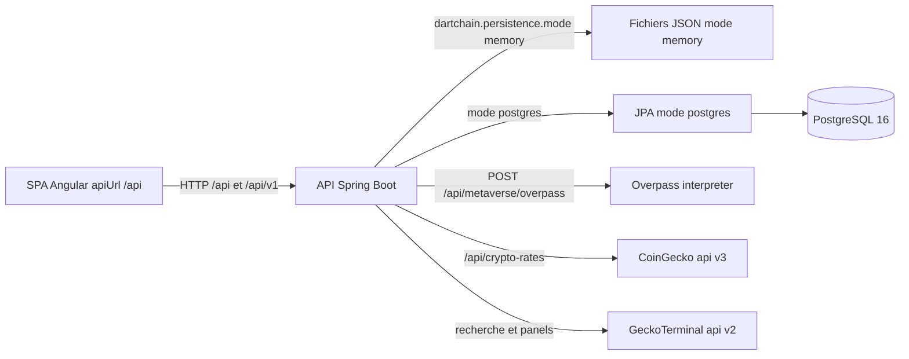

# 25 — Flux de données

## Objectif

Montrer où circulent les données du démonstrateur : le navigateur SPA appelle l’API Spring, qui écrit soit des fichiers JSON en mode `memory`, soit PostgreSQL via JPA en mode `postgres`, et qui proxifie Overpass et CoinGecko. Les diagrammes 21 à 40 sont des vues complémentaires. Ils ne font pas partie des 14 diagrammes UML officiels.

## Statut

Moyen. Les modes, les noms de propriétés de chemins et les URL externes ont été lus. Le contenu des fichiers JSON et le SQL colonne par colonne de V12 ne sont pas recopiés.

## Sources analysées

- `application.yaml` : `dartchain.persistence.mode` défaut `memory` (`DARTCHAIN_PERSISTENCE_MODE`), chemins `BLOCKCHAIN_STATE_PATH`, `EXCHANGE_LEDGER_PATH`, `LAUNCH_PROJECTS_PATH`, `CHAT_MESSAGES_PATH`, `NEWS_ITEMS_PATH`, `FAQ_QUESTIONS_PATH`, `QUESTS_PROGRESS_PATH`, `FAUCET_CLAIMS_PATH`, `AUTH_USERS_PATH`, `M4T3R_REWARDS_PATH`
- Stores JPA sous `io.dartchain.backend.persistence` conditionnés `havingValue = "postgres"`
- `JsonFaqQuestionStore` (`memory`, `matchIfMissing = true`) et `InMemoryFaqQuestionStore` (`postgres`)
- `OverpassProxyService` : `https://lz4.overpass-api.de/api/interpreter` puis `https://overpass-api.de/api/interpreter`
- `CryptoRatesProxyService` : `https://api.coingecko.com/api/v3` et `https://api.geckoterminal.com/api/v2`
- Flyway `V1__auth.sql` à `V14__oauth_identities.sql`. `V12__ad_persistence.sql` n’est pas une table publicitaire : il ajoute `chain_config`, `chain_accounts` et des index.

## Éléments représentés

Flux SPA → API → store. Branche memory / postgres. Flux sortants Overpass, CoinGecko, GeckoTerminal. WiGLE est un flux voisin (mock par défaut), cité à part pour ne pas le confondre avec Overpass.

## Diagramme

Légende : une seule API, deux stores exclusifs selon la propriété. Overpass et les taux sont des appels sortants, pas des tables locales.

## Explication

Le défaut est `dartchain.persistence.mode: ${DARTCHAIN_PERSISTENCE_MODE:memory}`. Tant que la variable n’est pas `postgres`, les stores JSON dont la condition est `memory` avec `matchIfMissing = true` prennent le relais. Les profils Compose `default`, `dev`, `staging`, `prod` et `p2p` fixent au contraire `DARTCHAIN_PERSISTENCE_MODE: postgres` dans les services backend relus. Le binaire lancé sans cette variable reste en mémoire.

Chemins par défaut lus dans `application.yaml` (noms de propriétés d’environnement entre parenthèses) :

| Donnée | Propriété | Défaut fichier |
| --- | --- | --- |
| Chaîne | `BLOCKCHAIN_STATE_PATH` | `data/blockchain-state.json` |
| Ledger d’échange | `EXCHANGE_LEDGER_PATH` | `data/exchange-ledger.json` |
| Projets launch | `LAUNCH_PROJECTS_PATH` | `data/launch-projects.json` |
| Messages chat | `CHAT_MESSAGES_PATH` | `data/chat-messages.json` |
| News | `NEWS_ITEMS_PATH` | `data/news-items.json` |
| FAQ | `FAQ_QUESTIONS_PATH` | `data/faq-questions.json` |
| Quêtes | `QUESTS_PROGRESS_PATH` | `data/quest-progress.json` |
| Claims faucet | `FAUCET_CLAIMS_PATH` | `data/faucet-claims.json` |
| Utilisateurs | `AUTH_USERS_PATH` | `data/auth-users.json` |
| Récompenses M4T3R | `M4T3R_REWARDS_PATH` | `data/m4t3r-rewards.json` |

En mode postgres, des stores `Jpa*Store` existent pour comptes, sessions, refresh tokens, audit, OAuth, rate limit, quêtes, faucet, chaîne (`JpaBlockchainStateStore`), ledger, launch, chat, news. Les entités mappent les tables JPA (`users`, `auth_sessions`, `auth_refresh_tokens`, `auth_audit_log`, `oauth_identities`, `rate_limit_buckets`, `quest_progress`, `faucet_claims`, `blocks`, `pending_transactions`, `chain_config`, `chain_accounts`, `exchange_ledger_adjustments`, `exchange_seeded_wallets`, `launch_projects`, `chat_messages`, `news_items`). Aucun `@ManyToOne` / `@OneToMany` n’a été relevé : les `userId` sont des UUID scalaires.

Exception FAQ : `JsonFaqQuestionStore` si memory, `InMemoryFaqQuestionStore` si postgres. Le mode postgres ne bascule pas la FAQ vers une table. Il la garde en RAM. Il n’y a pas de table `faq_questions` dans les migrations du canon.

Overpass : `OverpassProxyController` préfixe `/api/metaverse/overpass`. `OverpassProxyService` interroge d’abord `https://lz4.overpass-api.de/api/interpreter`, avec repli `https://overpass-api.de/api/interpreter`. Le frontend (`geo-reference.config.ts`) décrit le même partage : backend `/api/metaverse/overpass`, ou proxy dev `/overpass`. `SecurityConfig` laisse `POST /api/metaverse/overpass` en permitAll.

CoinGecko : `CryptoRatesProxyService.COINGECKO_BASE` = `https://api.coingecko.com/api/v3`. GeckoTerminal : `https://api.geckoterminal.com/api/v2`. Le contrôleur est `CryptoRatesController` `/api/crypto-rates`. Le service frontend `crypto-rate.service.ts` appelle `${apiUrl}/crypto-rates` (`chart`, `panels/batch`, `panels/native`, `search`). Les résultats de recherche portent la source `"coingecko"` ou `"geckoterminal"`.

WiGLE (`WiglePointsService`, `WigleVisualizationController` `/api/metaverse/wigle`) est un autre externe. `dartchain.wigle.mock-enabled` vaut `true` par défaut. Les jetons `WIGLE_API_NAME` et `WIGLE_API_TOKEN` sont [SECRET MASQUÉ]. Ce flux ne remplace pas Overpass.

OAuth (google, meta, apple, microsoft, github, x, discord) est désactivé par défaut (`enabled: false`). Aucun provisionnement réel hors dépôt n’est identifié. Les client secrets sont [SECRET MASQUÉ].

## Correspondance avec le code

- Bascule : annotation `@ConditionalOnProperty(name = "dartchain.persistence.mode", ...)`.
- Chaîne : `BlockchainStateStore`, `JsonBlockchainStateStore` (package `blockchain`, condition `memory`), `JpaBlockchainStateStore`.
- FAQ : `FaqQuestionStore` et les deux implémentations du package `showcase.faq`.
- Santé : `HealthController` renvoie le `persistenceMode` courant dans `GET /api/health`.
- Déploiement documenté : `deploy/render.yaml` pose `DARTCHAIN_PERSISTENCE_MODE=postgres` et une base `dartchain-db`. Ce fichier décrit un déploiement ; cette session n’a pas exécuté le réseau (vue 36).

Flyway : V1 auth, V2 quests, V3 quest week key, V4 faucet claims, V5 quest explored blocks, V6 blockchain, V7 exchange ledger, V8 launch projects, V9 chat messages, V10 news items, V11 auth ab, V12 `ad_persistence`, V13 launch project metadata, V14 oauth identities. Colonnes de V12 : voir le fichier SQL. Aucune table `ads` n’est affirmée ici.

## Hypothèses

- `JsonBlockchainStateStore` est dans `io.dartchain.backend.blockchain` et implémente `BlockchainStateStore`. Il n’est pas dans le package `persistence` (c’est `JpaBlockchainStateStore` qui y est).
- Les fichiers sous `data/` ne sont pas versionnés comme source de vérité produit. Seuls les noms de propriétés sont des faits.
- GeckoTerminal est utilisé en complément de CoinGecko dans le même service. Le choix d’appel selon l’endpoint (`search` contre `panels`) n’a été lu que par les constantes et les constructions de résultats, pas par un test d’intégration rejoué.

## Anomalies détectées

- Deux vérités de stockage selon le mode. Un développeur qui lit seulement Flyway croit que la FAQ est en base ; en postgres elle est en RAM.
- `userId` relie users, sessions, refresh, audit et OAuth sans association JPA. Le lien est une colonne scalaire.
- V12 s’appelle `ad_persistence`. Inventer des colonnes publicitaires serait faux tant que le SQL n’est pas ouvert.
- Le frontend de prod (`environment.prod.ts`, `environment.cloudflare.ts`) pointe l’API Render en dur pour les WebSockets. Les données restent derrière cette API ; elles ne sont pas dans le bundle Pages.
- Working tree : `depth-rail` est un ajout local non commité. Il ne constitue pas un flux de données serveur.

## Recommandations

- Afficher `persistenceMode` de `/api/health` dans les docs d’exploitation : c’est le seul indicateur runtime du branchement JSON ou JPA.
- Traiter la FAQ postgres comme une dette : soit une migration, soit un commentaire d’architecture à côté de `InMemoryFaqQuestionStore`.
- Ne pas committer le contenu de `data/*.json` s’il contient des comptes. Les chemins seuls suffisent à cette vue.
