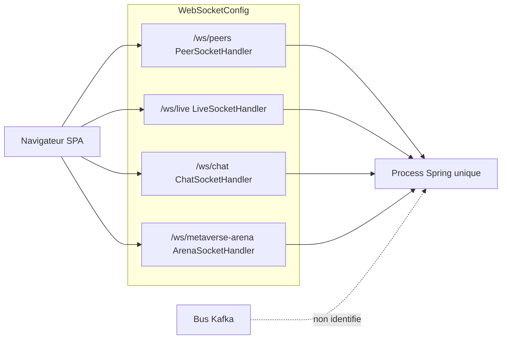

# 26 — Flux d'événements

## Objectif

Décrire les quatre canaux WebSocket enregistrés par `WebSocketConfig`, et constater qu’aucun bus Kafka n’est identifié dans le dépôt. Les diagrammes 21 à 40 sont des vues complémentaires. Ils ne font pas partie des 14 diagrammes UML officiels.

## Statut

Moyen. Les chemins et les handlers sont confirmés. Le catalogue complet des types de messages JSON échangés sur chaque socket n’a pas été inventorié message par message.

## Sources analysées

- `shared/config/WebSocketConfig.java`
- Handlers : `PeerSocketHandler`, `LiveSocketHandler`, `ChatSocketHandler`, `ArenaSocketHandler`
- Intercepteur : `WebSocketAuthHandshakeInterceptor`
- Frontend : `environment.ts` (`liveWsUrl`, `chatWsUrl`), `environment.factory.ts` (`arenaWsUrl` dérivé de `/ws/live`), `blockchain-api.service.ts` (socket live), `showcase-chat.service.ts`, `arena-transport.hybrid.service.ts`
- Nginx : `location /ws/` dans `apps/dartchain-frontend/Dart/nginx.conf` et `infra/nginx/nginx.prod.conf`
- Recherche dépôt : aucune occurrence de Kafka dans les sources Java, YAML, TOML relues

## Éléments représentés

Quatre endpoints WebSocket. Producteurs et consommateurs côté SPA quand le fichier a été lu. Absence de bus : **non identifié**.

## Diagramme

Légende : les quatre flèches pleines sont des handlers enregistrés. La flèche pointillée vers Kafka signifie qu’aucun composant de ce type n’a été trouvé. Ce n’est pas un bus désactivé par configuration : il est absent du code parcouru.

## Explication

`WebSocketConfig` active `@EnableWebSocket` et enregistre :

| Chemin | Handler | Package observé |
| --- | --- | --- |
| `/ws/peers` | `PeerSocketHandler` | `io.dartchain.backend.p2p` |
| `/ws/live` | `LiveSocketHandler` | `io.dartchain.backend.live` |
| `/ws/chat` | `ChatSocketHandler` | `io.dartchain.backend.showcase.chat` |
| `/ws/metaverse-arena` | `ArenaSocketHandler` | `io.dartchain.backend.metaverse.arena.ws` |

Chaque handler reçoit `WebSocketAuthHandshakeInterceptor` et `CorsConfig.ALLOWED_ORIGIN_PATTERNS`. `SecurityConfig` laisse `/ws/**` en permitAll au niveau HTTP ; l’intercepteur de handshake reste posé sur les quatre canaux.

Le nginx d’image et le nginx de prod proxifient `/ws/` en HTTP/1.1 avec `Upgrade` et `Connection: upgrade`, `proxy_read_timeout 3600s`. En compose default, la cible est `backend:8080`. En prod, la cible est l’upstream `dartchain_backend` (`backend-a` et `backend-b`).

Côté SPA, les URL lues sont :

- `environment.liveWsUrl` = `devWsUrl('/ws/live')` en développement ; en prod et Cloudflare, `wss://dartchain-backend-1-0-0.onrender.com/ws/live` (écrit dans les fichiers d’environnement, pas prouvé par un appel réseau de cette session).
- `chatWsUrl` suit le même schéma avec `/ws/chat`. `ShowcaseChatService.buildWsUrl` ajoute `access_token` si un jeton est en stockage.
- `arenaWsUrl` est optionnel. `environment.factory.ts` le déduit en remplaçant `/ws/live` par `/ws/metaverse-arena` quand il n’est pas surchargé. `ArenaTransportHybridService` ouvre cette URL avec `access_token` et `room`, après avoir activé un mock local. Sans jeton ou sans base, il reste en mock.
- Les pairs : le panneau peers propose un exemple `ws://localhost:8080/ws/peers`. Le handler serveur est `/ws/peers`. L’API REST voisine est `PeerController` `/api/peers`.

`TransactionPoolService` se décrit comme le mempool mémoire partagé par REST, P2P, live WS et minage. Les événements de chaîne live et le pool se rejoignent donc dans le même process JVM, pas via un broker.

Aucun client ou annotation Kafka, aucun service `kafka` dans `docker-compose.yml`, aucun topic. **Bus Kafka : non identifié.**

Les événements métier qui ne passent pas par WebSocket restent du HTTP : claim faucet, mine, register, unlock admin (vues 23 et 24). Les poster ici comme des « events Kafka » serait une invention.

## Correspondance avec le code

- Enregistrement unique : `WebSocketConfig.registerWebSocketHandlers`.
- Commentaire dans la classe : le canal arène est additif et ne remplace pas live, chat ni peers.
- Client live : `BlockchainApiService` ouvre `environment.liveWsUrl`.
- Client chat : `ShowcaseChatService`.
- Client arène : `ArenaTransportHybridService`, repli `ArenaTransportMockService`.
- Autorisation HTTP des sockets : `permitAll` sur `/ws/**` dans `SecurityConfig`.

## Hypothèses

- Le handshake peut refuser un jeton invalide via `WebSocketAuthHandshakeInterceptor`. Le corps de l’intercepteur n’a pas été relu ; seul son branchement sur les quatre handlers est un fait.
- Les messages live (nouveau bloc, pending) sont poussés par `LiveSocketHandler`. Les noms de types JSON ne sont pas listés ici pour éviter d’en inventer.
- Deux replicas `backend-a` et `backend-b` ne partagent pas un bus. Un client nginx `least_conn` tombe sur un process. La diffusion cross-nœud n’est pas identifiée. C’est une limite d’architecture déduite de l’absence de broker, pas une trace d’exécution.

## Anomalies détectées

- Le README omet `/ws/peers` et `/ws/metaverse-arena` dans son aperçu. `WebSocketConfig` les enregistre.
- Star Conquest est décrit « live » dans le README alors que `starConquestEnabled` est `false`. Aucun canal WebSocket Star Conquest n’est dans `WebSocketConfig`. Sync serveur Star Conquest : non identifiée.
- L’arène démarre en mock même quand le WebSocket est tenté (`activateMock` avant la connexion). Le flux « temps réel arène » peut donc être local.
- `GET` et les sockets sont largement ouverts au filtre Spring (`/ws/**` permitAll) ; la confidentialité dépend de l’intercepteur et des services, pas du seul `authorizeRequests`.

## Recommandations

- Documenter les quatre chemins à côté du README, handler par handler.
- Si plusieurs JVM doivent voir le même mempool ou le même chat, il manque un mécanisme de diffusion. Kafka n’est pas ce mécanisme aujourd’hui : il est non identifié. Ne pas l’ajouter dans un schéma d’existant.
- Distinguer dans l’UI arène le mode `mock` et le mode `ws` : `ArenaTransportHybridService` expose déjà `transportMode`.
