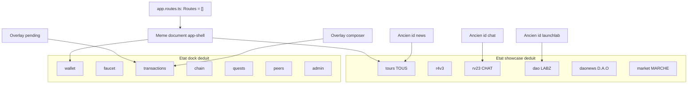

# 28 — Navigation frontend

## Objectif

Montrer comment l’utilisateur se déplace dans la SPA. Le fait confirmé est l’absence de routes Angular. Le parcours entre zones est un état d’interface interne, déduit des signaux et des services de navigation. Les diagrammes 21 à 40 sont des vues complémentaires. Ils ne font pas partie des 14 diagrammes UML officiels.

## Statut

Moyen. `routes = []` est confirmé par le code. Le graphe d’onglets est déduit des types TypeScript et de `app.ts`. Ce n’est pas un routeur.

## Sources analysées

- `apps/dartchain-frontend/Dart/src/app/app.routes.ts`
- `app.ts` : `activeShowcaseTab`, `activeBottomTab`, `onShowcaseTabChange`, `onBottomTabChange`
- `showcase/models/showcase-tab.model.ts`
- `dock/services/dock-navigation.service.ts`
- `app.html` (tiroirs, pas de `router-outlet` dans le fichier relu)
- `README.md` et `app.routes.ts` : SPA d’une seule page, `routes` vide

## Éléments représentés

Tableau de routes vide. État showcase. État dock. Overlays qui réécrivent l’onglet dock. Anciens identifiants d’onglets.

## Diagramme



Légende : aucune flèche n’est une `Route` Angular. Les flèches partent de signaux ou de tables de réécriture lus dans le code. Le qualificatif « déduit » porte sur l’idée de « navigation », pas sur les noms d’onglets, qui sont écrits dans les types.

## Explication

`app.routes.ts` contient exactement :

```ts
export const routes: Routes = [];
```

Il n’y a donc pas de path `/wallet`, `/faucet`, `/admin`, `/explorer`. Le routeur Angular est une dépendance du `package.json` (`@angular/router`) mais la table est vide. Changer d’onglet ne change pas l’URL.

La navigation observable est interne :

- `activeShowcaseTab` démarre à `'tours'`. `onShowcaseTabChange` passe par `normalizeShowcaseTab`. Les valeurs légales sont `tours`, `r4v3`, `rv23`, `dao`, `daonews`, `market`.
- `LEGACY_SHOWCASE_TAB_MAP` réécrit `news` → `tours`, `chat` → `rv23`, `launchlab` → `dao`, `peers` et `reseau` → `tours`. Un ancien identifiant « peers » dans le showcase n’ouvre pas le dock peers ; il retombe sur `tours`. Le dock a, lui, un vrai onglet `peers`.
- `activeBottomTab` démarre à `'wallet'`. Le type `BottomDockTab` liste `wallet`, `faucet`, `transactions`, `chain`, `quests`, `peers`, `admin`.
- `DockNavigationService` mappe les overlays : `pending` et `composer` vers l’onglet `transactions` (sous-onglets `mempool` et `composer`), `chain`, `wallet` et `peers` vers le même nom. `QuestNavigateAction` peut demander `faucet`, `swap`, `explore-blocks`, `showcase-tours`, `market`, `peers` : ce sont des ordres vers l’état UI, pas des URL.

Les tiroirs (`app-auth-drawer`, `app-block-detail-drawer`, `app-launch-form-drawer`) sont des panneaux par-dessus le shell. Les ouvrir ne pousse pas d’entrée d’historique, d’après le template relu (pas de lien `routerLink`).

Star Conquest n’est pas une route. C’est un `@if (product.starConquestEnabled)` et le flag de `environment.ts` est `false`.

`depth-rail` n’a pas de route non plus. Le dossier n’est pas référencé par `app.html`.

Le proxy et nginx renvoient `try_files ... /index.html` pour `/`. Toute URL inconnue côté serveur de fichiers retombe sur le même shell. Comme la table Angular est vide, le shell ne lit pas cette URL pour choisir un onglet. Ce comportement de repli fichier est décrit par `nginx.conf` ; il ne crée pas un routeur applicatif.

## Correspondance avec le code

| Mécanisme | Fichier | Rôle |
| --- | --- | --- |
| Table de routes | `app.routes.ts` | vide, fait confirmé |
| Onglet showcase | `app.ts`, `showcase-tab.model.ts` | signal |
| Onglet dock | `app.ts`, `dock-navigation.service.ts` | signal |
| Réécriture legacy | `LEGACY_SHOWCASE_TAB_MAP` | compatibilité d’identifiants |
| Pages HTTP | `nginx.conf` `try_files` | toujours `index.html` |

## Hypothèses

- `app.config.ts` enregistre bien `provideRouter(routes)` ou un équivalent avec le tableau vide. Le fichier de config n’a pas été ouvert. L’absence de routes dans `routes` suffit à dire qu’aucune route métier n’est déclarée.
- Les abonnements dans `app.ts` (lecture d’un onglet depuis un service vers `onShowcaseTabChange` / `onBottomTabChange`) mettent à jour les signaux sans URL. Le corps complet de ces abonnements n’a été vu qu’en extrait de grep.
- Un query param pourrait exister sans être une route. Aucun `queryParam` de navigation n’a été lu dans `app.routes.ts`. Il n’est pas affirmé qu’un autre fichier n’en lit pas.

## Anomalies détectées

- `@angular/router` est dépendant alors que la table est vide. La navigation réelle est ailleurs.
- L’identifiant legacy `peers` du showcase et l’onglet dock `peers` ne désignent pas le même geste.
- `admin` est un onglet de dock, pas une URL `/admin`. Le déverrouillage seed peut surprendre si on cherche une page.
- Cloudflare `wrangler.toml` pose `not_found_handling = "single-page-application"`. Combiné aux routes vides, toute URL profonde affiche le même écran sans restaurer l’onglet.

## Recommandations

- Si des liens partageables deviennent nécessaires, les ajouter dans `routes` et brancher les signaux dessus. Tant que le tableau est vide, la doc doit dire « état UI interne ».
- Éviter de réutiliser l’id `peers` pour deux gestes différents quand on fait évoluer `LEGACY_SHOWCASE_TAB_MAP`.
- Ne pas documenter de sitemap d’URLs métier : il n’y en a pas.
