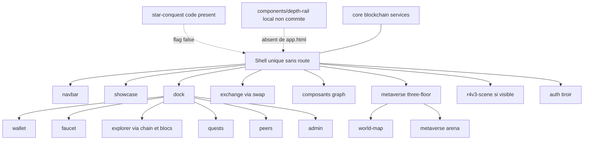

# 29 — Écrans

## Objectif

Présenter les dossiers de `src/app` comme des zones d’interface du shell unique, pas comme des pages routées. Les diagrammes 21 à 40 sont des vues complémentaires. Ils ne font pas partie des 14 diagrammes UML officiels.

## Statut

Moyen. La liste des dossiers est confirmée par le répertoire. Leur lecture comme « écrans » est une convention de cette vue : le routeur ne leur associe pas d’URL (vue 28).

## Sources analysées

- Listing de `apps/dartchain-frontend/Dart/src/app/`
- `app.html` pour les zones réellement montées
- `components/depth-rail/` (cinq fichiers)
- `environments/environment.ts` : `starConquestEnabled: false`
- `app.routes.ts` : tableau vide

Dossiers exacts : `admin`, `auth`, `blockchain`, `components`, `core`, `dock`, `exchange`, `explorer`, `faucet`, `metaverse`, `navbar`, `peers`, `quests`, `r4v3-scene`, `showcase`, `star-conquest`, `wallet`, `world-map`.

## Éléments représentés

Zones d’interface regroupées par dossier. Visibilité dans le shell. Mention de `depth-rail` et de Star Conquest.

## Diagramme

Légende : trait plein = zone branchée sur le shell ou sur un onglet du dock, d’après `app.html` et les types d’onglets. Trait pointillé = code présent sans insertion dans le template relu.

## Explication

Il n’y a pas d’écran `/admin` ni d’écran `/faucet`. Chaque dossier est un ensemble de composants et de services affichés à l’intérieur de `app-shell`, ou des services sans UI (`core`, une partie de `blockchain`).

| Dossier | Rôle d’interface observé | Branchement |
| --- | --- | --- |
| `navbar` | Barre et bandeau d’accueil | toujours dans `app.html` |
| `showcase` | Onglets tours, r4v3, rv23, dao, daonews, market | `app-showcase-tab-showcase` |
| `exchange` | Swap / panneau | `app-swap` dans le main |
| `dock` | Onglets du bas | `app-dock-tabs-dock-tabs` |
| `wallet` | Contenu d’onglet dock `wallet` | état `BottomDockTab` |
| `faucet` | Onglet dock `faucet` | idem |
| `explorer` | Recherche et blocs, tiroir de détail | événements navbar / showcase, pas une page |
| `blockchain` | Modèles et `BlockchainApiService` | service, peu une « page » |
| `quests` | Onglet dock `quests` | idem |
| `peers` | Onglet dock `peers` | idem |
| `admin` | Onglet dock `admin` | idem, unlock seed séparé |
| `auth` | Tiroir | `app-auth-drawer` |
| `metaverse` | `app-three-floor`, arène | sous le main |
| `world-map` | Carte, placements, WiGLE, traînée M4T3R | utilisé par la scène metaverse |
| `r4v3-scene` | Couche scène | `@defer` si `r4v3SceneVisible()` |
| `star-conquest` | Particules, panel, scanner | seulement si le flag produit est vrai |
| `components` | Pièces partagées, dont `depth-rail` | `depth-rail` non monté dans `app.html` |
| `core` | Intercepteurs, i18n, config produit | pas une zone visuelle |

`depth-rail` est un ajout local non commité. Fichiers vus : `depth-rail.ts`, `depth-rail.html`, `depth-rail.css`, `depth-rail.math.ts`, `depth-rail.math.spec.ts`. Le template racine ne les référence pas. Ce n’est pas un écran routé, et ce n’est pas une zone du shell commité.

Star Conquest est présent dans le code (`src/app/star-conquest/`, balises `app-star-quest-panel` et `app-star-quest-scanner`). `environment.ts` fixe `starConquestEnabled: false`. `app.html` n’affiche ces balises que dans le `@if`. Le README qui le dit « live » contredit ce flag.

Les dossiers `exchange` et le composant `app-graph` couvrent le marché affiché dans le `main`. Le graphique est une zone du shell ; son dossier de composants n’est pas un dix-neuvième top-level au même titre que `wallet` : il vit avec showcase / composants selon les imports de `app.ts`. Cette fiche ne crée pas de dossier absent du listing.

## Correspondance avec le code

- Liste : dossiers de `apps/dartchain-frontend/Dart/src/app`.
- Montage : `app.html`.
- Flag : `export const environment = buildEnvironment({ starConquestEnabled: false, ... })`.
- Routes : tableau vide, donc aucun dossier n’est une page.

## Hypothèses

- L’onglet dock `chain` s’appuie sur des composants `explorer` et `blockchain`. Le template du dock n’a pas été ouvert composant par composant ; le lien est déduit du nom d’onglet `chain` et de `OVERLAY_TO_BOTTOM_TAB`.
- `app-graph` est la zone marché graphique. Son dossier source exact sous `showcase` ou `components` n’est pas requis pour dire qu’elle est à l’écran : la balise est dans `app.html`.
- Le working tree contient des modifications showcase non commitées. Elles peuvent changer le rendu des onglets sans changer la liste des dossiers.

## Anomalies détectées

- Appeler ces dossiers « pages » serait faux : `Routes = []`.
- Star Conquest est un écran en puissance, éteint par le flag.
- `depth-rail` est un écran ou un widget local, non commité, hors template racine.
- `core` et `blockchain` sont des dossiers techniques. Les compter comme des écrans utilisateur gonflerait la carte.

## Recommandations

- Dans les revues UI, parler de zones du shell et d’onglets, et réserver le mot « page » au document unique.
- Décider du sort de `depth-rail` : le committer et le monter, ou le laisser hors documentation d’écran publié.
- Aligner le discours Star Conquest sur `starConquestEnabled`.
