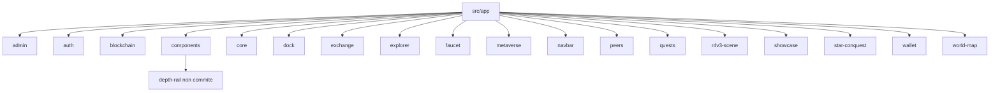

# 30 — Composants frontend

## Objectif

Cartographier les dossiers réels de `src/app` et les services HTTP qui appellent l’API. Les diagrammes 21 à 40 sont des vues complémentaires. Ils ne font pas partie des 14 diagrammes UML officiels. Cette fiche ne liste pas les centaines de composants Angular un par un.

## Statut

Élevé. Confirmé par le listing du répertoire et par la lecture des services HTTP nommés.

## Sources analysées

- `apps/dartchain-frontend/Dart/src/app/` (18 dossiers)
- `app.routes.ts`, `app.html`, `environment.ts` (`apiUrl: '/api'`)
- Services relus pour leurs URL : voir la vue 33. Ici ils sont nommés et rattachés à leur dossier.

## Éléments représentés

Dossiers top-level de `src/app`. Services HTTP dont le fichier existe. Composant local `depth-rail`.

## Diagramme

Légende : chaque boîte est un dossier présent sous `src/app`. `depth-rail` est un sous-dossier de `components`, pas un dix-neuvième module de premier niveau.

## Explication

Le frontend vit dans `apps/dartchain-frontend/Dart`. Angular `^21.2.7`. La SPA n’a pas de routes métier. Les dossiers sont des zones et des services (vue 29).

Services HTTP confirmés (fichier exact) :

| Service | Fichier |
| --- | --- |
| `AuthService` | `auth/services/auth.service.ts` |
| `auth-token-refresh` | `core/auth/auth-token-refresh.ts` |
| `BlockchainApiService` | `blockchain/services/blockchain-api.service.ts` |
| `ChainConfigService` | `blockchain/services/chain-config.service.ts` |
| `CryptoRatesService` | `exchange/services/crypto-rate.service.ts` |
| `FaucetService` | `faucet/services/faucet.service.ts` |
| `QuestsApiService` | `quests/services/quests-api.service.ts` |
| `ShowcaseApiService` | `showcase/services/showcase-api.service.ts` |
| `CharacterNftApiService` | `metaverse/services/character-nft-api.service.ts` |
| `ArenaSessionService` | `metaverse/arena/services/arena-session.service.ts` |
| `AdminExportClientService` | `admin/services/admin-export-client.service.ts` |
| `AdminSeedSessionService` | `admin/services/admin-seed-session.service.ts` |
| `OpsSnapshotService` | `admin/services/ops-snapshot.service.ts` |
| `M4t3rTrailApiService` | `world-map/m4t3r-trail-api.service.ts` |
| `M4t3rRewardApiService` | `world-map/m4t3r-reward-api.service.ts` |
| `PlacementApiRepository` | `world-map/placements/placement-api.repository.ts` |
| `WigleApiService` | `world-map/wigle/wigle-api.service.ts` |

D’autres classes du dossier `metaverse/arena/services/` (`arena-combat`, `arena-transport.hybrid`, `arena-economy.mock`, etc.) sont des services de scène. Seuls ceux qui appellent `HttpClient` vers l’API sont dans le tableau. `ArenaTransportHybridService` ouvre un WebSocket, pas un préfixe REST ; il est décrit en vue 26.

`DockWalletStateService` ne parle pas HTTP tout seul : il injecte `BlockchainApiService`. Il n’est pas compté comme un client d’URL propre.

`depth-rail` : `components/depth-rail/depth-rail.ts`, `.html`, `.css`, `depth-rail.math.ts`, `depth-rail.math.spec.ts`. Ajout local non commité. Pas de service HTTP dans ces fichiers au titre de cette fiche (ils n’ont pas été ouverts au-delà de leur présence).

`star-conquest` est un dossier de composants présent. `environment.ts` le laisse éteint (`starConquestEnabled: false`).

`navbar`, `explorer`, `peers`, `wallet`, `r4v3-scene` sont des dossiers de composants. Leurs appels réseau passent par les services du tableau (surtout `BlockchainApiService` pour explorateur, pairs, bannière, échanges) plutôt que par un fichier HTTP homonyme. Aucun mapping inventé : si le dossier n’a pas de service dans la liste, cette fiche ne lui attribue pas d’URL.

## Correspondance avec le code

Racine Angular : `apps/dartchain-frontend/Dart`. Build docker : `npm run build:docker`. Build Cloudflare : `npm run build:cloudflare`. Node lu dans `.node-version` : `22`. `packageManager` : `npm@9.2.0`.

Proxy navigateur : `environment.ts` commente que le dev passe par le proxy Angular vers des URL relatives `/api`, ce qui évite CORS. Les motifs nginx sont en vue 36. Aucune URL de proxy inventée.

## Hypothèses

- La liste des clients HTTP est celle des fichiers relus pour la vue 33. Un autre `HttpClient` peut exister hors de cette liste ; il n’est pas dessiné.
- `ops-snapshot.service.ts` est sous `admin/services` d’après le chemin lu, pas sous `core`.

## Anomalies détectées

- `depth-rail` est sur le disque et hors commit. Le diagramme de composants « publié » et le working tree divergent.
- Star Conquest est un groupe de composants compilables avec un flag faux.
- `@angular/router` est une dépendance alors que `routes` est vide.
- `blockchain-api.service.ts` concentre explorateur, mine, wallets, pairs, bannière et exchange-panel. Le dossier `explorer/` n’a pas son propre service HTTP dans la liste.

## Recommandations

- Garder cette liste comme index des clients HTTP, et la vue 33 comme index des URL.
- Isoler ou committer `depth-rail` pour que le diagramme de composants corresponde au HEAD.
- Ne pas ajouter de boîte « page » par dossier : le shell est unique.
