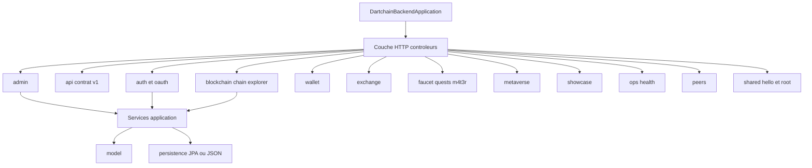

# 31 — Composants backend

## Objectif

Regrouper le backend par packages réels et par les 42 contrôleurs, sans énumérer les 423 classes main. Les diagrammes 21 à 40 sont des vues complémentaires. Ils ne font pas partie des 14 diagrammes UML officiels.

## Statut

Élevé. Confirmé par le listing `io.dartchain.backend` et par les annotations `@RequestMapping` des contrôleurs.

## Sources analysées

- `apps/dartchain-backend/src/main/java/io/dartchain/backend/` et `DartchainBackendApplication.java`
- Contrôleurs `*Controller.java` (42 annotations `@RestController` relevées)
- `config/ApiRoutes.java` pour les préfixes v1
- Packages internes observés en échantillon : `application`, `infrastructure/web`, `model`, `dto`, `persistence`

Le backend compte environ 423 classes sous `src/main/java` et 94 fichiers sous `src/test`. Cette vue ne les dessine pas.

## Éléments représentés

26 packages. 42 contrôleurs regroupés par domaine. Entrée JVM unique.

## Diagramme

Légende : les boîtes du milieu sont des regroupements de packages, pas de nouvelles classes. Le détail des 42 préfixes est en vue 32.

## Explication

Packages présents directement sous `io.dartchain.backend` :

`admin`, `api`, `auth`, `blockchain`, `chain`, `character`, `config`, `exchange`, `explorer`, `faucet`, `live`, `m4t3r`, `metaverse`, `ops`, `p2p`, `peer`, `peers`, `persistence`, `product`, `quests`, `shared`, `showcase`, `tools`, `utils`, `wallet`, `web`.

`peer` et `peers` sont deux dossiers distincts. Le handler WebSocket des pairs est dans `p2p` (`PeerSocketHandler`). Le contrôleur REST est dans `peers` (`PeerController`).

Les contrôleurs (42), regroupés :

**Admin et contrat**

- `AdminV1Controller` `/api/v1/admin`
- `ApiContractV1Controller` `/api/v1` (`GET /contract`)

**Auth**

- `AuthController` `/api/auth`
- `AuthV1Controller` `/api/v1/auth`
- `OAuthV1Controller` `/api/v1/auth/oauth`

**Chaîne**

- `BlockchainController` `/api/blockchain`
- `BlockchainV1Controller` `/api/v1/blockchain`
- `BlockController` `/api/blocks`
- `PendingTransactionController` `/api`
- `TransactionController` `/api`
- `ChainV1Controller` `/api/v1/chain`
- `ExplorerController` `/api/explorer`
- `ExplorerV1Controller` `/api/v1/explorer`

**Wallets**

- `WalletController` `/api/wallets` (`/create-client`, `/verify` seulement)
- `WalletV1Controller` `/api/v1/wallets`

**Marché**

- `SwapController` `/api/swap`
- `ExchangeController` `/api/exchange-panel`
- `CryptoRatesController` `/api/crypto-rates`

**Produit, quêtes, matière**

- `FaucetController` `/api/faucet`
- `QuestController` `/api/quests`
- `M4t3rTrailController` `/api/m4t3r`
- `M4t3rRewardController` `/api/m4t3r/rewards`
- `CharacterNftController` `/api/v1/characters`

**Metaverse**

- `OverpassProxyController` `/api/metaverse/overpass`
- `PlacementController` `/api/metaverse/placements`
- `WigleVisualizationController` `/api/metaverse/wigle`
- `ArenaController` `/api/metaverse/arena`

**Showcase**

- `ShowcaseR4v3Controller` `/api/showcase/r4v3`
- `ShowcaseNewsController` `/api/showcase/news`
- `ShowcaseLaunchController` `/api/showcase/launch`
- `ShowcaseCommunityFaqController` `/api/showcase/faq`
- `ShowcaseChatController` `/api/showcase/chat`
- `ShowcaseChartController` `/api/showcase/chart`
- `GraphController` `/api/graph`
- `BannerController` `/api` (`GET /banner`)

**Ops et racine**

- `OpsController` `/api/ops`
- `OpsV1Controller` `/api/v1/ops`
- `HealthController` `GET /api/health`
- `HealthV1Controller` `/api/v1` (`/health`)
- `PeerController` `/api/peers`
- `HelloController` `/api` (`/hello`)
- `RootController` `GET /`

Hors REST, quatre handlers WebSocket (vue 26) vivent dans `p2p`, `live`, `showcase.chat`, `metaverse.arena.ws`.

La persistance est le package `persistence` (entités, dépôts Spring, `Jpa*Store`) plus les stores JSON conditionnés par le mode. Ce n’est pas un 43e contrôleur.

Aucun fichier `.sol` n’est dans le produit. Les « contrats » métier sont des classes Java (`ApiContractV1Controller` décrit le contrat HTTP, pas un smart contract).

## Correspondance avec le code

Entrée : `io.dartchain.backend.DartchainBackendApplication`. Build : `apps/dartchain-backend/pom.xml`, parent Spring Boot `3.5.14`, artefact `dartchain-backend` version `1.0.0`.

Les contrôleurs d’un domaine suivent en général `…/infrastructure/web/`. Les services suivent `…/application/`. Les types métier suivent `…/model/`. Exemples lus : `faucet`, `blockchain`, `auth`, `admin`, `wallet`, `showcase`.

## Hypothèses

- Le nombre 42 compte les classes annotées `@RestController` trouvées par recherche dans `src/main`. Un contrôleur ajouté après le HEAD `0690e34` dans un autre arbre n’est pas inclus. Le working tree canon est la source.
- `web` et `tools` et `utils` existent comme packages. Leur rôle précis (filtres, helpers) n’est pas détaillé classe par classe, conformément au choix de ne pas lister 423 types.
- Le package `peer` (singulier) n’a pas été ouvert fichier par fichier. Il est dessiné parce qu’il est sur le disque, à côté de `peers` et `p2p`.

## Anomalies détectées

- `POST /api/wallets/create` n’a pas de contrôleur alors que la sécurité le cite.
- Deux packages `peer` et `peers`, plus `p2p` pour le socket. Trois noms pour le même sujet.
- Double API legacy `/api` et versionnée `/api/v1` sur auth, blockchain, explorer, ops, health, wallets.
- `BannerController`, `HelloController`, `PendingTransactionController` et `TransactionController` partagent le préfixe de classe `/api`.
- FAQ : le composant de persistance en mode postgres est un store mémoire, pas une entité du package `persistence`.

## Recommandations

- Utiliser la vue 32 comme annuaire d’URL et celle-ci comme annuaire de packages.
- Ne pas générer un diagramme de classes des 423 types à partir de cette fiche.
- Clarifier `peer` / `peers` / `p2p` dans un commentaire de package le jour où le code bougera ; ici on ne fait que les nommer.
