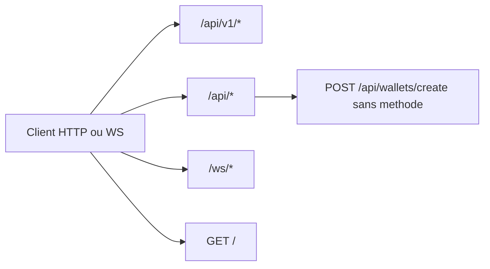

# 32 — Endpoints

## Objectif

Donner les préfixes réels des 42 contrôleurs et des 4 WebSockets, et signaler `POST /api/wallets/create` qui n’a pas de mapping. Les diagrammes 21 à 40 sont des vues complémentaires. Ils ne font pas partie des 14 diagrammes UML officiels.

Les méthodes HTTP de chaque action ne sont pas toutes recopiées : le préfixe de classe est le fait stable. Quelques chemins fins sont cités quand `ApiRoutes` ou la méthode ont été lus.

## Statut

Élevé. Confirmé par `@RequestMapping` et `WebSocketConfig`.

## Sources analysées

- Tous les `*Controller.java` sous `apps/dartchain-backend/src/main/java`
- `config/ApiRoutes.java`
- `shared/config/WebSocketConfig.java`
- `wallet/infrastructure/web/WalletController.java` (mappings `/create-client` et `/verify` seulement)
- `ops/infrastructure/web/HealthController.java` (`GET /api/health`)
- `showcase/infrastructure/web/BannerController.java` (`GET /banner`)

## Éléments représentés

Préfixes groupés. WebSockets. Route morte.

## Diagramme

Le schéma résume les familles. Le tableau suivant est la liste utilisable.

## Explication

### Préfixes des 42 contrôleurs

| Contrôleur | Préfixe |
| --- | --- |
| `AdminV1Controller` | `/api/v1/admin` |
| `ApiContractV1Controller` | `/api/v1` |
| `AuthController` | `/api/auth` |
| `AuthV1Controller` | `/api/v1/auth` |
| `OAuthV1Controller` | `/api/v1/auth/oauth` |
| `BlockchainController` | `/api/blockchain` |
| `BlockchainV1Controller` | `/api/v1/blockchain` |
| `BlockController` | `/api/blocks` |
| `PendingTransactionController` | `/api` |
| `TransactionController` | `/api` |
| `ChainV1Controller` | `/api/v1/chain` |
| `WalletController` | `/api/wallets` |
| `WalletV1Controller` | `/api/v1/wallets` |
| `ExplorerController` | `/api/explorer` |
| `ExplorerV1Controller` | `/api/v1/explorer` |
| `SwapController` | `/api/swap` |
| `ExchangeController` | `/api/exchange-panel` |
| `CryptoRatesController` | `/api/crypto-rates` |
| `FaucetController` | `/api/faucet` |
| `QuestController` | `/api/quests` |
| `PeerController` | `/api/peers` |
| `OpsController` | `/api/ops` |
| `OpsV1Controller` | `/api/v1/ops` |
| `HealthController` | `GET /api/health` |
| `HealthV1Controller` | `/api/v1` puis `/health` |
| `M4t3rTrailController` | `/api/m4t3r` |
| `M4t3rRewardController` | `/api/m4t3r/rewards` |
| `OverpassProxyController` | `/api/metaverse/overpass` |
| `PlacementController` | `/api/metaverse/placements` |
| `WigleVisualizationController` | `/api/metaverse/wigle` |
| `ArenaController` | `/api/metaverse/arena` |
| `CharacterNftController` | `/api/v1/characters` |
| `ShowcaseR4v3Controller` | `/api/showcase/r4v3` |
| `ShowcaseNewsController` | `/api/showcase/news` |
| `ShowcaseLaunchController` | `/api/showcase/launch` |
| `ShowcaseCommunityFaqController` | `/api/showcase/faq` |
| `ShowcaseChatController` | `/api/showcase/chat` |
| `ShowcaseChartController` | `/api/showcase/chart` |
| `GraphController` | `/api/graph` |
| `BannerController` | `/api` (`GET /banner`) |
| `HelloController` | `/api` (`/hello`) |
| `RootController` | `GET /` |

### Chemins v1 lus dans `ApiRoutes`

- Auth : `/api/v1/auth/register`, `/login`, `/refresh`, `/logout`, `/me`, `/me/wallet`
- Chaîne : `/api/v1/blockchain/chain`, `/stats`, `/valid`, `/blocks`, `/blocks/latest`, `/pending`
- Explorer : `/api/v1/explorer/search`, `/blocks`
- Config : `/api/v1/chain/config`
- Wallet : `/api/v1/wallets/generate-evm`
- Personnage : `/api/v1/characters/me`
- Admin : `/api/v1/admin/unlock`, `/export`, `/status`
- Ops et santé : `/api/v1/ops/snapshot`, `/api/v1/health`, `/api/v1/contract`
- Legacy retiré selon le commentaire de classe : `/api/stats` (`LEGACY_STATS`)

### Sous-chemins legacy lus sur les contrôleurs ou `ApiRoutes`

- Pending : `GET/POST /api/pending-transactions`, `POST /api/pending-transactions/{id}/mine`
- Wallets actuels : `POST /api/wallets/create-client`, `POST /api/wallets/verify`
- Rate limit (liste, pas le contrôleur) : `/api/exchange-panel/swap`, `/api/blockchain/mine`, `/api/showcase/chat/messages`, et autres chemins de `RateLimitProperties.defaultPaths()`

### WebSockets

| Chemin | Handler |
| --- | --- |
| `/ws/peers` | `PeerSocketHandler` |
| `/ws/live` | `LiveSocketHandler` |
| `/ws/chat` | `ChatSocketHandler` |
| `/ws/metaverse-arena` | `ArenaSocketHandler` |

### Route sans mapping

`POST /api/wallets/create` est en `permitAll` dans `SecurityConfig` et figure dans `RateLimitProperties.defaultPaths()`. `WalletController` n’a pas de `@PostMapping("/create")`. Les mappings présents sont `/create-client` et `/verify`. La création EVM versionnée est `POST /api/v1/wallets/generate-evm`, gardée par `allow-server-evm-wallet-create: true`, alors que `allow-server-wallet-create` est `false`.

Un client qui poste sur `/api/wallets/create` ne trouve pas de méthode de contrôleur.

## Correspondance avec le code

Sécurité `permitAll`, lue dans `SecurityConfig` : OPTIONS `/**` ; `/ws/**` ; POST `/api/auth/register|login` ; POST `/api/v1/auth/register|login|refresh|oauth/exchange` ; POST `/api/v1/admin/unlock` ; GET `/api/v1/auth/oauth/**` ; POST `/api/v1/auth/oauth/connect/apple/callback` ; POST `/api/wallets/create|verify|create-client` ; POST `/api/v1/wallets/generate-evm` ; actuator health/info ; GET `/**` ; POST et DELETE `/api/showcase/chat/messages` ; POST `/api/m4t3r/trail-pickup` ; POST `/api/metaverse/overpass` ; POST `/api/metaverse/placements/*/inquiries`. Le reste est `authenticated`.

Nginx prod et nginx d’image proxifient `/api/`, `/ws/`, et certaines routes actuator. `metrics` et `prometheus` répondent 403 au proxy.

## Hypothèses

- Les préfixes de classe suffisent à router un client. Les verbes exacts de chaque méthode de showcase ou de quête ne sont pas tous relus ; la vue 33 cite les verbes réellement appelés par le frontend.
- `HealthV1Controller` est confirmé : `@RequestMapping("/api/v1")` et `@GetMapping("/health")`, soit `GET /api/v1/health`.
- Aucun endpoint gRPC ou GraphQL n’est dessiné : aucun n’a été vu dans les contrôleurs.

## Anomalies détectées

1. `POST /api/wallets/create` sans mapping, encore permitAll et rate-limité.
2. `/api/stats` retiré selon `ApiRoutes`, alors que `blockchain-api.service.ts` contient encore un GET `${apiUrl}/stats`.
3. Quatre contrôleurs partagent `/api`, ce qui rend le préfixe ambigu sans le chemin de méthode.
4. Double génération legacy et v1.
5. `GET /**` permitAll : les lectures HTTP sont publiques au filtre Spring.
6. `blockchain-api.service.ts` appelle `GET /blocks/{hash}` et `GET /transactions/pending`. `BlockController` n’a pas de `GET /{hash}` (seulement `GET /api/blocks` et `GET /api/blocks/latest`). Aucun contrôleur n’expose `GET /api/transactions/pending` (`TransactionController` n’a que `POST /api/transactions`).

## Recommandations

- Faire échouer clairement `/api/wallets/create` dans la sécurité, ou ajouter un mapping qui appelle `ProductFeatureService.requireServerWalletCreate()` et explique le refus.
- Préférer les chemins `ApiRoutes` v1 dans les nouveaux clients.
- Tenir cette table à jour quand un 43e `@RestController` apparaît ; le compte actuel est 42.
