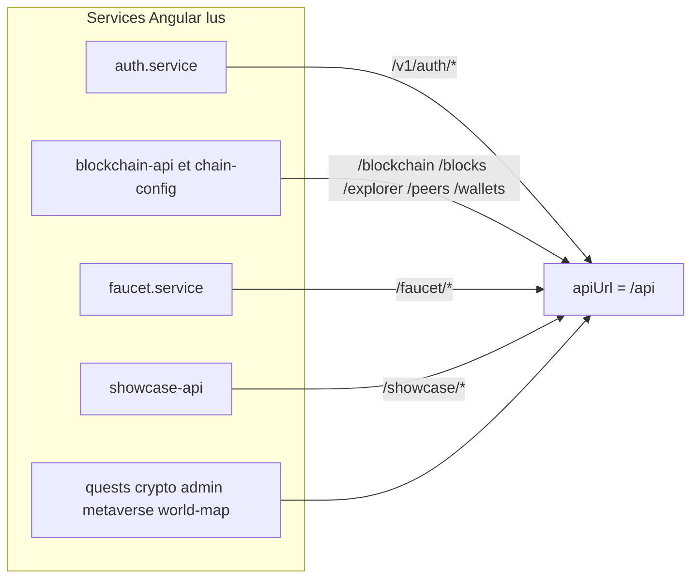

# 33 — Appels API

## Objectif

Relier les services HTTP du frontend aux URL réellement lues dans leurs fichiers. Les diagrammes 21 à 40 sont des vues complémentaires. Ils ne font pas partie des 14 diagrammes UML officiels.

`environment.apiUrl` vaut `/api` dans `environment.ts` et `environment.docker.ts`. Les chemins ci-dessous sont ceux concaténés après cette base, sauf mention.

## Statut

Élevé pour les services dont le fichier a été lu. Aucun couple service → URL n’est inventé.

## Sources analysées

Fichiers ouverts ou extraits par recherche d’URL :

- `auth/services/auth.service.ts`
- `core/auth/auth-token-refresh.ts`
- `blockchain/services/blockchain-api.service.ts`
- `blockchain/services/chain-config.service.ts`
- `exchange/services/crypto-rate.service.ts`
- `faucet/services/faucet.service.ts`
- `quests/services/quests-api.service.ts`
- `showcase/services/showcase-api.service.ts`
- `metaverse/services/character-nft-api.service.ts`
- `metaverse/arena/services/arena-session.service.ts`
- `admin/services/admin-export-client.service.ts`
- `admin/services/admin-seed-session.service.ts`
- `admin/services/ops-snapshot.service.ts`
- `world-map/m4t3r-trail-api.service.ts`
- `world-map/m4t3r-reward-api.service.ts`
- `world-map/placements/placement-api.repository.ts`
- `world-map/wigle/wigle-api.service.ts`

## Éléments représentés

Un groupe par service, avec les chemins cités dans le source.

## Diagramme

Légende : les flèches résument des préfixes lus. Le détail est dans les listes, pas dans le dessin.

## Explication

### `auth.service.ts`

Helper `authV1(path)` → `{apiUrl}/v1/auth{path}`.

Appels lus : `/register`, `/login`, `/logout`, `/me`, `/me/wallet`, `/oauth/providers`, `/oauth/connect/{providerId}`, `/oauth/exchange`, `/refresh`.

### `auth-token-refresh.ts`

`POST {apiUrl}/v1/auth/refresh` avec `{ refreshToken }`.

### `chain-config.service.ts`

`GET {apiUrl}/v1/chain/config`.

### `faucet.service.ts`

`baseUrl = {apiUrl}/faucet`.

- `GET /config`
- `GET /state/{walletAddress}`
- `POST /claim`
- `GET /claims`

### `quests-api.service.ts`

- `GET /quests/state`
- `GET /quests/catalog`
- `POST /quests/explore-block`
- `POST /quests/progress`
- `POST /quests/tasks/{taskId}/claim`
- `POST /quests/mission/claim`
- `POST /quests/weekly/claim`

### `showcase-api.service.ts`

`baseUrl = {apiUrl}/showcase`.

- `GET /news`, `GET /news/{id}`
- `GET /r4v3`
- `GET /chart`
- `GET/POST /chat/messages`, `DELETE /chat/messages`
- `GET/POST /launch/projects`
- `GET /faq/questions`, `/faq/questions/latest`, `/faq/questions/popular`
- `POST /faq/questions`
- `POST /faq/questions/{id}/vote`

### `crypto-rate.service.ts`

`apiUrl` local = `{environment.apiUrl}/crypto-rates`.

- `GET /chart`
- `GET /panels/batch`
- `GET /panels/native`
- `GET /search`

### `character-nft-api.service.ts`

`base = {apiUrl}/v1/characters`, `GET /me`.

### `arena-session.service.ts`

- `POST {apiUrl}/metaverse/arena/session/join`
- `POST {apiUrl}/metaverse/arena/events/elimination`

Le WebSocket d’arène n’est pas dans ce service (vue 26, `ArenaTransportHybridService`).

### Admin

- `AdminSeedSessionService` : `GET /v1/admin/status`, `POST /v1/admin/unlock`, `POST /v1/admin/lock`
- `AdminExportClientService` : `GET /v1/admin/export`
- `OpsSnapshotService` : `GET /v1/ops/snapshot`

### World map

- Traînée : `POST /m4t3r/trail-pickup`, `GET /m4t3r/trail-cells`
- Récompenses : `GET /m4t3r/rewards/history`, `GET /m4t3r/rewards/{rewardId}/verify`
- Placements : préfixe `{apiUrl}/metaverse/placements` (liste, détail, `POST` inquiry), constantes `METAVERSE_PLACEMENT_API`
- WiGLE : `GET /metaverse/wigle/buildings`, `/areas`, `/points`

### `blockchain-api.service.ts`

Ce service agrège beaucoup d’appels. Chemins lus dans le fichier :

- `GET /health`
- `GET /explorer/search`, `GET /explorer/blocks`
- `GET /blocks`, repli `GET /blockchain/blocks`
- `GET /blocks/{hash}`, `GET /blocks/latest` avec repli `/blockchain/blocks/latest`
- stats et valid via `API_ROUTES` du frontend (`/blockchain/stats`, `/blockchain/valid` d’après les noms de constantes vus à l’usage)
- `POST /blocks` avec repli `POST /blockchain/blocks`
- `POST /blockchain/mine`
- `POST /pending-transactions/{id}/mine`
- `GET /pending-transactions`, `POST /pending-transactions`
- `POST /wallets/verify`, `POST /wallets/create-client`
- `POST /transactions`
- `GET /blockchain/balance/{address}`
- `GET /peers`, `GET /peers/stats`, `POST /peers`, `POST /peers/reconnect`, `POST /peers/disconnect`
- `GET /banner`
- `GET /exchange-panel`, `POST /exchange-panel/swap`
- `GET /stats` et `GET /blockchain/stats`
- `GET /transactions/pending`
- WebSocket séparé : `environment.liveWsUrl` (`/ws/live`)

`GET /stats` correspond à `ApiRoutes.LEGACY_STATS` (`/api/stats`), que le commentaire Java décrit comme retiré (404). Le frontend contient encore cet appel à côté du chemin `/blockchain/stats`.

Aucun appel lu vers `POST /api/wallets/create`. Le client wallet passe par `/wallets/create-client` et `/wallets/verify`.

## Correspondance avec le code

Côté serveur, ces préfixes tombent sur les contrôleurs de la vue 32. Exemples directs : `/faucet` → `FaucetController`, `/v1/auth` → `AuthV1Controller`, `/v1/chain/config` → `ChainV1Controller`, `/crypto-rates` → `CryptoRatesController`, `/showcase/faq` → `ShowcaseCommunityFaqController`, `/metaverse/overpass` n’apparaît pas dans les services du tableau ; le commentaire de `geo-reference.config.ts` cite `/api/metaverse/overpass` comme endpoint backend. Ce n’est pas un des services HTTP listés plus haut : c’est une config de carte, pas un client supplémentaire du tableau.

Les constantes `API_ROUTES.blockchainStats` et `blockchainValid` valent `/blockchain/stats` et `/blockchain/valid` dans `core/constants/api-routes.constants.ts`.

## Hypothèses

- D’autres méthodes de `blockchain-api.service.ts` peuvent appeler d’autres chemins plus bas dans le fichier (il dépasse 800 lignes). La liste couvre les appels trouvés par la recherche, pas une relecture ligne à ligne de tout le fichier.
- `ShowcaseChatService` ouvre `/ws/chat` ; il n’est pas dans le tableau REST.

## Anomalies détectées

- `GET /blocks/{hash}` est appelé par `blockchain-api.service.ts`. `BlockController` ne déclare pas `GET /{hash}`.
- `GET /transactions/pending` est appelé par le même service. Le backend expose `GET /api/pending-transactions` et `POST /api/transactions`, pas `GET /api/transactions/pending`.
- `LegacyApiDeprecationFilter` (`io.dartchain.backend.api`) n’émet pas le 404. Il pose `Deprecation`, `Sunset: 2027-01-01` et `Link` quand `GET /api/stats` est déjà en 404, ou des en-têtes de dépréciation sur `GET /api/blocks` en 2xx.
- Double lecture stats : `/stats` (legacy, commenté 404 côté `ApiRoutes`) et `/blockchain/stats`.
- Replis `/blocks` vers `/blockchain/blocks` : le client tente deux générations.
- `POST /api/wallets/create` est connu du serveur (sécurité) et inconnu des services frontend lus. Le client fait `/wallets/create-client`.
- Auth frontend ne montre pas d’appel vers `/api/auth/*` legacy dans `auth.service.ts` : il passe par `/v1/auth`. Les deux contrôleurs existent pourtant.

## Recommandations

- Retirer l’appel `${apiUrl}/stats`. `LegacyApiDeprecationFilter` ne fabrique pas le 404 : il ajoute les en-têtes `Deprecation`, `Sunset` et `Link` seulement si la réponse est déjà 404. `GET /api/stats` n’a pas de contrôleur (`ApiRoutes.LEGACY_STATS`). Garder `/blockchain/stats`, qui est mappé sur `BlockchainController`.
- Documenter `create-client` comme le seul enregistrement wallet côté SPA.
- Quand un nouveau service HTTP apparaît, l’ajouter ici seulement après lecture du fichier, avec le préfixe exact.
