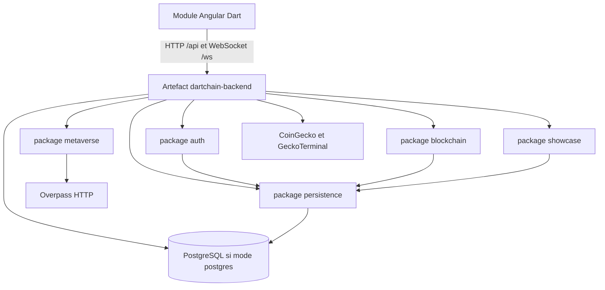

# 34 — Dépendances modules

## Objectif

Montrer le sens des dépendances entre le frontend, l’API et les packages backend, sans inventer de cycle. Les diagrammes 21 à 40 sont des vues complémentaires. Ils ne font pas partie des 14 diagrammes UML officiels.

## Statut

Élevé. Le frontend dépend de l’API par HTTP et WebSocket. Les packages backend sont ceux du disque. Aucun graphe Maven multi-modules n’existe : le backend est un seul artefact.

## Sources analysées

- `apps/dartchain-frontend/Dart/package.json` (un projet Angular, pas une dépendance Maven)
- `apps/dartchain-backend/pom.xml` (un jar `dartchain-backend`)
- Listing des packages `io.dartchain.backend`
- `environment.ts` (`apiUrl: '/api'`)
- Nginx qui proxy `/api/` et `/ws/` vers le backend
- Aucun `pom.xml` parent multi-modules relu comme agrégateur de plusieurs apps Java. Le backend est un module Maven unique.

## Éléments représentés

Dépendance de build et dépendance d’exécution SPA → API. Familles de packages qui s’appellent dans le sens web → application → model / persistence. Externes en aval de l’API.

## Diagramme

Légende : la flèche va de l’appelant vers l’appelé. Il n’y a pas de flèche du backend vers le code Angular. Il n’y a pas de cycle dessiné, parce qu’aucun cycle de packages n’a été mesuré.

## Explication

Le dépôt a deux applications compilées séparément :

- Frontend : `apps/dartchain-frontend/Dart`, npm, sortie statique `dist/browser`.
- Backend : `apps/dartchain-backend`, Maven, un jar Spring Boot.

Le frontend ne compile pas contre les classes Java. Il dépend de l’API à l’exécution : `apiUrl` relatif `/api`, sockets `/ws/live`, `/ws/chat`, `/ws/metaverse-arena`. En Docker, nginx de l’image frontend envoie ces préfixes à `backend:8080`. En prod Compose, `frontend-prod` monte `nginx.prod.conf` qui envoie vers `backend-a` et `backend-b`. Cette dépendance est un contrat HTTP, pas un import TypeScript du backend.

À l’intérieur du jar, les packages ne sont pas des modules Java (`module-info` non identifié). Ce sont des dossiers. Le sens observé sur les exemples lus :

- `infrastructure/web` (contrôleurs) appelle les services `application`.
- Les services appellent des stores (`FaucetClaimStore`, `TransactionPoolService`, `UserAccountStore`, `FaqQuestionStore`).
- Le package `persistence` fournit les implémentations JPA quand `dartchain.persistence.mode=postgres`.
- `shared.config` (`SecurityConfig`, `WebSocketConfig`, `CorsConfig`) est utilisé par toute l’application au démarrage.

`auth` est utilisé par `faucet` (`AuthService` dans `FaucetServiceImpl`) et par `PendingTransactionController` (`RoleAuthorizationService`). Ce sont des dépendances vers `auth`, pas l’inverse. `blockchain` est appelé par le faucet (`enqueueSystemCredit`). Le mempool ne rappelle pas le contrôleur faucet.

Les externes sont des dépendances sortantes de l’API : Overpass depuis `metaverse`, CoinGecko et GeckoTerminal depuis `exchange`, WiGLE depuis `metaverse` (mock par défaut), fournisseurs OAuth désactivés par défaut. Le frontend ne les appelle pas directement dans les services lus, sauf mention de proxy dev Overpass dans `geo-reference.config.ts`.

PostgreSQL est une dépendance du backend en mode `postgres` et des profils Compose. En mode `memory`, cette flèche ne s’active pas ; les fichiers JSON remplacent les stores JPA. Le frontend ne dépend pas de Postgres.

`dartchainReview` et `dartchainPreSeed` ne sont pas des modules de ce graphe.

Aucun cycle du type « persistence → contrôleur → persistence » n’a été observé. En inventer un pour « faire UML » serait faux. Des références croisées de services (auth ↔ quêtes via `@Lazy QuestService` dans `AuthService`) existent. `@Lazy` sur `QuestService` dans le constructeur de `AuthService` montre que l’auth peut appeler les quêtes après coup (login quotidien, le nom `recordDailyLoginQuest` a été lu). Le faucet appelle aussi les quêtes. Ce n’est pas dessiné comme un cycle de modules Maven : ce sont des beans du même jar.

## Correspondance avec le code

- Front : `package.json` name `dart`, dépendance `@angular/router` sans routes métier.
- Back : `groupId` `io.dartchain`, `artifactId` `dartchain-backend`.
- Proxy : `apps/dartchain-frontend/Dart/nginx.conf` `location /api/` → `http://backend:8080/api/`.
- Condition de store : `@ConditionalOnProperty` sur `dartchain.persistence.mode`.

## Hypothèses

- Il n’existe pas de second `pom.xml` d’agrégation qui ferait du frontend un module Maven. La recherche des POM a trouvé `apps/dartchain-backend/pom.xml` et un `package.json` backend d’outillage. Pas de cycle Maven.
- `@Lazy QuestService` évite une boucle de création de beans entre auth et quêtes. Le graphe d’injection complet n’a pas été calculé par le compilateur dans cette session. On n’affirme donc pas « zéro cycle de beans », seulement « pas de cycle de modules inventé ».

## Anomalies détectées

- Le frontend connaît encore `/api/stats`, chemin que `ApiRoutes` marque comme retiré. La dépendance d’exécution pointe vers une URL morte possible.
- `POST /api/wallets/create` est une dépendance de la configuration de sécurité vers un mapping absent.
- `peer`, `peers` et `p2p` se recouvrent fonctionnellement sans être un cycle.
- Le mode memory et le mode postgres changent la cible de `persistence` sans changer le frontend. Le client ignore le mode, sauf via le champ renvoyé par `/api/health`.

## Recommandations

- Traiter le contrat HTTP (`ApiRoutes` + vue 33) comme la seule dépendance front/back.
- Ne pas introduire un bus ou un second jar dans ce schéma tant qu’ils ne sont pas dans le POM.
- Si un cycle de beans auth/quêtes gêne le démarrage, le traiter dans le code ; cette fiche ne le « corrige » pas.
