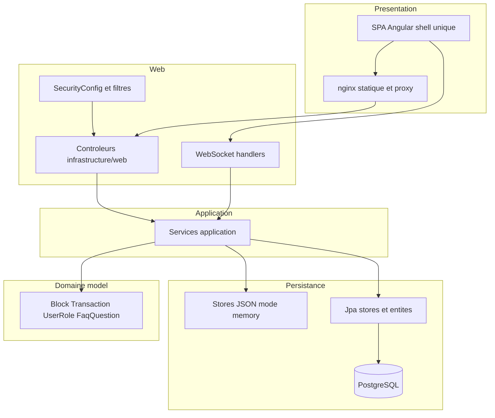

# 35 — Architecture logique

## Objectif

Décrire les couches logiques observées dans le backend et le frontend : web, application, domaine, persistance. Les diagrammes 21 à 40 sont des vues complémentaires. Ils ne font pas partie des 14 diagrammes UML officiels.

Le code ne nomme pas un dossier unique `domain`. Le domaine vécu est le package `model` (et les entités JPA). Cette fiche le dit explicitement.

## Statut

Élevé. Confirmé par l’arborescence des packages (`infrastructure/web`, `application`, `model`, `persistence`) sur les modules relus.

## Sources analysées

Arborescence sous `io.dartchain.backend` pour `admin`, `auth`, `blockchain`, `faucet`, `showcase`, `wallet`, `persistence`, `shared`. Contrôleurs et services cités dans les vues 23 et 31. Frontend : dossiers `src/app` comme couche de présentation unique (pas de routeur).

## Éléments représentés

Quatre couches backend, une couche SPA, les externes en bordure. Pas les 423 classes.

## Diagramme

Légende : « domaine » = packages `model` et types métier, pas un dossier littéralement nommé `domain`.

## Explication

**Web.** Les requêtes entrent par des `@RestController` dans `infrastructure/web` et par `WebSocketConfig` (`shared.config`). Les filtres ne sont pas tous dans `shared` : `BearerTokenAuthenticationFilter` et `RateLimitFilter` sont dans `auth.security` ; `SecurityHeadersFilter` est dans `web` ; `LegacyApiDeprecationFilter` est dans `api` ; `ActuatorAccessFilter`, `RequestCorrelationFilter` et `RequestTimingFilter` sont dans `ops`. `HealthController` et `RootController` sont aussi des points web. Cette couche traduit HTTP en appels de services. Elle ne mine pas elle-même : `BlockchainController` délègue à `BlockchainService`.

**Application.** Les règles de déroulement sont dans `application` : `AuthService.register` / `login`, `FaucetServiceImpl.claim`, `BlockchainService.minePendingTransactions`, `AdminUnlockService.unlock`, `CommunityFaqService`, `ProductFeatureService`. Les DTO (`dto`) accompagnent cette couche sans être une couche de plus.

**Domaine.** `blockchain/model` porte `Block`, `Transaction`, `PendingTransaction` (champs lus sur `Block` et `Transaction` : index, timestamp, data, transactions, previousHash, hash, nonce, difficulty ; id, hash, sender, recipient, amount, timestamp, signature, systemReward, payload, status). `auth/model/UserRole` porte `isAtLeast`. `showcase/model/FaqQuestionStatus` porte `ACTIVE`, `PINNED`, `ARCHIVED`. Il n’y a pas de contrat Solidity. `ApiContractV1Controller` est un endpoint web de description d’API, pas une couche domaine blockchain.

**Persistance.** Deux implémentations derrière les mêmes interfaces de store :

- mode `memory` (défaut YAML) : fichiers dont les chemins sont les propriétés `*_PATH` ;
- mode `postgres` : classes `Jpa*Store` du package `persistence`, entités, Flyway.

`TransactionPoolService` est un mempool en mémoire du process, partagé par REST, P2P, live et mine, même quand les blocs finissent en JSON ou en table `blocks`.

La SPA est une couche de présentation : composants, signaux d’onglets, services HTTP. Elle ne contient pas la règle `isAtLeast` ni le minage. Nginx est un adaptateur de livraison (fichiers + proxy), pas une couche métier.

Les externes (Overpass, CoinGecko, GeckoTerminal, WiGLE, OAuth) sont atteints depuis la couche application ou des services d’infrastructure dédiés (`OverpassProxyService`, `CryptoRatesProxyService`). Ils ne sont pas une cinquième couche du domaine.

## Correspondance avec le code

| Couche de cette vue | Chemin réel |
| --- | --- |
| Web | `*/infrastructure/web/*Controller.java`, `shared/config/SecurityConfig.java`, `WebSocketConfig.java` |
| Application | `*/application/*Service.java` |
| Domaine | `*/model`, entités `persistence/entity` |
| Persistance | `persistence/Jpa*Store`, stores `Json*` / `InMemory*` |

Exemple faucet : `FaucetController` (web) → `FaucetServiceImpl` (application) → `FaucetClaim` (modèle) → `claimStore` (JSON ou `JpaFaucetClaimStore` / table `faucet_claims`).

## Hypothèses

- Les packages qui n’ont pas été listés en profondeur (`tools`, `utils`, `peer`) se rangent dans web ou application selon leurs classes. Ils ne forment pas une couche supplémentaire identifiée.
- Les entités JPA sont rangées avec la persistance et reflètent le domaine. Les placer dans « domaine » ou « persistance » est un choix de lecture ; le code les met sous `persistence/entity`.

## Anomalies détectées

- La FAQ en mode postgres utilise `InMemoryFaqQuestionStore` : la couche persistance ne va pas jusqu’à JPA pour cet agrégat.
- `AdminUnlockService` garde ses jetons dans une `ConcurrentHashMap` de process, à côté du store utilisateurs. L’unlock n’est pas dans Flyway.
- `GET /**` permitAll mélange la politique de sécurité web et l’absence d’autorisation sur les lectures.
- Aucune couche « smart contract » : non applicable au sens Solidity. Le dire évite d’inventer une couche.

## Recommandations

- Continuer à placer les nouveaux cas d’usage dans `application` et les mappings dans `infrastructure/web`, comme le faucet et l’auth.
- Nommer `model` dans les revues plutôt qu’un dossier `domain` qui n’existe pas.
- Ne pas faire dépendre la SPA des entités JPA ; le contrat reste les DTO HTTP.
