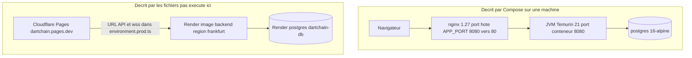

# 36 — Architecture physique

## Objectif

Placer les processus et les hôtes décrits par les fichiers : navigateur, nginx, JVM, PostgreSQL, Render, Cloudflare Pages. Les diagrammes 21 à 40 sont des vues complémentaires. Ils ne font pas partie des 14 diagrammes UML officiels.

Cette session n’a pas ouvert le réseau. Tout déploiement live est **décrit par les fichiers**, pas prouvé par un appel HTTP exécuté ici.

## Statut

Élevé pour la topologie écrite dans le dépôt. Le statut « en marche sur Internet » n’a pas été vérifié dans cette session.

## Sources analysées

- `docker-compose.yml` (profils et images)
- `apps/dartchain-backend/Dockerfile` (`eclipse-temurin:21-jre`, port 8080)
- `apps/dartchain-frontend/Dart/Dockerfile` (`node:22-alpine` puis `nginx:1.27-alpine`, port 80)
- `apps/dartchain-frontend/Dart/nginx.conf` (upstream `backend:8080`)
- `infra/nginx/nginx.prod.conf` (upstream `backend-a` / `backend-b`)
- `wrangler.toml` (Pages, `dist/browser`)
- `deploy/render.yaml` (service `dartchain-backend`, base `dartchain-db`, région `frankfurt`, health `/api/health`)
- `environment.prod.ts` et `environment.cloudflare.ts` : `wss://dartchain-backend-1-0-0.onrender.com/ws/live` et `/ws/chat`
- README : https://dartchain.pages.dev et https://dartchain-backend-1-0-0.onrender.com

Secrets des variables `DARTCHAIN_JWT_SECRET`, `DATABASE_PASSWORD`, `DARTCHAIN_ACTUATOR_TOKEN`, `DARTCHAIN_ADMIN_SEED_SHA256` : [SECRET MASQUÉ].

## Éléments représentés

Deux plans : la machine décrite par Compose, et le plan hébergé décrit par Wrangler et Render. Les deux sont documentaires.

## Diagramme

Légende : le cadre du haut est ce que `docker compose` construirait. Le cadre du bas est ce que `wrangler.toml`, `deploy/render.yaml` et les environnements Angular écrivent. Aucun des deux n’a été contacté pendant la rédaction.

## Explication

**Navigateur.** Il charge le shell Angular. En dev, `ng serve` écoute le port 4200 (`package.json`, script `start`, host `localhost`). Les appels sont relatifs (`/api`). En image Docker, le navigateur parle à nginx.

**nginx.** Deux fichiers :

- Image frontend par défaut : `nginx.conf` proxy `/api/`, `/ws/`, `/actuator/health`, `/actuator/info` vers `http://backend:8080`. Les autres chemins : `try_files` vers `index.html`.
- Profil Compose `prod` : `frontend-prod` monte `infra/nginx/nginx.prod.conf`. L’upstream `dartchain_backend` est `least_conn` vers `backend-a:8080` et `backend-b:8080`. Même découpage `/api/`, `/ws/`, actuator. `metrics` et `prometheus` : 403.

Le service `frontend` du profil `default` publie `${APP_PORT:-8080}:80`.

**JVM.** Dockerfile runtime `eclipse-temurin:21-jre`, utilisateur `appuser` uid 10001, `EXPOSE 8080`, healthcheck `curl` sur `/api/health`. Entrée `DartchainBackendApplication`. En Compose, les backends attendent Postgres healthy puis exposent `/actuator/health` ou `/api/health`.

**PostgreSQL.** Image `postgres:16-alpine`. Volume nommé du profil default : `dartchain_pg_data`. Base et utilisateur par variables `POSTGRES_DB` / `POSTGRES_USER` (défaut de nom `dartchain`). Mot de passe : [SECRET MASQUÉ]. Le process backend n’embarque pas Postgres ; il s’y connecte par `DATABASE_URL` quand le mode est `postgres`.

**Cloudflare Pages.** `wrangler.toml` : nom `dartchain`, `compatibility_date` `2025-07-16`, assets `./apps/dartchain-frontend/Dart/dist/browser`, `not_found_handling = "single-page-application"`. Le workflow `cloudflare-deploy.yml` est `workflow_dispatch` et appelle `scripts/cloudflare-deploy.sh`. Le nom de site cité par le README est https://dartchain.pages.dev. CORS autorise `https://dartchain.pages.dev`, `https://*.dartchain.pages.dev`, `https://*.pages.dev`.

**Render.** `deploy/render.yaml` décrit un web service `dartchain-backend`, runtime image, plan free, région `frankfurt`, health ` /api/health`, profils `postgres,prod`, `DARTCHAIN_PERSISTENCE_MODE=postgres`, image `docker.io/DOCKERHUB_USER/dartchain-backend:1.0.0` (l’utilisateur Docker Hub est un placeholder du fichier). Base `dartchain-db`, plan free, nom logique `dartchain`. `DARTCHAIN_JWT_SECRET` et `DARTCHAIN_ACTUATOR_TOKEN` sont `generateValue: true` : valeurs [SECRET MASQUÉ]. Les environnements Angular prod et Cloudflare pointent `wss://dartchain-backend-1-0-0.onrender.com`. CORS contient aussi `https://dartzvz01-tagname.onrender.com` et `https://*.onrender.com`.

Javadoc de déploiement : `deploy/soc-readme.md` est une note de conformité du dossier `deploy`. Cette vue n’en tire aucun hôte supplémentaire.

Aucun Terraform, aucun Redis, aucun Kafka dans cette topologie (vues 39 et 40).

## Correspondance avec le code

| Nœud | Fichier qui le décrit |
| --- | --- |
| Navigateur / SPA | `src/app`, `environment*.ts` |
| nginx edge Docker | `Dart/nginx.conf`, `infra/nginx/nginx.prod.conf` |
| JVM | `Dockerfile` backend, `pom.xml` Java 21 |
| Postgres local Compose | `docker-compose.yml` services `postgres*` |
| Pages | `wrangler.toml` |
| Render | `deploy/render.yaml` |

## Hypothèses

- L’URL Render du README et celle des fichiers `environment.prod.ts` désignent le même service que le blueprint. Le blueprint parle d’un nom `dartchain-backend` et d’une image ; l’hôte `onrender.com` exact dépend du compte Render. On recopie les chaînes présentes dans le dépôt sans les résoudre en DNS.
- `frontend` default n’a pas d’upstream double. Seul le profil `prod` a `backend-a` et `backend-b`.
- Le port 4200 n’existe pas dans l’image nginx. Il appartient au script `ng serve`.

## Anomalies détectées

- Deux récits physiques coexistent : Compose (nginx + JVM + Postgres sur un hôte) et Pages + Render (SPA statique, API ailleurs). Le README cite le second. Le compose décrit le premier. Aucun des deux n’a été exécuté ici.
- `environment.prod.ts` fige l’hôte Render. `render.yaml` laisse `DOCKERHUB_USER` et `YOUR-PROJECT.pages.dev` comme textes à remplacer.
- `GET /**` permitAll côté JVM : le nginx ne compense pas en authentifiant les lectures.
- Star Conquest « live » dans le README n’ajoute pas de nœud physique : le flag frontend est faux.

## Recommandations

- Dans toute doc d’exploitation, étiqueter « décrit par les fichiers » tant qu’un healthcheck réel n’a pas été joué.
- Séparer un schéma Compose et un schéma Pages/Render, comme le dessin ci-dessus, pour ne pas laisser croire qu’nginx et Cloudflare sont dans le même processus.
- Remplacer les placeholders `DOCKERHUB_USER` et `YOUR-PROJECT.pages.dev` dans le blueprint avant de le traiter comme un déploiement reproductible. Ne pas y coller de secret en clair.
