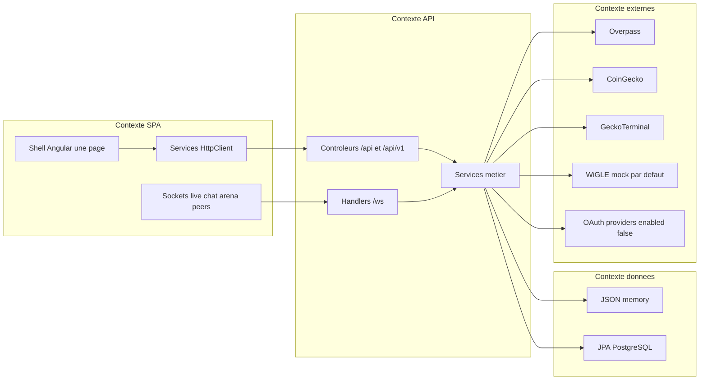

# 37 — Architecture applicative

## Objectif

Découper le démonstrateur en contextes applicatifs : SPA, API, données, systèmes externes. Les diagrammes 21 à 40 sont des vues complémentaires. Ils ne font pas partie des 14 diagrammes UML officiels.

## Statut

Élevé. Les quatre contextes sont ceux que le code et la configuration séparent déjà. Leurs frontières sont les URL et la propriété `dartchain.persistence.mode`.

## Sources analysées

- SPA : `apps/dartchain-frontend/Dart`, `app.routes.ts`, `environment.ts`
- API : `io.dartchain.backend`, 42 contrôleurs, 4 WebSockets
- Données : YAML `persistence.mode`, stores JSON, package `persistence`, Flyway
- Externes : `OverpassProxyService`, `CryptoRatesProxyService`, `dartchain.wigle`, `dartchain.oauth`

Le site `dartchainReview` (`io.dartchain.review`, port 8081, H2) est un autre produit. Il n’est pas un contexte de ce schéma.

## Éléments représentés

Quatre contextes et le sens des appels. Pas de contexte « smart contract ». Pas de contexte Kafka.

## Diagramme

Légende : la SPA ne parle pas à PostgreSQL ni à CoinGecko dans les services lus. Elle parle à l’API. L’API parle aux données et aux externes.

## Explication

**SPA.** Une application Angular. État d’écran interne (vues 27 et 28). Elle connaît des URL relatives `/api` et des URL WebSocket. Elle garde le jeton (refresh via `/api/v1/auth/refresh`) et l’état visuel (onglets, tiroirs, Three.js). Elle ne choisit pas entre JSON et Postgres.

**API.** Un process Spring Boot. Il authentifie (JWT stateless, rôles `USER` / `ADMIN`, unlock admin séparé), limite certains chemins, mine le mempool, enregistre les claims, proxifie la carte et les taux. Les packages sont des modules internes du même contexte, pas des applications déployables à part (vue 34).

**Données.** Deux réalisations du même contexte :

- `memory` : fichiers sous les propriétés `BLOCKCHAIN_STATE_PATH`, `AUTH_USERS_PATH`, etc.
- `postgres` : tables Flyway et `Jpa*Store`.

La FAQ reste en mémoire même en postgres (`InMemoryFaqQuestionStore`). Le mempool `TransactionPoolService` est dans le process API, pas dans Postgres, jusqu’au `persistBlocks`.

**Externes.**

- Overpass, deux hôtes dans `OverpassProxyService`, exposés au SPA seulement via `/api/metaverse/overpass`.
- CoinGecko `api/v3` et GeckoTerminal `api/v2`, via `/api/crypto-rates`.
- WiGLE : `dartchain.wigle.mock-enabled: true`. Les secrets d’API sont [SECRET MASQUÉ].
- OAuth : google, meta, apple, microsoft, github, x, discord, tous `enabled: false` par défaut. Secrets [SECRET MASQUÉ]. Provisionnement hors dépôt : non identifié.

Le README présente le produit comme une démo, pas une crypto réelle, pas un mainnet. Le jeton affiché est R4V3, chain-id 3377. Ce contexte « chaîne » est une bibliothèque Java dans l’API (`BlockchainService`), pas un réseau de nœuds public identifié au-delà du WebSocket `/ws/peers` et du profil Compose `p2p`.

## Correspondance avec le code

| Contexte | Frontière |
| --- | --- |
| SPA | `environment.apiUrl`, `liveWsUrl`, `chatWsUrl`, `arenaWsUrl` |
| API | port `PORT` défaut 8080, contexte servlet unique |
| Données | `DARTCHAIN_PERSISTENCE_MODE` |
| Externes | constantes URL dans `OverpassProxyService` et `CryptoRatesProxyService` |

Acteurs rattachés : A1 visiteur et A2/A3 utilisateurs sont dans la SPA et l’API ; A4 pair P2P est le socket `/ws/peers` ; A5 jobs locaux sont les profils `seed` et `application-data-import.yaml`, plus `TestnetSettlementService` (M4T3R), sans être un cinquième produit ; A6 regroupe les externes de ce dessin.

## Hypothèses

- Le proxy dev Angular vers Overpass (`/overpass` dans `geo-reference.config.ts`) est un raccourci de développement. Le contexte cible reste Overpass. Le fichier `proxy.conf.json` n’a pas été ouvert ; aucune URL de proxy n’est inventée au-delà de ce commentaire.
- Le profil Compose `p2p` lance deux API (`backend-p2p-a`, `backend-p2p-b`) avec deux bases. Ce sont deux instances du même contexte API, pas une nouvelle application.

## Anomalies détectées

- Contexte données « postgres » qui ne couvre pas la FAQ.
- Contexte externe OAuth déclaré dans le YAML et éteint.
- Contexte SPA qui contient Star Conquest et `depth-rail` sans que le shell par défaut les montre.
- `dartchainReview` pourrait être confondu avec un bounded context du même produit. Ce n’en est pas un : pas de wallet, pas de bloc, pas de `.sol`, 134 fichiers hors caches, JWT toujours `ROLE_USER`.

## Recommandations

- Dessiner les évolutions (nouveau partenaire, nouvelle base) comme un changement de contexte seulement si un nouveau process ou un nouvel hôte apparaît.
- Garder Overpass et CoinGecko derrière l’API pour que la SPA ne dépende pas de leurs URL.
- Ne pas fusionner le site review dans ce schéma.
