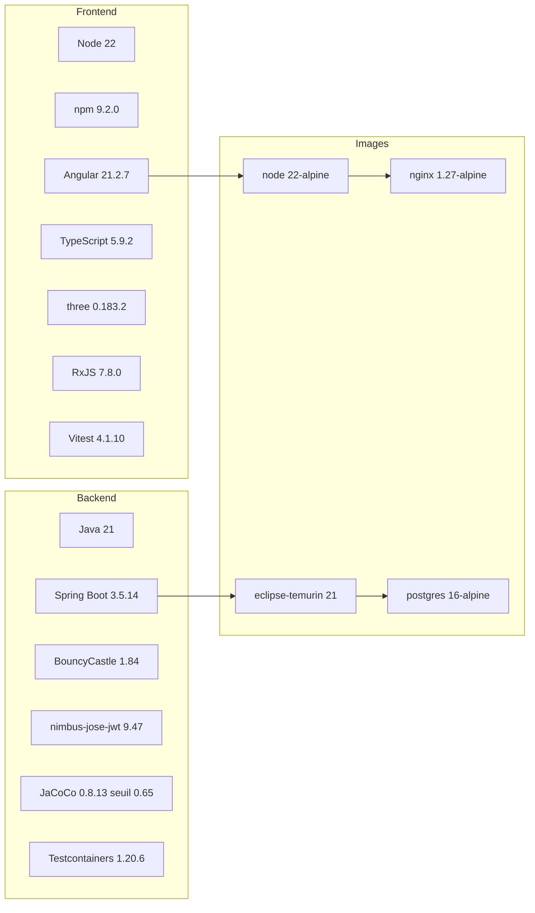

# 38 — Architecture technique

## Objectif

Fixer les versions et les bibliothèques lues dans les manifestes. Les diagrammes 21 à 40 sont des vues complémentaires. Ils ne font pas partie des 14 diagrammes UML officiels.

## Statut

Élevé. Confirmé par `pom.xml`, `package.json`, `.node-version`, Dockerfiles et `application.yaml` pour les versions d’application qui y figurent.

## Sources analysées

- `apps/dartchain-backend/pom.xml`
- `apps/dartchain-frontend/Dart/package.json`
- `.node-version`
- `apps/dartchain-backend/Dockerfile`
- `apps/dartchain-frontend/Dart/Dockerfile`
- `docker-compose.yml` (image Postgres)
- `application.yaml` (`info.app.version`, persistance, TTL)
- `wrangler.toml` (`compatibility_date`)

## Éléments représentés

Chaîne de build et d’exécution avec versions exactes. Pas de version inventée pour un outil absent (Playwright, Terraform, Kafka, Redis).

## Diagramme

Légende : les versions sont celles des fichiers de build. Les images sont celles des Dockerfiles et du compose.

## Explication

### Backend

| Élément | Version lue |
| --- | --- |
| Parent Spring Boot | 3.5.14 |
| Artefact | `io.dartchain:dartchain-backend:1.0.0` |
| `java.version` | 21 |
| Image build | `eclipse-temurin:21-jdk` |
| Image runtime | `eclipse-temurin:21-jre` |
| BouncyCastle | `bcprov-jdk18on` 1.84 |
| JWT | `nimbus-jose-jwt` 9.47 |
| Testcontainers | 1.20.6 (`junit-jupiter` et module postgresql) |
| JaCoCo | plugin 0.8.13, `jacoco.minimum.line-ratio` 0.65 |
| Starters | web, security, validation, websocket, data-jpa, actuator, flyway-core, flyway-database-postgresql, driver PostgreSQL |
| `info.app.version` dans le YAML | `0.17.0-SNAPSHOT` |
| `info.app.phase` | `AF` |
| Nom Spring | `dartchain-backend` |
| Port | `${PORT:8080}` |
| Persistance défaut | `memory` |
| TTL access / refresh | 3600 s / 604800 s |
| Rate limit YAML | 60 / 60000 ms |

Le POM déclare une balise `<licenses><license/></licenses>` vide. Le README demande de traiter le dépôt comme propriétaire tant qu’aucun fichier `LICENSE` n’est publié. Ce n’est pas une analyse juridique : c’est l’absence de licence SPDX dans le POM, plus la consigne README.

Flyway est la bibliothèque de migration. Les scripts vont de `V1__auth.sql` à `V14__oauth_identities.sql`.

### Frontend

| Élément | Version lue |
| --- | --- |
| Nom npm | `dart` 1.0.0, privé |
| `packageManager` | `npm@9.2.0` |
| `.node-version` | `22` |
| Image build | `node:22-alpine` |
| Angular (`@angular/core` et CLI) | `^21.2.7` |
| TypeScript | `~5.9.2` |
| RxJS | `~7.8.0` |
| three | `^0.183.2` (`@types/three` `^0.183.1`) |
| Vitest | `^4.1.10` |
| zone.js | `^0.16.1` |
| qrcode | `^1.5.4` |
| jsdom | `^27.1.0` |
| Image runtime | `nginx:1.27-alpine` |
| Tests | script `ng test` (Vitest). `verify:a11y` inclus. Aucun Playwright ni Cypress identifié |

### Hébergement décrit

- Postgres Compose : `postgres:16-alpine`
- Wrangler : `compatibility_date = "2025-07-16"`, assets `dist/browser`
- Render : image tag documenté `dartchain-backend:1.0.0`, Java heap documenté `-Xmx384m` dans `render.yaml` ; Compose utilise `${JAVA_TOOL_OPTIONS:--Xmx512m}`

### Non identifié

Prometheus / Grafana productisés, Terraform, Redis, Kafka, E2E navigateur, sync Star Conquest, géodonnées IGN, licence ouverte. JaCoCo 0,65 est un seuil de build, pas une version d’exécution.

## Correspondance avec le code

Les chiffres de cette fiche sont des littéraux de `pom.xml`, `package.json`, `.node-version`, Dockerfiles, `wrangler.toml`, `application.yaml`. `NativeJwtService` s’appuie sur la pile JWT (nimbus est la dépendance déclarée ; le service lui-même utilise aussi `HmacSHA256` d’après l’import `SecretKeySpec` vu dans le fichier). On ne recopie pas le secret.

`PasswordHasher.hashBcrypt` est l’algorithme de mot de passe vu dans `AuthService`. La version de bibliothèque bcrypt n’est pas une dépendance directe nommée dans l’extrait du POM ; elle vient de Spring Security. On ne fabrique pas un numéro de version bcrypt.

## Hypothèses

- `^21.2.7` signifie la plage npm, pas un lock résolu dans cette session. Le `package-lock.json` n’a pas été ouvert. La version déclarée est 21.2.7.
- `info.app.version` `0.17.0-SNAPSHOT` et la version Maven `1.0.0` sont deux numéros différents dans deux fichiers. Les deux sont vrais ; aucun n’est « corrigé » ici.
- Testcontainers 1.20.6 sert les tests, pas l’image de production. L’image de prod documentée reste `postgres:16-alpine`.

## Anomalies détectées

- Trois numéros de version produit : Maven `1.0.0`, npm `1.0.0`, `info.app.version` `0.17.0-SNAPSHOT`.
- Licence POM vide.
- JaCoCo 0,65 avec entités JPA exclues (commentaire POM).
- Défaut Java du rate limit à 20 contre YAML à 60 (vue 21).
- Défaut Java `networkName` `R4V3 Testnet` contre YAML `DartChain Native`.

## Recommandations

- Citer `info.app.version` pour l’actuator et `1.0.0` pour l’image Docker, sans les fusionner tant que les fichiers divergent.
- Garder Java 21, Spring Boot 3.5.14 et Angular 21 comme socle de cette vue technique.
- Ne pas ajouter de ligne Redis, Kafka ou Terraform : versions non identifiées parce que les outils ne sont pas dans le dépôt.
