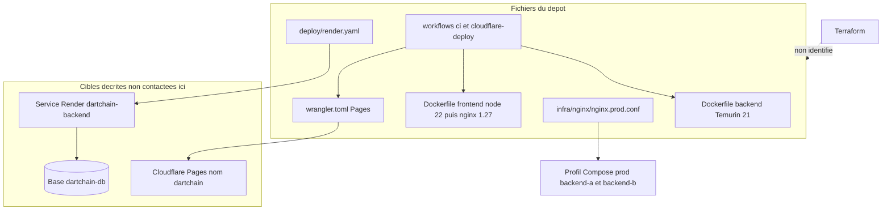

# 40 — Infrastructure

## Objectif

Recenser les artefacts d’infrastructure présents dans le dépôt : nginx de production, Dockerfiles, Wrangler, blueprint Render. Les diagrammes 21 à 40 sont des vues complémentaires. Ils ne font pas partie des 14 diagrammes UML officiels.

Terraform : **non identifié**. Aucun fichier `.tf` n’entre dans cette vue parce qu’aucun n’a été trouvé.

## Statut

Élevé pour les fichiers listés. L’exécution réseau (Pages, Render, DNS) n’a pas été prouvée dans cette session : ces cibles sont décrites par les fichiers.

## Sources analysées

- `infra/nginx/nginx.prod.conf`
- `apps/dartchain-frontend/Dart/nginx.conf`
- `apps/dartchain-backend/Dockerfile`
- `apps/dartchain-frontend/Dart/Dockerfile`
- `wrangler.toml`
- `deploy/render.yaml`
- `docker-compose.yml` (montage du nginx prod, profils)
- Mémo : `.github/workflows/ci.yml`, `.github/workflows/cloudflare-deploy.yml`, `deploy/soc-readme.md`
- Recherche : pas d’occurrence Terraform ni Kafka dans les sources parcourues

Secrets générés par le blueprint (`generateValue` sur `DARTCHAIN_JWT_SECRET` et `DARTCHAIN_ACTUATOR_TOKEN`) : [SECRET MASQUÉ].

## Éléments représentés

Edge nginx, images, publication statique Cloudflare, service Render et sa base, CI comme producteur d’images. Absence de Terraform.

## Diagramme

Légende : Terraform est hors dépôt. Le nginx prod vise les hôtes Compose `backend-a` et `backend-b`. Le blueprint Render est un autre edge, décrit à part. Aucun des deux n’a été contacté ici.

## Explication

### nginx prod

`infra/nginx/nginx.prod.conf` écoute le port 80, `server_name _`, racine `/usr/share/nginx/html`.

- `location /` : `try_files` vers `index.html` (SPA).
- `location /api/` : `proxy_pass` vers l’upstream `dartchain_backend`.
- `location = /actuator/health` et `= /actuator/info` : proxy explicite.
- `location` regex `metrics` et `prometheus` : `return 403`.
- `location /actuator/` : proxy du reste.
- `location /ws/` : proxy avec `Upgrade`, timeout de lecture 3600 s.

Upstream : `least_conn`, `backend-a:8080` et `backend-b:8080`, `max_fails=2`, `fail_timeout=10s`. En-têtes ajoutés : `X-Content-Type-Options nosniff`, `X-Frame-Options DENY`, `Referrer-Policy strict-origin-when-cross-origin`, `Permissions-Policy` sans géolocalisation / micro / caméra, `X-XSS-Protection 0`. Gzip sur les types texte, JSON et JavaScript.

`frontend-prod` monte ce fichier en lecture seule sur `/etc/nginx/conf.d/default.conf`. Le Dockerfile frontend, lui, copie `nginx.conf`, dont l’upstream est le nom unique `backend:8080`. Les deux fichiers partagent la même politique actuator 403.

### Dockerfiles

Backend : build JDK 21, `./mvnw -q -B package -DskipTests`, runtime JRE 21, healthcheck `/api/health`, port 8080, `java -XX:+UseContainerSupport -jar /app/app.jar`.

Frontend : Node 22 alpine, `npm ci --legacy-peer-deps`, `npm run build:docker`, nginx 1.27 alpine, healthcheck `wget` sur `/`.

### Wrangler

`name = "dartchain"`. `compatibility_date = "2025-07-16"`. Assets : `./apps/dartchain-frontend/Dart/dist/browser`. `not_found_handling = "single-page-application"`. Commentaires du fichier : build `bash scripts/cloudflare-build.sh`, deploy `npx wrangler deploy`. Le workflow `.github/workflows/cloudflare-deploy.yml` est en `workflow_dispatch` : build `scripts/cloudflare-build.sh`, puis `scripts/cloudflare-deploy.sh`. Le site cité par le README est https://dartchain.pages.dev. Non contacté ici.

### Render

`deploy/render.yaml` est un blueprint : base `dartchain-db` plan free, user `dartchain`, service web `dartchain-backend` plan free, région `frankfurt`, runtime image `docker.io/DOCKERHUB_USER/dartchain-backend:1.0.0`, `healthCheckPath: /api/health`. Variables lues : `PORT=8080`, `SPRING_PROFILES_ACTIVE=postgres,prod`, `DARTCHAIN_PERSISTENCE_MODE=postgres`, `DARTCHAIN_PRODUCT_FAUCET_ENABLED=true`, `JAVA_TOOL_OPTIONS=-Xmx384m`, champs `DATABASE_*` pris sur la base, secrets en `generateValue`, `DARTCHAIN_CORS_EXTRA` exemple `https://YOUR-PROJECT.pages.dev`. `DOCKERHUB_USER` et `YOUR-PROJECT` sont des placeholders du fichier.

`deploy/soc-readme.md` est la doc SOC citée. Elle n’ajoute pas, dans cette fiche, de ressource qui n’aurait pas été lue.

### CI comme infra de build

`.github/workflows/ci.yml` : job backend `./mvnw -q verify` sous Java 21 Temurin, job frontend `npm ci`, `npm test`, `verify:a11y`, build, `build:cloudflare` avec `BACKEND_URL` Render, job docker images `dartchain-backend:ci` et `dartchain-frontend:ci`. Déclencheurs push `main` et `pull_request`. Ce workflow construit ; il n’est pas un hébergeur.

### Terraform

Aucun fichier Terraform, aucun provider, aucun state n’a été identifié. L’infrastructure as code du dépôt est le compose, les Dockerfiles, nginx, Wrangler et le blueprint Render. **Terraform : non identifié.**

Redis et Kafka : non identifiés dans ces artefacts (vue 39).

## Correspondance avec le code

| Besoin | Fichier |
| --- | --- |
| Deux JVM derrière un edge | `nginx.prod.conf` + services `backend-a` / `backend-b` |
| Une JVM | `Dart/nginx.conf` hôte `backend` |
| SPA hébergée | `wrangler.toml` |
| API hébergée + Postgres managé | `deploy/render.yaml` |
| Image reproductible | les deux Dockerfiles |
| Provisionnement cloud générique | non identifié (pas de Terraform) |

CORS côté JVM autorise déjà `https://*.pages.dev` et `https://*.onrender.com` (`CorsConfig`), ce qui relie les hôtes décrits sans les faire démarrer.

## Hypothèses

- Le workflow Cloudflare fait `bash scripts/cloudflare-deploy.sh` après le build. Les secrets `CLOUDFLARE_API_TOKEN` et `CLOUDFLARE_ACCOUNT_ID` sont des noms d’environnement, pas des valeurs.
- `soc-readme.md` peut lister des contrôles d’exploitation. Tant qu’il n’est pas relu, il ne crée pas de serveur supplémentaire dans le diagramme.
- L’image Docker Hub `1.0.0` du blueprint et les tags `:ci` du workflow sont deux publications différentes.

## Anomalies détectées

- Placeholders `DOCKERHUB_USER` et `YOUR-PROJECT.pages.dev` dans le blueprint.
- Deux nginx : un pour le nom `backend`, un pour `backend-a`/`backend-b`. Le staging Compose n’est dans aucun des deux noms (vue 39).
- README live Pages + Render, alors que cette session ne l’a pas prouvé.
- `restrict-actuator: false` dans le YAML applicatif, compensé seulement par le 403 nginx sur metrics et prometheus.
- Star Conquest et la sync serveur associée : pas d’artefact d’infra dédié. Flag frontend faux.

## Recommandations

- Garder Terraform hors des schémas tant qu’aucun `.tf` n’existe. Si un jour il est ajouté, cette fiche devra citer le répertoire réel.
- Remplacer les placeholders Render avant usage, sans committer les secrets générés.
- Traiter `nginx.prod.conf` comme la définition d’edge à deux nœuds, et `Dart/nginx.conf` comme celle de l’image simple.
- Marquer Pages et Render « décrit par les fichiers » dans les runbooks tant qu’un healthcheck externe n’est pas archivé.
