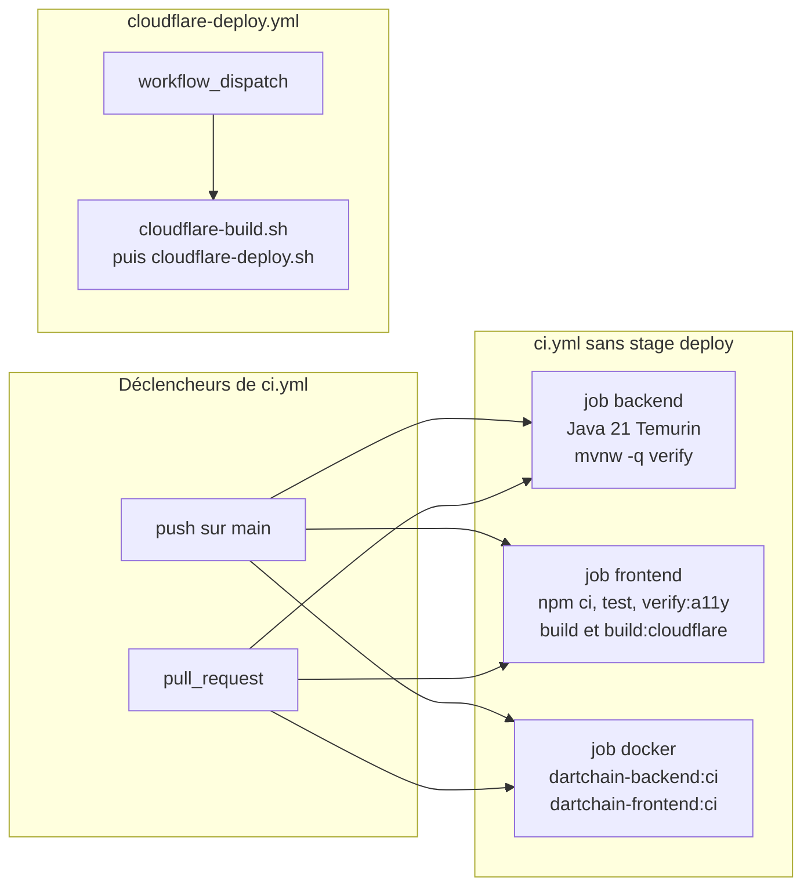

# 41 — Intégration et livraison continues

## Objectif

Cette fiche est une vue complémentaire de la série documentaire 41–60. Elle décrit les pipelines réellement déclarés : la vérification backend, frontend et images Docker dans `.github/workflows/ci.yml`, et le téléversement Cloudflare Pages déclenché à la main. Aucun stage de déploiement automatique n’a été identifié dans `ci.yml`.

## Statut

Élevé. Confirmé par le code des workflows lus.

## Sources analysées

- `.github/workflows/ci.yml`
- `.github/workflows/cloudflare-deploy.yml`
- `deploy/render.yaml` (blueprint d’hébergement, hors job du workflow CI)
- `wrangler.toml` (nom `dartchain`, assets vers `dist/browser`), cité comme cible Pages ; le workflow manuel appelle `scripts/cloudflare-build.sh` et `scripts/cloudflare-deploy.sh`

Les arbres `dartchainPreSeed` et `dartchainReview` ne sont pas la source de ce diagramme.

## Éléments représentés

- Déclencheurs de CI : `push` sur la branche `main`, et `pull_request`.
- Job `backend` : Ubuntu, Java 21 Temurin, `./mvnw -q verify` dans `apps/dartchain-backend` (tests et JaCoCo).
- Job `frontend` : Node 22, `npm ci`, tests, `verify:a11y`, `build`, puis `build:cloudflare` avec `BACKEND_URL` vers l’API Render citée par le README.
- Job `docker` : images locales `dartchain-backend:ci` et `dartchain-frontend:ci`.
- Workflow séparé `Cloudflare Pages Deploy (manual)` : événement `workflow_dispatch` seulement.
- Absence de job de déploiement dans `ci.yml`.

## Diagramme

## Explication

Les trois jobs de `ci.yml` partent des mêmes déclencheurs et ne déclarent aucun `needs`. Un échec de tests backend n’empêche donc pas, dans ce fichier, le démarrage des jobs frontend et docker. Aucun de ces jobs ne publie l’application sur Render ni sur Cloudflare Pages.

Le job frontend enchaîne quatre commandes dans `apps/dartchain-frontend/Dart` : installation verrouillée, tests Vitest sans watch, contrat d’accessibilité, build de production, puis un build Cloudflare de fumée. Ce dernier fixe `BACKEND_URL` à `https://dartchain-backend-1-0-0.onrender.com`. C’est une compilation, pas une mise en ligne.

Le workflow `cloudflare-deploy.yml` porte le nom « Cloudflare Pages Deploy (manual) ». Son commentaire d’en-tête précise qu’il sert à un upload manuel via wrangler, et que le déploiement Pages « natif » sur push n’est pas ce YAML. Il construit le frontend avec `scripts/cloudflare-build.sh` (Node 22, `BACKEND_URL` lu dans `vars.BACKEND_URL` avec la même URL Render en repli, `SHOWCASE_ENABLED` en variable) puis lance `scripts/cloudflare-deploy.sh`. Les noms `CLOUDFLARE_API_TOKEN` et `CLOUDFLARE_ACCOUNT_ID` apparaissent comme secrets GitHub ; leurs valeurs ne sont pas recopiées.

`deploy/render.yaml` décrit un autre chemin d’hébergement : base `dartchain-db`, service web `dartchain-backend`, sonde `/api/health`, profils Spring `postgres,prod`. Ce blueprint n’est référencé par aucun des deux workflows.

## Correspondance avec le code

| Élément | Ancrage |
| --- | --- |
| Workflow CI | `name: CI`, `on.push.branches: [main]`, `on.pull_request` |
| Backend | `actions/setup-java@v4`, Temurin 21, cache Maven, `working-directory: apps/dartchain-backend`, `./mvnw -q verify` |
| Frontend | `actions/setup-node@v4`, Node 22, cache `apps/dartchain-frontend/Dart/package-lock.json` |
| Images CI | tags `dartchain-backend:ci` et `dartchain-frontend:ci` |
| Pages manuel | `on: workflow_dispatch`, permissions `contents: read`, job `deploy` |

Le seuil JaCoCo `0.65` est déclaré dans `apps/dartchain-backend/pom.xml` et s’exécute parce que le job backend lance `verify`, pas parce que `ci.yml` recopie le ratio.

## Hypothèses

- L’absence de `needs` est lue comme trois jobs parallèles. C’est le comportement par défaut de GitHub Actions lorsque aucune dépendance n’est écrite.
- Le commentaire du workflow Cloudflare sur un build Git natif est une intention écrite dans le fichier. Cette fiche ne constate pas une exécution Pages hors dépôt.
- `wrangler.toml` (nom `dartchain`, dossier `dist/browser`) est la cible attendue du script de déploiement. Le contenu intégral du script n’est pas redessiné ici.

## Anomalies détectées

- `ci.yml` ne contient aucun stage de déploiement automatique, alors que le README cite un site live Pages et une API Render.
- Le smoke test frontend fige l’URL Render, tandis que le workflow manuel passe d’abord par `vars.BACKEND_URL`.
- Render (`deploy/render.yaml`) et Cloudflare (workflow manuel) coexistent sans orchestration commune dans la CI.

## Recommandations

- Écrire dans la documentation d’exploitation quel chemin est canonique : Pages par intégration Git, wrangler manuel, ou blueprint Render.
- Tant qu’aucun job `deploy` n’existe dans `ci.yml`, les revues d’architecture ne doivent pas supposer une mise en production à chaque merge.
- Aligner l’URL de backend du job frontend sur la variable déjà utilisée par `cloudflare-deploy.yml`.
