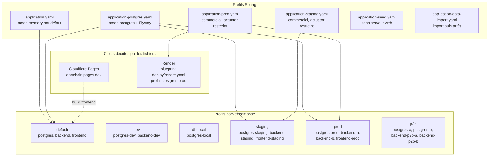

# 42 — Environnements

## Objectif

Cette fiche est une vue complémentaire de la série documentaire 41–60. Elle cartographie les profils Spring et les profils Docker Compose réellement présents, ainsi que les cibles Pages et Render décrites par les fichiers du dépôt. Elle ne fabrique pas d’environnement supplémentaire.

## Statut

Élevé. Confirmé par les fichiers de configuration lus.

## Sources analysées

- `apps/dartchain-backend/src/main/resources/application.yaml`
- `application-postgres.yaml`, `application-prod.yaml`, `application-staging.yaml`, `application-seed.yaml`, `application-data-import.yaml`
- `docker-compose.yml` (profils `default`, `dev`, `db-local`, `staging`, `prod`, `p2p`)
- `deploy/render.yaml`
- `.github/workflows/cloudflare-deploy.yml` et le commentaire Pages associé
- `info.dartchain.postgres-only-profiles` dans `application.yaml` : `prod,staging`

Aucune valeur de secret n’est recopiée. Les arbres compagnons ne sont pas la source du diagramme.

## Éléments représentés

- Mode de persistance par défaut : `dartchain.persistence.mode` = `memory`, surchargeable par `DARTCHAIN_PERSISTENCE_MODE`.
- Profil Spring `postgres` : datasource PostgreSQL, Flyway activé, `ddl-auto: validate`.
- Profils `prod` et `staging` : mode `postgres`, produit `commercial: true`, actuator restreint.
- Profil `seed` : application non web, `seed-local` puis arrêt.
- Profil `data-import` : import activé puis arrêt.
- Compose : services nommés par profil, images `postgres:16-alpine`, healthchecks.
- Cibles décrites hors machine locale : Cloudflare Pages et Render.

## Diagramme

Légende : le trait plein relie un fichier de profil à un groupe Compose qui active le même mode. Le pointillé Pages indique un hébergement statique décrit à part, pas un service du `docker-compose.yml`.

## Explication

Le fichier de base fixe le comportement de démonstration : persistance mémoire, `dartchain.product.commercial: false`, faucet et vitrine activés, alias d’API legacy désactivés, création serveur de wallet historique désactivée (`allow-server-wallet-create: false`) alors que la génération EVM serveur reste autorisée (`allow-server-evm-wallet-create: true`). Le nom de réseau YAML est « DartChain Native », chain-id `3377`.

`application-postgres.yaml` bascule `dartchain.persistence.mode` sur `postgres`, active Flyway (`classpath:db/migration`) et valide le schéma Hibernate (`ddl-auto: validate`). Il ne crée pas un second moteur : le driver visé est PostgreSQL.

`application-staging.yaml` et `application-prod.yaml` imposent aussi le mode postgres et `commercial: true`. Les deux mettent `dartchain.ops.restrict-actuator` à `true`. Le profil prod désactive en plus `allow-server-evm-wallet-create` et le mock OAuth. Le bloc `info` du fichier de base rappelle que les profils « postgres-only » attendus sont `prod` et `staging`, ce que `PostgresOnlyProfileGuard` contrôle au démarrage.

`application-seed.yaml` active le profil `seed`, coupe le serveur web (`web-application-type: none`) et demande une sortie après amorçage local. `application-data-import.yaml` active `dartchain.data-import.enabled` et `exit-after-import`. Ce sont des jobs locaux, pas des environnements HTTP durables.

Compose découpe les mêmes intentions en services :

| Profil Compose | Services |
| --- | --- |
| `default` | `postgres`, `backend`, `frontend` ; volume `dartchain_pg_data` ; frontend `${APP_PORT:-8080}:80` |
| `dev` | `postgres-dev`, `backend-dev` |
| `db-local` | `postgres-local` |
| `staging` | `postgres-staging`, `backend-staging`, `frontend-staging` |
| `prod` | `postgres-prod`, `backend-a`, `backend-b`, `frontend-prod` |
| `p2p` | `postgres-a`, `postgres-b`, `backend-p2p-a`, `backend-p2p-b` |

L’image Postgres lue sur ces services est `postgres:16-alpine`. Le healthcheck backend partagé interroge `/actuator/health` puis `/api/health`. Le frontend default teste la racine HTTP du conteneur nginx.

Render, dans `deploy/render.yaml`, fixe `SPRING_PROFILES_ACTIVE` à `postgres,prod` et `DARTCHAIN_PERSISTENCE_MODE` à `postgres`, avec la sonde `/api/health`. Cloudflare Pages est la cible statique décrite par le workflow manuel et par l’URL `https://dartchain.pages.dev` présente dans la liste CORS de `application.yaml`.

## Correspondance avec le code

- Défaut mémoire : `dartchain.persistence.mode: ${DARTCHAIN_PERSISTENCE_MODE:memory}` dans `application.yaml`.
- Garde profils : `io.dartchain.backend.config.PostgresOnlyProfileGuard`.
- Garde produit commercial : `ProductCommercialGuard` exige le mode postgres lorsque le mode commercial est actif.
- Nginx de production du dépôt : `infra/nginx/nginx.prod.conf` prévoit les upstreams `backend-a` et `backend-b`, ce qui correspond au couple Compose `prod`.
- Pages : nom wrangler `dartchain`, assets `dist/browser`.

## Hypothèses

- Le profil Compose `default` est associé au fichier `application-postgres.yaml` parce que le service `backend` dépend de Postgres et que le mode commercial des profils d’hébergement exige postgres. Le YAML exact injecté par `x-backend-env-prod` n’est pas redessiné ligne à ligne.
- « staging.dartchain.pages.dev » dans la CORS du profil staging est une origine autorisée, pas la preuve qu’un second projet Pages est déjà provisionné.

## Anomalies détectées

- Le défaut Java de `ChainProperties.networkName` est « R4V3 Testnet » si le YAML ne charge pas, alors que `application.yaml` et l’insert Flyway `chain_config` portent « DartChain Native ».
- `application.yaml` laisse `restrict-actuator: false`, alors que staging et prod le passent à `true`.
- Le profil staging réactive `legacy-api-aliases-enabled: true`, désactivé dans le fichier de base.
- Le profil Compose `dev` publie Postgres ; le profil `default` ne publie pas le port Postgres dans le fragment lu (seul le frontend publie `${APP_PORT:-8080}:80`).

## Recommandations

- Nommer dans un seul tableau d’exploitation le couple profil Spring / profil Compose / URL, pour éviter de traiter `default`, `prod` Compose et Render comme le même environnement.
- Faire échouer le démarrage local si le secret JWT ou la seed admin restent sur leur défaut de `application.yaml` dès qu’un profil autre que la démo mémoire est actif.
- Vérifier que `backend-a` et `backend-b` reçoivent la même configuration de chaîne : le compose prod les duplique derrière un nginx à deux upstreams.
