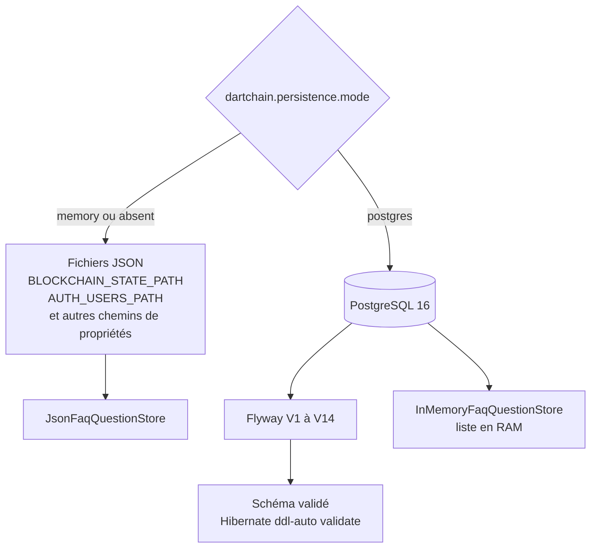
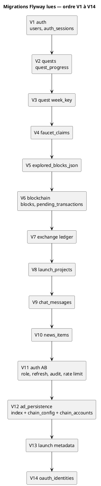

# 43 — Base de données

## Objectif

Cette fiche est une vue complémentaire de la série documentaire 41–60. Elle fixe le moteur utilisé par le canon DartChain : PostgreSQL 16 lorsque le mode de persistance est `postgres`, fichiers JSON ou mémoire lorsque le mode est `memory`. Flyway couvre les versions V1 à V14. Aucun second SGBD n’est branché sur ce dépôt.

## Statut

Élevé. Confirmé par le code et les migrations lues.

## Sources analysées

- `application.yaml` (`dartchain.persistence.mode`, défaut `memory`)
- `application-postgres.yaml` (URL JDBC PostgreSQL, Flyway, `ddl-auto: validate`)
- `docker-compose.yml` (image `postgres:16-alpine`)
- `apps/dartchain-backend/src/main/resources/db/migration/V1__auth.sql` à `V14__oauth_identities.sql`
- Stores conditionnels `@ConditionalOnProperty(name = "dartchain.persistence.mode", ...)`
- `InMemoryFaqQuestionStore` et `JsonFaqQuestionStore`

Le site compagnon `dartchainReview` utilise H2. Il est hors source de ce diagramme : le canon ne déclare pas H2 comme base du produit.

## Éléments représentés

- Deux modes exclusifs, pas deux SGBD simultanés.
- PostgreSQL 16 Alpine dans tous les services Compose nommés `postgres*`.
- Flyway activé seulement avec le profil postgres, emplacement `classpath:db/migration`.
- Quatorze migrations, de l’authentification jusqu’aux identités OAuth.
- Stores JSON (mode `memory`, y compris si la propriété est absente) et stores JPA (mode `postgres`).
- FAQ : pas de table `faq_questions` dans ces migrations.

## Diagramme

## Explication

Le canon ne choisit pas un SGBD au hasard du profil Docker. La propriété `dartchain.persistence.mode` vaut `memory` par défaut. Dans ce mode, les stores annotés `havingValue = "memory", matchIfMissing = true` écrivent des fichiers dont les chemins sont des propriétés (`BLOCKCHAIN_STATE_PATH`, `EXCHANGE_LEDGER_PATH`, `LAUNCH_PROJECTS_PATH`, `CHAT_MESSAGES_PATH`, `NEWS_ITEMS_PATH`, `FAQ_QUESTIONS_PATH`, `QUESTS_PROGRESS_PATH`, `FAUCET_CLAIMS_PATH`, `AUTH_USERS_PATH`, `M4T3R_REWARDS_PATH`). Le redémarrage conserve ces données seulement si les fichiers sont encore sur le disque.

Le mode `postgres` active la datasource décrite dans `application-postgres.yaml`, le pool Hikari, Flyway et la validation du schéma. L’image Compose est `postgres:16-alpine`. Le blueprint Render crée une base nommée `dartchain` et injecte l’hôte via `DATABASE_HOST`. Il n’ajoute pas MySQL, H2 ni un second cluster lu par l’application.

Les migrations lues produisent dix-sept tables applicatives : `users`, `auth_sessions`, `auth_refresh_tokens`, `auth_audit_log`, `oauth_identities`, `rate_limit_buckets`, `quest_progress`, `faucet_claims`, `blocks`, `pending_transactions`, `chain_config`, `chain_accounts`, `exchange_ledger_adjustments`, `exchange_seeded_wallets`, `launch_projects`, `chat_messages`, `news_items`. V12 s’intitule `ad_persistence` : le SQL lu crée des index, la table `chain_config` (avec les clés `chainId` 3377, `networkName` DartChain Native, `nativeToken` R4V3) et la table `chain_accounts`. Il ne crée pas de table `ads`.

Flyway n’est pas activé dans `application.yaml` de base : le bloc `spring.flyway` apparaît dans `application-postgres.yaml` (`enabled: true`).

## Correspondance avec le code

| Mode | Exemples de stores |
| --- | --- |
| `memory` | `JsonBlockchainStateStore`, `JsonUserAccountStore`, `JsonFaucetClaimStore`, `JsonQuestProgressStore`, `JsonExchangeLedgerStore`, `JsonChatMessageStore`, `JsonNewsItemStore`, `JsonLaunchProjectStore`, `JsonFaqQuestionStore`, `InMemorySessionStore`, `InMemoryRefreshTokenStore`, `InMemoryAuthAuditStore`, `InMemoryRateLimitCounterStore`, `InMemoryOAuthIdentityStore` |
| `postgres` | `JpaBlockchainStateStore`, `JpaUserAccountStore`, `JpaSessionStore`, `JpaRefreshTokenStore`, `JpaFaucetClaimStore`, `JpaQuestProgressStore`, `JpaExchangeLedgerStore`, `JpaChatMessageStore`, `JpaNewsItemStore`, `JpaLaunchProjectStore`, `JpaOAuthIdentityStore`, `JpaAuthAuditStore`, `JpaRateLimitCounterStore` |

La FAQ déroge : `JsonFaqQuestionStore` en mode mémoire, `InMemoryFaqQuestionStore` en mode postgres. Aucune migration `faq_questions` n’existe dans `db/migration`.

## Hypothèses

- « Pas de second SGBD » vaut pour le canon `/home/azertyuiop/dev/dartchain`. Le H2 du dépôt `dartchainReview` est un autre produit (`io.dartchain.review`).
- Les fichiers JSON par défaut sous `data/` sont le support du mode mémoire. Un chemin surchargé par variable d’environnement reste le même mécanisme.

## Anomalies détectées

- En mode postgres, les questions FAQ restent dans `InMemoryFaqQuestionStore` : une liste en RAM, perdue au redémarrage, sans table Flyway. C’est confirmé par l’annotation de classe et par l’absence de migration.
- V12 porte le nom `ad_persistence` alors que son SQL lu concerne des index, `chain_config` et `chain_accounts`.
- Le mode mémoire est le défaut, y compris si l’on démarre sans profil, alors que Compose `default` livre un Postgres. Le branchement effectif dépend des variables injectées au conteneur, pas du seul nom du profil Compose.

## Recommandations

- Donner à la FAQ le même couple JSON / JPA que les autres agrégats, ou documenter explicitement qu’elle est volatile en production postgres.
- Au démarrage du profil Compose `default`, afficher le mode de persistance effectif (déjà exposé via `PersistenceModeInfoContributor`) dans la procédure d’exploitation.
- Conserver Flyway comme seule source de schéma : `ddl-auto: validate` interdit à Hibernate de créer les tables à côté des migrations.
