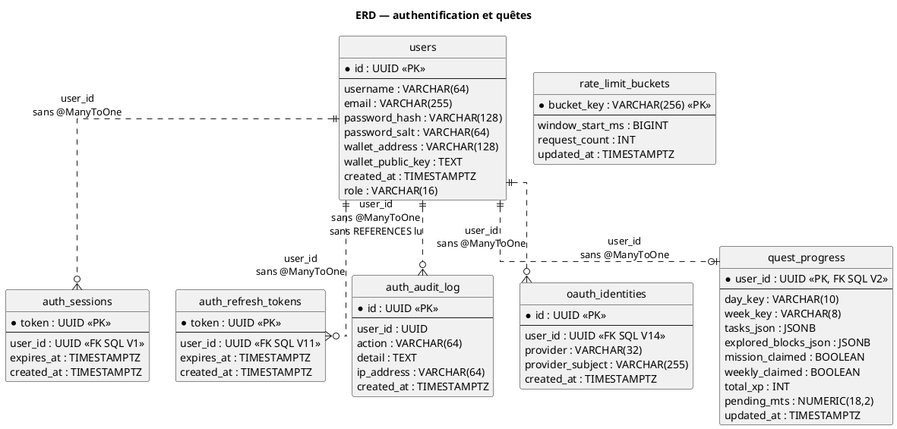
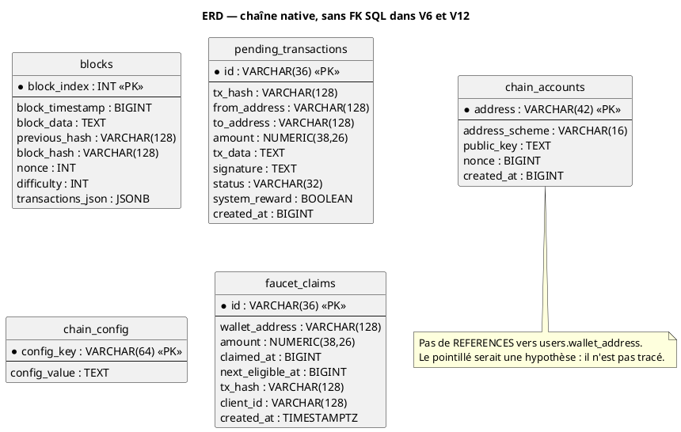
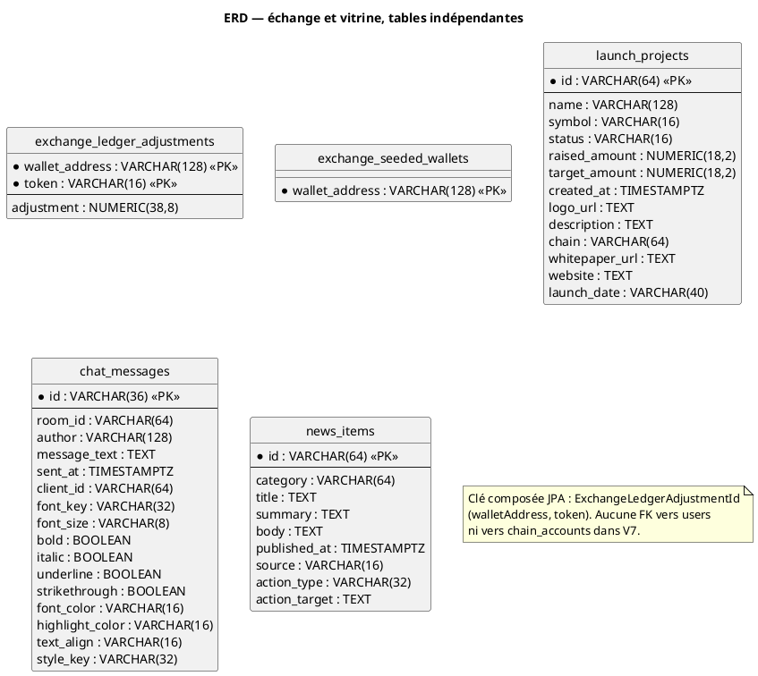

# 44 — Diagramme entité-relation

## Objectif

Cette fiche est une vue complémentaire de la série documentaire 41–60. Elle dessine les dix-sept tables du canon et leurs colonnes confirmées. Les liens `user_id` sont en pointillés : aucune association JPA `@ManyToOne` ou `@OneToMany` n’a été relevée. Lorsqu’une contrainte SQL `REFERENCES` existe, elle est citée à part, elle n’est pas dessinée comme une association JPA.

## Statut

Élevé. Confirmé par les entités JPA et les migrations lues.

## Sources analysées

- Entités de `io.dartchain.backend.persistence.entity`
- `V1__auth.sql`, `V2__quests.sql`, `V6__blockchain.sql`, `V7__exchange_ledger.sql`, `V11__auth_ab.sql`, `V12__ad_persistence.sql`, `V14__oauth_identities.sql`, et les autres migrations V3–V5, V8–V10, V13 pour les colonnes ajoutées
- Recherche `@ManyToOne` / `@OneToMany` : aucune occurrence dans le backend

## Éléments représentés

Dix-sept tables : `users`, `auth_sessions`, `auth_refresh_tokens`, `auth_audit_log`, `oauth_identities`, `rate_limit_buckets`, `quest_progress`, `faucet_claims`, `blocks`, `pending_transactions`, `chain_config`, `chain_accounts`, `exchange_ledger_adjustments`, `exchange_seeded_wallets`, `launch_projects`, `chat_messages`, `news_items`.

Clés étrangères SQL confirmées par lecture :

- `auth_sessions.user_id` → `users.id` ON DELETE CASCADE (`V1__auth.sql`)
- `auth_refresh_tokens.user_id` → `users.id` ON DELETE CASCADE (`V11__auth_ab.sql`)
- `oauth_identities.user_id` → `users.id` ON DELETE CASCADE (`V14__oauth_identities.sql`)
- `quest_progress.user_id` → `users.id` ON DELETE CASCADE, et cette colonne est la clé primaire (`V2__quests.sql`)

`auth_audit_log.user_id` est indexé dans V11 et nullable dans l’entité ; le `CREATE TABLE` lu ne contient pas de `REFERENCES`. `V6__blockchain.sql` ne déclare aucune clé étrangère sur `blocks` ni `pending_transactions`.

Légende des diagrammes : `PK` clé primaire, `<<FK SQL>>` contrainte lue dans une migration, trait `..` lien logique sur un UUID scalaire sans `@ManyToOne`.

## Diagramme

Sous-vue authentification et quêtes.

Sous-vue chaîne native. Aucun lien vers `users` : les adresses sont des chaînes, pas des clés étrangères lues.

Sous-vue vitrine, chat, actualités et carnet d’échange.

## Explication

Le schéma relationnel et le modèle JPA ne coïncident pas sur les associations. Les entités portent un champ `userId` de type `UUID` avec `@Column`, jamais `@ManyToOne`. Le diagramme le montre par des traits pointillés, y compris là où PostgreSQL impose `REFERENCES users(id)`.

Quatre liens SQL sont donc à la fois réels dans les migrations et absents du graphe d’objets : sessions, jetons de rafraîchissement, identités OAuth, progression de quêtes. L’audit est plus faible : colonne et index, sans `REFERENCES` dans le SQL lu, et `user_id` sans `nullable = false` sur l’entité.

La chaîne stocke les transactions d’un bloc dans `blocks.transactions_json`. Il n’existe pas de table `transactions`. Les adresses de mempool, de faucet, de comptes de chaîne et de carnet d’échange ne référencent pas `users.wallet_address`. Aucune de ces FK n’a été inventée.

`exchange_ledger_adjustments` a une clé primaire composée `(wallet_address, token)`, mappée par `@EmbeddedId` et la classe `ExchangeLedgerAdjustmentId`.

`oauth_identities` ajoute la contrainte unique `(provider, provider_subject)` dans V14.

## Correspondance avec le code

| Table | Entité | Migration d’origine |
| --- | --- | --- |
| `users` | `UserEntity` | V1, colonne `role` ajoutée en V11 |
| `auth_sessions` | `AuthSessionEntity` | V1 |
| `auth_refresh_tokens` | `AuthRefreshTokenEntity` | V11 |
| `auth_audit_log` | `AuthAuditLogEntity` | V11 |
| `oauth_identities` | `OAuthIdentityEntity` | V14 |
| `rate_limit_buckets` | `RateLimitBucketEntity` | V11 |
| `quest_progress` | `QuestProgressEntity` | V2, V3, V5 |
| `faucet_claims` | `FaucetClaimEntity` | V4 |
| `blocks` | `BlockEntity` | V6 |
| `pending_transactions` | `PendingTransactionEntity` | V6, index V12 |
| `chain_config` | `ChainConfigEntity` | V12 |
| `chain_accounts` | `ChainAccountEntity` | V12 |
| `exchange_ledger_adjustments` | `ExchangeLedgerAdjustmentEntity` | V7 |
| `exchange_seeded_wallets` | `ExchangeSeededWalletEntity` | V7 |
| `launch_projects` | `LaunchProjectEntity` | V8, métadonnées V13 |
| `chat_messages` | `ChatMessageEntity` | V9 |
| `news_items` | `NewsItemEntity` | V10 |

## Hypothèses

- La cardinalité « un utilisateur, plusieurs sessions » est portée par la FK SQL et par le type de la colonne, pas par une annotation JPA. Elle est donc confirmée côté SQL et absente côté graphe d’entités.
- `users.wallet_address` pourrait correspondre à `chain_accounts.address` ou à `faucet_claims.wallet_address` dans les données. Aucun `REFERENCES` lu ne le confirme : ces traits ne sont pas dessinés.

## Anomalies détectées

- Dualité FK SQL / scalaire JPA : la base cascade la suppression de l’utilisateur vers sessions, refresh, OAuth et quêtes, alors que le code Java ne navigue pas ces associations.
- `auth_audit_log.user_id` n’a pas la même contrainte que les autres `user_id` d’authentification.
- `V6__blockchain.sql` isole blocs et mempool de tout compte utilisateur.
- Le nom de fichier V12 laisse attendre des colonnes publicitaires ; le SQL lu n’en crée pas.

## Recommandations

- Soit mapper les FK déjà présentes avec `@ManyToOne` (ou une `@JoinColumn` explicite), soit documenter le choix « identifiant scalaire » pour que les suppressions en cascade ne surprennent pas les services qui chargent les entités une à une.
- Ne pas ajouter de FK d’adresse sans décision de modèle : les largeurs diffèrent (`users.wallet_address` VARCHAR 128, `chain_accounts.address` VARCHAR 42).
- Aligner le nom de V12 sur son contenu réel si une migration future touche encore ce périmètre, sans réécrire l’historique déjà appliqué.
